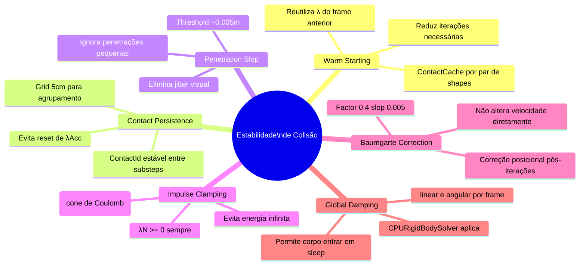

| Técnica | O que resolve | Funcionamento |
| :--- | :--- | :--- |
| **Warm Starting** | Mantém pilhas de objetos (stacks) perfeitamente imóveis e estáveis. | Salva o impulso $J$ do frame anterior e o aplica no início do novo frame como uma "estimativa inicial" próxima do real. |
| **Contact Persistence** | Viabiliza o Warm Starting identificando o contato através dos frames. | Atribui IDs únicos para pares de feições (ex: Vértice ID 5 vs Face ID 2). Se o ID persiste, o impulso é reaproveitado. |
| **Penetration Slop** | Elimina tremores (jitter) de micro-oscilações em objetos em repouso. | Define uma margem (ex: 0.005m). Se $\text{penetração} < \text{slop}$, o Bias é zerado para evitar micro-correções infinitas. |
| **Impulse Clamping** | Impede que o atrito ou a correção de posição gerem energia infinita. | O limite de aplicação (clamp) deve ser feito sobre o **impulso total acumulado** no frame, não na iteração isolada. |
| **Friction Anchors** | Evita o "drift" (deslizamento lento) de objetos em superfícies levemente inclinadas. | Armazena o ponto de contato inicial e tenta "travar" o objeto ali enquanto a força lateral for menor que o atrito. |
| **Predictive Contacts** | Evita o "tunneling" (objetos rápidos atravessando paredes finas). | Cria um contato "virtual" antes da colisão ocorrer, prevendo a posição no próximo frame: $\text{dist} + v \cdot \Delta t$. |
| **Global Damping** | Drena energia residual acumulada por erros de precisão numérica (float). | Aplica uma redução mínima constante: $v = v \cdot (1 - \text{fator})$. Crucial para permitir que o corpo entre em *Sleep*. |

