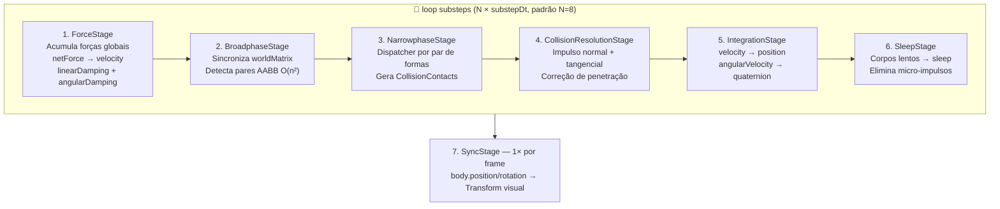

# Class: PhysicsWorld

Defined in: [elements/physics/PhysicsWorld.ts:114](https://github.com/dantasgut/clayflow/blob/a1666043080ae3b3e0982d5e31ab5afdc5a5a4a4/src/elements/physics/PhysicsWorld.ts#L114)

Implementação euclidiana do SimulationWorld (Mediator — GoF).

Orquestra o pipeline de física composto por estágios independentes
(Pipeline pattern). Cada estágio encapsula uma fase única da simulação.

## Pipeline de Física — `step(scene, dt)`

O frame dt é dividido em N substeps (padrão: 8) para estabilidade numérica.
O pipeline de substeps roda N vezes; SyncStage roda uma única vez ao final.



## Registro Event-Driven

Modificações no grafo de cena (addChild / removeChild) durante step() são
diferidas em filas (`pendingAdd`, `pendingRemove`) e processadas no início
do próximo frame — evitando mutação de coleções durante a iteração do pipeline.

## Example

```ts
const world = new PhysicsWorld();
world.setSolver('RigidBody', new CPURigidBodySolver());
world.addForce(new ConstantForce('gravity', vec3.fromValues(0, -9.81, 0)));
world.setSubsteps(8);

// No loop de render:
world.step(scene, dt);
```

## Extends

- [`SimulationWorld`](../interfaces/SimulationWorld.md)

## Constructors

### Constructor

> **new PhysicsWorld**(`options?`): `PhysicsWorld`

Defined in: [elements/physics/PhysicsWorld.ts:142](https://github.com/dantasgut/clayflow/blob/a1666043080ae3b3e0982d5e31ab5afdc5a5a4a4/src/elements/physics/PhysicsWorld.ts#L142)

#### Parameters

##### options?

[`PhysicsWorldOptions`](../interfaces/PhysicsWorldOptions.md) = `{}`

#### Returns

`PhysicsWorld`

#### Overrides

`SimulationWorld.constructor`

## Accessors

### dispatcher

#### Get Signature

> **get** **dispatcher**(): `CollisionDispatcher`

Defined in: [elements/physics/PhysicsWorld.ts:224](https://github.com/dantasgut/clayflow/blob/a1666043080ae3b3e0982d5e31ab5afdc5a5a4a4/src/elements/physics/PhysicsWorld.ts#L224)

##### Returns

`CollisionDispatcher`

## Methods

### addForce()

> **addForce**(`force`): `void`

Defined in: [elements/physics/PhysicsWorld.ts:272](https://github.com/dantasgut/clayflow/blob/a1666043080ae3b3e0982d5e31ab5afdc5a5a4a4/src/elements/physics/PhysicsWorld.ts#L272)

Registra uma força global aplicada a todos os corpos a cada step.

#### Parameters

##### force

[`Force`](../interfaces/Force.md)

#### Returns

`void`

#### Overrides

[`SimulationWorld`](../interfaces/SimulationWorld.md).[`addForce`](../interfaces/SimulationWorld.md#addforce)

***

### connectScene()

> **connectScene**(`scene`): `void`

Defined in: [elements/physics/PhysicsWorld.ts:239](https://github.com/dantasgut/clayflow/blob/a1666043080ae3b3e0982d5e31ab5afdc5a5a4a4/src/elements/physics/PhysicsWorld.ts#L239)

Conecta o mundo a uma cena: observa child_added e child_removed
para registrar/remover corpos e colliders automaticamente.
Também registra todos os physics components já presentes na cena.

#### Parameters

##### scene

[`Entity`](Entity.md)

#### Returns

`void`

#### Overrides

[`SimulationWorld`](../interfaces/SimulationWorld.md).[`connectScene`](../interfaces/SimulationWorld.md#connectscene)

***

### disconnectScene()

> **disconnectScene**(`scene`): `void`

Defined in: [elements/physics/PhysicsWorld.ts:250](https://github.com/dantasgut/clayflow/blob/a1666043080ae3b3e0982d5e31ab5afdc5a5a4a4/src/elements/physics/PhysicsWorld.ts#L250)

Remove a observação da cena e limpa todos os registros.

#### Parameters

##### scene

[`Entity`](Entity.md)

#### Returns

`void`

#### Overrides

[`SimulationWorld`](../interfaces/SimulationWorld.md).[`disconnectScene`](../interfaces/SimulationWorld.md#disconnectscene)

***

### removeForce()

> **removeForce**(`id`): `void`

Defined in: [elements/physics/PhysicsWorld.ts:276](https://github.com/dantasgut/clayflow/blob/a1666043080ae3b3e0982d5e31ab5afdc5a5a4a4/src/elements/physics/PhysicsWorld.ts#L276)

#### Parameters

##### id

`string`

#### Returns

`void`

#### Overrides

[`SimulationWorld`](../interfaces/SimulationWorld.md).[`removeForce`](../interfaces/SimulationWorld.md#removeforce)

***

### removeSolver()

> **removeSolver**(`physicType`): `void`

Defined in: [elements/physics/PhysicsWorld.ts:268](https://github.com/dantasgut/clayflow/blob/a1666043080ae3b3e0982d5e31ab5afdc5a5a4a4/src/elements/physics/PhysicsWorld.ts#L268)

#### Parameters

##### physicType

`string`

#### Returns

`void`

#### Overrides

[`SimulationWorld`](../interfaces/SimulationWorld.md).[`removeSolver`](../interfaces/SimulationWorld.md#removesolver)

***

### setSolver()

> **setSolver**(`physicType`, `solver`): `void`

Defined in: [elements/physics/PhysicsWorld.ts:264](https://github.com/dantasgut/clayflow/blob/a1666043080ae3b3e0982d5e31ab5afdc5a5a4a4/src/elements/physics/PhysicsWorld.ts#L264)

Associa um solver ao tipo de corpo (Bridge).

#### Parameters

##### physicType

`string`

##### solver

[`PhysicsSolver`](../interfaces/PhysicsSolver.md)

#### Returns

`void`

#### Overrides

[`SimulationWorld`](../interfaces/SimulationWorld.md).[`setSolver`](../interfaces/SimulationWorld.md#setsolver)

***

### setSubsteps()

> **setSubsteps**(`n`): `void`

Defined in: [elements/physics/PhysicsWorld.ts:228](https://github.com/dantasgut/clayflow/blob/a1666043080ae3b3e0982d5e31ab5afdc5a5a4a4/src/elements/physics/PhysicsWorld.ts#L228)

#### Parameters

##### n

`number`

#### Returns

`void`

***

### step()

> **step**(`scene`, `dt`): `void`

Defined in: [elements/physics/PhysicsWorld.ts:284](https://github.com/dantasgut/clayflow/blob/a1666043080ae3b3e0982d5e31ab5afdc5a5a4a4/src/elements/physics/PhysicsWorld.ts#L284)

Avança a simulação por `dt` segundos.
A implementação decide o pipeline interno (broadphase, narrowphase, integração).

#### Parameters

##### scene

[`Entity`](Entity.md)

##### dt

`number`

#### Returns

`void`

#### Overrides

[`SimulationWorld`](../interfaces/SimulationWorld.md).[`step`](../interfaces/SimulationWorld.md#step)
