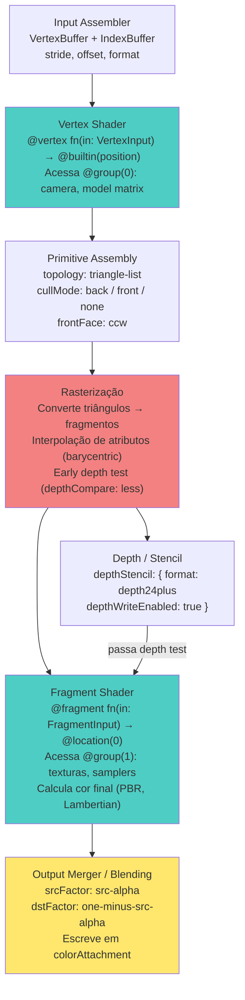
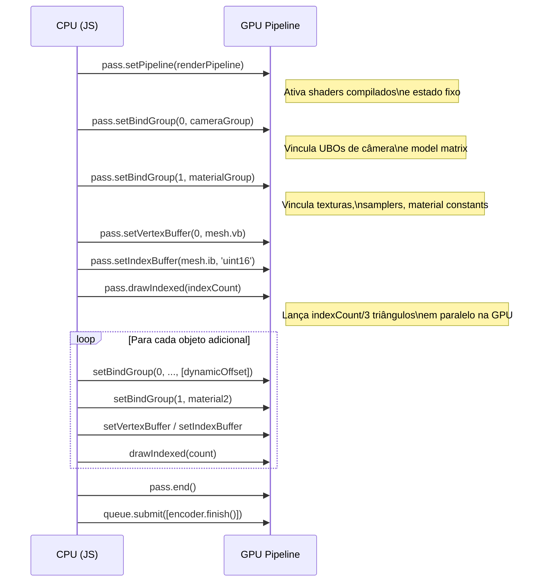

# 7. Pipeline de Renderização Prático, Programmable Passes e Drawings

O `GPURenderPipeline` é o objeto mais demorado de se construir na inteira arquitetura da WebGPU. Ele não processa os dados imediatamente, mas encapsula todos os Shaders compilados (Capítulo 5), junto a todos Layouts Esperados de BindGroups (Capítulo 6), combinados a um "Estado de Função Fixa" (Como mesclar cores, regras invisíveis de Triângulos/Rastreio 3D na Z-Matrix) em uma peça blindada indestrutível.

Em WebGPU, **mudanças de estado bruto são assadas (baked)** nos Pipelines. Você não liga ou desliga "Culling" ou "Wireframes" durante um Frame via código como fazia no OpenGL. Você precisa ter 2 Pipelines idênticas compiladas inicialmente e apenas apontar qual rodar.

## 7.1 Compilando o Estágio Fixo (`GPURenderPipeline`)

```javascript
// Agrupando TODOS Os Modelos Abstratos que nosso Pipeline Consumirá
// Ex: Bind Group 0 (Camera) + Bind Group 1 (Material do Capítulo Anterior)
const pipelineLayoutCompleto = device.createPipelineLayout({
  bindGroupLayouts: [layoutDaCameraGlobal, layoutDeMadeiraEHeroi]
});

const gpuStatePipelineOuro = device.createRenderPipeline({
  layout: pipelineLayoutCompleto,  

  // A. O Vértice Shader (Nossa Função Escrita pra Deformar, Capítulo 5)
  vertex: {
    module: moduloCompiladoShaderPronto,
    entryPoint: "minha_funcao_vertice", 
    // Como os Vértices se parecem antes de entrar no Shader? Declarando na RAM as regras:
    buffers: [{
      arrayStride: 12, // Tamanho total do vertice em Bytes
      attributes: [{ shaderLocation: 0, offset: 0, format: 'float32x3' }] // Envia isso pro @location(0) na GPU!
    }]
  },

  // B. Função Fixa de Rasterização e Primitivas (Hardware C++)
  primitive: {
      topology: 'triangle-list', // Conecta os Vértices em Triângulos de 3 Pontos? Ou Quad-Strips?
      cullMode: 'back',          // Jogue no Lixo triângulos invertidos economizando 50% dos loops de Cor!
      frontFace: 'ccw'           // A face 'virada para mim' deve enrolar no anti-horário!
  },

  // C. Testador de Profundidade Oculto (A Matrix Z-Buffer!) *OPCIONAL!
  depthStencil: {
      depthWriteEnabled: true,       // Ao Pintar uma árvore na tela, salve a Distância Z dela!
      depthCompare: 'less',          // PINTE O FRAGMENTO APENAS SE Z Desta arvore for 'MENOR' que a montanha ja guardada atrás no buffer!!
      format: 'depth24plus-stencil8' // O formato Textural invisível atrelado.
  },

  // D. Multisampling (MSAA) - OPCIONAL
  multisample: {
    count: 4,            // 1 (padrão, sem MSAA) ou 4 (4x MSAA)
    mask: 0xFFFFFFFF,    // Máscara de amostras ativas (padrão: todas)
    alphaToCoverageEnabled: false // Usa alpha do fragmento para máscara de cobertura
  },

  // E. Cores, Transparências, Telas / Fragment Shader!
  fragment: {
    module: moduloCompiladoShaderPronto,
    entryPoint: "minha_funcao_cor_final",
    targets: [{
      // Deve ser obrigatoriamente idêntico as configurações Iniciais do `context.configure({format: ...})` do canvas físico.
      format: navigator.gpu.getPreferredCanvasFormat(),
      
      // Hardware Fixo de Mesclagem de Cores! Como combinar "Vidro Transparente" sobre a cor já existente no canvas?
      blend: {
         color: { srcFactor: 'src-alpha', dstFactor: 'one-minus-src-alpha', operation: 'add' },
         alpha: { srcFactor: 'one', dstFactor: 'one', operation: 'add' }
      }
    }]
  }
});
// RESULTADO PÓS-COMPILAÇÃO OBTIDO. AGORA DEVEMOS DESENHAR E USÁ-LO!
```



## 7.2 Programmable Passes (A Execução `beginRenderPass`)

Pipeline criado não tem ligação com a realidade até enfiá-lo no Gravador de Comandos (Capítulo 3). Criamos os comandos gráficos englobando tudo num `GPURenderPassEncoder`.

Aqui informamos **exatamente** o Destino das Pinturas (`colorAttachments`), que limpezas automáticas a GPU deve executar nativamente no Frame antes de começar, e conectamos as energias e botões.

```javascript
const encoderCena = device.createCommandEncoder();

// A Configuração Dinâmica da Passagem "RenderPassDescriptor"
// Define a 'Tela Final' e sua Extensão Física pro hardware:
const configDrawFinal = {
   colorAttachments: [{
      view: context.getCurrentTexture().createView(), // Escreva no Canvas visível no Lado Cliente
      clearValue: [0.1, 0.4, 0.9, 1.0],               // Limpe a tela do navegador com um céu Azul Claro puro!!
      loadOp: 'clear',  // "Ação Inicial" = limpe antes de rodar os Draw.
      storeOp: 'store'  // "Ação Final" = Mande para a placa mãe mostrar nos chips de Display!
   }],
   // O Z-Buffer criado! Lembra do Pipeline `depthStencil` acoplado? Nós fornecemos o bloco extra limpo por frame aqui:
   depthStencilAttachment: {
      view: texturadeBufferZCriadaSeparado.createView(),
      depthClearValue: 1.0,  // "Limpe CADA Pixel virtual Z" para a Distância Infinita absoluta Máxima do Universo Matemático (1.0).
      depthLoadOp: 'clear',
      depthStoreOp: 'discard' // O Z-Buffer era temporário invisível de uso. Apague e Descarte na RAM.
   }
};

/* GRAVANDO OS DRAW CALLS AO VIVO EM FRAME ATUAL */
const renderPassFísico = encoderCena.beginRenderPass(configDrawFinal);

  // 1. Acorde a Monstruosidade Compilada: O Render Pipeline de Ouro.
  renderPassFísico.setPipeline(gpuStatePipelineOuro); 
  
  // 2. Coloque os fios de energia das variáveis concretas atuais na tomada!
  renderPassFísico.setBindGroup(0, machadoGiganteVerdeFogo); 
  
  // 3. Empurre os vértices e indices de pontos crus para o Input Assembler C++ (Configurado pelo Pipeline)!
  renderPassFísico.setVertexBuffer(0, bufferTriangulosFísicoDaPlaca);
  renderPassFísico.setIndexBuffer(bufferArrayIndicesCurtoGeometricos, 'uint16');
  
  // 3b. Viewport e Scissor (opcionais — padrão cobre todo o attachment)
  renderPassFísico.setViewport(0, 0, canvas.width, canvas.height, 0.0, 1.0);
  renderPassFísico.setScissorRect(0, 0, canvas.width, canvas.height);

  // 4. Mande invocar 3.000 Vértice Threads. Inicie! O Hardware decola!
  renderPassFísico.drawIndexed(3000);

  // 4b. Draw Indireto: parâmetros de draw lidos de um GPUBuffer na GPU (sem roundtrip CPU)
  // renderPassFísico.drawIndirect(indirectBuffer, 0);
  // renderPassFísico.drawIndexedIndirect(indirectBuffer, 0);

renderPassFísico.end(); // Assine a fita. Fim de Frame
/* ENVIE TUDO VIA QUEUE!! QUEUE.SUBMIT([]) */
```



## 7.3 Criação Assíncrona de Pipeline

`createRenderPipeline` é síncrono mas pode causar stutter porque a compilação do shader bloqueia a thread. Para evitar isso durante o loading:

```javascript
// Retorna uma Promise — compila em background sem travar o frame loop
const pipeline = await device.createRenderPipelineAsync({
  layout: pipelineLayout,
  vertex: { /* ... */ },
  fragment: { /* ... */ }
});
```

Use sempre a versão `Async` durante screens de loading. Reserve a versão síncrona apenas para hot-reloads de shader em ferramentas de desenvolvimento.

### O Custo da Invocação
Uma única Invocação de `draw/drawIndexed` pode acordar todas as dezenas de núcleos paralelos. Como boa prática em qualquer API explícita baixo-nível (Vulkan/Metal), o programador estuda incessantemente formas de *minitificar* a repetição abusiva dos "Fios de Energia na Tomada" `setBindGroup()` ou repetições custosas na CPU de múltiplos `draw()`. Para essa otimização massiva final, a classe avançada do [Módulo 9](./09_Compute_Pass_e_Queries.md) e [Módulo 10](./10_Hierarquia_Objetos_3D.md) lidará com Otimizações Pesadas (Instânciamentos e RenderBundles Automáticos).

[⬅ Voltar para Bindings](./06_Resource_Bindings.md) | [Próximo: Render Bundles ➡](./08_Bundles_e_Comandos.md)
