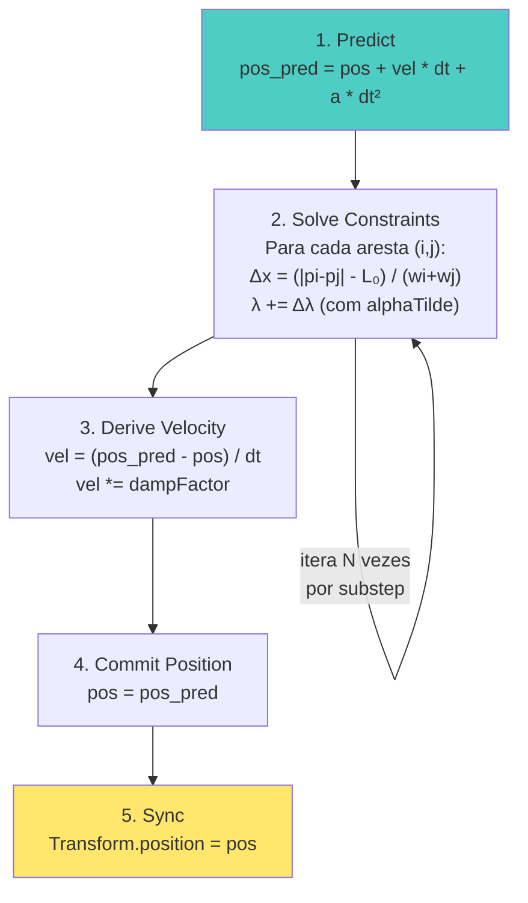
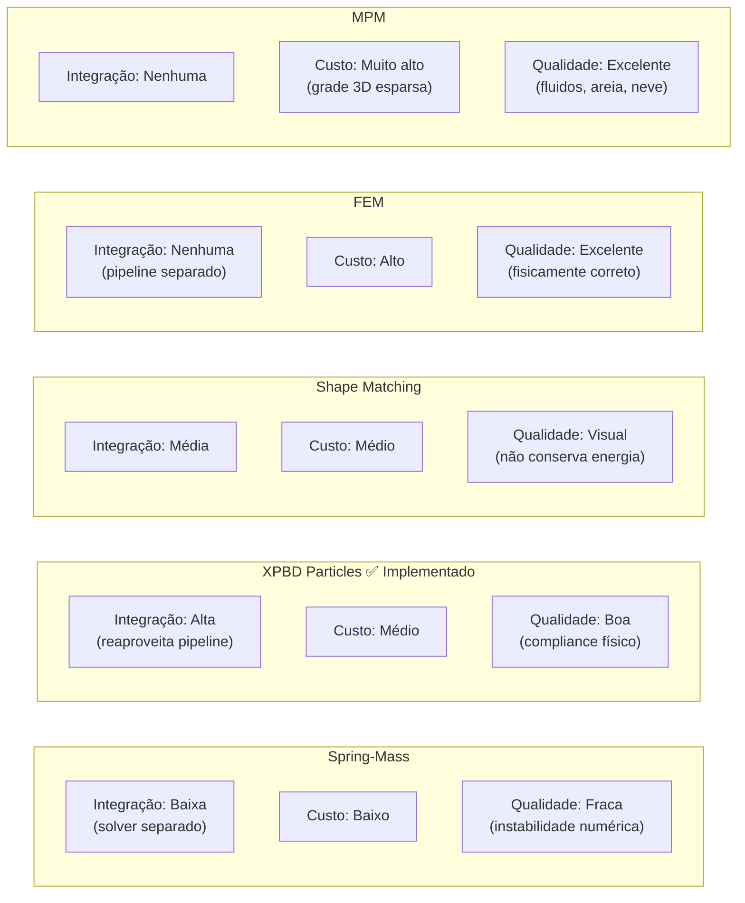

As principais abordagens para SoftBody:

  ---
  1. Spring-Mass (Massa-Mola)

  O que o stub atual sugere. Cada aresta da malha é uma mola: F = k·(|Δp| - restLength) · n̂. Integração explícita (Euler/Verlet).

  Prós: simples, intuitivo, GPU-friendly (paralelo por partícula).
  Contras: instável para k alto (rigidez exige dt pequeno), não conserva volume, parâmetros físicos sem significado real (k ≠ módulo de Young).

  ---
  2. XPBD Particles

  O que descrevi antes. Constraints de distância resolvidas por projeção iterativa com compliance α.

  Prós: incondicionalmente estável, α mapeia diretamente para rigidez física, reaproveita toda a infraestrutura XPBD já implementada.
  Contras: convergência lenta para alta rigidez sem muitos substeps.

  ---
  3. FEM (Finite Element Method)

  Divide o corpo em tetraedros; calcula stress/strain por elemento usando tensor de deformação. Base da simulação industrial (Abaqus, FEniCS).

  Prós: fisicamente correto, parâmetros são módulo de Young + coeficiente de Poisson.
  Contras: complexo, requer malha volumétrica (não apenas superfície), custo alto.

  ---
  4. Shape Matching

  Não usa constraints por aresta — computa a transformação rígida "mais próxima" do estado deformado e puxa partículas de volta a ela.

  Prós: extremamente estável e rápido, sem parâmetros de constraint por aresta.
  Contras: não é fisicamente correto, deformação é visual não mecânica.

  ---
  5. MPM (Material Point Method)

  Híbrido partícula-grade: partículas carregam momentum, grade resolve forças, partículas atualizam posição. Usado em neve (Frozen), água, areia.

  Prós: lida com grandes deformações, fratura, fluidos e granulares com o mesmo framework.
  Contras: custo alto de memória (grade 3D), implementação complexa.

  ---
  Qual faz sentido aqui

  Dado que o engine já tem XPBD funcionando:

