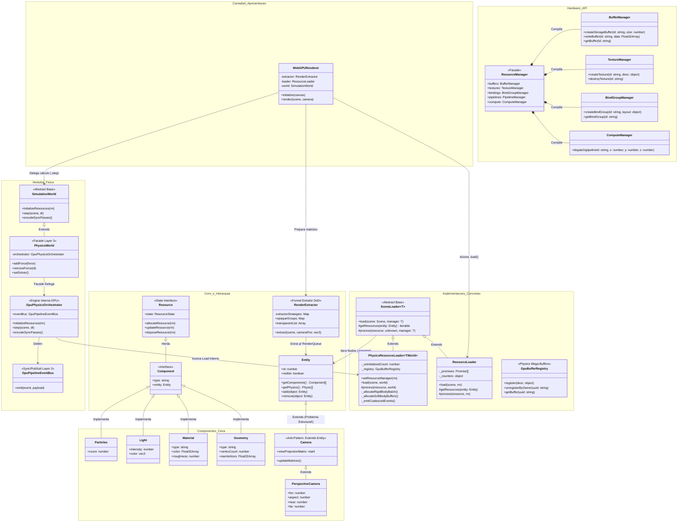

# Fluxo Estrutural e Gerenciamento de Loaders

Neste documento, mapeamos a arquitetura limpa em uso pelo motor WebGPU para realizar a ponte entre os Dados Puros da Cena (Camada 3) e o envio em massa para a API de Hardware (Camada 1).

## A Unificação por Trás dos Loaders

A engine baseia-se num design pautado em **Template Method** acoplado ao ECS/DoD. Em vez de criar múltiplos loops dispersos na pipeline de renderização, o trânsito C2 -> C1 é centralizado por uma classe base abstrata que dita a liturgia de travessia do Grafo de Cena: a classe utilitária `SceneLoader<T>`.

### A Classe Abstrata: `SceneLoader<TManager>`
O `SceneLoader` atua de forma rigorosa seguindo o Padrão de Projeto *Visitor*. Ele possui um único método exposto, `.load(scene, manager)`, que itera por toda a árvore ECS invocando obrigatoriamente duas assinaturas abstratas das classes filhas:
1. `getResources(entity: Entity)` -> Quais componentes importam para o meu escopo?
2. `process(resource, manager)` -> O que fazer com ele no estágio atual da máquina de estados?

A partir dele, a Engine cria distinções vitais em como processa dados limitados (visuais) vs dados correlacionados (Física PBD massiva).

### 1. `ResourceLoader` (Uploads Visuais e Atômicos)
Extende de `SceneLoader<ResourceManager>`. 
O `ResourceLoader` atua de forma autônoma avaliando **contratos locais**. Ele procura no Entity tudo o que herda a interface mestre de ciclo de vida (`ResourceState`: Uninitialized, Dirty, etc).
Sua natureza é essencialmente 1-para-1 assíncrona. Quando acha a Geometria A, ele emite o upload do `Float32Array` dela independentemente da Geometria B, empilhando todos os comandos numa `Promise.all` para não travar o Frame.

### 2. `PhysicsResourceLoader` (Agregação DoD Global e Coalescing)
Extende de `SceneLoader<TWorld>`.
O paradigma muda drasticamente. Processos físicos interconectados como os do PBD ou colisores Broadphase não se importam com a independência dos componentes — **Eles dependem da soma global deles**. 
O `PhysicsResourceLoader` varre a Cena para descobrir quem está inicializando ou mudando. O segredo dele é o **Coalescing**: no término do loop, ele invoca `_emitCoalescedEvents()`.
A partir daí, se houver alteração estrutural, a Física não aloca memoriazinhs pingadas. Ela derruba arrays no formato Float e agrupa todos os corpos em "Sopas Numéricas Colossais" no **GpuBufferRegistry** (RigidBody global buffer batch), usando ponteiros absolutos. 

## Diagrama da Arquitetura C2 Efetiva

Abaixo, a representação da herança limpa entre a interface abstrata e seus pipelines reais em TypeScript:

### O Triunfo da Padronização
Esse é o verdadeiro poder da arquitetura da Engine em seu Core. Ela não engessa o sistema. Ao extrair os loops `scene.traverse()` e a semântica `Onde Encontrar -> O Que Fazer` para uma **Abstract Class**, qualquer colaborador pode construir um "SoundLoader" amanhã, herdá-lo de `SceneLoader`, e apenas customizar as promessas, mantendo o controle total garantido pelo ECS purista.
