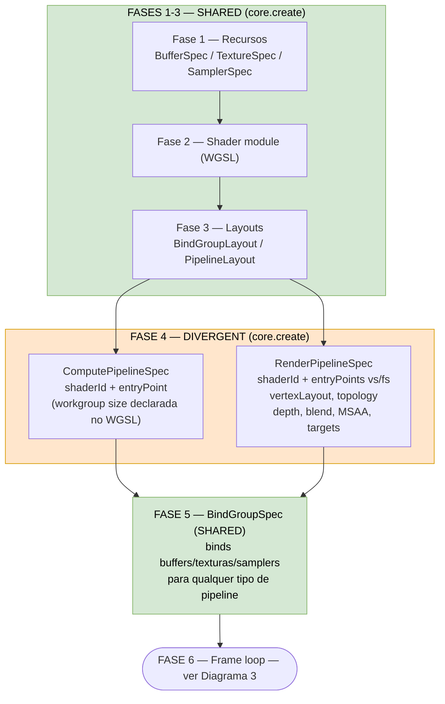
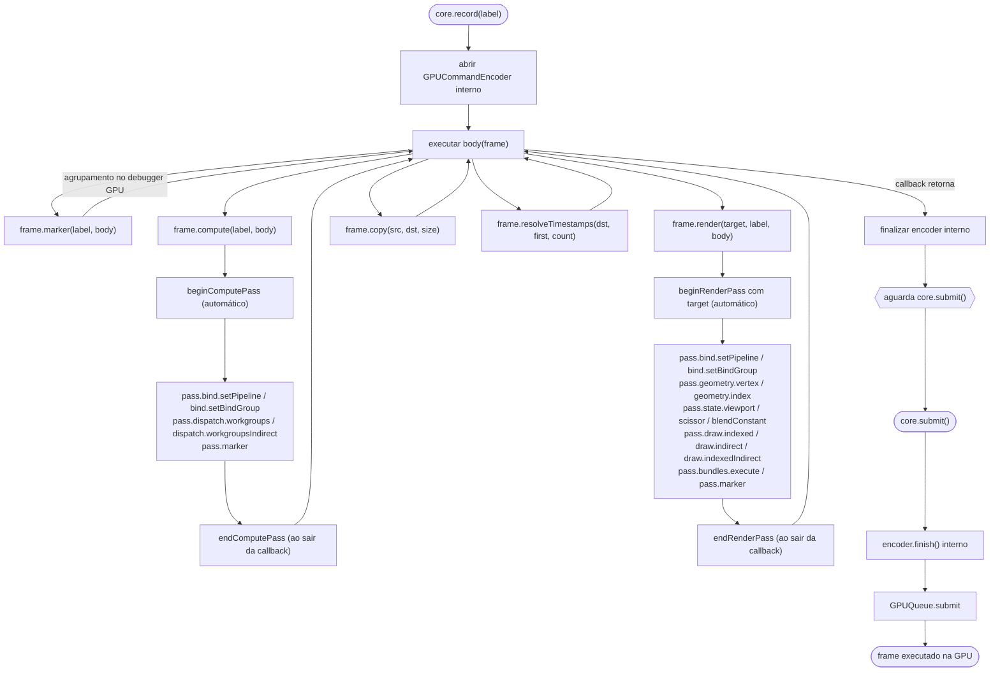
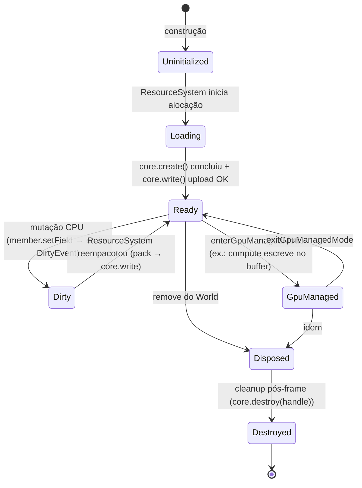
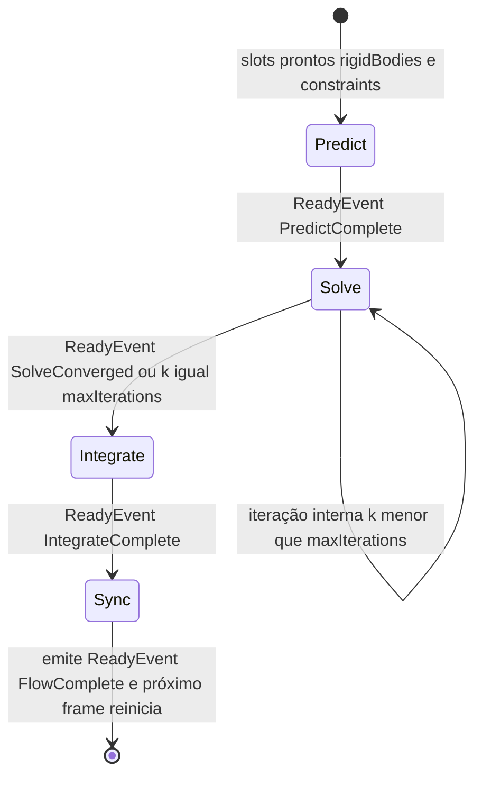

# Arquitetura do Motor — Camadas 1 a 4

Este guia descreve a arquitetura **corrente** do Clay Engine após a refatoração clean. O motor é
organizado em quatro camadas com regra de importação estrita: **C1 Hardware** (`src/core` — `EngineCore`
sobre WebGPU), **C2 Sincronização/ECS** (`src/scene` — `World`, `ResourceSystem`/`ExecutionSystem`, `Flow`,
descritores `Schema`/`GPUDescriptor`), **C3 Elementos** (`src/elements` — geometrias, materiais, bodies,
colliders, constraints, forcefields, flows) e **C4 Apresentação** (`src/presentation` — `Application`,
controllers, pós-processamento).

> A arquitetura legada baseada em Loaders e Singletons (`SceneLoader`, `PhysicsResourceLoader`,
> `WebGPUContext`…) foi **removida**. Sua descrição histórica está no apêndice de
> [Migração legacy → clean](./migration_legacy_to_clean.md).

## Camada 1: Hardware API (`src/core`)

Reorganização radical da Camada 1 com superfície pública **mínima** e callback-oriented. O acesso ao hardware passa por uma única facade `EngineCore` com poucos métodos de ação direta; encoders, passes e recursos GPU **nunca escapam como objetos** — **recursos são identificados pelo próprio `ResourceSpec`** (spec-as-identity: `core.create(spec)` retorna `spec` e o engine hasheia o conteúdo internamente para dedup/idempotência) e passes existem apenas dentro de callbacks. Substitui a antiga hierarquia de managers paralelos e hierarquia de classes `Engine*` por um contrato único e tipado estaticamente via discriminated unions.

| Antes (legado) | Agora (clean) |
|---|---|
| `WebGPUContext` Singleton — 11 dependências diretas | `GpuContext` value object interno — injetado uma vez no bootstrap |
| `WebGPUEngineCore` expõe 8 managers navegáveis via getters | `EngineCore` com 8 métodos de ação + 2 únicos getters (profiler, canvasFormat) |
| `BufferManager`, `TextureManager`, `BindGroupManager`, `PipelineManager` como interfaces públicas paralelas | Todos viram implementação interna — fronteira pública reduz a `EngineCore` |
| Navegação em 3 níveis: `core.resources.buffers.createStorage(...)` | Ação direta: `core.create({ kind: 'buffer', subkind: 'storage', ... })` |
| `EngineBuffer` flat e `Engine*` classes que vazam estrutura (`buf.native`) | **Spec é a identidade** — `core.create(spec)` retorna `spec`; engine hasheia internamente (UUIDv5 sobre serialização estável) e mantém `Map<hash, GPUObject>`. Zero estrutura GPU exposta |
| `Encoder` e passes retornáveis e reteníveis por C2 | Encoder implícito no `record()`; passes só existem dentro de callbacks |
| 14 métodos de fábrica (`createVertexBuffer`, `createStorageBuffer`, …) | 1 método genérico `create<S extends ResourceSpec>(spec: S): S` — inferência por discriminated union |
| Indirect/Staging como pastas separadas | Subtipos discriminados via `subkind: 'indirect'`/`'staging'` no `BufferSpec` |
| Copy e Readback desconectos da fase de gravação | `frame.copy()` dentro de callback, `core.readback()` direto |

### Diagrama 1 — Contratos públicos, specs por família e implementação

```mermaid
classDiagram

    %% ═══════════════════════════════════════════════════════════════════════
    %% CONTRATOS PÚBLICOS — core/contracts/
    %% 5 interfaces: a fronteira inteira da Camada 1
    %% ═══════════════════════════════════════════════════════════════════════
    namespace Contratos_Publicos {
        class EngineCore {
            <<Interface — facade única | impl: GpuEngineCore>>
            +create~S~(spec: S) S
            +createAsync~S~(spec: S) Promise~S~
            +write(spec: BufferSpec, data: ArrayBufferView, offset?) void
            +writeTexture(spec: TextureSpec, data: ArrayBufferView, layout: TextureDataLayout, size: Extent3D) void
            +destroy(spec: ResourceSpec) void
            +readback(spec: StagingBufferSpec) Promise~ArrayBuffer~
            +record(label?, body: (frame) => void) void
            +submit() void
            +initialize(canvas, options?: CanvasOptions) Promise~void~
            +reconfigureCanvas(options?: CanvasOptions) void
            +withErrorScope~T~(filter, body: () => T) Promise~T~
            +shutdown() void
            +profiler: Profiler
            +canvasFormat: GPUTextureFormat
        }
        class Frame {
            <<Interface — callback-scoped | impl: GpuFrame>>
            +canvasView: TextureViewSpec
            +compute(label?, body: (pass) => void) void
            +render(target: RenderTarget, label?, body: (pass) => void) void
            +copy(src: BufferSpec, dst: BufferSpec, size, srcOffset?, dstOffset?) void
            +copyBufferToTexture(src: BufferSpec, dst: TextureSpec, layout, size, options?) void
            +copyTextureToBuffer(src: TextureSpec, dst: BufferSpec, layout, size, options?) void
            +copyTextureToTexture(src: TextureSpec, dst: TextureSpec, size, options?) void
            +marker(label, body: () => void) void
            +resolveTimestamps(dst: StagingBufferSpec, first, count) void
        }
        class ComputePass {
            <<Interface — agrega slots | impl: GpuComputePass (+Binder+Dispatcher)>>
            +bind: Binder~ComputePipelineSpec~
            +dispatch: Dispatcher
            +marker(label) void
        }
        class RenderPass {
            <<Interface — agrega slots | impl: GpuRenderPass (+5 slots)>>
            +bind: Binder~RenderPipelineSpec~
            +geometry: GeometryBinder
            +state: RenderState
            +draw: Drawer
            +bundles: BundleRunner
            +marker(label) void
        }
        class Profiler {
            <<Interface — única exposição de objeto | impl: GpuProfilerSystem>>
            +isSupported: boolean
            +timestampWritesFor(first, last) object
            +readRange(first, count) Promise~BigInt64Array~
        }
    }

    %% ═══════════════════════════════════════════════════════════════════════
    %% PASS SLOTS — Interface Segregation aplicada sobre ComputePass e RenderPass
    %% Binder é compartilhado (generic em P) — o resto é específico por tipo de pass
    %% ═══════════════════════════════════════════════════════════════════════
    namespace Pass_Slots_SHARED {
        class Binder~P~ {
            <<Interface — impl: GpuComputePass / GpuRenderPass (narrow por P)>>
            +setPipeline(spec: P) this
            +setBindGroup(index, spec: BindGroupSpec, dynamicOffsets?) this
        }
    }

    namespace Pass_Slots_COMPUTE {
        class Dispatcher {
            <<Interface — impl: GpuComputePass>>
            +workgroups(x, y?, z?) this
            +workgroupsIndirect(spec: IndirectBufferSpec, offset?) this
        }
    }

    %% ═══════════════════════════════════════════════════════════════════════
    %% RENDER TARGET — value objects passados inline para frame.render()
    %% Não criados via core.create(); referenciam TextureViewSpec já existentes
    %% ═══════════════════════════════════════════════════════════════════════
    namespace Render_Target_ValueObjects {
        class RenderTarget {
            <<value object>>
            +colorAttachments: ColorAttachment[]
            +depthStencilAttachment?: DepthStencilAttachment
            +maxDrawCount?: number
        }
        class ColorAttachment {
            <<value object>>
            +view: TextureViewSpec
            +resolveTarget?: TextureViewSpec
            +clearValue?: [r, g, b, a]
            +loadOp: 'load'|'clear'
            +storeOp: 'store'|'discard'
            +depthSlice?: number
        }
        class DepthStencilAttachment {
            <<value object>>
            +view: TextureViewSpec
            +depthClearValue?: number
            +depthLoadOp?: 'load'|'clear'
            +depthStoreOp?: 'store'|'discard'
            +depthReadOnly?: boolean
            +stencilClearValue?: number
            +stencilLoadOp?: 'load'|'clear'
            +stencilStoreOp?: 'store'|'discard'
            +stencilReadOnly?: boolean
        }
    }

    %% ═══════════════════════════════════════════════════════════════════════
    %% VALUE OBJECTS DE PIPELINE — usados dentro de RenderPipelineSpec
    %% Estruturas inline; não criadas via core.create()
    %% ═══════════════════════════════════════════════════════════════════════
    namespace Pipeline_ValueObjects {
        class VertexBufferLayout {
            <<value object>>
            +arrayStride: number
            +stepMode?: 'vertex'|'instance'
            +attributes: VertexAttribute[]
        }
        class VertexAttribute {
            <<value object>>
            +shaderLocation: number
            +offset: number
            +format: GPUVertexFormat
        }
        class DepthSpec {
            <<value object>>
            +format: GPUTextureFormat
            +depthWriteEnabled?: boolean
            +depthCompare?: GPUCompareFunction
            +stencilFront?: StencilFaceState
            +stencilBack?: StencilFaceState
            +stencilReadMask?: number
            +stencilWriteMask?: number
            +depthBias?: number
            +depthBiasSlopeScale?: number
            +depthBiasClamp?: number
        }
        class StencilFaceState {
            <<value object>>
            +compare?: GPUCompareFunction
            +failOp?: GPUStencilOperation
            +depthFailOp?: GPUStencilOperation
            +passOp?: GPUStencilOperation
        }
        class ColorTargetSpec {
            <<value object>>
            +format: GPUTextureFormat
            +blend?: BlendSpec
            +writeMask?: number
        }
        class BlendSpec {
            <<value object>>
            +color: BlendComponent
            +alpha: BlendComponent
        }
        class BlendComponent {
            <<value object>>
            +operation?: GPUBlendOperation
            +srcFactor?: GPUBlendFactor
            +dstFactor?: GPUBlendFactor
        }
        class MultisampleSpec {
            <<value object>>
            +count?: 1|4
            +mask?: number
            +alphaToCoverageEnabled?: boolean
        }
    }

    %% ═══════════════════════════════════════════════════════════════════════
    %% VALUE OBJECTS DE BINDING — usados em LayoutSpec e BindGroupSpec
    %% Cada um é discriminated union sobre kind
    %% ═══════════════════════════════════════════════════════════════════════
    namespace Binding_ValueObjects {
        class BindingLayoutEntry {
            <<discriminated union — 5 variantes por kind>>
            +binding: number
            +visibility: number
            +kind: 'buffer'|'sampler'|'texture'|'storage-texture'|'external-texture'
        }
        class BindingEntry {
            <<discriminated union — 3 variantes por kind>>
            +binding: number
            +kind: 'buffer'|'sampler'|'textureview'
        }
    }

    namespace Pass_Slots_RENDER {
        class GeometryBinder {
            <<Interface — impl: GpuRenderPass>>
            +vertex(slot, spec: VertexBufferSpec, offset?, size?) this
            +index(spec: IndexBufferSpec, offset?, size?) this
        }
        class RenderState {
            <<Interface — impl: GpuRenderPass>>
            +viewport(x, y, w, h, minDepth, maxDepth) this
            +scissor(x, y, w, h) this
            +blendConstant(color) this
            +stencilReference(ref) this
        }
        class Drawer {
            <<Interface — impl: GpuRenderPass>>
            +vertices(count, instances?, firstVertex?, firstInstance?) this
            +indexed(count, instances?, firstIndex?, baseVertex?, firstInstance?) this
            +indirect(spec: IndirectBufferSpec, offset?) this
            +indexedIndirect(spec: IndirectBufferSpec, offset?) this
        }
        class BundleRunner {
            <<Interface — impl: GpuRenderPass>>
            +execute(specs: BundleSpec[]) this
        }
    }

    %% ═══════════════════════════════════════════════════════════════════════
    %% SPECS — organizados pelas 6 fases do ciclo WebGPU
    %% SHARED   = spec comum a compute e render
    %% DIVERGENT = spec difere entre compute e render
    %% ═══════════════════════════════════════════════════════════════════════
    namespace FASE_1_Recursos_SHARED {
        class BufferSpec {
            <<abstract — família | spec-as-identity>>
            kind='buffer'
            +discriminator?: string
            +subkind
        }
        class VertexBufferSpec {
            subkind='vertex'
            +byteSize: number
            +stride: number
            +count: number
        }
        class IndexBufferSpec {
            subkind='index'
            +byteSize: number
            +count: number
            +format: GPUIndexFormat
        }
        class UniformBufferSpec {
            subkind='uniform'
            +byteSize: number
        }
        class StorageBufferSpec {
            subkind='storage'
            +byteSize: number
        }
        class IndirectBufferSpec {
            subkind='indirect'
            +byteSize: number
        }
        class StagingBufferSpec {
            subkind='staging'
            +byteSize: number
        }
        class TextureSpec {
            kind='texture'
            +discriminator?: string
            +dimension?: '1d'|'2d'|'3d'
            +width: number
            +height: number
            +depthOrArrayLayers?: number
            +format: GPUTextureFormat
            +usage: number
            +mipLevelCount?: number
            +sampleCount?: 1|4
            +viewFormats?: GPUTextureFormat[]
        }
        class TextureViewSpec {
            kind='textureview'
            +discriminator?: string
            +source: TextureSpec
            +dimension?: GPUTextureViewDimension
            +format?: GPUTextureFormat
            +baseMipLevel?: number
            +mipLevelCount?: number
            +baseArrayLayer?: number
            +arrayLayerCount?: number
            +aspect?: 'all'|'depth-only'|'stencil-only'
        }
        class SamplerSpec {
            kind='sampler'
            +discriminator?: string
            +desc?: GPUSamplerDescriptor
        }
    }

    namespace FASE_2_Shader_SHARED {
        class ShaderModuleSpec {
            kind='shader'
            +discriminator?: string
            +source: string
            +label?: string
        }
    }

    namespace FASE_3_Layout_SHARED {
        class LayoutSpec {
            kind='layout'
            +discriminator?: string
            +entries: BindingLayoutEntry[]
        }
    }

    namespace FASE_4_Pipelines_DIVERGENT {
        class PipelineSpec {
            <<abstract — família | spec-as-identity>>
            kind='pipeline'
            +discriminator?: string
            +layouts: LayoutSpec[]
            +subkind
        }
        class ComputePipelineSpec {
            subkind='compute'
            +shader: ShaderModuleSpec
            +entryPoint: string
            +constants?: Record~string, number~
        }
        class RenderPipelineSpec {
            subkind='render'
            +vertex: VertexStage
            +fragment?: FragmentStage
            +primitive?: PrimitiveSpec
            +depthStencil?: DepthSpec
            +multisample?: MultisampleSpec
        }
    }

    namespace FASE_5_BindGroup_SHARED {
        class BindGroupSpec {
            kind='bindgroup'
            +discriminator?: string
            +layout: LayoutSpec
            +bindings: BindingEntry[]
        }
    }

    namespace RENDER_ONLY_Bundles {
        class BundleSpec {
            kind='bundle'
            +discriminator: string
            +formats: BundleFormats
            +body: (pass: RenderPass) => void
        }
    }

    %% ── FLUXO DE SPECS por fase: EngineCore.create() aceita qualquer spec ───
    %% (1 arrow por família; variantes resolvidas via subkind no discriminated union)
    %% Fase 1 — Recursos físicos
    EngineCore ..> BufferSpec       : create (qualquer subkind)
    EngineCore ..> TextureSpec      : create
    EngineCore ..> TextureViewSpec  : create
    EngineCore ..> SamplerSpec      : create
    %% Fase 2 — Shader module
    EngineCore ..> ShaderModuleSpec : create
    %% Fase 3 — Layout
    EngineCore ..> LayoutSpec       : create
    %% Fase 4 — Pipelines (divergent)
    EngineCore ..> PipelineSpec     : create (compute ou render)
    %% Fase 5 — BindGroups
    EngineCore ..> BindGroupSpec    : create
    %% Render-only
    EngineCore ..> BundleSpec       : create

    %% ── HIERARQUIA DE FAMÍLIAS (extends — campos comuns na base) ───────────
    BufferSpec   <|-- VertexBufferSpec
    BufferSpec   <|-- IndexBufferSpec
    BufferSpec   <|-- UniformBufferSpec
    BufferSpec   <|-- StorageBufferSpec
    BufferSpec   <|-- IndirectBufferSpec
    BufferSpec   <|-- StagingBufferSpec
    PipelineSpec <|-- ComputePipelineSpec
    PipelineSpec <|-- RenderPipelineSpec

    %% ── DEPENDÊNCIAS ENTRE SPECS (grafo de referências) ─────────────────────
    PipelineSpec    ..> ShaderModuleSpec : shader (referência direta)
    PipelineSpec    ..> LayoutSpec       : layouts (array)
    BindGroupSpec   ..> LayoutSpec       : layout (referência direta)
    TextureViewSpec ..> TextureSpec      : source (referência direta)

    %% ── PASSES ↔ SLOTS (composição — Binder reutilizado via P) ─────────────
    ComputePass o-- Binder         : bind
    ComputePass o-- Dispatcher     : dispatch
    RenderPass  o-- Binder         : bind
    RenderPass  o-- GeometryBinder : geometry
    RenderPass  o-- RenderState    : state
    RenderPass  o-- Drawer         : draw
    RenderPass  o-- BundleRunner   : bundles

    %% ── RENDER TARGET (value-object composition) ───────────────────────────
    RenderTarget *-- ColorAttachment           : colorAttachments[]
    RenderTarget *-- DepthStencilAttachment    : depthStencilAttachment?
    Frame        ..> RenderTarget              : render(target, body)

    %% ── PIPELINE VALUE OBJECTS (usados por RenderPipelineSpec) ──────────────
    RenderPipelineSpec *-- VertexBufferLayout : vertexBuffers[]
    RenderPipelineSpec *-- DepthSpec          : depth?
    RenderPipelineSpec *-- MultisampleSpec    : multisample?
    RenderPipelineSpec *-- ColorTargetSpec    : colorTargets[]
    VertexBufferLayout *-- VertexAttribute    : attributes[]
    DepthSpec          *-- StencilFaceState   : stencilFront/stencilBack?
    ColorTargetSpec    *-- BlendSpec          : blend?
    BlendSpec          *-- BlendComponent     : color/alpha

    %% ── BINDING VALUE OBJECTS (usados por LayoutSpec e BindGroupSpec) ───────
    LayoutSpec    *-- BindingLayoutEntry : entries[]
    BindGroupSpec *-- BindingEntry       : bindings[]

    %% ── FLUXO DE CALLBACKS ─────────────────────────────────────────────────
    EngineCore ..> Frame : record(body) injeta
    Frame ..> ComputePass : compute(body) injeta
    Frame ..> RenderPass : render(body) injeta
    EngineCore ..> Profiler : expõe (única exceção)
```



### Implementações `Gpu*` — tabela (internas, não aparecem no classDiagram)

Assim como handles, as classes `Gpu*` não aparecem como caixas no classDiagram — seriam caixas sem atributos/métodos públicos (o contrato vive nas interfaces que implementam). Residem em `core/gpu/` e **nunca são importadas por C2/C3/C4** — o bootstrap instancia `GpuEngineCore` e entrega como `EngineCore`.

| Classe            | Implementa                                                               | Responsabilidade |
|---|---|---|
| `GpuEngineCore`      | `EngineCore`                                                             | Facade raiz — dispatcher de `create()` para o store, abre encoder em `record()`, expõe `Profiler`. Composto por `GpuContext`, `GpuResourceStore`, `GpuCommandState`. |
| `GpuFrame`           | `Frame`                                                                  | Vida de 1 callback `record()` — expõe `compute`/`render`/`copy`/`marker`/`resolveTimestamps`. Instancia passes sob demanda. |
| `GpuComputePass`     | `ComputePass`, `Binder<ComputePipelineSpec>`, `Dispatcher`                 | 1 objeto com 3 visões tipadas via getters `this as Binder<…>` / `this as Dispatcher`. |
| `GpuRenderPass`      | `RenderPass`, `Binder<RenderPipelineSpec>`, `GeometryBinder`, `RenderState`, `Drawer`, `BundleRunner` | 1 objeto com 6 visões tipadas — zero alocação extra. |
| `GpuProfilerSystem`  | `Profiler`                                                               | Timestamp queries + resolve/readback parcial. |
| `GpuContext`         | — (value object interno)                                                 | Tupla `{ device, queue, canvasFormat, canvas }` construída no bootstrap, injetada nos outros `Gpu*`. |
| `GpuResourceStore`   | — (helper interno)                                                       | Indexa `GPUBuffer / GPUTexture / GPUSampler / GPUShaderModule / GPUBindGroupLayout / GPUBindGroup / GPUPipeline / GPURenderBundle` por handle id e categoria. |
| `GpuCommandState`    | — (helper interno)                                                       | Encoder ativo + pilha de passes durante uma chamada a `record()`. |

**Composição interna:** `GpuEngineCore *-- GpuContext`, `GpuResourceStore`, `GpuCommandState`. `GpuEngineCore` instancia `GpuFrame` em `record()`; `GpuFrame` instancia `GpuComputePass`/`GpuRenderPass` nas callbacks de `compute()`/`render()`. Estes laços de instanciação também ficam ocultos ao classDiagram porque envolvem exclusivamente classes internas.

### Specs como identidade (spec-as-identity)

**Não há handles branded.** Recursos são identificados pelo próprio `ResourceSpec` que o consumidor passou em `core.create(spec)`. O engine hasheia o conteúdo do spec (UUIDv5 sobre serialização JSON estável) e mantém `Map<hash, GPUObject>` interno. `core.create(spec)` retorna `spec` (a mesma referência) — chamadas com specs estruturalmente iguais retornam o mesmo handle subjacente (idempotência por construção).

| Categoria | subkind/discriminator | Campos no spec |
|---|---|---|
| `BufferSpec`    | `vertex`   | `stride, count` |
| `BufferSpec`    | `index`    | `count, format` |
| `BufferSpec`    | `uniform`  | `byteSize` |
| `BufferSpec`    | `storage`  | `byteSize` |
| `BufferSpec`    | `indirect` | `byteSize` |
| `BufferSpec`    | `staging`  | `byteSize` |
| `TextureSpec`        | —          | `dimension, width, height, depthOrArrayLayers, format, mipLevelCount, sampleCount` |
| `TextureViewSpec`    | —          | `source: TextureSpec, format?, dimension?` |
| `SamplerSpec`        | —          | `desc?: GPUSamplerDescriptor` |
| `ShaderModuleSpec`   | —          | `source: string` |
| `LayoutSpec`         | —          | `entries: BindingLayoutEntry[]` |
| `BindGroupSpec`      | —          | `layout: LayoutSpec, bindings: BindingEntry[]` |
| `ComputePipelineSpec`| `compute`  | `shader: ShaderModuleSpec, entryPoint, layouts` |
| `RenderPipelineSpec` | `render`   | `vertex/fragment stages, primitive, depth, multisample, colorTargets, layouts` |
| `BundleSpec`         | —          | `formats, body: (pass: RenderPass) => void` |

`ResourceSpec` é o union discriminado de todas as variantes — aceito por `destroy()` e outras operações universais. Cada spec carrega `discriminator?: string` opcional que o caller (LayoutInferencer/ResourceSystem) preenche para diferenciar duas alocações estruturalmente iguais (ex.: dois Camera com mesmo `byteSize` precisam de discriminator pra virarem buffers distintos).

Consumidor acessa metadata direto do spec que detém: `vboSpec.byteSize`, `texSpec.width`. Nunca há "id branded" separado.

### Buffers polivalentes — compute produz, render consome

Cada `subkind` de buffer define **propósito semântico**, não uma restrição de uso. A implementação traduz subkind em usage flags WebGPU de forma que o mesmo `GPUBuffer` serve ambos os lados do pipeline sem cópia:

| subkind | usage WebGPU resultante | padrão típico |
|---|---|---|
| `vertex`   | `VERTEX \| STORAGE \| COPY_DST`   | compute escreve posições/normais → render lê como vertex |
| `index`    | `INDEX \| STORAGE \| COPY_DST`    | compute escreve índices → render lê como index |
| `indirect` | `INDIRECT \| STORAGE \| COPY_DST` | compute gera draw counts → render drawIndirect |
| `storage`  | `STORAGE \| COPY_SRC \| COPY_DST` | buffer interno de compute (solvers de física, neighbor grids) |
| `uniform`  | `UNIFORM \| COPY_DST`             | constantes para ambos os pipelines |
| `staging`  | `COPY_DST \| MAP_READ`            | readback de GPU para CPU |

**Zero cópia entre passes.** Um `VertexBufferSpec` criado para ser consumido no render pode ser bound como storage em um `ComputePass` via `BindGroup` — a barreira de memória entre passes dentro do mesmo encoder é automática.

**Consequência arquitetural:** o engine é compute-first. Geometria (posições de vértice), particle surfaces, cloth/fluid meshes, transform matrices de instâncias são todos calculados por compute e consumidos pelo render sem tradução intermediária. Material (Layer 3) configura **vertex stage + fragment stage** do render pipeline — mas como a transformação pesada já aconteceu no compute, o vertex shader tende a ser fino (MVP final + pass-through de atributos); o peso semântico do Material concentra-se no fragment.

### Diagrama 2 — Construção de recursos e pipelines (setup)

Fluxo das chamadas `core.create(spec)` agrupadas pelas 5 fases de setup do WebGPU, evidenciando o que é compartilhado entre compute/render e onde diverge.



**Observações:**
- Apenas **Pipeline** (fase 4) e **Pass** (fase 6, ver Diagrama 3) divergem entre compute e render — ~70% do ciclo é compartilhado
- `RenderPipelineSpec` carrega todo o fixed-function: topologia, vertexLayout, depth/stencil, blending, MSAA, color targets — mais o par de entrypoints vs/fs
- `ComputePipelineSpec` é muito mais enxuto — só entrypoint; workgroup size declarada no próprio WGSL (`@workgroup_size(...)`)
- O mesmo `BindGroup` pode ser consumido por qualquer tipo de pass desde que o shader declare bindings compatíveis com o layout

### Diagrama 3 — Ciclo de um frame (etapas explícitas dos passes)

No original, as etapas de cada pass eram obscuras (só apareciam `beginX → GPURawEncoder`). Com callbacks, begin/end viram automáticos — o flowchart abaixo explicita como.



Observações do ciclo:
- **Encoder nunca escapa** — aberto antes da callback, fechado depois, submetido por `core.submit()`
- **Begin/end dos passes são automáticos** — garantidos pelo escopo da callback
- **Nested callbacks permitidos** — `frame.marker(() => { frame.compute(...); frame.render(...) })` funciona
- **Ordem da body callback define ordem GPU** — compute antes de render = dependência implícita

### Vocabulário de tipos em TypeScript

**Specs como identidade.** Não há handles branded. Cada spec é um objeto declarativo discriminado por `kind` (e `subkind` quando família). `core.create(spec)` retorna `spec` (a mesma referência); engine hasheia o conteúdo (UUIDv5 sobre serialização JSON estável) para dedup interno. Specs estruturalmente iguais → mesmo handle subjacente.

```typescript
// ── Bases de família (campos comuns DRY) ──────────────────────────────────
interface BufferSpec {
    kind: 'buffer'
    subkind: 'vertex' | 'index' | 'uniform' | 'storage' | 'indirect' | 'staging'
    discriminator?: string  // caller preenche quando dois specs estruturalmente iguais precisam ser distintos
}

// ── Variantes da família Buffer ───────────────────────────────────────────
interface VertexBufferSpec   extends BufferSpec { subkind: 'vertex';   byteSize: number; stride: number; count: number }
interface IndexBufferSpec    extends BufferSpec { subkind: 'index';    byteSize: number; count: number; format: GPUIndexFormat }
interface UniformBufferSpec  extends BufferSpec { subkind: 'uniform';  byteSize: number }
interface StorageBufferSpec  extends BufferSpec { subkind: 'storage';  byteSize: number }
interface IndirectBufferSpec extends BufferSpec { subkind: 'indirect'; byteSize: number }
interface StagingBufferSpec  extends BufferSpec { subkind: 'staging';  byteSize: number }

type AnyBufferSpec = VertexBufferSpec | IndexBufferSpec | UniformBufferSpec
                   | StorageBufferSpec | IndirectBufferSpec | StagingBufferSpec

// ── Variantes da família Pipeline ─────────────────────────────────────────
interface PipelineSpec {
    kind: 'pipeline'
    subkind: 'compute' | 'render'
    discriminator?: string
    layouts: readonly LayoutSpec[]   // ordem reflete bindGroup index esperado
}

interface ComputePipelineSpec extends PipelineSpec {
    subkind: 'compute'
    shader: ShaderModuleSpec
    entryPoint: string
    constants?: Readonly<Record<string, number>>
}

interface RenderPipelineSpec extends PipelineSpec {
    subkind: 'render'
    vertex: VertexStage
    fragment?: FragmentStage
    primitive?: PrimitiveSpec
    depthStencil?: DepthSpec
    multisample?: MultisampleSpec
}

interface VertexStage   { shader: ShaderModuleSpec; entryPoint: string; buffers?: readonly VertexBufferLayout[]; constants?: Readonly<Record<string, number>> }
interface FragmentStage { shader: ShaderModuleSpec; entryPoint: string; targets: readonly ColorTargetSpec[]; constants?: Readonly<Record<string, number>> }

type AnyPipelineSpec = ComputePipelineSpec | RenderPipelineSpec

// ── Specs stand-alone ──────────────────────────────────────────────────────
interface TextureSpec {
    kind: 'texture'
    discriminator?: string
    dimension?: '1d' | '2d' | '3d'
    width: number
    height: number
    depthOrArrayLayers?: number
    format: GPUTextureFormat
    usage: number
    mipLevelCount?: number
    sampleCount?: 1 | 4
    viewFormats?: readonly GPUTextureFormat[]
    label?: string
}

interface TextureViewSpec {
    kind: 'textureview'
    discriminator?: string
    source: TextureSpec                        // referência direta — não id
    dimension?: GPUTextureViewDimension
    format?: GPUTextureFormat
    baseMipLevel?: number
    mipLevelCount?: number
    baseArrayLayer?: number
    arrayLayerCount?: number
    aspect?: 'all' | 'depth-only' | 'stencil-only'
    label?: string
}

interface SamplerSpec      { kind: 'sampler';   discriminator?: string; desc?: GPUSamplerDescriptor }
interface ShaderModuleSpec { kind: 'shader';    discriminator?: string; source: string; label?: string }
interface LayoutSpec       { kind: 'layout';    discriminator?: string; entries: readonly BindingLayoutEntry[] }
interface BindGroupSpec    { kind: 'bindgroup'; discriminator?: string; layout: LayoutSpec; bindings: readonly BindingEntry[] }
interface BundleSpec       { kind: 'bundle';    discriminator: string; formats: BundleFormats; body: (pass: RenderPass) => void }

type ResourceSpec = AnyBufferSpec | TextureSpec | TextureViewSpec | SamplerSpec
                  | ShaderModuleSpec | LayoutSpec | AnyPipelineSpec | BindGroupSpec | BundleSpec

// ── Tipos auxiliares para upload/cópia de textura ─────────────────────────
interface TextureDataLayout {
    bytesPerRow: number
    rowsPerImage?: number                        // obrigatório se target tem > 1 layer/depth
    offset?: number                              // default 0
}

type Extent3D = readonly [width: number, height?: number, depthOrArrayLayers?: number]

interface TextureCopyOptions {
    mipLevel?: number                            // default 0
    origin?: readonly [x: number, y?: number, z?: number]  // default [0, 0, 0]
    aspect?: 'all' | 'depth-only' | 'stencil-only'
}

interface CanvasOptions {
    alphaMode?: 'opaque' | 'premultiplied'       // default 'opaque'
    colorSpace?: 'srgb' | 'display-p3'
}

// ── Render target: value objects passados inline para frame.render() ──────
// Não são criados via core.create(); estruturas de dados efêmeras por frame.
// Referenciam TextureViewSpec previamente criados (ou frame.canvasView).

interface RenderTarget {
    colorAttachments: readonly ColorAttachment[]        // até 8 (MRT)
    depthStencilAttachment?: DepthStencilAttachment
    maxDrawCount?: number                               // limite opcional de drawCalls
}

interface ColorAttachment {
    view: TextureViewSpec
    resolveTarget?: TextureViewSpec                       // para MSAA: sampleCount>1 no view, resolveTarget=sampleCount=1
    clearValue?: readonly [r: number, g: number, b: number, a: number]
    loadOp: 'load' | 'clear'
    storeOp: 'store' | 'discard'
    depthSlice?: number                                 // para view '3d' texture
}

interface DepthStencilAttachment {
    view: TextureViewSpec                                 // precisa ser view de formato depth/stencil
    depthClearValue?: number                            // default 0 (usado quando depthLoadOp==='clear')
    depthLoadOp?: 'load' | 'clear'
    depthStoreOp?: 'store' | 'discard'
    depthReadOnly?: boolean                             // default false
    stencilClearValue?: number                          // default 0
    stencilLoadOp?: 'load' | 'clear'
    stencilStoreOp?: 'store' | 'discard'
    stencilReadOnly?: boolean                           // default false
}

// ── Pipeline value objects (usados em RenderPipelineSpec) ─────────────────

interface VertexAttribute {
    shaderLocation: number                              // @location(N) no WGSL
    offset: number                                      // bytes desde o início do vértice
    format: GPUVertexFormat                             // 'float32', 'float32x2', 'float32x4', 'uint32', 'sint16x4', etc.
}

interface VertexBufferLayout {
    arrayStride: number                                 // bytes por vértice (ou instância)
    stepMode?: 'vertex' | 'instance'                    // default 'vertex'
    attributes: readonly VertexAttribute[]
}

interface StencilFaceState {
    compare?: GPUCompareFunction                        // default 'always'
    failOp?: GPUStencilOperation                        // default 'keep'
    depthFailOp?: GPUStencilOperation                   // default 'keep'
    passOp?: GPUStencilOperation                        // default 'keep'
}

interface DepthSpec {
    format: GPUTextureFormat                            // obrigatório: 'depth24plus', 'depth32float', 'depth24plus-stencil8', etc.
    depthWriteEnabled?: boolean                         // default false
    depthCompare?: GPUCompareFunction                   // default 'always'
    stencilFront?: StencilFaceState
    stencilBack?: StencilFaceState
    stencilReadMask?: number                            // default 0xFFFFFFFF
    stencilWriteMask?: number                           // default 0xFFFFFFFF
    depthBias?: number                                  // default 0
    depthBiasSlopeScale?: number                        // default 0
    depthBiasClamp?: number                             // default 0
}

interface BlendComponent {
    operation?: GPUBlendOperation                       // default 'add'
    srcFactor?: GPUBlendFactor                          // default 'one'
    dstFactor?: GPUBlendFactor                          // default 'zero'
}

interface BlendSpec {
    color: BlendComponent
    alpha: BlendComponent
}

interface ColorTargetSpec {
    format: GPUTextureFormat                            // precisa bater com o ColorAttachment.view.format
    blend?: BlendSpec                                   // ausente = sem blending (equivale a opaque write)
    writeMask?: number                                  // bitmask GPUColorWriteFlags; default 0xF (RGBA)
}

interface MultisampleSpec {
    count?: 1 | 4                                       // default 1
    mask?: number                                       // default 0xFFFFFFFF
    alphaToCoverageEnabled?: boolean                    // default false
}

// ── BindingLayoutEntry (usado em LayoutSpec.entries) ──────────────────────
// Discriminated union por kind — exatamente uma variante por entry.

interface BaseBindingLayoutEntry {
    binding: number
    visibility: number                                  // bitmask: GPUShaderStage.VERTEX | FRAGMENT | COMPUTE
}

interface BufferBindingLayoutEntry extends BaseBindingLayoutEntry {
    kind: 'buffer'
    type?: 'uniform' | 'storage' | 'read-only-storage' // default 'uniform'
    hasDynamicOffset?: boolean                          // default false
    minBindingSize?: number                             // default 0
}

interface SamplerBindingLayoutEntry extends BaseBindingLayoutEntry {
    kind: 'sampler'
    type?: 'filtering' | 'non-filtering' | 'comparison' // default 'filtering'
}

interface TextureBindingLayoutEntry extends BaseBindingLayoutEntry {
    kind: 'texture'
    sampleType?: 'float' | 'unfilterable-float' | 'depth' | 'sint' | 'uint'  // default 'float'
    viewDimension?: GPUTextureViewDimension             // default '2d'
    multisampled?: boolean                              // default false
}

interface StorageTextureBindingLayoutEntry extends BaseBindingLayoutEntry {
    kind: 'storage-texture'
    access?: 'write-only' | 'read-only' | 'read-write' // default 'write-only'
    format: GPUTextureFormat
    viewDimension?: GPUTextureViewDimension             // default '2d'
}

interface ExternalTextureBindingLayoutEntry extends BaseBindingLayoutEntry {
    kind: 'external-texture'
}

type BindingLayoutEntry =
    | BufferBindingLayoutEntry
    | SamplerBindingLayoutEntry
    | TextureBindingLayoutEntry
    | StorageTextureBindingLayoutEntry
    | ExternalTextureBindingLayoutEntry

// ── BindingEntry (usado em BindGroupSpec.bindings) ────────────────────────
// Discriminated union por kind; referencia specs já criados (spec-as-identity).

interface BufferBindingEntry {
    binding: number
    kind: 'buffer'
    buffer: AnyBufferSpec                                // referência direta ao spec
    offset?: number
    size?: number
}

interface SamplerBindingEntry {
    binding: number
    kind: 'sampler'
    sampler: SamplerSpec
}

interface TextureViewBindingEntry {
    binding: number
    kind: 'textureview'
    view: TextureViewSpec
}

type BindingEntry =
    | BufferBindingEntry
    | SamplerBindingEntry
    | TextureViewBindingEntry

// ── União canônica (entrada do create, organizada pelas fases WebGPU) ─────
type ResourceSpec =
    | BufferSpec        // Fase 1 (família com 6 variantes)
    | TextureSpec       // Fase 1
    | TextureViewSpec   // Fase 1 (view é derivada de uma texture já criada)
    | SamplerSpec       // Fase 1
    | ShaderModuleSpec  // Fase 2
    | LayoutSpec        // Fase 3
    | PipelineSpec      // Fase 4 (família com 2 variantes)
    | BindGroupSpec     // Fase 5
    | BundleSpec        // Render-only (frame-time)

// `core.create<S extends ResourceSpec>(spec: S): S` retorna o próprio spec.
// Consumidor mantém referência ao spec passado e usa metadata direto.
```

Consumo fica ergonômico — metadata do spec disponível sem guardar ao lado:

```typescript
const vbo: VertexBufferSpec = core.create({
    kind: 'buffer', subkind: 'vertex',
    discriminator: 'mesh_vbo', byteSize: 32 * 1024, stride: 32, count: 1024,
})
// vbo é a própria spec — engine hasheia internamente para dedup.
console.log(vbo.stride)  // 32 — acesso direto
console.log(vbo.count)   // 1024
```

### Pass slots — composição tipada

Os passes não expõem métodos flat — são **agregações de slots** pequenos e focados. `Binder<P>` é genérico, reutilizado entre compute e render; os demais slots são específicos por lado. Nenhuma interface tem mais de 4 métodos.

```typescript
// ── Slots compartilhados (fluent chaining via `this`) ─────────────────
interface Binder<P extends PipelineSpec> {
    setPipeline(id: P): this
    setBindGroup(index: number, id: BindGroupSpec, dynamicOffsets?: number[]): this
}

// ── Slots só compute ──────────────────────────────────────────────────
interface Dispatcher {
    workgroups(x: number, y?: number, z?: number): this
    workgroupsIndirect(id: IndirectBufferSpec, offset?: number): this
}

// ── Slots só render ───────────────────────────────────────────────────
interface GeometryBinder {
    vertex(slot: number, id: VertexBufferSpec, offset?: number, size?: number): this
    index(id: IndexBufferSpec, offset?: number, size?: number): this
}

interface RenderState {
    viewport(x: number, y: number, w: number, h: number, minDepth: number, maxDepth: number): this
    scissor(x: number, y: number, w: number, h: number): this
    blendConstant(color: readonly [number, number, number, number]): this
    stencilReference(ref: number): this
}

interface Drawer {
    vertices(count: number, instances?: number, firstVertex?: number, firstInstance?: number): this
    indexed(count: number, instances?: number, firstIndex?: number, baseVertex?: number, firstInstance?: number): this
    indirect(id: IndirectBufferSpec, offset?: number): this
    indexedIndirect(id: IndirectBufferSpec, offset?: number): this
}

interface BundleRunner {
    execute(ids: BundleSpec[]): this
}

// ── Passes como agregações ────────────────────────────────────────────
interface ComputePass {
    readonly bind:     Binder<ComputePipelineSpec>
    readonly dispatch: Dispatcher
    marker(label: string): void
}

interface RenderPass {
    readonly bind:     Binder<RenderPipelineSpec>   // mesma interface, P diferente
    readonly geometry: GeometryBinder
    readonly state:    RenderState
    readonly draw:     Drawer
    readonly bundles:  BundleRunner
    marker(label: string): void
}
```

Uso — agrupamento semântico elimina leitura linear de 14 métodos:

```typescript
frame.compute('physics step', pass => {
    pass.bind
        .setPipeline(xpbdPipeline)            // ComputePipelineSpec
        .setBindGroup(0, paramsBg)            // BindGroupSpec
        .setBindGroup(1, bodiesBg);
    pass.dispatch.workgroups(workgroupCount);
    pass.marker('after prediction');
});

// RenderTarget é construído inline a cada frame; canvasView vem do Frame
const target: RenderTarget = {
    colorAttachments: [{
        view: frame.canvasView,                // TextureViewSpec do swapchain
        clearValue: [0.05, 0.05, 0.08, 1],
        loadOp: 'clear',
        storeOp: 'store',
    }],
    depthStencilAttachment: {
        view: depthView,                       // TextureViewSpec
        depthClearValue: 1.0,
        depthLoadOp: 'clear',
        depthStoreOp: 'store',
    },
};

frame.render(target, 'opaque', pass => {
    pass.bind
        .setPipeline(pbrPipeline)              // RenderPipelineSpec
        .setBindGroup(0, sceneBg);
    pass.geometry
        .vertex(0, meshVbo)                    // VertexBufferSpec
        .index(meshIbo);                       // IndexBufferSpec
    pass.state
        .viewport(0, 0, 1920, 1080, 0, 1)
        .scissor(0, 0, 1920, 1080);
    pass.draw.indexedIndirect(drawCommands);   // IndirectBufferSpec
});
```

**Implementação:** uma classe `GpuRenderPass` implementa `RenderPass` + todos os slots; os getters retornam `this` com narrow por interface (`this as Binder<RenderPipelineSpec>`, etc.). Zero alocação adicional — o "slot" é apenas uma visão tipada do mesmo objeto.

### O que o compilador trava

- **Cross-category:** passar `PipelineSpec` onde se espera `BufferSpec` — erro de compilação
- **Cross-subkind:** passar `ComputePipelineSpec` em `RenderPass.setPipeline` (que exige `RenderPipelineSpec`) — erro de compilação
- **Readback só em Staging:** `readback(id: StagingBufferSpec)` — passar storage buffer é erro de compilação
- **Passes só em callback:** `ComputePass` / `RenderPass` só aparecem como parâmetro de callback — impossível reter como campo para uso entre frames

### Princípio da fronteira

Toda interface em `Contratos_Publicos` é o **contrato exportado** da Camada 1. Nenhum tipo concreto (`Gpu*`) escapa — camadas superiores operam exclusivamente sobre:
- 5 interfaces principais (`EngineCore`, `Frame`, `ComputePass`, `RenderPass`, `Profiler`)
- 6 interfaces de slot (`Binder<P>`, `Dispatcher`, `GeometryBinder`, `RenderState`, `Drawer`, `BundleRunner`) — fatoração por Interface Segregation; nenhuma com mais de 4 métodos
- 13 value objects auxiliares — inline, não criados via `create()`:
  - **Render target (3)**: `RenderTarget`, `ColorAttachment`, `DepthStencilAttachment`
  - **Pipeline (8)**: `VertexBufferLayout`, `VertexAttribute`, `DepthSpec`, `StencilFaceState`, `ColorTargetSpec`, `BlendSpec`, `BlendComponent`, `MultisampleSpec`
  - **Binding (2 discriminated unions)**: `BindingLayoutEntry` (5 variantes), `BindingEntry` (3 variantes)
- 9 specs principais (`BufferSpec` família + 7 stand-alone) — sem branded handles separados; spec é a identidade
- 9 kinds de `ResourceSpec` (discriminated union cobrindo as 6 fases WebGPU + bundles + textureview derivado)

Encoders, passes e recursos GPU concretos **nunca aparecem como objetos retornáveis** — recursos são identificados pelo próprio spec (spec-as-identity, hash interno) e passes só existem dentro de callbacks. As implementações `Gpu*` ficam inteiramente dentro de `core/gpu/` e são instanciadas via bootstrap no ponto de entrada da aplicação.

### Correções aplicadas ao diagrama

| # | Antes | Depois | Princípio |
|---|---|---|---|
| 1 | 21 interfaces públicas (Resources, Commands, alocadores, caches, tipos de recurso) | 5 interfaces principais + 6 slots + 9 specs (spec-as-identity) | Minimização + Interface Segregation |
| 1b | `RenderPass` com 14 métodos flat (god class) e duplicação de setPipeline/setBindGroup/marker com `ComputePass` | Passes como agregação de slots tipados (`bind`, `dispatch`, `geometry`, `state`, `draw`, `bundles`); `Binder<P>` reutilizado entre os dois | Interface Segregation + reuso via generic |
| 1c | 14 arrows de `EngineCore ..> *Spec` e campos `kind='buffer'`/`id: string` duplicados em 6 variantes; `layoutId`/`shaderModuleId` duplicados em 2 | 2 famílias abstratas (`BufferSpec`, `PipelineSpec`) com bases DRY; 8 arrows totais saindo de EngineCore | Fatoração por família discriminada via subkind |
| 1d | `TextureSpec` mínimo (width/height/format/usage) — insuficiente para mipmaps, 3D, arrays, MSAA, view reinterpretation; sem upload (`writeTexture`); sem cópias envolvendo texturas; sem `TextureView`; sem acesso à canvas surface | `TextureSpec` completo (dimension/depthOrArrayLayers/mipLevelCount/sampleCount/viewFormats); `TextureViewSpec` novo; `EngineCore.writeTexture`; `Frame.copyBufferToTexture`/`copyTextureToBuffer`/`copyTextureToTexture`; `Frame.canvasView` per-frame | Fechamento do Tema A (texturas completas) |
| 1e | `frame.render(target, ...)` com `target` opaco — MRT, depth/stencil attachments, load/store ops, MSAA resolve sem representação | 3 value objects tipados: `RenderTarget` (até 8 color + 1 depth/stencil), `ColorAttachment` (view/resolveTarget/clear/load/store), `DepthStencilAttachment` (depth + stencil independentes com load/store e readOnly) | Fechamento do Tema B (render targets) |
| 1f | Specs derivados referenciados mas não definidos (`VertexLayout`, `DepthSpec`, `BlendSpec`, `ColorTargetSpec`, `MultisampleSpec`, `BindingLayoutEntry`, `BindingEntry`); `blend?` estava no pipeline em vez de por color-target | 8 value objects de pipeline (VertexBufferLayout/Attribute, DepthSpec/StencilFaceState, BlendSpec/BlendComponent, ColorTargetSpec, MultisampleSpec) + 2 discriminated unions de binding (5+3 variantes); `blend` movido para `ColorTargetSpec`; `vertexLayout` renomeado `vertexBuffers` alinhando com spec WebGPU | Fechamento do Tema C (specs derivados) |
| 2 | Navegação por getters em 3 níveis (`core.resources.buffers.createStorage`) | Ação direta (`core.create({ kind: 'buffer', subkind: 'storage', ... })`) | Encapsulamento |
| 3 | `Encoder` / `ComputePass` / `RenderPass` retornáveis e reteníveis por C2 | Callbacks injetam passes — nunca escapam | Lifetime safety |
| 4 | Recursos como classes com `buf.native`, `tex.native` vazando | Spec-as-identity (`BufferSpec`, `TextureSpec`) — engine hasheia conteúdo, zero estrutura GPU exposta | DIP radical |
| 5 | 14 métodos de fábrica explícitos | 1 método `create<S extends ResourceSpec>(spec: S): S` com inferência via union discriminada — spec-as-identity | Generalidade |
| 6 | `Pipeline<T>` phantom generic | `ComputePipelineSpec` e `RenderPipelineSpec` como subtipos discriminados via `subkind` | Type safety real |
| 7 | `BundleCache.beginRecording → RenderPass` (LSP quebrado) | `create({ kind: 'bundle', body: (pass) => ... })` — callback no spec | LSP |
| 8 | `CopyManager` separado do encoder | `frame.copy(src, dst)` dentro da callback | Responsabilidade temporal |
| 9 | `GpuEncoder` e demais `Gpu*` vazando via interface pública | Implementações `Gpu*` são inteiramente internas a `core/gpu/` | DIP total |
| 10 | Classes soltas no diagrama sem conexões visíveis | Todas as relações de produção/consumo desenhadas explicitamente | Clareza visual |

### Robustez e utilidades — polimento da fronteira

Quatro capacidades adicionais do `EngineCore` resolvem necessidades operacionais sem expandir a fronteira: dedup de shader, redimensionamento de canvas, escopo de erro para debugging e criação assíncrona de pipelines pesados.

#### 1. Idempotência de `create` por hash do spec

`core.create(spec)` é **idempotente** — específicamente, idempotente por hash (UUIDv5 sobre serialização JSON estável) do conteúdo do `spec`. Chamar com specs estruturalmente iguais retorna o mesmo handle subjacente — não tenta recriar. Dois `Resource`s com o mesmo WGSL produzem `ShaderModuleSpec`s iguais → mesmo hash → compilação única, sem registry intermediário.

```typescript
const s1 = core.create({ kind: 'shader', source: wgsl });   // compila
const s2 = core.create({ kind: 'shader', source: wgsl });   // no-op — engine retorna o mesmo GPUShaderModule subjacente
// s1 e s2 podem ser objetos diferentes, mas apontam para o mesmo recurso GPU.

// Para diferenciar duas alocações estruturalmente iguais (ex.: dois Camera com mesmo byteSize),
// caller fornece `discriminator`:
core.create({ kind: 'buffer', subkind: 'uniform', byteSize: 64, discriminator: 'camera_main' });
core.create({ kind: 'buffer', subkind: 'uniform', byteSize: 64, discriminator: 'camera_mirror' });
// → dois GPUBuffer distintos, hashes diferentes via discriminator.
```

Implementação interna no `GpuEngineCore`: cada `create(spec)` hasheia o conteúdo do spec (UUIDv5 sobre serialização JSON estável) e consulta um `store: Map<hash, GPUObject>` — retorna cedo em hit.

#### 2. `reconfigureCanvas(options?)` — redimensionamento e reconfiguração

`initialize(canvas, options?)` é one-shot. Quando o canvas muda de tamanho (resize de janela) ou de formato (HDR toggle), o dev chama `core.reconfigureCanvas(options?)`:

```typescript
window.addEventListener('resize', () => {
  canvas.width  = canvas.clientWidth  * devicePixelRatio;
  canvas.height = canvas.clientHeight * devicePixelRatio;
  core.reconfigureCanvas();      // reaplica configuração + recicla textures size-canvas
});
```

Semântica:
- Re-executa `GPUCanvasContext.configure(...)` com as `options` atuais (ou novas, se passadas).
- **Invalida handles de texturas com tamanho dependente do canvas** (ex.: depth buffers criados com `size: 'canvas'`). O `EventBus` emite `canvasReconfigured` — `ResourceSystem` recicla os Resources marcados.
- `canvasFormat` pode mudar entre chamadas (ex.: `'bgra8unorm'` → `'rgba16float'`).

#### 3. `withErrorScope(filter, body)` — debugging de validação

Wrapper sobre `pushErrorScope`/`popErrorScope` do WebGPU. Captura erros de validação/OOM dentro de um bloco de código, útil para isolar o culpado em testes e ferramentas:

```typescript
await core.withErrorScope('validation', async () => {
  core.create({ kind: 'pipeline', ... });    // se spec inválido, o erro é capturado aqui
});
```

Semântica:
- `filter: 'validation' | 'out-of-memory' | 'internal'`.
- Se o bloco emitir erro nesse filtro, a `Promise` rejeita com `GPUValidationError`/`GPUOutOfMemoryError`.
- Em build de produção pode ser no-op configurável (evita custo de scope em hot path).
- Usado internamente pelo `Profiler` ao ativar `GpuOptions.debug: true`.

#### 4. `createAsync<S>(spec)` — criação assíncrona de pipelines pesados

Para `RenderPipeline`/`ComputePipeline` grandes, a compilação síncrona pode introduzir stall de ~100 ms no thread principal na primeira frame. `createAsync<S>(spec)` paraleliza via `createRenderPipelineAsync`/`createComputePipelineAsync`:

```typescript
const pipelineId = await core.createAsync({
  kind: 'pipeline', subkind: 'render', id: 'mat_standard', ...
});
```

Regras:
- Disponível apenas para `kind: 'pipeline'` (outros recursos são síncronos e baratos).
- `create` síncrono continua válido — recomendado para pipelines pequenos (post-process, UI) e durante testes.
- O `ResourceSystem` usa `createAsync` quando `PipelineDescriptor.preferAsync: true` é declarado no C3.


```
src/core/
│
├── contracts/                       ← ÚNICO ponto de importação para C2/C3/C4
│     ├── EngineCore.ts                interface — facade pública
│     ├── Frame.ts                     interface — handle transiente de gravação
│     ├── passes.ts                    ComputePass + RenderPass (agregações transientes)
│     ├── slots.ts                     Binder<P> + Dispatcher + GeometryBinder + RenderState + Drawer + BundleRunner
│     ├── Profiler.ts                  interface de profiler
│     ├── (sem handles.ts — spec-as-identity; specs em specs.ts são suficientes)
│     ├── specs.ts                     BufferSpec + PipelineSpec (famílias) + 7 stand-alone + ResourceSpec union
│     ├── render_target.ts             RenderTarget + ColorAttachment + DepthStencilAttachment (value objects)
│     ├── pipeline_descriptors.ts      VertexBufferLayout/Attribute + DepthSpec/StencilFaceState + BlendSpec/Component + ColorTargetSpec + MultisampleSpec
│     └── binding_descriptors.ts       BindingLayoutEntry (5 variants) + BindingEntry (3 variants) — discriminated unions
│
└── gpu/                             ← implementação WebGPU — NUNCA importada por cima
      ├── GpuEngineCore.ts             implementa EngineCore
      ├── GpuContext.ts                value object device/queue/format/canvas
      ├── GpuResourceStore.ts          indexa recursos WebGPU por id (por categoria)
      ├── GpuCommandState.ts           gerencia encoder ativo durante record()
      ├── GpuFrame.ts                  implementa Frame
      ├── GpuComputePass.ts            implementa ComputePass + Binder + Dispatcher
      ├── GpuRenderPass.ts             implementa RenderPass + Binder + GeometryBinder + RenderState + Drawer + BundleRunner
      └── profiler/
            └── GpuProfilerSystem.ts   implementa Profiler
```

> **Regra de importação:** camadas superiores (C2, C3, C4) importam exclusivamente de `core/contracts/`.
> A pasta `core/gpu/` é substituível por outro backend (`core/webgl/`, `core/mock/`) sem tocar os contratos — toda a lógica WebGPU fica isolada lá.

---

### Pipeline completo — fluxo de um frame via Camada 1

O fluxo usa 6 fases bem delimitadas: alocar recursos persistentes → escrever dados → gravar (dentro de callback) → submeter → (opcional) ler de volta.

```typescript
// ── 1. ALOCAÇÃO DE RECURSOS PERSISTENTES ──────────────────────────────────
// Recursos vivem entre frames. Spec é a identidade — engine hasheia internamente.

const particles: StorageBufferSpec = core.create({
  kind: 'buffer', subkind: 'storage',
  byteSize: PARTICLE_COUNT * PARTICLE_STRIDE,
  discriminator: 'particles',
});

const camera: UniformBufferSpec = core.create({
  kind: 'buffer', subkind: 'uniform',
  byteSize: CAMERA_STRIDE,
  discriminator: 'camera',
});

const material: UniformBufferSpec = core.create({
  kind: 'buffer', subkind: 'uniform',
  byteSize: MATERIAL_STRIDE,
  discriminator: 'material',
});

// ── 2. SHADER MODULES (compartilhados entre pipelines) ────────────────────

const particleSimShader: ShaderModuleSpec = core.create({
  kind: 'shader', source: particleSimWGSL, discriminator: 'particle_sim',
});
const particleRenderShader: ShaderModuleSpec = core.create({
  kind: 'shader', source: particleRenderWGSL, discriminator: 'particle_render',
});

// ── 3. LAYOUTS ────────────────────────────────────────────────────────────

const simLayout: LayoutSpec = core.create({
  kind: 'layout',
  entries: [{ binding: 0, visibility: GPUShaderStage.COMPUTE, kind: 'buffer', type: 'storage' }],
  discriminator: 'sim_layout',
});

const renderLayout: LayoutSpec = core.create({
  kind: 'layout',
  entries: [
    { binding: 0, visibility: GPUShaderStage.VERTEX,   kind: 'buffer', type: 'uniform' },
    { binding: 1, visibility: GPUShaderStage.FRAGMENT, kind: 'buffer', type: 'uniform' },
  ],
  discriminator: 'render_layout',
});

// ── 4. PIPELINES ──────────────────────────────────────────────────────────

const simPipeline: ComputePipelineSpec = core.create({
  kind: 'pipeline', subkind: 'compute',
  layouts: [simLayout],
  shader: particleSimShader,
  entryPoint: 'cs_main',
  discriminator: 'sim_pipeline',
});

const renderPipeline: RenderPipelineSpec = core.create({
  kind: 'pipeline', subkind: 'render',
  layouts: [renderLayout],
  vertex:   { shader: particleRenderShader, entryPoint: 'vs_main' },
  fragment: { shader: particleRenderShader, entryPoint: 'fs_main', targets: [{ format: core.canvasFormat }] },
  discriminator: 'render_pipeline',
});

// ── 5. BIND GROUPS ────────────────────────────────────────────────────────

const simBg: BindGroupSpec = core.create({
  kind: 'bindgroup',
  layout: simLayout,
  bindings: [{ binding: 0, kind: 'buffer', buffer: particles }],
  discriminator: 'sim_bg',
});

const renderBg: BindGroupSpec = core.create({
  kind: 'bindgroup',
  layout: renderLayout,
  bindings: [
    { binding: 0, kind: 'buffer', buffer: camera },
    { binding: 1, kind: 'buffer', buffer: material },
  ],
  discriminator: 'render_bg',
});

// ── 6. ESCRITA DE DADOS CPU → GPU (fora do encoder, via queue) ────────────

core.write(particles, initialParticleData);
core.write(camera,    cameraData);
core.write(material,  materialData);

// ── 7. GRAVAÇÃO — tudo dentro de callbacks, passes nunca escapam ──────────

core.record('frame', frame => {
  frame.marker('simulate', () => {
    frame.compute('sim', pass => {
      pass.bind.setPipeline(simPipeline)              // exige ComputePipelineSpec
              .setBindGroup(0, simBg);
      pass.dispatch.workgroups(Math.ceil(PARTICLE_COUNT / 64));
    });
  });

  frame.marker('render', () => {
    const target: RenderTarget = {
      colorAttachments: [{
        view: frame.canvasView, clearValue: [0.1, 0.1, 0.15, 1], loadOp: 'clear', storeOp: 'store',
      }],
    };
    frame.render(target, 'forward', pass => {
      pass.bind.setPipeline(renderPipeline)           // exige RenderPipelineSpec
              .setBindGroup(0, renderBg);
      pass.draw.vertices(PARTICLE_COUNT);
    });
  });
});

// ── 8. SUBMISSÃO ──────────────────────────────────────────────────────────

core.submit();

// ── 9. READBACK (opcional, async pós-submit) ──────────────────────────────

const staging: StagingBufferSpec = core.create({
  kind: 'buffer', subkind: 'staging', byteSize: 1024, discriminator: 'dbg',
});
// ... uma iteração de record() que faz frame.copy(particles, staging, 1024) ...
// ... core.submit() ...
const bytes = await core.readback(staging);  // exige StagingBufferSpec
```

---

## Camada 2: Sincronização e Inventário

A Camada 2 é a ponte entre o hardware (C1) e os elementos de cena (C3). Ela não conhece geometrias específicas nem solvers concretos — opera sobre **duas abstrações gerenciáveis complementares**:

- **`Resource`** — contrato único de dado GPU. Implementado por classes data-bearing (Camera, Material, Transform, RigidBody, ...). Cada Resource declara `getDescriptors()` retornando uma bag de `GPUDescriptor`. Coalescing é declarativo via `storage: 'individual' | 'pool'` em cada descritor:
  - `storage: 'individual'` (default): buffer GPU próprio por instância — Camera, Material, Transform.
  - `storage: 'pool'`: engine agrega N instâncias do mesmo schema em um buffer global contíguo. Pool key = `${schema.name}` (ou `${schema.name}:${algorithm}` quando o Resource declara FlowDescriptor). Membros indexam por slot estável atribuído na inserção; o ResourceSystem mantém isso em `Map<poolKey, PoolEntry>` interno. Flow consome o pool via `consumes: ['SchemaName']` no PipelineDescriptor, que o ConsumerResolver resolve para o `BindGroupSpec` correspondente.

Resources implementam ciclo de vida 7-state (`ResourceStateHandler`, State Pattern), são registrados no `World` ECS e observados pelo `EventBus`. Cardinalidade é declarativa por descritor, não por tipo separado.

```mermaid
classDiagram

    %% ── CAMADA 1 — INTERFACE (referência; contrato completo em C1) ───────────
    namespace Camada_1 {
        class EngineCore {
            <<Facade única de C1 | callback-based | spec-as-identity>>
            +create~S~(spec: S) S
            +createAsync~S~(spec: S) Promise~S~
            +write(spec: BufferSpec, data, offset?) void
            +writeTexture(spec: TextureSpec, data, layout, size) void
            +destroy(spec: ResourceSpec) void
            +readback(spec: StagingBufferSpec) Promise~ArrayBuffer~
            +record(label?, body: (frame) => void) void
            +submit() void
            +initialize(canvas, options?) Promise~void~
            +reconfigureCanvas(options?) void
            +withErrorScope(filter, body) Promise~T~
            +shutdown() void
            +profiler: Profiler
            +canvasFormat: GPUTextureFormat
        }
        class Frame {
            <<Interface callback-scoped — entregue em record()>>
            +canvasView: TextureViewSpec
            +compute(label?, body: (pass) => void) void
            +render(target: RenderTarget, label?, body: (pass) => void) void
            +copy(src, dst, size, srcOffset?, dstOffset?) void
            +copyBufferToTexture(src, dst, layout, size, options?) void
            +copyTextureToBuffer(src, dst, layout, size, options?) void
            +copyTextureToTexture(src, dst, size, options?) void
            +marker(label, body) void
            +resolveTimestamps(dst, first, count) void
        }
        class ComputePass {
            <<Callback-scoped; agrega slots tipados>>
            +bind: Binder~ComputePipelineSpec~
            +dispatch: Dispatcher
            +marker(label) void
        }
        class RenderPass {
            <<Callback-scoped; agrega slots tipados>>
            +bind: Binder~RenderPipelineSpec~
            +geometry: GeometryBinder
            +state: RenderState
            +draw: Drawer
            +bundles: BundleRunner
            +marker(label) void
        }
    }
    note for EngineCore "EngineCore é retido como instância apenas por C2 (ResourceSystem + ExecutionSystem). C3 e C4 não importam de core/ — usam contratos via re-exports de scene/.\nFrame/ComputePass/RenderPass chegam via callbacks — never retained.\nTodas criações via core.create(spec) com discriminated union ResourceSpec; engine hasheia o spec internamente para dedup."

    %% ── NÚCLEO ECS ───────────────────────────────────────────────────────────
    namespace Nucleo_ECS {
        class World {
            <<ECS store — EntityId: u32, components indexados por schema>>
            +insert(entity: Entity) EntityId
            +remove(entity: Entity) void
            +get(id: EntityId, schema: StructSchema) Resource
            +queryBySchema(schema: StructSchema) Entity[]
            +query(tags: string[]) EntityId[]
        }
    }
    note for World "insert(entity) é atômico: aloca novo EntityId, armazena a entity (raiz),\ne percorre `entity.attached` co-localizando cada part no MESMO id.\nQuery por schema retorna entidades com aquele Resource (tipo via nome do schema).\nQuery por tags continua para tags semânticas de domínio (ex.: 'planet')."

    %% ── CONTRATOS DE COMPOSIÇÃO + CICLO DE VIDA ──────────────────────────────
    namespace Contratos_Recurso {
        class Entity {
            <<Abstract — composição genérica | herdada por TODA classe que entra na cena>>
            -parts: Entity[]
            +add(e: Entity) this
            +attached: readonly Entity[]
        }
        class Resource {
            <<Interface — contrato GPU (implementado por classes data-bearing)>>
            +getDescriptors() GPUDescriptor[]
            +getPipelineDescriptors() PipelineDescriptor[]
            +getFlowDescriptors() FlowDescriptor[]?
            +state: ResourceState
        }
    }
    note for Entity "Base abstrata de composição. Define APENAS `add(e)` e `attached`.\nNão tem dado GPU, não declara state.\nClasses data-bearing herdam Entity AND implementam Resource.\nClasses de coleção (ex.: Scene) herdam Entity sem implementar Resource."
    note for Resource "Contrato GPU puro. Implementado por classes que carregam dado para a GPU\n(Camera, Material, Geometry, RigidBody, ...). Cada classe declara `static schema`\n(StructSchema com nome — o tag de tipo). Dado mora em `data: Record<string, unknown>`\ngovernado pelo schema; ResourceSystem chama `schema.pack(data)` diretamente. `state` é\natributo público mutado pelo ResourceSystem em reação a eventos — não há `transitionTo`.\n\nCoalescing é declarativo via `storage: 'pool'` no GPUDescriptor — sem classe paralela.\nEngine internamente mantém `Map<poolKey, PoolEntry>` indexado por schema.name (+ algoritmo se\nResource declarar getFlowDescriptors). PoolEntry é struct plain (bufferSpec, bindGroupSpec,\ncount, slotByEntity); Flow resolve o BindGroupSpec via consumes + ConsumerResolver."

    %% ── CICLO DE VIDA (interno do ResourceSystem; Resource só carrega `state` simples) ──
    namespace Ciclo_Vida {
        class ResourceState {
            <<Enum — 7 estados | exposto em Resource.state>>
            Uninitialized
            Loading
            Ready
            Dirty
            GpuManaged
            Disposed
            Destroyed
        }
        class ResourceStateHandler {
            <<INTERNO ao ResourceSystem | flyweight singleton | NÃO exposto no contrato Resource>>
            +stateId: ResourceState
            +canRender() boolean
            +needsAllocation() boolean
            +needsUpdate() boolean
            +needsDisposal() boolean
            +suppressCpuUpload() boolean
            +ignoreDirtyMark() boolean
            +validTransitions() ResourceState[]
        }
        class ResourceStateHandlerRegistry {
            <<INTERNO | flyweight registry consultado pelo ResourceSystem>>
            +get(state: ResourceState) ResourceStateHandler
        }
    }
    note for ResourceState "Resource.state é atributo público (enum simples). ResourceSystem reage a eventos\n(`resourcesChanged`, `resourceDirty`, ...) e muta `resource.state` diretamente.\nHandler com capabilities (`canRender`, etc.) é detalhe INTERNO do ResourceSystem — não vaza pro contrato."

    %% ── DESCRITORES GPU — a bag semântica (sem group/binding/visibility/usage) ──
    namespace Descritores_GPU {
        class Schema {
            <<Abstract — contrato de layout CPU↔GPU>>
            +stride: number
            +toWGSL() string
        }
        class FieldType {
            <<Enum — tipo primitivo WebGPU>>
            f32
            vec2f
            vec3f
            vec4f
            mat4x4f
            u32
            i32
            u16
            i16
        }
        class StructSchema {
            <<Layout de struct — campos nomeados, ordem preservada | nome = tag de tipo>>
            +name: string
            +fields: Map~string, FieldType~
            +stride: number
            +offsetOf(field: string) number
            +applyDefaults(values) Record~string, unknown~
            +pack(data: Record~string, unknown~) Float32Array
            +toWGSL() string
        }
        class TensorSchema {
            <<Layout de tensor N-dimensional (shape) | nome = tag de tipo>>
            +name: string
            +shape: number[]
            +elementType: FieldType
            +stride: number
            +pack(data: Record~string, unknown~) Float32Array
            +toWGSL() string
        }
        class GPUDescriptor {
            <<Bag — declaração semântica de recurso alocável>>
            +id: string
            +role: 'uniform'|'storage-rw'|'storage-ro'|'vertex'|'index'|'indirect'|'staging'|'texture'|'sampler'
            +schema?: Schema
            +count?: number
            +storage?: 'individual'|'pool'
            +textureShape?: TextureShape
            +samplerShape?: SamplerShape
        }
        class PipelineDescriptor {
            <<Bag — declaração semântica de pipeline>>
            +id: string
            +role: 'compute'|'render'
            +shaderSource: string
            +entryPoints: string[]
            +consumes: string[]
            +topology?: GPUPrimitiveTopology
            +depth?: DepthSpec
            +multisample?: MultisampleSpec
            +colorTargets?: ColorTargetSpec[]
            +vertexBuffers?: VertexBufferLayout[]
        }
        class FlowDescriptor {
            <<Bag opcional — algoritmo físico para seleção de Flow>>
            +algorithm: string
            +bodyType: string
        }
    }
    note for GPUDescriptor "Bag declarativa: Resource diz **o que é** (role), **como é estruturado**\n(schema/textureShape/samplerShape) e **como é alocado** (storage).\nstorage: 'individual' (default) → buffer GPU próprio por instância.\nstorage: 'pool' → engine agrega N instâncias do mesmo schema num buffer global\n(coalescing). Pool key = schema.name (+ algoritmo se Resource declarar FlowDescriptor).\nC2 infere group/binding/visibility/usage/layoutId a partir daqui + WGSL AST."
    note for PipelineDescriptor "Bag declarativa de pipeline: source WGSL + entry points + consumes\n(resources que o pipeline lê). Campos fixed-function opcionais reutilizam\nos value objects de C1 (DepthSpec, MultisampleSpec, ColorTargetSpec,\nVertexBufferLayout). C2 infere layoutId e compõe vertexBuffers do shader."
    note for FlowDescriptor "Bag opcional — só Resources que participam de Flow físico declaram via\n`getFlowDescriptors?()`. Default por classe (`static defaultAlgorithm`) + override\nper-instance (`new RigidBody({...}, { algorithm: 'XPBD' })`).\nResourceSystem usa `(schema.name, algorithm)` como pool key — bodies de algoritmos\ndiferentes coexistem em pools distintos com Flows distintos no mesmo frame.\nResources não-físicos (Camera, Material, Geometry) não implementam este método."

    %% ── FLOW — execução multi-pass orquestrada por state machine + eventos ──
    namespace Flows {
        class Flow~TSlots,S~ {
            <<abstract PÚBLICO — Template Method; dev pode estender para solvers e stages custom>>
            +type: string
            +bodyType: string
            +priority: number
            +slots: TSlots
            #state: S
            +getPipelineDescriptors() PipelineDescriptor[]
            +dispatch(frame: Frame) void
            #onEvent(event) S
        }
        class RenderFlow~TSlots,S~ {
            <<abstract PÚBLICO — Flow com slot('target', RenderTarget) pré-declarado>>
            +slots: TSlots
            +dispatch(frame: Frame) void
        }
        class FlowRegistry {
            <<Registry de Flows por bodyType e fase | seleção automática com override explícito>>
            +register(factory: FlowFactory, options: RegisterOptions) void
            +resolve(bodyType: string) FlowFactory
            +override(bodyType: string, factory: FlowFactory) void
            +flowsInPhase(phase: Phase) Flow[]
        }
        class RegisterOptions {
            <<Bag de configuração ao registrar Flow no FlowRegistry>>
            +phase: Phase
            +bodyType?: string
            +priority?: number
        }
        class Phase {
            <<enum nomeado — physics, shadow, forward, post, ui>>
        }
    }
    note for Flow "Classe abstrata PÚBLICA agnóstica entre compute e render. Engine fornece defaults\nfísicos (LCPFlow, XPBDFlow, FEMFlow, MPMFlow, PBFFlow, SPHFlow) e de render\n(ShadowFlow, ForwardFlow, PostFlow, UIFlow). Dev pode escrever subclasses\nadicionais (ex.: ImpulseRigidFlow, OutlineFlow) e registrá-las no FlowRegistry\ncom phase explícita.\n\ndispatch(frame) abre frame.compute(pass => ...) ou frame.render(target, pass => ...)\nconforme a subclasse precisa. Render-flavor declara slot('target', RenderTarget) — target\nvem por DI como qualquer pool, suportando multi-camera e offscreen. Compute-flavor não tem target.\n\nAvanço de fase interna via state machine própria (S parametrizado, internal state);\ntransições disparadas por eventos do EventBus, nunca por flow.advance() público.\nNão existe FlowStateHandler externo: dispatch(frame) é o único ponto de gravação."
    note for FlowRegistry "Resolve qual Flow ativar e em qual fase do frame ele roda.\nCada register declara phase (uma de: 'physics', 'shadow', 'forward', 'post', 'ui')\ne opcionalmente bodyType (para Flows físicos) e priority (desempate dentro do bodyType).\n\nExecutionSystem itera fases na ordem fixa physics → shadow → forward → post → ui.\nOrdem dentro da fase = ordem de registro.\n\nDefaults da engine no bootstrap (registerEngineDefaults):\n- 'physics': LCPFlow (pri 10), XPBDFlow (pri 5), FEMFlow, MPMFlow, PBFFlow, SPHFlow.\n- 'shadow':  ShadowFlow.\n- 'forward': ForwardFlow.\n- 'post':    PostFlow (encadeia PostProcessEffect[]).\n- 'ui':      UIFlow.\n\nDev customiza importando flows do scene/index e chamando register/override:\n  import { flows } from '@scene';\n  flows.register(new MyOutlineFlow(), { phase: 'forward' });\n  flows.override('RigidBody', XPBDRigidFlowFactory);"
    note for RenderFlow "Subclasse abstrata de Flow para stages que renderizam — Shadow/Forward/Post/UI/Debug.\nPré-declara slot('target', RenderTarget) que o ConsumerResolver injeta com a textura\ncorrente do RenderTarget Resource (canvas swapchain, shadow map, ping-pong target etc.).\ndispatch(frame) abre frame.render(slots.target, pass => ...) e delega ao state handler."

    %% ── SISTEMAS LAYER 2 ─────────────────────────────────────────────────────
    namespace Sistemas {
        class ResourceSystem {
            <<Ciclo de vida de recursos GPU | consome core.create/createAsync/write/writeTexture/destroy>>
            +onResourcesChanged(event: ChangedEvent~Resource~) void
            +onPoolReallocated(event: PoolReallocatedEvent) void
        }
        class ExecutionSystem {
            <<Reativo — abre core.record por frame e itera Flows por fase>>
            +onFlowReady(event: ReadyEvent~Flow~) void
            +onFrameTick() void
        }
        class LayoutInferencer {
            <<Traduz bag semântica (GPUDescriptor/PipelineDescriptor) para ResourceSpec[] de C1>>
            +infer(resource: Resource) ResourceSpec[]
            +inferPool(poolKey: string, schema: Schema, capacity: number) ResourceSpec[]
            +parseWGSL(source: string) WgslBindingInfo
        }
    }
    note for LayoutInferencer "Única responsável por preencher o mecânico que a bag deliberadamente omite.\nEntrada: GPUDescriptor[] e PipelineDescriptor[] (role + schema + consumes + storage + WGSL source).\nSaída: ResourceSpec[] completo — inclui group/binding/visibility/usage/layoutId/shaderModuleId.\n\nInferências principais:\n1. Parse WGSL (@group N @binding M @location) → mapeia slots do shader\n2. role → usage flags (vertex → STORAGE|VERTEX|COPY_DST; uniform → UNIFORM|COPY_DST, ...)\n3. stages em que símbolo é usado → visibility bitmask\n4. consumes[] + World.query → bindings de Resources externos (Camera, Transform)\n5. Ordem topológica: shader → layout → buffers/texturas/samplers → pipeline → bindgroup\n6. storage='pool' → inferPool(schema.name, schema, capacity) — buffer global compartilhado\n\nOverride: descriptor pode carregar binding/visibility explícitos quando inferência não basta."
    note for ResourceSystem "Reage a eventos do World (resourcesChanged, resourceDirty).\nRoteia por descriptor.storage:\n- 'individual' → core.create(spec) próprio por instância.\n- 'pool' → poolKey = schema.name (+ algoritmo se getFlowDescriptors presente).\n  Pool aloca buffer global com capacity inicial, realoca 2× ao exceder.\n  Slots seguem POLÍTICA FREE-LIST: remoção marca slot como livre; próxima inserção\n  reusa slot livre antes de crescer. Slots NUNCA migram — Constraints (bodyA/bodyB)\n  referenciam slots e ficam estáveis pra toda a vida da entidade.\n\nRealocação 2× → emite poolReallocated(poolKey). ResourceSystem mantém\nMap<poolKey, BindGroupSpec[]> e re-cria BindGroups afetados, emitindo\nbindGroupReplaced(oldSpec, newSpec).\n\nPipelines com preferAsync=true → ResourceSystem usa core.createAsync; só emite\nReadyEvent<Flow> após o pipeline compilar. Enquanto compila, Flow não entra em\nactiveFlows (ExecutionSystem ignora silenciosamente)."
    note for ExecutionSystem "Não tem loop imperativo. Reage a dois eventos:\n- ReadyEvent<Flow>: adiciona Flow em activeFlows quando todos seus pipelines compilaram.\n- frameTick: abre core.record('frame', frame => { ... }) UMA vez por frame.\n\nDentro do record, itera activeFlows pelas fases na ordem fixa\nphysics → shadow → forward → post → ui (ordem dentro da fase = registro no FlowRegistry).\nCada Flow.dispatch(frame) grava seus próprios passes — frame.compute(pass => ...)\nou frame.render(target, pass => ...) conforme a subclasse abre.\n\nAo sair do callback, chama core.submit() e emite frameComplete { timestamp, dt, elapsed }.\nBarreiras inter-pass são automáticas (WebGPU). Submit único, encoder único, sem micro-requests."

    %% ── FENÔMENOS GLOBAIS ────────────────────────────────────────────────────
    namespace Fenomenos_Globais {
        class EventBus {
            <<Interface — eventos de ciclo do pipeline GPU>>
            +on(type, handler) unsubscribe
            +off(type, handler)
            +emit(type, payload)
        }
        class DefaultEventBus {
            <<Implementation>>
        }
        class ChangedEvent~T~ {
            <<Abstract — conjunto de resources mudou>>
            +added: T[]
            +removed: T[]
        }
        class ReadyEvent~T~ {
            <<Abstract — alvo GPU disponível — pipelines compilados se aplicável>>
            +payload: T
        }
        class PoolReallocatedEvent {
            <<Pool buffer recriado — bind groups dependentes precisam recriar>>
            +poolKey: string
            +oldByteSize: number
            +newByteSize: number
        }
        class BindGroupReplacedEvent {
            <<BindGroup recriado após pool realloc>>
            +oldSpec: BindGroupSpec
            +newSpec: BindGroupSpec
        }
        class FrameTickEvent {
            <<Início do frame — emitido pelo GameLoop>>
            +dt: number
            +elapsed: number
        }
        class FrameCompleteEvent {
            <<Fim do submit do frame — emitido pelo ExecutionSystem após core.submit()>>
            +timestamp: number
            +dt: number
            +elapsed: number
        }
        class EventMap {
            <<Mapa canônico de eventos do pipeline GPU>>
            +resourcesChanged ChangedEvent~Resource~
            +flowReady ReadyEvent~Flow~
            +poolReallocated PoolReallocatedEvent
            +bindGroupReplaced BindGroupReplacedEvent
            +frameTick FrameTickEvent
            +frameComplete FrameCompleteEvent
        }
    }

    %% ── RELAÇÕES ─────────────────────────────────────────────────────────────

    %% Núcleo ECS
    World --> Resource        : armazena Resources por EntityId
    World --> EventBus        : emite eventos ao inserir, atualizar e remover
    ResourceSystem ..> EventBus : escuta eventos de World

    %% Contratos compartilhados
    Resource --> ResourceStateHandler : currentResourceState

    %% Ciclo de vida
    ResourceStateHandler ..> ResourceState             : stateId
    ResourceStateHandlerRegistry ..> ResourceStateHandler : flyweight lookup

    %% Resource declara descriptors (a bag — declaração semântica)
    %% storage: 'pool' no GPUDescriptor instrui ResourceSystem a coalescer no Map<poolKey, PoolEntry> interno.
    Resource ..> GPUDescriptor       : getDescriptors
    Resource ..> PipelineDescriptor  : getPipelineDescriptors
    Resource ..> FlowDescriptor      : getFlowDescriptors (opcional — só física)

    %% Descritores GPU — a bag semântica que C2 consome e infere o mecânico
    TensorSchema --|> Schema : estende
    StructSchema --|> Schema : estende
    Schema --> FieldType : tipos primitivos
    GPUDescriptor --> Schema : schema do conteúdo StructSchema ou TensorSchema

    %% Sistemas Layer 2 — consomem EngineCore via callback-based API
    ResourceSystem ..> EventBus : escuta ChangedEvent
    ResourceSystem --> World : consulta Resources por EntityId
    ResourceSystem ..> GPUDescriptor : lê bag para inferir ResourceSpec
    ResourceSystem ..> LayoutInferencer : delega inferência bag para ResourceSpec
    ResourceSystem ..> EngineCore : core create createAsync write writeTexture destroy
    ResourceSystem --> EventBus : emite ReadyEvent Flow poolReallocated bindGroupReplaced

    LayoutInferencer ..> GPUDescriptor : lê role schema textureShape samplerShape
    LayoutInferencer ..> PipelineDescriptor : lê shaderSource entryPoints consumes

    ExecutionSystem ..> EventBus : escuta frameTick e ReadyEvent Flow
    ExecutionSystem ..> EngineCore : core record body core submit
    ExecutionSystem ..> Frame : recebe em callback e delega compute e render
    ExecutionSystem ..> Flow : dispatcha Flow por fase
    ExecutionSystem ..> FlowRegistry : flowsInPhase
    ExecutionSystem --> EventBus : emite frameComplete após submit
    ExecutionSystem ..> ComputePass : grava via slots bind dispatch marker
    ExecutionSystem ..> RenderPass : grava via slots bind geometry state draw bundles

    %% Flow — consome pools/Resources via slots e transita via eventos
    Flow o-- Resource : slots resolvidos pelo ResourceSystem (pool ou individual)
    Flow ..> EventBus : escuta ReadyEvent upstream e emite ReadyEvent Flow
    Flow ..> ComputePass : dispatch grava compute passes via frame.compute(...)
    Flow ..> RenderPass : dispatch grava render passes via frame.render(target, ...) quando aplicável

    %% Layer 1 — injeção de callback
    EngineCore ..> Frame : record body injeta
    Frame ..> ComputePass : compute body injeta
    Frame ..> RenderPass : render target body injeta

    %% Eventos
    DefaultEventBus ..|> EventBus : implementa
    EventBus ..> EventMap : contrato de tipos
    EventMap --> ChangedEvent : changed events
    EventMap --> ReadyEvent : ready events
    EventMap --> PoolReallocatedEvent : pool grew
    EventMap --> BindGroupReplacedEvent : bind group recriado
    EventMap --> FrameTickEvent : frameTick
    EventMap --> FrameCompleteEvent : frameComplete
```

### Padrão bag — declaração semântica + inferência automática

A bag (`GPUDescriptor[]` + `PipelineDescriptor[]` + `FlowDescriptor[]?`) é **declarativa**: o Resource diz o que é (role), como é estruturado (schema/textureShape/samplerShape), como é alocado (`storage`), o que consome e — se aplicável — qual algoritmo físico precisa (`getFlowDescriptors?()`). O mecânico (group/binding/visibility/usage/layoutId/shaderModuleId) é **inferido por `LayoutInferencer`** a partir da bag + WGSL AST + composição semântica com outros Resources. **Coalescing** é declarado por `storage: 'pool'` no descriptor — engine roteia para buffer global.

**O que o Resource declara (parte ~25 linhas, semântico):**

```typescript
// C3 — Resource declara a bag (sem group/binding/visibility/usage/layoutId)
import standardMaterialWGSL from './standard_material.wgsl?raw';

class StandardMaterial extends Entity implements Resource {
    static readonly schema = new StructSchema('StandardMaterial', {
        albedo:    FieldType.vec4f,
        roughness: FieldType.f32,
        metallic:  FieldType.f32,
    });

    data: Record<string, unknown> = {};
    state: ResourceState = ResourceState.Uninitialized;

    constructor(values: Record<string, unknown> = {}) {
        super();
        this.data = StandardMaterial.schema.applyDefaults(values);
    }

    getDescriptors(): GPUDescriptor[] {
        return [
            { id: 'material',  role: 'uniform', schema: StandardMaterial.schema },
            { id: 'albedoMap', role: 'texture', textureShape: { format: 'rgba8unorm', dimension: '2d' } },
            { id: 'normalMap', role: 'texture', textureShape: { format: 'rgba8unorm', dimension: '2d' } },
            { id: 'linear',    role: 'sampler', samplerShape: { magFilter: 'linear', minFilter: 'linear', mipmapFilter: 'linear' } },
        ];
    }

    getPipelineDescriptors(): PipelineDescriptor[] {
        return [{
            id: 'pipeline_standard_material',
            role: 'render',
            shaderSource: standardMaterialWGSL,
            entryPoints: ['vs_main', 'fs_main'],
            consumes: ['Camera', 'Transform', 'Light', 'ShadowMap'],   // resolvidos via ConsumerResolverRegistry
            // fixed-function com defaults sensatos quando ausentes
            topology: 'triangle-list',
            depth: { format: 'depth24plus', depthCompare: 'less', depthWriteEnabled: true },
        }];
    }

}
```
**O que o `LayoutInferencer` deriva (mecânico, invisível ao usuário):**

```
parseWGSL(standardMaterialWGSL) →
    @group(0) @binding(0) var<uniform> camera:    Camera     // consumes: Camera
    @group(1) @binding(0) var<uniform> transform: Transform  // consumes: Transform
    @group(2) @binding(0) var<uniform> material:  Material   // este Resource
    @group(2) @binding(1) var            albedoMap: texture_2d<f32>
    @group(2) @binding(2) var            normalMap: texture_2d<f32>
    @group(2) @binding(3) var            linear:    sampler

→ visibilities analisando uso em vs_main / fs_main
→ usages derivados dos roles
→ layoutId único inferido a partir das entries do group 2
```

**O que chega na Camada 1 (via `core.create`):**

```typescript
// Ordem topológica — shader → layout → recursos → pipeline → bindgroup
core.create({ kind: 'shader',      id: 'standard_material', source: standardMaterialWGSL });
core.create({ kind: 'layout',      id: 'layout_std_mat_g2', entries: [/* 4 inferred */] });
core.create({ kind: 'buffer',      subkind: 'uniform',   id: 'mat_42_material', size: 32 });
core.create({ kind: 'texture',     id: 'mat_42_albedo',  dimension: '2d', width, height, format: 'rgba8unorm', usage: TEXTURE_BINDING | COPY_DST });
core.create({ kind: 'textureview', id: 'mat_42_albedo_view', textureId: /*...*/ });
core.create({ kind: 'sampler',     id: 'sampler_linear', desc: { magFilter:'linear', /*...*/ } });
core.create({ kind: 'pipeline',    subkind: 'render', id: 'pipeline_standard_material',
              layoutId: 'layout_std_mat_g2', shaderModuleId: 'standard_material',
              vertexEntryPoint: 'vs_main', fragmentEntryPoint: 'fs_main',
              topology: 'triangle-list', depth: { /*...*/ }, colorTargets: [/*...*/] });
core.create({ kind: 'bindgroup',   id: 'bg_mat_42_g2', layoutId: 'layout_std_mat_g2',
              bindings: [
                { binding: 0, kind: 'buffer',      bufferId:      'mat_42_material' },
                { binding: 1, kind: 'textureview', textureViewId: 'mat_42_albedo_view' },
                { binding: 2, kind: 'textureview', textureViewId: 'mat_42_normal_view' },
                { binding: 3, kind: 'sampler',     samplerId:     'sampler_linear' },
              ] });
```

**Ponto de override:** quando a inferência não basta (ex.: bindings dinâmicos, variant de pipeline compartilhada entre N materiais), GPUDescriptor/PipelineDescriptor aceitam campos opcionais explícitos (`binding?: number`, `visibility?: GPUShaderStageFlags`, `layoutId?: string`). Esses se sobrepõem à inferência automática.

### Ciclo de vida — 7 estados e capabilities

`Resource` carrega `currentResourceState: ResourceStateHandler`. Cada handler é singleton stateless (flyweight) com capabilities que eliminam guards dispersos (`if (state === Ready)`). Transições são disparadas por eventos do `EventBus` — nunca por chamada imperativa externa. Resources com `storage: 'pool'` reutilizam o mesmo handler set; o pool em si não é um Resource.

| Estado | `canRender` | `needsAllocation` | `needsUpdate` | `needsDisposal` | `suppressCpuUpload` | `ignoreDirtyMark` | Transições válidas |
|---|:-:|:-:|:-:|:-:|:-:|:-:|---|
| **Uninitialized** | ❌ | ✅ | ❌ | ❌ | ❌ | ✅ | → Loading |
| **Loading**       | ❌ | ❌ | ❌ | ❌ | ❌ | ✅ | → Ready |
| **Ready**         | ✅ | ❌ | ❌ | ❌ | ❌ | ❌ | → Dirty, GpuManaged, Disposed |
| **Dirty**         | ❌ | ❌ | ✅ | ❌ | ❌ | ✅ | → Ready |
| **GpuManaged**    | ✅ | ❌ | ❌ | ❌ | ✅ | ✅ | → Ready, Disposed |
| **Disposed**      | ❌ | ❌ | ❌ | ✅ | ❌ | ✅ | → Destroyed |
| **Destroyed**     | ❌ | ❌ | ❌ | ❌ | ❌ | ✅ | — (terminal) |

**Diagrama de transições:**



**Implementação:** 7 classes concretas `{Uninitialized/Loading/Ready/Dirty/GpuManaged/Disposed/Destroyed}ResourceStateHandler` — cada uma stateless, instância única via `ResourceStateHandlerRegistry.get(state)`. Transições são **dirigidas por eventos**: cada handler registra os eventos a que reage (ex.: `Loading` observa `resourceReady`; `Ready` observa `resourceDirty` e `bufferReallocated`) e, ao recebê-los, substitui `currentResourceState` pelo próximo handler consultado no `ResourceStateHandlerRegistry`. **Não há `transitionTo` público** — chamadas imperativas externas são rejeitadas.

### ConsumerResolver — resolvendo nomes semânticos em `consumes`

`PipelineDescriptor.consumes: string[]` usa nomes semânticos (`'Camera'`, `'Transform'`, `'Light'`, `'ShadowMap'`, ...) em vez de referenciar Resources por id. Cada nome é resolvido em tempo de inferência por um `ConsumerResolver` registrado no `ConsumerResolverRegistry`. Isso permite que materiais declarem intenção (`consumes: ['Light']`) sem saber se a resolução é um buffer individual, um pool coalescido (`storage: 'pool'`), ou uma estratégia custom.

```typescript
interface ConsumerResolver {
  readonly name: string;                 // 'Camera', 'Light', 'ShadowMap', 'Wind', ...
  resolve(ctx: ResolveContext): BindGroupEntry[];
}

class ConsumerResolverRegistry {
  register(resolver: ConsumerResolver): void;
  resolve(name: string, ctx: ResolveContext): BindGroupEntry[];
}
```

**Três estratégias default fornecidas pela engine:**

| Resolver | Resolve `consume` como | Caso típico |
|---|---|---|
| `SingletonResolver(name)` | Único Resource do tipo ativo na cena | `'Camera'` — uma câmera principal |
| `PerEntityResolver(name)` | Resource colocalizado no mesmo `EntityId` da entidade que está renderizando | `'Transform'` — cada mesh usa seu próprio transform |
| `PoolResolver(name)` | Buffer global do pool correspondente (`storage: 'pool'`) | `'Light'`, `'ShadowMap'`, `'ForceField'` |

**Extensão:** dev registra um resolver novo para consumir Resources custom:

```typescript
class EnvironmentResolver implements ConsumerResolver {
  readonly name = 'Environment';
  resolve(ctx: ResolveContext): BindGroupEntry[] {
    const envId = ctx.world.queryByTag('environment')[0];
    const env   = ctx.world.resourcesOf(envId)
                     .find(r => r.constructor === Environment) as Environment;
    return [{ binding: 'skybox',     view: env.skyboxView },
            { binding: 'irradiance', view: env.irradianceView }];
  }
}

// Registrar no bootstrap:
await Application.create(canvas, {
  consumers: (r) => r.register(new EnvironmentResolver()),
});

// Material custom declara consumo:
class EnvironmentMaterial extends Entity implements Resource {
  static readonly schema = new StructSchema('EnvironmentMaterial', {});
  data: Record<string, unknown> = {};
  state: ResourceState = ResourceState.Uninitialized;

  getDescriptors() { return []; }
  getPipelineDescriptors(): PipelineDescriptor[] {
    return [{
      role: 'render', shaderSource, entryPoints: ['vs_main', 'fs_main'],
      consumes: ['Camera', 'Transform', 'Environment'],   // novo consume semântico
    }];
  }
}
```

**Como `LayoutInferencer` usa:** ao parsear `consumes`, para cada nome chama `registry.resolve(name, ctx)` e anexa as `BindGroupEntry` resultantes ao bindgroup final. Nomes não-registrados disparam erro em modo dev.

### Flows canônicos — máquinas de estado reativas por solver

Cada solver física estende `Flow` com seus slots e estados. Slots são referências tipadas para pools (resolvidos a partir de `bodyType` no FlowDescriptor) e Resources individuais; estados são compute passes (ou conjuntos deles) com dependências explícitas.

| Flow | Slots consumidos | Estados sequenciais | Output |
|---|---|---|---|
| `LCPFlow`   | `bodies` (RigidBody:LCP), `colliders`, `constraints`, `forceFields` | DetectContacts → AssembleA → SolvePGS×K → Apply        | impulsos aplicados |
| `XPBDFlow`  | `bodies` (RigidBody:XPBD ou SoftBody), `constraints`, `forceFields`, `colors` | Predict → Solve×N (graph-colored) → Integrate → Sync   | posições/velocidades atualizadas |
| `FEMFlow`   | `bodies` (SoftBody com tetraedros), `constraints`, `forceFields`, `colors`    | AssembleStiffness → SolveConstraints → Integrate       | deformação elástica |
| `MPMFlow`   | `particles` (FluidBody/SoftBody:MPM), `grid` (EulerianGrid), `forceFields`    | P2G → GridUpdate → G2P → ParticleAdvect                | plasticidade/fluido viscoso |
| `SPHFlow`   | `particles` (FluidBody:SPH), `neighbors` (NeighborSearchGrid), `forceFields`  | NeighborSearch → Density → Forces → Integrate          | fluido lagrangiano |
| `PBFFlow`   | `particles` (FluidBody:PBF), `neighbors` (NeighborSearchGrid), `forceFields`  | PredictPosition → FindNeighbors → SolveIncompressibility×N → UpdateVelocity | fluido incompressível |

> **Pool key e roteamento.** O FlowDescriptor `{ algorithm, bodyType }` declarado pelo Resource determina a pool key `${schema.name}:${algorithm}` (ex.: `RigidBody:LCP`, `RigidBody:XPBD`, `SoftBody:XPBD`). FlowRegistry resolve qual Flow ativar para cada pool. Um mesmo `XPBDFlow` pode processar `RigidBody:XPBD` e `SoftBody:XPBD` em frames distintos — o slot `bodies` recebe o pool correspondente; o algoritmo XPBD é generic-over-body.

**Diagrama de transições — `XPBDFlow` como exemplo:**



**Integração com EventBus (ciclo típico por frame):**

```
World.insert(rigid bodies)
  → resourcesChanged → ResourceSystem.collect
    → core.create(...) + core.write(...) → Ready handler
      → ReadyEvent<PoolEntry> { poolKey: 'RigidBody:XPBD' }

  Todos os slots do XPBDFlow em Ready?
    → XPBDFlow entra em Predict
      → ExecutionSystem escuta; dentro de core.record(frame):
          flow.dispatch(frame)               // Flow.dispatch direto — abre frame.compute(...) e grava passes
      → emite ReadyEvent<PredictComplete>

  XPBDFlow transiciona para Solve (loop interno)
  Solve → Integrate → Sync → ReadyEvent<FlowComplete>

  ExecutionSystem recebe FrameCompleteEvent → core.submit()
```

**Ganhos arquiteturais:**
- Substeps nativos — um Flow pode ter `Solve×N` como loop interno via evento de auto-transição
- Dependências explícitas — Flow só avança quando eventos upstream chegam (não há lock implícito)
- Testabilidade — cada Flow é stateless do lado do orquestrador (estado interno parametrizado por S); testável em isolamento com mocks de slot e Frame
- Extensibilidade — novo solver = nova subclasse de Flow; zero modificação no ExecutionSystem

### Pools canônicos — `storage: 'pool'` esperados

Abaixo os pools padrão que a engine instancia para Resources com `storage: 'pool'` no GPUDescriptor. Tipos que aparecem em N cópias e exigem coalescing usam o pool; tipos 1:1 por EntityId (Camera, Material por instância de mesh, Transform por entity) ficam como Resource individual (`storage` ausente ou `'individual'`).

A pool key é `${schema.name}` para Resources sem FlowDescriptor (Light, ShadowMap) ou `${schema.name}:${algorithm}` para Resources de física (RigidBody, SoftBody, FluidBody, Constraints).

| Pool key | Membro | Buffer global (stride) | Consumido por | Observação |
|---|---|---|---|---|
| `RigidBody:LCP`         | corpo rígido — LCP/PGS    | `pool_RigidBody_LCP` (160B)   | `LCPFlow`        | Default para rigid bodies |
| `RigidBody:XPBD`        | corpo rígido — XPBD       | `pool_RigidBody_XPBD` (160B)  | `XPBDFlow`       | Override per-instance |
| `SoftBody:XPBD`         | partícula soft body       | `pool_SoftBody_XPBD`          | `XPBDFlow`       | Cloth, ropes, deformáveis |
| `SoftBody:FEM`          | nó tetraédrico            | `pool_SoftBody_FEM`           | `FEMFlow`        | Sólidos deformáveis (XPBD-FEM T4) |
| `SoftBody:MPM`          | partícula MPM             | `pool_SoftBody_MPM`           | `MPMFlow`        | Plasticidade |
| `FluidBody:SPH`         | partícula SPH (WCSPH)     | `pool_FluidBody_SPH`          | `SPHFlow`        | Fluidos lagrangianos |
| `FluidBody:PBF`         | partícula PBF             | `pool_FluidBody_PBF`          | `PBFFlow`        | Fluidos incompressíveis |
| `FluidBody:MPM`         | partícula material point  | `pool_FluidBody_MPM`          | `MPMFlow`        | Fluidos viscosos |
| `SpringConstraint`      | mola entre dois bodies    | `pool_SpringConstraint`       | `XPBDFlow`/`FEMFlow` | Graph coloring downstream |
| `JointConstraint`       | joint bilateral           | `pool_JointConstraint`        | `LCPFlow`/`XPBDFlow` | Hinge, ball-socket |
| `DistanceConstraint`    | distância min/max         | `pool_DistanceConstraint`     | `XPBDFlow`       | Rope, rigid links |
| `Light`                 | luz unificada (kind disc.) | `pool_Light`                  | render (fragment) | Directional + Point + Spot |
| `ShadowMap`             | shadow map (1 layer/luz)  | `pool_ShadowMap` (texture array) | render (fragment) | Auto-criado quando castShadow |

**Políticas comuns:**
- Stride do buffer global é fixo (ditado pelo WGSL struct) — engine usa `schema.pack(resource.data)` para produzir bytes conforme o layout.
- Capacidade inicial dobra quando atinge limite (growth factor 2×) → emite `poolReallocated { poolKey, oldByteSize, newByteSize }` no EventBus; ResourceSystem recria os `BindGroupSpec` que referenciam o buffer trocado e emite `bindGroupReplaced` para Flows interessados.
- Remoção é "compactação lazy" — slot vazio marcado, reaproveitado em próxima inserção; compactação total em checkpoint.
- Indexação: `entityId → slotIndex` via `Map<EntityId, number>` no PoolEntry; ResourceSystem oferece `world.poolSlotOf(poolKey, entityId)` para Flows que precisam (constraints traduzem EntityId → slot na inserção).

### Correções aplicadas — tabela C2 original → C2 refatorada

| # | Antes (C2 original) | Depois (C2 refatorada) | Princípio |
|---|---|---|---|
| 2a | `Resource` como único contrato; física GPU reinventa coalescing ad-hoc em `RigidBodyGlobalBufferSet`, `SoftBodyGpuBufferSet`, `FEMBufferSpecs`, etc. | Único contrato `Resource` com GPUDescriptor declarando `storage: 'pool'` quando o tipo aparece em N cópias; engine coalesce em `Map<poolKey, PoolEntry>` interno; dev nunca toca o pool | Generaliza coalescing — elimina N implementações duplicadas |
| 2b | Ciclo de vida fragmentado — guards dispersos (`if state === Ready`), getter `isGpuManaged` ad-hoc, sem State Pattern | `ResourceStateHandler` (State Pattern, flyweight) com 7 estados e capabilities (`canRender`, `needsAllocation`, `suppressCpuUpload`, ...) uniformes para Resource individual e Resource pooled | State Pattern (GoF) — substitui ifs por polimorfismo |
| 2c | `ExecutionSystem.run(colorView, depthView)` com loop imperativo, passes como campos da classe (`computePass`, `renderPass`), `pipeline.native` vazando, `setPipeline`/`setBindGroup`/`dispatchWorkgroups` flat — física multi-pass impossível | `ExecutionSystem` reativo: abre `core.record(frame => ...)` por frame e itera Flows ativos pelas fases (`physics → shadow → forward → post → ui`); cada Flow grava seus próprios passes via slots tipados (`pass.bind.*`, `pass.dispatch.*`, `pass.geometry.*`, `pass.draw.*`); ReadyEvent<Flow> só dispara após pipelines compilarem | Inversão de controle + callback-scoped + sem micro-requests; zero vazamento de GPU* |
| 2d | Substeps/multi-pass orquestrado inexistente; solvers precisariam reimplementar ordenação de passes manualmente | Classe abstrata `Flow` (Template Method) com slots tipados (resolvidos via FlowDescriptor para pool ou Resource individual) e state machine reativa; `LCPFlow`, `XPBDFlow`, `MPMFlow`, `SPHFlow`, `PBFFlow`, `FEMFlow` como concretas; avanço exclusivamente via eventos | Template Method + State Pattern — múltiplos solvers com infraestrutura compartilhada |
| 2e | `GPUDescriptor { id, group, binding, schema, count, usage }` mecânico; cobre só buffer — textura/sampler/view ausentes; `PipelineDescriptor { type: string, shaderId, source }` sem campos fixed-function | Descriptors como **bag semântica**: role discriminado (`'uniform'/'storage-rw'/.../'texture'/'sampler'`), `schema?`/`textureShape?`/`samplerShape?`; PipelineDescriptor com `role: 'compute'\|'render'`, `consumes[]`, fixed-function reutilizando value objects de C1 (DepthSpec/MultisampleSpec/ColorTargetSpec/VertexBufferLayout) | Declarativo — o mecânico é inferido, não declarado |
| 2f | Sem inferência — Resource declara group/binding/visibility/usage/layoutId à mão em cada descriptor | `LayoutInferencer` em C2 derivando group/binding/visibility/usage/layoutId/shaderModuleId a partir de bag + WGSL AST + `consumes[]` + World; override opcional via campos explícitos no descriptor | DRY — a bag diz o quê, C2 deriva o como |
| 2g | `Resource.pack(): Float32Array` (e o método em si) | Removido. ResourceSystem chama `descriptor.schema.pack(resource.data)` direto. `Schema.pack()` produz TypedArray (u32/u16/i16 OK) | Wrapper era redundante; schema é a única fonte de packing |
| 2h | `StructSchema` com record literal fechado; sem ordem preservada acessível, sem `offsetOf` | `StructSchema` com `fields: Map<string, FieldType>` (ordem preservada) + `offsetOf(field)` + `pack(data)` + `toWGSL(name)` | Introspeção e composição declarativa de WGSL |
| 2i | `PipelineCache.get(descriptor)` recompilava mesma fonte WGSL múltiplas vezes | `LayoutInferencer` usa hash do `shaderSource` como `shaderModuleId`; `core.create({ kind: 'shader', id: hash, source })` é idempotente — zero recompilação duplicada | Dedup estrutural via hash |
| 2j | `ReallocatedEvent<T>` usado para invalidar bind groups quando buffer era realocado; em C1 refatorado specs são imutáveis (identidade por hash de conteúdo) | Substituído por `poolReallocated { poolKey, oldByteSize, newByteSize }` + `bindGroupReplaced { oldSpec, newSpec }` — emitidos apenas quando pool global cresce (growth 2×); ResourceSystem mantém `Map<poolKey, BindGroupSpec[]>` e re-cria os bind groups dependentes | Escopo reduzido + cascata explícita; C2 é o único responsável por reagir |
| 2k | Namespace `Camada_1 { Resources, Commands, Encoder }` obsoleto no classDiagram — API antiga | Namespace `Camada_1 { EngineCore, Frame, ComputePass, RenderPass }` refletindo callback-based API | Sincronização com C1 refatorado |

---

### Resoluções das lacunas críticas

**1. Cobertura de texturas, samplers e views**

Resolvido via `role` discriminado em `GPUDescriptor`. Roles `'texture'`, `'sampler'` carregam `textureShape` / `samplerShape` (value objects com `dimension/format/mipLevelCount/sampleCount` e `magFilter/minFilter/wrap/compare`). Storage texture para compute write: `role: 'storage-texture'` com `textureShape.access: 'write-only'|'read-only'|'read-write'`. `TextureView` não é declarado diretamente por Resource — é inferido pelo `LayoutInferencer` quando um binding espera view (derivado do WGSL `texture_2d`/`texture_3d`/`texture_cube`/etc.). Override opcional via `GPUDescriptor.viewSpec?: TextureViewSpec`.

**2. RenderTarget — value object construído por frame**

RenderTarget permanece como **value object de C1** (colorAttachments/depthStencilAttachment/loadOp/storeOp). Em C2, um Resource dedicado `FrameRenderTarget` (ou a camada de presentation em C4) constrói o RenderTarget inline a cada frame usando `frame.canvasView` + depthView criado por `Camera` (ou uma `Scene` que detém o depth buffer). O `ExecutionSystem` recebe o `RenderTarget` atual via evento `frameTargetReady` antes de abrir `frame.render(target, ...)`.

**3. Pack de tipos não-float32**

Resolvido: `Schema.pack(data)` produz qualquer TypedArray (Float32Array, Uint32Array, Int16Array, Uint16Array, etc.) conforme os FieldType declarados. Index buffers, IDs, flags e bitmasks fluem naturalmente. ResourceSystem chama o schema diretamente — não há método `pack()` na Resource.

**4. Representação de Bundles**

Adicionar `getBundleDescriptors(): BundleDescriptor[]` como método **opcional** na interface `Resource` (via interface mix-in ou campo opcional). `BundleDescriptor` é bag declarativa:
```
BundleDescriptor {
    id: string
    formats: BundleFormats          // color/depth/sample formats — do RenderTarget ativo
    body: (pass: RenderPass) => void // gravação replayable
}
```
O `LayoutInferencer` gera `BundleSpec` correspondente em C1; o `ExecutionSystem` emite `frame.render(target, pass => pass.bundles.execute([bundleId]))` quando o Resource usa bundles. Usado para otimizar draw calls repetitivos (GUI, instancing estático).

**5. Profiler integrado**

`ExecutionSystem` consome `Profiler` de C1 indiretamente via eventos. No início de cada `frame.compute` / `frame.render`, o `frame` já configura timestamp-queries automaticamente via `Profiler.timestampWritesFor`. Ao final do frame, `ExecutionSystem` chama `frame.resolveTimestamps(stagingId, first, count)` e emite `ProfilerStatsEvent` com os tempos por Flow stage após `Profiler.readRange` resolver. Observabilidade sem acoplamento direto.

**6. ShaderRegistry — dedup via inferência**

Não há `ShaderRegistry` explícito. `LayoutInferencer` calcula hash do `PipelineDescriptor.shaderSource` e usa como `shaderModuleId`. Resources distintos que carregam a mesma fonte WGSL recebem o mesmo `shaderModuleId` — `core.create({ kind: 'shader', id: hash, source })` é idempotente para id já registrado. Zero recompilação duplicada.

**7. Composição declarativa de WGSL**

`StructSchema.toWGSL(name)` gera fragmento WGSL (`struct Name { field1: type1, field2: type2, ... }`). O `LayoutInferencer` pré-processa o `PipelineDescriptor.shaderSource` substituindo marcadores `{{struct:CameraStruct}}` (ou similar) por `Camera.struct.toWGSL('CameraStruct')` — concatenação baseada em `consumes[]`. Regra: para cada nome em `consumes`, busca o Resource correspondente via World, pega seu `StructSchema` e injeta o fragmento. O autor do shader escreve `{{struct:Camera}}` no topo e recebe o struct completo no source final antes de compilar.

---

### Organização de Pacotes — Camada 2

```
src/scene/
│
├── index.ts                          ← entry point com top-level await; bootstrap eager
│                                       (instancia EngineCore + sistemas, exporta scene/events/flows prontos)
│
├── contracts/                        ← o que Layer 3 implementa — importado por L3 e L4
│     ├── index.ts                      re-exporta tipos de core/contracts/ (Frame, RenderPass, ComputePass,
│     │                                 RenderTarget, ResourceSpec, PipelineDescriptor) para uso em L3/L4
│     ├── Entity.ts                     classe abstrata — composição (add + attached); herdada por Resources e Scene
│     ├── Resource.ts                   interface — getDescriptors + getPipelineDescriptors + getFlowDescriptors? + pack + state
│     └── ResourceState.ts              enum — 7 estados (Uninitialized/Loading/Ready/Dirty/GpuManaged/Disposed/Destroyed)
│
├── descriptors/                      ← bag semântica que Layer 3 produz e Layer 2 consome
│     ├── GPUDescriptor.ts              bag (role + schema + count + storage 'individual'|'pool' + textureShape/samplerShape)
│     ├── PipelineDescriptor.ts         bag (role + shaderSource + entryPoints + consumes + fixed-function)
│     ├── FlowDescriptor.ts             bag opcional (algorithm + bodyType) — só para Resources que entram em Flow
│     ├── Schema.ts                     abstract — base de StructSchema/TensorSchema (name + stride + toWGSL + pack + applyDefaults)
│     ├── StructSchema.ts               layout struct nomeado — fields: Map<string, FieldType>
│     ├── TensorSchema.ts               layout tensor N-dim — shape + elementType
│     ├── TextureShape.ts               value object — dimension/format/mipLevelCount/sampleCount
│     ├── SamplerShape.ts               value object — magFilter/minFilter/wrap/compare
│     └── FieldType.ts                  enum de tipos primitivos WebGPU + helpers (vec3f, mat4x4f, u32, ...)
│
├── world/                            ← núcleo ECS — importado por L3 e L4
│     ├── World.ts                      world.insert(entity) atômico, queryBySchema, query(tags)
│     └── EntityId.ts                   branded u32
│
├── lifecycle/                        ← State Pattern interno do ResourceSystem (NÃO exposto)
│     ├── ResourceStateHandler.ts       interface — capabilities por estado (canRender, needsAllocation, ...)
│     ├── ResourceStateHandlerRegistry.ts   flyweight singleton (1 handler por estado)
│     └── states/
│           ├── UninitializedResourceStateHandler.ts
│           ├── LoadingResourceStateHandler.ts
│           ├── ReadyResourceStateHandler.ts
│           ├── DirtyResourceStateHandler.ts
│           ├── GpuManagedResourceStateHandler.ts
│           ├── DisposedResourceStateHandler.ts
│           └── DestroyedResourceStateHandler.ts
│
├── flows/                            ← Flow abstrato + RenderFlow + FlowRegistry
│     ├── Flow.ts                       classe abstrata pública — Template Method + state machine interna parametrizada por S; agnóstico compute/render
│     ├── RenderFlow.ts                 abstrata extends Flow<S> com slot('target', RenderTarget) pré-declarado
│     └── FlowRegistry.ts               register(factory, { phase, bodyType?, priority? }) + resolve + override + flowsInPhase
│
├── consumers/                        ← ConsumerResolver — resolve nomes em PipelineDescriptor.consumes
│     ├── ConsumerResolver.ts           interface — resolve(world, ctx) BindGroupEntry[]
│     ├── ConsumerResolverRegistry.ts   register + resolve
│     └── strategies/
│           ├── SingletonResolver.ts    pega 1 Resource ativo do schema (ex.: Camera, Time)
│           ├── PerEntityResolver.ts    pega Resource colocalizado no mesmo EntityId (ex.: Transform)
│           └── PoolResolver.ts         pega buffer global do pool (ex.: Light, ShadowMap, ForceField, RigidBody)
│
├── systems/                          ← sistemas de coordenação reativos
│     ├── ResourceSystem.ts             on('resourcesChanged'/'resourceDirty'); aloca/atualiza buffers; mantém Map<poolKey, PoolEntry>
│     ├── ExecutionSystem.ts            on('frameTick'); abre core.record(), drena ReadyEvent, executa pipeline; submete
│     └── LayoutInferencer.ts           parsea WGSL + bag → ResourceSpec[] completo
│
└── events/                           ← sistema de eventos de pipeline GPU
      ├── EventBus.ts                   interface pubsub — importada por L3 e L4
      ├── DefaultEventBus.ts            implementação síncrona
      ├── EventMap.ts                   mapa tipado de eventos do pipeline
      ├── ChangedEvent.ts               conjunto de resources mudou
      ├── ReadyEvent.ts                 alvo GPU disponível (Flow, Resource etc.)
      ├── PoolReallocatedEvent.ts       pool buffer recriado (growth 2×)
      ├── BindGroupReplacedEvent.ts     bind group recriado após pool realloc
      ├── FrameTickEvent.ts             início de frame (emitido por GameLoop)
      └── FrameCompleteEvent.ts         fim do submit (emitido por ExecutionSystem)
```

> **Regra de importação:**
> **Layer 3** importa exclusivamente de `scene/contracts/`, `scene/descriptors/`, `scene/world/`, `scene/flows/` (Flow + RenderFlow + FlowRegistry públicos), `scene/consumers/` (registro de resolvers custom) e `scene/events/` — nunca de `scene/systems/` ou `scene/lifecycle/` (internals) nem de `core/` (Layer 1).
> **Layer 4** importa **exclusivamente de `scene/`** (que re-exporta os contratos de Layer 1 via `contracts/index.ts`). L4 nunca toca `core/` direta nem indiretamente — nem `core/contracts/`, nem `core/gpu/`.
> Apenas `scene/index.ts` (e arquivos internos de `systems/`) importa de `core/gpu/` para construir o `EngineCore` durante o bootstrap top-level.
> Pools são `Map<poolKey, PoolEntry>` interno do ResourceSystem — não há classe `Pool` exportada.

### Bootstrap em `scene/index.ts` — top-level await

A Layer 2 é responsável por instanciar a impl de Layer 1 e wire-ar todos os sistemas. Isso acontece **uma única vez no carregamento do módulo** via top-level await; quem importa `scene` recebe um Scene já-pronto.

```typescript
// engine/src/scene/index.ts
import { GpuEngineCore } from '../core/gpu';
import { DefaultEventBus } from './events';
import { LayoutInferencer, ResourceSystem, ExecutionSystem } from './systems';
import { FlowRegistry } from './flows';
import { World } from './world';
import { Scene } from './world/Scene';
import { registerEngineDefaults } from './flows/defaults';

const core = new GpuEngineCore();
await core.initialize();                     // top-level await — ES2022+

const events = new DefaultEventBus();
const inferencer = new LayoutInferencer();
const flows = new FlowRegistry();
registerEngineDefaults(flows);               // LCPFlow/XPBDFlow/ShadowFlow/ForwardFlow/PostFlow/UIFlow

const resourceSystem = new ResourceSystem(core, events, inferencer);
const executionSystem = new ExecutionSystem(core, events, flows);
const world = new World(events, resourceSystem, executionSystem, flows);

export const scene: Scene = new Scene(world);
export { events, flows };

// Re-exports de contratos C1 para uso em L3/L4 sem importar core/.
export type { Frame, ComputePass, RenderPass, RenderTarget,
              ResourceSpec, PipelineDescriptor } from './contracts';
```

**Implicações:**

- `core` (impl C1) é variável local do módulo C2 — nunca exposta. L3/L4 nem veem o tipo.
- L4 importa `{ scene, events, flows }` de `'@scene'` e tem tudo que precisa para registrar Flow custom, escutar `frameComplete` e adicionar Resources.
- Top-level await é suportado em todos os browsers que suportam WebGPU (Chrome 89+, Firefox 113+, Safari 18+) — sem fallback necessário.
- Erros de bootstrap (`requestAdapter()` falha, `requestDevice()` rejeitado) propagam pelo próprio sistema de imports — quem importou recebe a rejection.

---

## Camada 3: Elementos de Cena e Física

A Camada 3 contém todos os elementos concretos da engine: recursos visuais, corpos físicos, partículas e infraestrutura GPU auxiliar. **Todo elemento com dado GPU implementa `Resource`** — o contrato da Camada 2 que garante alocação, atualização e descarte via `ResourceSystem`, sem acesso direto à Camada 1.

O padrão é idêntico para física, geometria, material, luz e câmera:
- `getDescriptors()` declara slots GPU via `StructSchema` (uniforms) ou `TensorSchema` (arrays de partículas e constraints)
- `getPipelineDescriptors()` declara qual shader processa esses dados
- ResourceSystem chama `schema.pack(data)` para serializar o estado para o buffer

### O que foi removido e por quê

| Removido | Substituto | Motivo |
|---|---|---|
| `PhysicsComputePass` e hierarquia | `ResourceSystem` + `ExecutionSystem` | Passes acoplavam à Camada 1 — a Camada 2 assume coordenação |
| `FluidParticleVisualAdapter` | `FluidBody` + `PointCloudGeometry` + `PointSpriteMaterial` | Anti-pattern de herança por conveniência |
| `XPBDComputePass` | `SoftBody` + `XPBDFlow` | Deprecated — pass obsoleto ainda registrável |
| `ColliderDescriptorUploader` | `Collider.getDescriptors()` | Absorvido pelo contrato `Resource` |
| `ShaderLibrary` | `PipelineDescriptor.shaderSource` | WGSL viaja com o descritor — sem registry intermediário |
| `FEMGraphColorSolver` | `GraphColorSolver` | Mesmo algoritmo — duas implementações sem razão |
| `bufferIds?: object` em `PhysicsBody` | `getDescriptors(): GPUDescriptor[]` | Perda total de segurança de tipos |
| `FEMBody`, `MPMBody`, `PBFBody`, `SPHBody` | `SoftBody` / `FluidBody` + `Flow` correspondente (`FEMFlow`, `MPMFlow`, `PBFFlow`, `SPHFlow`) | O algoritmo não define o tipo de corpo — o `Flow` é selecionado pela engine a partir dos bodies presentes |
| `Force` CPU-only | `ForceField` implements Resource | Forças vão para shaders — precisam de Schema e GPUDescriptor |
| `ConstantForce`, `FunctionalForce` | `GravityField`, `WindField`, `VortexField`, `DragField` | Nomes semânticos — cada campo tem Schema próprio |
| `Solver` como `Resource` (`LCPSolver`, `XPBDSolver`, ...) | `Flow` abstract + subclasses `LCPFlow`, `XPBDFlow`, `FEMFlow`, `MPMFlow`, `PBFFlow`, `SPHFlow` | Solver não é dado — é coordenação multi-pass; agora é Template Method com state machine e slots tipados |
| `ResourceSystem.flush(world, core)` | Reativo via `on('resourcesChanged')` + `on('resourceDirty')` | Imperativo virou observação de eventos — ninguém "empurra" ciclo de vida |
| `ExecutionSystem.run(encoder, world, core)` | `onFrameTick()` abre `core.record(frame => ...)` | Encoder não cruza camadas; passes são callback-scoped |
| `Resource.pack(): Float32Array` | Removido — ResourceSystem usa `descriptor.schema.pack(resource.data)` direto | Schema já recebe data e produz TypedArray; método na Resource era wrapper redundante |
| `GPUDescriptor { group, binding, usage }` explícito | Bag `{ role, schema, textureShape?, samplerShape? }` + `LayoutInferencer` | Dev declara semântica; C2 deriva mecânico via WGSL AST + composição |
| `PipelineDescriptor { type, shaderId, source }` | Bag `{ role, shaderSource, entryPoints, consumes[], depth?, topology?, ... }` | Dedup via hash-do-source, ligação com Resources externos via `consumes` |
| `Resource.transitionTo(state)` imperativo | Eventos `resourceReady` / `bufferReallocated` / `resourceDisposed` | Handlers stateless reagem — dev nunca dispara transição |
| `SceneEntity` (value object agregador) | `SceneSpec` + `scene.add(spec)` | Facade pragmática — um único método de entrada; ECS cru via `EcsBundle` |
| `Scene.addPlanet/addCloth/addFluidBox/addTerrain/addLight/setCamera` | `scene.add(new Planet/Cloth/FluidBox/Terrain/DirectionalLight/Observer/... )` | Entrada uniforme — API não ramifica por tipo; discriminação ocorre pela classe do spec |
| `Presets.planet/cloth/fluidBox/terrain` (factory functions) | Classes `Planet`/`Cloth`/`FluidBox`/`Terrain` implementando `SceneSpec` | Instância vive em memória (handle pode editar `spec.config.X` e re-empacotar); composable via campos `SceneSpec[]` no construtor |
| `Preset` retorna `EntityId` | `scene.add(spec)` retorna `SceneHandle` | Handle permite `get/set/destroy` sem dev lembrar qual Resource editar |
| `SpringConstraint { bodyA, bodyB }` com ambiguidade EntityId vs índice de partícula | `SpringConstraint` sempre entre EntityIds distintos + `SoftBody.internalSprings` interno (índices de partícula) | Cada construto tem semântica única — ambiguidade eliminada |
| Seleção automática de solver indefinida | `FlowRegistry` com `register/resolve/override` por `bodyType` e `priority` | Engine escolhe default; dev override via `Application.create({ flows })` ou `app.flows.override()` |
| `Flow` fechado (dev não escreve) | `Flow` abstract PÚBLICO + `FlowRegistry.register(factory)` | Autor de solvers custom pode injetar seu Flow; 6 defaults da engine continuam pré-registrados |
| `Light` como Resource individual + `shadowTarget` não definido | `Light` declara `storage: 'pool'`; `ShadowMap` Resource auto-criado quando `castShadow=true`, vinculado por entityId no slot do pool | Coalescing de N luzes em buffer único; shadow map criado automaticamente pelo ResourceSystem |
| `consumes: string[]` com nomes hardcoded no inferencer | `ConsumerResolverRegistry` plugável (Singleton/PerEntity/Pool resolvers) | Dev pode registrar novos nomes semânticos sem tocar na engine |
| `RenderPipeline.add(stage)` só append | `add(stage, position?: { before?, after?, at? })` com ancoragem nomeada | Dev insere estágio custom em posição específica sem reconstruir a ordem toda |
| `SceneSpec` interface + `scene.add(spec)` + `SceneHandle` | `Entity` (composição) + `Resource` (dado) — contratos separados; classes data-bearing estendem Entity AND implementam Resource | SceneSpec duplicava dado já modelado em Resources; criava layer 3.5 e exigia diff opaco em `set` |
| `SceneHandle`/`EntityHandle` | A Entity é o handle (`entity.entityId` injetado pelo `World.insert`) | Handle separado era redundante — Entity carrega id e parts |
| Wrappers `Mesh`/`RigidMesh`/`SoftMesh`/`FluidMesh`/`Cube`/`Sphere`/`Plane` (propostos e descartados) | Composição direta com Resources atômicas via `add` | Wrappers eram açúcar sem ganho arquitetural; engine ship só Resources atômicas |
| `attach(child)` separado de `add(component)` | `add` único — sem child-entity nativo | Hierarquia não é responsabilidade da engine; ECS já dá os blocos |
| `Hierarchy` Resource / `Transform.parent` / `TransformSystem` | Engine não prescreve hierarquia | ECS resolve via componente customizado quando o domínio precisa; engine não impõe modelo |
| `Resource.type: string` redundante | Tipo derivado do nome do schema (`new StructSchema('Name', {...})`) | Schema já carrega identidade; sem mecanismo extra |
| `Resource.currentResourceState: ResourceStateHandler` exposto | `state: ResourceState` simples (atributo público); Handler é interno do ResourceSystem | Capabilities (`canRender`, etc.) são detalhes do ciclo de vida — não vazam pro contrato Resource |
| Field declarations redundantes (`albedo: vec4 = ...`) | `data: Record<string, unknown>` governado pelo schema; ResourceSystem chama `schema.pack(data)` diretamente | Schema descreve a SHAPE; redeclarar campos defeats o bag |
| `Presets.planet/cloth/fluidBox/terrain` factory functions | Composição em chain partindo do núcleo (`new SphereGeometry({...}).add(...).add(...)`) | Domain-specific (Planet, Spaceship) é app-side, não engine |
| `Scene.addPlanet/addCloth/addLight/setCamera` | `scene.add(entity)` único — Scene herda `add` de Entity | Entrada uniforme; Scene fica simétrica às outras classes que adotam `add` |
| `World.spawn()` separado + `World.insert(id, resource)` | `World.insert(entity): EntityId` atômico — aloca id + co-localiza `entity.attached` | Operação atômica elimina race entre spawn e insert |
| `interface ResourceSet<T>` como contrato público | `storage: 'individual' \| 'pool'` no `GPUDescriptor` | Coalescing é estratégia declarativa de armazenamento, não tipo paralelo. Pool é detalhe interno do ResourceSystem. |
| Classes `RigidBodyBuffer`/`ConstraintBuffer`/`LightBuffer` paralelas | uma classe por Resource | Sem duplicação. Engine mantém `Map<poolKey, PoolEntry>` interno indexado por `(schema.name, algorithm)`. |
| `insert(entityId, member)` / `remove(entityId)` / `indexOf(entityId)` no contrato `ResourceSet<T>` | Internals do ResourceSystem com slot estável (free-list) por PoolEntry | Constraints traduzem EntityId → slot na inserção; o dado packed contém slot, não EntityId. Flow recebe `BindGroupSpec` via ConsumerResolver. |
| Algoritmo físico só configurável via `FlowRegistry.override` global | `getFlowDescriptors?()` opcional no Resource + `static defaultAlgorithm` + override per-instance via `options.algorithm` | Default por classe + override granular — pool key vira `(schema.name, algorithm)`. Bodies de algoritmos diferentes coexistem em pools distintos. |
| Resource com múltiplos schemas (Struct + Tensor) sem exemplo | Subseção `EulerianGrid` em C3 mostrando padrão (params StructSchema + velocity/mass TensorSchema) | Resources com paramsão + arrays N-dim N são padrão necessário p/ MPM/FLIP/SPH/PBF; estava implícito sem exemplo. |

### Composição ECS — um EntityId, múltiplos Resources

Um mesmo EntityId pode acumular papéis ortogonais. O `Flow` da física consulta o `World` e lê os buffers de cada tipo:

```
Planeta:    Transform + RigidBody + SphereGeometry + StandardMaterial + GravityField + SphereCollider
Pano:       Transform + SoftBody + PlaneGeometry + StandardMaterial + SpringConstraint
Fluido:     Transform + FluidBody + PointCloudGeometry + PointSpriteMaterial + BuoyancyField
Vento:      Transform + WindField   ← entidade ambiental sem body
```

> **Nota sobre Flows.** O solver (`LCPFlow`, `XPBDFlow`, `SPHFlow`, ...) é escolhido pela engine a partir dos `FlowDescriptor` declarados pelos Resources presentes (`{ algorithm, bodyType }` → pool key `${schema.name}:${algorithm}`) — não entra na composição ECS como Resource. Flows são subclasses internas de `Flow` (C2), instanciadas uma vez no bootstrap.

`ForceField` não é propriedade de um body — é um Resource independente que o `Flow` da física lê via `World.query(['ForceField'])`.

```mermaid
classDiagram

    %% ── CAMADA 2 — CONTRATOS (referência) ───────────────────────────────────
    namespace Camada_2 {
        class Entity {
            <<Abstract — composição genérica | herdada por TODA classe>>
            +add(e: Entity) this
            +attached: readonly Entity[]
        }
        class Resource {
            <<Interface — contrato GPU | implementado por classes data-bearing>>
            +getDescriptors() GPUDescriptor[]
            +getPipelineDescriptors() PipelineDescriptor[]
            +getFlowDescriptors() FlowDescriptor[]?
            +state: ResourceState
        }
        class FlowDescriptor {
            <<Bag opcional — algoritmo físico p/ Flow selection>>
            +algorithm: string
            +bodyType: string
        }
        class Flow~TSlots,S~ {
            <<Abstract pública — dev pode estender p/ solvers custom>>
            +bodyType: string
            +priority: number
            +slots: TSlots
            #state: S
            +dispatch(frame) void
        }
        class FlowRegistry {
            <<Resolve Flow por bodyType com maior priority | override explícito>>
            +register(factory) void
            +override(bodyType, factory) void
        }
        class World {
            <<ECS store>>
            +insert(entity: Entity) EntityId
            +queryBySchema(schema) Entity[]
            +query(tags: string[]) EntityId[]
        }
    }
    note for Entity "Base abstrata só de composição: `add` (mutador) + `attached` (acessor read-only).\nClasses data-bearing herdam Entity AND implementam Resource.\nClasses de coleção (Scene) herdam Entity SEM implementar Resource."
    note for Resource "Cada classe data-bearing declara `static readonly schema = new StructSchema('Name', {...})`.\nDado vive em `data: Record<string, unknown>` governado pelo schema (sem redeclarar fields).\nResourceSystem usa `schema.pack(data)` diretamente. `state` muta via reação a eventos do ResourceSystem."

    %% ── RECURSOS DE CENA ─────────────────────────────────────────────────────
    %% Toda classe abaixo: extends Entity AND implements Resource
    %% Dado vive em data: Record<string, unknown> governado pelo schema (não redeclarado)
    namespace Recursos_Cena {
        class Scene {
            <<extends Entity | NÃO implementa Resource — coleção de entidades>>
            +add(entity) this
            +remove(entity) void
            +query(schema) Entity[]
        }
        class Transform {
            <<extends Entity, implements Resource>>
            <<schema 'Transform' — position: vec3f, rotation: vec4f, scale: vec3f>>
        }
        class Camera {
            <<extends Entity, implements Resource>>
            <<schema 'Camera' — view: mat4x4f, projection: mat4x4f, near: f32, far: f32, fov: f32>>
        }
        class Light {
            <<Abstract — extends Entity, implements Resource | storage: 'pool'>>
            <<schema unificado 'Light' — kind u32, color vec3f, intensity f32, position vec3f, direction vec3f, radius f32, castShadow u32, shadowMapIndex u32>>
        }
        class DirectionalLight {
            <<kind=0 | popula direction>>
        }
        class PointLight {
            <<kind=1 | popula position, radius>>
        }
        class ShadowMap {
            <<extends Entity, implements Resource | storage: 'pool' (1 layer per Light castShadow)>>
            <<descriptor: texture2D depth32float (array) + RenderTarget>>
        }
        class RenderTarget {
            <<Abstract — extends Entity, implements Resource | descritor: textura de cor e depth>>
        }
        class CanvasRenderTarget {
            <<extends RenderTarget | wrap de HTMLCanvasElement; ResourceSystem configura swapchain na alocação>>
            +canvas: HTMLCanvasElement
            +format?: GPUTextureFormat
            +alphaMode?: GPUCanvasAlphaMode
        }
        class OffscreenRenderTarget {
            <<extends RenderTarget | textura offscreen para multi-camera, shadow, ping-pong>>
            +size: vec2u
            +format: GPUTextureFormat
        }
    }
    note for Scene "Scene herda Entity (composição) mas NÃO implementa Resource — não tem dado GPU.\n`scene.add(entity)` delega a `world.insert(entity)` que é atômico (aloca id + co-localiza parts)."
    note for CanvasRenderTarget "L4 declara apenas\n  scene.add(new CanvasRenderTarget({ canvas: document.querySelector('#gpu') }))\nResourceSystem reage à inserção: chama canvas.getContext('webgpu').configure(...)\ncom o device do EngineCore. A textura corrente do swapchain é exposta como\nview do RenderTarget per-frame — RenderFlow recebe via slot('target', RenderTarget)\ne usa em frame.render(target, pass => ...). Reconfiguração em resize é feita pelo\npróprio ResourceSystem ao receber resourceDirty no CanvasRenderTarget."
    note for Light "Todas as luzes (Directional, Point, Spot futuras) coalescem em UM pool 'Light'\ncom struct unificado — o campo `kind` discrimina o tipo no shader.\nMateriais que iluminam cena declaram `consumes: ['Light']` — LayoutInferencer\nresolve para o buffer global do pool. Se a luz tem `castShadow: true`, o\nResourceSystem cria automaticamente um ShadowMap associado via entityId\n(pool 'ShadowMap' indexado pelo mesmo índice); materiais declaram\n`consumes: ['ShadowMap']` para receber o array de shadow maps."

    %% ── GEOMETRIA ────────────────────────────────────────────────────────────
    namespace Geometria {
        class Geometry {
            <<Abstract — extends Entity, implements Resource>>
            <<schema base: count + atributos vértice (pos, normal, uv)>>
        }
        class ParametricGeometry {
            <<f(u,v) → vértice — gerado em CPU>>
        }
        class BoxGeometry {
            <<schema 'BoxGeometry' — size: vec3f, ...>>
        }
        class SphereGeometry {
            <<schema 'SphereGeometry' — radius: f32, segments: vec2u>>
        }
        class PlaneGeometry {
            <<schema 'PlaneGeometry' — size: vec2f, divisions: vec2u>>
        }
        class PointCloudGeometry {
            <<schema + PipelineDescriptor compute: gera posições — FluidBody e Partículas>>
        }
        class ParametricSurfaceGeometry {
            <<schema 'ParametricSurfaceGeometry' — uSteps: u32, vSteps: u32 + compute>>
        }
    }

    %% ── MATERIAL ─────────────────────────────────────────────────────────────
    namespace Material_ns {
        class Material {
            <<Abstract — extends Entity, implements Resource>>
            <<PipelineDescriptor: shaderSource WGSL + entryPoints + consumes>>
        }
        class StandardMaterial {
            <<schema 'StandardMaterial' — albedo: vec4f, roughness: f32, metallic: f32>>
            <<consumes: ['Camera', 'Transform', 'Light', 'ShadowMap']>>
        }
        class WireframeMaterial {
            <<schema 'WireframeMaterial' — color: vec4f>>
        }
        class PointSpriteMaterial {
            <<schema 'PointSpriteMaterial' — radius: f32, color: vec4f — fluido e partículas>>
        }
    }

    %% ── FÍSICA — BODIES ──────────────────────────────────────────────────────
    namespace Fisica_Bodies {
        class PhysicsBody {
            <<Abstract — extends Entity, implements Resource>>
            <<schema base 'PhysicsBody' — mass: f32, linearDamping: f32, angularDamping: f32>>
        }
        class RigidBody {
            <<storage: 'pool' — engine coalesce em PoolEntry no Map interno>>
            <<schema 'RigidBody' (160B, 10 vec4f) — casa byte-a-byte com gpu/wgsl/structs/rigid_body.wgsl>>
            <<pos vec4f (xyz, w=invMass), vel vec4f (xyz, w=sleepFlag), omega vec4f, rot vec4f (quat),>>
            <<I_inv vec4f, pos_pred vec4f, rot_pred vec4f, mat_props vec4f (restit, fric, linDamp, angDamp),>>
            <<body_shape vec4f (shapeType, halfExtents), padding vec4f>>
        }
        class SoftBody {
            <<storage: 'pool' — partículas coalesced no PoolEntry interno>>
            <<schema 'SoftBody' partículas + internalSprings>>
        }
        class FluidBody {
            <<storage: 'pool' — partículas coalesced no PoolEntry interno>>
            <<schema 'FluidBody' partículas : pos, vel, density, pressure>>
        }
    }
    note for PhysicsBody "Dev cria instâncias individuais (`new RigidBody({...})`).\nEngine agrega no PoolEntry interno transparentemente — dev nunca lida com o pool."

    %% ── FÍSICA — FORCE FIELDS ────────────────────────────────────────────────
    namespace Fisica_ForceFields {
        class ForceField {
            <<Abstract — extends Entity, implements Resource>>
            <<schema base : strength: f32, falloff: f32, minDist: f32, maxDist: f32>>
        }
        class GravityField {
            <<schema 'GravityField' — sourceMode: u32, acceleration: vec3f, sourceMass: f32, ...>>
        }
        class WindField {
            <<schema 'WindField' — direction: vec3f, magnitude: f32>>
        }
        class VortexField {
            <<schema 'VortexField' — axis: vec3f, magnitude: f32>>
        }
        class DragField {
            <<schema 'DragField' — linearCoeff: f32, quadraticCoeff: f32>>
        }
        class BuoyancyField {
            <<schema 'BuoyancyField' — fluidDensity: f32, fluidLevel: f32 — emitido por FluidBody>>
        }
    }

    %% ── FÍSICA — COLLIDERS ───────────────────────────────────────────────────
    namespace Fisica_Colliders {
        class Collider {
            <<Abstract — extends Entity, implements Resource>>
            <<schema base : friction: f32, restitution: f32>>
        }
        class BoxCollider {
            <<schema 'BoxCollider' — halfExtents: vec3f>>
        }
        class SphereCollider {
            <<schema 'SphereCollider' — radius: f32>>
        }
        class PlaneCollider {
            <<schema 'PlaneCollider' — normal: vec3f, offset: f32>>
        }
        class MeshCollider {
            <<schema 'MeshCollider' — triangles: array vec3f>>
        }
    }

    %% ── FÍSICA — CONSTRAINTS (externas, entre EntityIds distintos) ──────────
    namespace Fisica_Constraints {
        class Constraint {
            <<Abstract — extends Entity, implements Resource | entre dois EntityIds>>
            <<schema base : bodyA: u32, bodyB: u32>>
        }
        class SpringConstraint {
            <<storage: 'pool' — buffer global coalesced + graph coloring downstream no XPBDFlow>>
            <<schema 'SpringConstraint' — bodyA: u32, bodyB: u32, stiffness: f32, restLength: f32, damping: f32>>
        }
        class JointConstraint {
            <<storage: 'pool'>>
            <<schema 'JointConstraint' — bodyA: u32, bodyB: u32, anchorA: vec3f, anchorB: vec3f, limits: vec2f>>
        }
        class DistanceConstraint {
            <<storage: 'pool'>>
            <<schema 'DistanceConstraint' — bodyA: u32, bodyB: u32, minDist: f32, maxDist: f32>>
        }
    }
    note for Constraint "Constraint é SEMPRE entre dois EntityIds distintos (ex.: dobradiça entre\nduas caixas, corda entre dois corpos). Vínculos INTERNOS a um mesmo body\n(ex.: molas entre partículas de um SoftBody, tetraedros de um FEMBody)\nnão são Constraints — são dados internos do body (ex.: SoftBody.internalSprings,\nFEMBody.tetrahedra). Presets que geram cloth/rope populam esses arrays\ninternos diretamente, não emitem Constraint Resources."

    %% ── FÍSICA — FLOWS (subclasses concretas de Flow da C2) ─────────────────
    namespace Fisica_Flows {
        class LCPFlow {
            <<extends Flow — RigidBody LCP/PGS>>
            <<slots: bodies, colliders, constraints, forceFields>>
            <<lê: RigidBody, Collider, Constraint, ForceField>>
        }
        class XPBDFlow {
            <<extends Flow — SoftBody XPBD>>
            <<slots: bodies, constraints, forceFields, colors>>
            <<lê: SoftBody, Constraint, ForceField, GraphColorSolver>>
        }
        class FEMFlow {
            <<extends Flow — SoftBody XPBD-FEM T4>>
            <<slots: bodies, tetrahedra, forceFields, colors>>
            <<lê: SoftBody, Constraint, ForceField, GraphColorSolver>>
        }
        class MPMFlow {
            <<extends Flow — FluidBody e SoftBody MLS-MPM>>
            <<slots: particles, grid, forceFields>>
            <<lê: Body, ForceField, EulerianGrid>>
        }
        class PBFFlow {
            <<extends Flow — FluidBody Position-Based Fluids>>
            <<slots: particles, neighbors, forceFields>>
            <<lê: FluidBody, ForceField, NeighborSearchGrid>>
        }
        class SPHFlow {
            <<extends Flow — FluidBody WCSPH>>
            <<slots: particles, neighbors, forceFields>>
            <<lê: FluidBody, ForceField, NeighborSearchGrid>>
        }
    }
    note for LCPFlow "Flows são subclasses PÚBLICAS de Flow (C2). Engine fornece os 6 defaults\n(LCPFlow, XPBDFlow, FEMFlow, MPMFlow, PBFFlow, SPHFlow). Dev pode estender Flow\npara escrever um solver custom (ex.: ImpulseBasedFlow, AffineBodyFlow) e\nregistrar em FlowRegistry — ver C2. Cada Flow declara bodyType + priority;\nFlowRegistry resolve qual flow ativar para cada pool (key = `${schema.name}:${algorithm}`),\ncom override explícito via Application.create({ flows }) ou app.flows.override()."

    %% ── PARTÍCULAS ───────────────────────────────────────────────────────────
    namespace Particulas {
        class ParticleEmitter {
            <<Abstract — extends Entity, implements Resource>>
            <<schema 'ParticleEmitter' partículas : pos: vec3f, vel: vec3f, life: f32, size: f32, maxParticles: u32>>
        }
        class ScriptedParticleEmitter {
            <<CPU — até ~5k partículas>>
        }
        class ComputeParticleEmitter {
            <<GPU — PipelineDescriptor aponta shader de emissão>>
        }
        class EmitterShape {
            <<Interface — algoritmo de spawn (não Resource)>>
            +sample() SpawnSample
        }
        class ConeEmitterShape { }
        class PointEmitterShape { }
        class SphereEmitterShape { }
    }

    %% ── INFRAESTRUTURA GPU ───────────────────────────────────────────────────
    namespace GPU_Infra {
        class GraphColorSolver {
            <<Utilitário static — Greedy Graph Coloring p/ SoftBody e FEM>>
            +solve(constraints) ColoredConstraints$
        }
        class NeighborSearchGrid {
            <<extends Entity, implements Resource — SPH/PBF>>
            <<schema 'NeighborSearchGrid' — cellSize: f32, ...>>
        }
        class EulerianGrid {
            <<extends Entity, implements Resource — MPM/FLIP>>
            <<schema 'EulerianGrid' — resolution: vec3u, ...>>
        }
    }

    %% ── RELAÇÕES ─────────────────────────────────────────────────────────────

    %% Composição via Entity (TODA classe data-bearing + Scene herdam Entity)
    Entity <|-- Scene : estende
    Entity <|-- Transform : estende
    Entity <|-- Camera : estende
    Entity <|-- Light : estende
    Entity <|-- ShadowMap : estende
    Entity <|-- RenderTarget : estende
    Entity <|-- Geometry : estende
    Entity <|-- Material : estende
    Entity <|-- PhysicsBody : estende
    Entity <|-- ForceField : estende
    Entity <|-- Collider : estende
    Entity <|-- Constraint : estende
    Entity <|-- ParticleEmitter : estende
    Entity <|-- NeighborSearchGrid : estende
    Entity <|-- EulerianGrid : estende

    %% Resource é contrato GPU — implementado por classes data-bearing (Scene NÃO implementa)
    Transform ..|> Resource : implementa
    Camera ..|> Resource : implementa
    Light ..|> Resource : implementa
    ShadowMap ..|> Resource : implementa
    RenderTarget ..|> Resource : implementa
    Geometry ..|> Resource : implementa
    Material ..|> Resource : implementa
    PhysicsBody ..|> Resource : implementa
    ForceField ..|> Resource : implementa
    Collider ..|> Resource : implementa
    Constraint ..|> Resource : implementa
    ParticleEmitter ..|> Resource : implementa
    NeighborSearchGrid ..|> Resource : implementa
    EulerianGrid ..|> Resource : implementa
    Scene ..> World : delega add a world.insert (não implementa Resource)

    %% storage: 'pool' — engine coalesce instâncias do mesmo schema em buffer único (PoolEntry interno)
    %% Pool key = `${schema.name}` (geometria/material/light) ou `${schema.name}:${algorithm}` (física, ver FlowDescriptor).
    RigidBody          ..> ResourceSystem : storage 'pool'
    SoftBody           ..> ResourceSystem : storage 'pool'
    FluidBody          ..> ResourceSystem : storage 'pool'
    SpringConstraint   ..> ResourceSystem : storage 'pool'
    JointConstraint    ..> ResourceSystem : storage 'pool'
    DistanceConstraint ..> ResourceSystem : storage 'pool'
    Light              ..> ResourceSystem : storage 'pool'
    ShadowMap          ..> ResourceSystem : storage 'pool'

    %% Cena
    Light <|-- DirectionalLight
    Light <|-- PointLight
    Light --> ShadowMap : emite quando castShadow=true

    %% Geometria
    Geometry <|-- ParametricGeometry
    Geometry <|-- BoxGeometry
    Geometry <|-- PointCloudGeometry
    Geometry <|-- ParametricSurfaceGeometry
    ParametricGeometry <|-- SphereGeometry
    ParametricGeometry <|-- PlaneGeometry

    %% Material
    Material <|-- StandardMaterial
    Material <|-- WireframeMaterial
    Material <|-- PointSpriteMaterial

    %% Bodies
    PhysicsBody <|-- RigidBody
    PhysicsBody <|-- SoftBody
    PhysicsBody <|-- FluidBody

    %% ForceFields — qualquer EntityId pode emitir
    ForceField <|-- GravityField
    ForceField <|-- WindField
    ForceField <|-- VortexField
    ForceField <|-- DragField
    ForceField <|-- BuoyancyField
    FluidBody --> BuoyancyField : emite sobre corpos imersos

    %% Colliders
    Collider <|-- BoxCollider
    Collider <|-- SphereCollider
    Collider <|-- PlaneCollider
    Collider <|-- MeshCollider

    %% Constraints
    Constraint <|-- SpringConstraint
    Constraint <|-- JointConstraint
    Constraint <|-- DistanceConstraint

    %% Flows — subclasses de Flow da C2
    Flow <|-- LCPFlow  : estende
    Flow <|-- XPBDFlow : estende
    Flow <|-- FEMFlow  : estende
    Flow <|-- MPMFlow  : estende
    Flow <|-- PBFFlow  : estende
    Flow <|-- SPHFlow  : estende
    XPBDFlow --> GraphColorSolver : resolve constraints
    FEMFlow  --> GraphColorSolver : resolve elementos
    PBFFlow  --> NeighborSearchGrid : busca vizinhos
    SPHFlow  --> NeighborSearchGrid : busca vizinhos
    MPMFlow  --> EulerianGrid : transfere momento

    %% Schema é o caminho dos dados CPU → bytes → buffer → shader.
    %% pack(data) usa o schema para calcular offsets/padding alinhados ao struct WGSL.
    %% Struct WGSL no shaderSource e StructSchema TS descrevem a MESMA memória.
    Resource ..> StructSchema : pack(data) gera bytes alinhados ao struct WGSL
    GPUDescriptor ..> StructSchema : descreve layout do buffer alocado

    %% Partículas
    ParticleEmitter <|-- ScriptedParticleEmitter
    ParticleEmitter <|-- ComputeParticleEmitter
    EmitterShape <|.. ConeEmitterShape : implementa
    EmitterShape <|.. PointEmitterShape : implementa
    EmitterShape <|.. SphereEmitterShape : implementa
    ScriptedParticleEmitter --> EmitterShape : usa
    ComputeParticleEmitter --> EmitterShape : usa

    %% World
    World --> Resource : armazena por EntityId
```

### Organização de Pacotes — Camada 3

```
src/elements/
│
├── Entity.ts                          ← classe abstrata: composição (add + attached)
│
├── scene/                            ← Scene + recursos de cena base
│     ├── Scene.ts                       extends Entity — facade scene.add/remove/query
│     ├── Transform.ts                   schema 'Transform' { position, rotation, scale }
│     ├── Camera.ts                      schema 'Camera' { view, projection, near, far, fov }
│     ├── Light.ts                       abstract — storage: 'pool' (pool 'Light' com kind disc.)
│     ├── DirectionalLight.ts            kind=0 — popula direction
│     ├── PointLight.ts                  kind=1 — popula position, radius
│     ├── ShadowMap.ts                   storage: 'pool' (texture array layered) — auto-criado
│     └── RenderTarget.ts                par color+depth — implementa Resource
│
├── geometry/                         ← dados de vértice e índice
│     ├── Geometry.ts                   abstract extends Entity, implements Resource
│     ├── ParametricGeometry.ts         f(u,v) → vértice — gerado em CPU
│     ├── BoxGeometry.ts                schema 'BoxGeometry' { size, ... }
│     ├── SphereGeometry.ts             schema 'SphereGeometry' { radius, segments }
│     ├── PlaneGeometry.ts              schema 'PlaneGeometry' { size, divisions }
│     ├── PointCloudGeometry.ts         compute shader gera posições — FluidBody e Partículas
│     └── ParametricSurfaceGeometry.ts  compute shader avalia f(u,v) → pos, normal
│
├── material/                         ← shading e aparência
│     ├── Material.ts                   abstract extends Entity, implements Resource
│     ├── StandardMaterial.ts           schema 'StandardMaterial' { albedo, roughness, metallic }
│     ├── WireframeMaterial.ts          schema 'WireframeMaterial' { color }
│     └── PointSpriteMaterial.ts        schema 'PointSpriteMaterial' { radius, color }
│
├── physics/
│     ├── bodies/                     ← contêineres de estado físico
│     │     ├── PhysicsBody.ts          abstract extends Entity, implements Resource
│     │     ├── RigidBody.ts            schema 'RigidBody' { pos, rot, linVel, angVel, mass, ... }
│     │     ├── SoftBody.ts             schema 'SoftBody' partículas + internalSprings
│     │     └── FluidBody.ts            schema 'FluidBody' partículas { pos, vel, density, pressure }
│     │
│     ├── forcefields/                ← campos de força — ambiental ou corpo-a-corpo
│     │     ├── ForceField.ts           abstract extends Entity, implements Resource
│     │     ├── GravityField.ts         schema 'GravityField' { sourceMode, acceleration, sourceMass, ... }
│     │     ├── WindField.ts            schema 'WindField' { direction, magnitude }
│     │     ├── VortexField.ts          schema 'VortexField' { axis, magnitude }
│     │     ├── DragField.ts            schema 'DragField' { linearCoeff, quadraticCoeff }
│     │     └── BuoyancyField.ts        schema 'BuoyancyField' { fluidDensity, fluidLevel }
│     │
│     ├── colliders/                  ← formas de colisão — material de contato
│     │     ├── Collider.ts             abstract extends Entity, implements Resource
│     │     ├── BoxCollider.ts          schema 'BoxCollider' { halfExtents }
│     │     ├── SphereCollider.ts       schema 'SphereCollider' { radius }
│     │     ├── PlaneCollider.ts        schema 'PlaneCollider' { normal, offset }
│     │     └── MeshCollider.ts         schema 'MeshCollider' { triangles }
│     │
│     ├── constraints/                ← vínculos entre EntityIds (entre dois bodies distintos)
│     │     ├── Constraint.ts           abstract extends Entity, implements Resource
│     │     ├── SpringConstraint.ts     schema 'SpringConstraint' { bodyA, bodyB, stiffness, restLength, damping }
│     │     ├── JointConstraint.ts      schema 'JointConstraint' { anchorA, anchorB, limits }
│     │     └── DistanceConstraint.ts   schema 'DistanceConstraint' { minDist, maxDist }
│     │
│     └── flows/                      ← subclasses públicas de Flow (C2) — registradas no FlowRegistry
│           ├── LCPFlow.ts              RigidBody:LCP — LCP/PGS; estado interno {kind:'detect'|'assemble'|'solve'|'apply'}
│           ├── XPBDFlow.ts             RigidBody:XPBD ou SoftBody:XPBD — estado {kind:'predict'|'solve'|'integrate'|'sync'}
│           ├── FEMFlow.ts              SoftBody:FEM — XPBD-FEM T4
│           ├── MPMFlow.ts              FluidBody:MPM ou SoftBody:MPM — MLS-MPM
│           ├── PBFFlow.ts              FluidBody:PBF — Position-Based Fluids
│           └── SPHFlow.ts              FluidBody:SPH — WCSPH
│
├── particles/                        ← sistema de partículas visual
│     ├── ParticleEmitter.ts            abstract extends Entity, implements Resource
│     ├── ScriptedParticleEmitter.ts    CPU — até ~5k
│     ├── ComputeParticleEmitter.ts     GPU compute
│     └── shapes/
│           ├── EmitterShape.ts          interface — algoritmo de spawn (não Resource)
│           ├── ConeEmitterShape.ts
│           ├── PointEmitterShape.ts
│           └── SphereEmitterShape.ts
│
└── gpu/                              ← infraestrutura GPU auxiliar (compartilhada entre Flows)
      ├── GraphColorSolver.ts           utilitário static — greedy graph coloring p/ XPBDFlow e FEMFlow
      ├── NeighborSearchGrid.ts         extends Entity, implements Resource — SPHFlow/PBFFlow
      ├── EulerianGrid.ts               extends Entity, implements Resource — MPMFlow
      └── wgsl/                         ← código WGSL puro (importado via `?raw` no bundler)
            ├── kernels/                  compute shaders por algoritmo
            │     ├── rb_predict.wgsl      RigidBody — predict/integrate
            │     ├── rb_solve_lcp.wgsl    RigidBody — LCP solver
            │     ├── xpbd_solve.wgsl      SoftBody — XPBD constraint solver
            │     ├── fem_*.wgsl           FEM (assemble/solve/integrate)
            │     ├── mpm_*.wgsl           MPM (P2G/grid/G2P)
            │     ├── sph_*.wgsl           SPH (density/forces/integrate)
            │     ├── pbf_*.wgsl           PBF (predict/density-lambda/correct)
            │     └── ns_*.wgsl            neighbor search (assign/scan/scatter/find)
            ├── math/                      funções matemáticas reutilizáveis
            │     ├── quat.wgsl, mat.wgsl, linalg.wgsl
            │     ├── lcp.wgsl, impulse.wgsl, contact_math.wgsl
            │     └── fem_xpbd.wgsl, fem_kinematics.wgsl, mpm_weights.wgsl
            └── structs/                   declarações de struct WGSL alinhadas com Schemas TS
                  ├── rigidbody.wgsl, softbody.wgsl, particle.wgsl, ...
                  └── (kernels importam via `#include` ou string concat no PipelineDescriptor)
```

> **Nota — composição WGSL.** Não há classe `WgslComposer` em runtime. O fluxo é direto:
> 1. Cada `.wgsl` é importado via `import wgsl from './kernel.wgsl?raw'` (Vite/bundler).
> 2. `PipelineDescriptor.shaderSource` carrega o source completo (com structs já declarados).
> 3. `LayoutInferencer` parsea `@group/@binding` para extrair contrato de binding.
> 4. `EngineCore.create({ kind: 'shader', source })` compila via `device.createShaderModule`.
>
> **O papel do `Schema` no fluxo de dados.** O schema **é o caminho** pelo qual valores TS chegam ao shader — não é validação acessória. A cadeia:
> ```
> Resource.data (TS)
>   → schema.pack(data)            calcula offsets/padding WGSL; produz Float32Array alinhado
>   → core.write(bufferId, bytes)   ResourceSystem escreve no buffer GPU
>   → bind group apontando buffer   LayoutInferencer casou descriptor.id com @group/@binding
>   → shader lê via struct WGSL     reinterpreta bytes; struct WGSL e schema TS DEVEM ter mesma forma
> ```
> O struct declarado no `.wgsl` e o `StructSchema` em TS são **duas declarações da mesma memória** — coerentes por construção. Drift entre os dois é o risco.
>
> **Manter coerência — duas opções:**
> - **Manual** (default): dev mantém `RigidBody.schema` em TS e `struct RigidBody { ... }` em `gpu/wgsl/structs/rigidbody.wgsl`. Disciplina necessária.
> - **Codegen build-time** (opcional): script `npm run gen:wgsl` lê schemas TS e gera os `.wgsl` de structs. Single source of truth = schema TS. Header `// auto-gerado` nos arquivos.
>
> Domain-specific (`Planet`, `Spaceship`, etc.) é app-side via subclasses de Entity. Não há mais `specs/`.

---

## Fluxo de Criação de Recursos — C3 → C2 → C1

Esta seção detalha como um Resource declara seus contratos GPU e como esses contratos fluem pelas camadas até a alocação física no hardware.

---

### Regra fundamental

A Camada 2 não preenche nenhum descritor — ela apenas chama os métodos do contrato e consome o que o Resource entrega. Todo o conhecimento de layout de memória, localização de binding e serialização vive dentro do próprio Resource da Camada 3.

---

### Fase 1 — Instanciação (Camada 3, CPU)

O usuário monta a cena criando entidades — chains de `Resource`s a partir de um núcleo via `add`. Neste momento nada é alocado na GPU; os objetos vivem apenas em memória CPU. Detalhe na seção **Composição via `Entity` + `Resource`**.

```typescript
const cube =
  new BoxGeometry({ size: [1, 1, 1] })                                        // núcleo: forma
    .add(new StandardMaterial({ albedo: [1, 0, 0, 1], roughness: 0.5 }))      // camada: aparência
    .add(new Transform({ position: [0, 0, 0] }));                              // camada: localização

scene.add(cube);
```

`scene.add(entity)` chama `world.insert(entity)` atomicamente — World aloca um EntityId, armazena a entity raiz, e percorre `entity.attached` co-localizando cada componente no MESMO id. Em seguida, `World` emite `resourcesChanged` no `EventBus`, e o `ResourceSystem` reage processando os Resources com `getDescriptors` não-vazio. As próximas fases descrevem esse caminho a partir do `world.insert`.

---

### Fase 2 — Como um Resource preenche StructSchema e GPUDescriptor

O schema é declarado uma vez na classe. O `getDescriptors()` constrói o `GPUDescriptor` embutindo o schema. ResourceSystem chama `schema.pack(data)` para serializar no stride exato.

```typescript
// Camada 3 — Camera.ts
class Camera extends Entity implements Resource {
  // Schema com nome — o tag de tipo. Engine não redeclara fields aqui.
  static readonly schema = new StructSchema('Camera', {
    view:       FieldType.mat4x4f,
    projection: FieldType.mat4x4f,
    near:       FieldType.f32,
    far:        FieldType.f32,
  });

  data: Record<string, unknown> = {};
  state: ResourceState = ResourceState.Uninitialized;

  // Construtor recebe valores; schema aplica defaults; nada é redeclarado como field.
  constructor(values: Record<string, unknown> = {}) {
    super();
    this.data = Camera.schema.applyDefaults(values);
  }

  getDescriptors(): GPUDescriptor[] {
    return [{ id: 'camera', role: 'uniform', schema: Camera.schema }];
  }

  getPipelineDescriptors(): PipelineDescriptor[] {
    return []; // Camera não possui shader próprio — é consumida por Materials
  }

  }
```
---

### Fase 3 — Como um Resource declara arrays (vértices, partículas) + GPUDescriptor

Para arrays homogêneos de structs (vértices interleaved, partículas, constraints), use `StructSchema` para descrever o layout de um elemento e `count` no `GPUDescriptor` para informar quantos existem. O `LayoutInferencer` traduz automaticamente em `VertexBufferLayout` com atributos tipados (`role: 'vertex'`) ou em `storage` com stride (`role: 'storage-rw'`). `TensorSchema` continua disponível para tensores N-dimensionais sem campos nomeados (ex.: grids em MPM/FLIP).

O critério para a presença de um compute shader em `Geometry` é se a **forma é calculada na GPU** — isso inclui qualquer operação: geração procedural, deformação, cálculos de geometria algébrica, simulação, ou qualquer outro programa compute. Qualquer subclasse de `Geometry` pode implementar `getPipelineDescriptors()`.

Quando há compute shader, o buffer com `role: 'storage-rw'` é o único canal de dados — não há `data` CPU a enviar. O compute escreve diretamente no buffer.

Geometria sem computação GPU: `getPipelineDescriptors()` retorna vazio — os vértices em `data` já são a forma final, escritos via `schema.pack(data)`.

```typescript
// Camada 3 — BoxGeometry.ts (sem computação GPU — vértices finais carregados em CPU)
class BoxGeometry extends Entity implements Resource {
  // Schema do vértice (interleaved). Nome 'BoxGeometry' é o tag de tipo.
  static readonly vertexStruct = new StructSchema('BoxGeometry', {
    position: FieldType.vec3f,
    normal:   FieldType.vec3f,
    uv:       FieldType.vec2f,
  });

  data: Record<string, unknown> = {};         // armazena cfg da box (size, etc.) + vertex buffer gerado
  state: ResourceState = ResourceState.Uninitialized;

  constructor(values: Record<string, unknown> = {}) {
    super();
    // Schema aplica defaults; gera vértices da box e armazena em data.vertices.
    this.data = BoxGeometry.vertexStruct.applyDefaults(values);
    this.data.vertices = generateBoxVertices(this.data);  // helper externo
  }

  getDescriptors(): GPUDescriptor[] {
    return [{
      id:     'vertices',
      role:   'vertex',
      schema: BoxGeometry.vertexStruct,
      count:  (this.data.vertices as Float32Array).length / (BoxGeometry.vertexStruct.stride / 4),
    }];
  }

  getPipelineDescriptors(): PipelineDescriptor[] {
    return []; // forma final definida em CPU — nenhum compute necessário
  }

}
```
Geometria com computação GPU: `getPipelineDescriptors()` retorna um compute shader. `data` fica vazio — o dado nasce e vive no `StorageBuffer`, sem trânsito CPU → GPU.

```typescript
// Camada 3 — PointCloudGeometry.ts (geometria procedural — gerada em GPU)
import pointCloudGenWGSL from './point_cloud_gen.wgsl?raw';

class PointCloudGeometry extends Entity implements Resource {
  // Cada ponto do StorageBuffer é pos+normal — sem uv.
  static readonly schema = new StructSchema('PointCloudGeometry', {
    position: FieldType.vec3f,
    normal:   FieldType.vec3f,
  });

  data: Record<string, unknown> = {};
  state: ResourceState = ResourceState.Uninitialized;

  constructor(values: Record<string, unknown> = {}) {
    super();
    this.data = PointCloudGeometry.schema.applyDefaults(values);
  }

  // role:'storage-rw' porque o compute escreve; LayoutInferencer adiciona
  // também o uso VERTEX ao detectar o buffer como entrada do vertex stage.
  getDescriptors(): GPUDescriptor[] {
    return [{
      id:     'points',
      role:   'storage-rw',
      schema: PointCloudGeometry.schema,
      count:  this.data.maxParticles as number,
    }];
  }

  getPipelineDescriptors(): PipelineDescriptor[] {
    return [{
      id:           'pipeline_pointcloud_gen',
      role:         'compute',
      shaderSource: pointCloudGenWGSL,
      entryPoints:  ['cs_main'],
      consumes:     [],                // gera dados ex-nihilo
    }];
  }

}
```
Superfície paramétrica: a função `f(u,v) → (pos, normal)` é avaliada inteiramente no compute shader para cada ponto da grade `(uSteps × vSteps)`. Os parâmetros de resolução e coeficientes da superfície são enviados como uniform via `data` + `schema.pack(data)`.

```typescript
// Camada 3 — ParametricSurfaceGeometry.ts
import parametricSurfaceWGSL from './parametric_surface.wgsl?raw';

class ParametricSurfaceGeometry extends Entity implements Resource {
  // Cada ponto: pos + normal (compute escreve, vertex stage lê).
  static readonly vertexSchema = new StructSchema('ParametricSurfaceVertex', {
    position: FieldType.vec3f,
    normal:   FieldType.vec3f,
  });

  // Parâmetros de resolução — u32 (não float).
  static readonly paramsSchema = new StructSchema('ParametricSurfaceParams', {
    uSteps: FieldType.u32,
    vSteps: FieldType.u32,
  });

  data: Record<string, unknown> = {};
  state: ResourceState = ResourceState.Uninitialized;

  constructor(values: Record<string, unknown> = {}) {
    super();
    this.data = ParametricSurfaceGeometry.paramsSchema.applyDefaults(values);
  }

  getDescriptors(): GPUDescriptor[] {
    const uSteps = this.data.uSteps as number;
    const vSteps = this.data.vSteps as number;
    return [
      { id: 'vertices', role: 'storage-rw', schema: ParametricSurfaceGeometry.vertexSchema, count: uSteps * vSteps },
      { id: 'params',   role: 'uniform',    schema: ParametricSurfaceGeometry.paramsSchema },
    ];
  }

  getPipelineDescriptors(): PipelineDescriptor[] {
    return [{
      id:           'pipeline_parametric_surface',
      role:         'compute',
      shaderSource: parametricSurfaceWGSL,
      entryPoints:  ['cs_main'],
      consumes:     [],
    }];
  }

  // Chaves de retorno casam com os ids dos descriptors; vértices não entram no pack
  // (são gerados na GPU — pack só popula o buffer 'params').
}
```
O pipeline de um frame com geometria calculada na GPU passa por dois passes:

```
ComputePass  — ParametricSurfaceGeometry / PointCloudGeometry
  → compute shader avalia f(u,v) ou opera sobre vértices
  → escreve resultado no buffer 'vertices' (role: 'storage-rw')

RenderPass   — StandardMaterial.pipeline
  vertex:   lê buffer 'vertices' (calculados pelo compute) + Transform + Camera → clip position
  fragment: lê 'material' (albedo, roughness...) + texturas → cor final
```

| Resource | `getDescriptors()` | `getPipelineDescriptors()` | `data` |
|---|---|---|---|
| `BoxGeometry` (sem compute) | `role: 'vertex'` + StructSchema interleaved | vazio | `{ vertices: Float32Array }` |
| `PointCloudGeometry` | `role: 'storage-rw'` + StructSchema do ponto | `role: 'compute'` + WGSL de geração | `{}` — dado nasce na GPU |
| `ParametricSurfaceGeometry` | 2 entradas: `storage-rw` de vértices + `uniform` de parâmetros | `role: 'compute'` — avalia f(u,v) | `{ params: Uint32Array }` |
| `StandardMaterial` | `uniform` + 2× `texture` + `sampler` | `role: 'render'` com `consumes: ['Camera', 'Transform', 'Light', 'ShadowMap']` | `{ material: Float32Array }` |
| `Camera` | `role: 'uniform'` + StructSchema (view, projection) | vazio | `{ camera: Float32Array }` |

---

### Fase 4 — Como um Resource preenche PipelineDescriptor

O `PipelineDescriptor` é auto-suficiente: carrega o `shaderSource` WGSL e declara `consumes` (outros Resources que o shader referencia por tipo). O `LayoutInferencer` faz parse do WGSL, resolve `consumes` via `World.query`, e deriva `layoutId`, `visibility`, `shaderModuleId`. O dev nunca declara `group/binding/usage/layoutId`.

```typescript
// Camada 3 — StandardMaterial.ts
import standardMaterialWGSL from './standard_material.wgsl?raw';

class StandardMaterial extends Entity implements Resource {
  static readonly schema = new StructSchema('StandardMaterial', {
    albedo:    FieldType.vec4f,
    roughness: FieldType.f32,
    metallic:  FieldType.f32,
  });

  data: Record<string, unknown> = {};
  state: ResourceState = ResourceState.Uninitialized;

  constructor(values: Record<string, unknown> = {}) {
    super();
    this.data = StandardMaterial.schema.applyDefaults(values);
  }

  // Bag: role + schema para uniform + textureShape para mapas + samplerShape para sampler.
  getDescriptors(): GPUDescriptor[] {
    return [
      { id: 'material',  role: 'uniform', schema: StandardMaterial.schema },
      { id: 'albedoMap', role: 'texture', textureShape: { format: 'rgba8unorm', dimension: '2d' } },
      { id: 'normalMap', role: 'texture', textureShape: { format: 'rgba8unorm', dimension: '2d' } },
      { id: 'linear',    role: 'sampler', samplerShape: { magFilter: 'linear', minFilter: 'linear', mipmapFilter: 'linear' } },
    ];
  }

  getPipelineDescriptors(): PipelineDescriptor[] {
    return [{
      id:           'pipeline_standard_material',
      role:         'render',
      shaderSource: standardMaterialWGSL,
      entryPoints:  ['vs_main', 'fs_main'],
      consumes:     ['Camera', 'Transform', 'Light', 'ShadowMap'],   // resolvidos via ConsumerResolverRegistry
      topology:     'triangle-list',
      depth:        { format: 'depth24plus', depthCompare: 'less', depthWriteEnabled: true },
    }];
  }

}
```
---

### Fase 5 — Coleta e alocação (Camada 2 → Camada 1)

`ResourceSystem` reage ao `resourcesChanged` e delega ao `LayoutInferencer` a tradução bag → `ResourceSpec[]`. Depois chama `core.create()` diretamente — sem navegação por `resources.buffers.create`, sem `pipeline.native`.

```
ResourceSystem.onAdded(resource)
  para cada desc in resource.getDescriptors():
    se desc.storage === 'pool' (e desc.schema presente):
      poolKey = `${desc.schema.name}` ou `${desc.schema.name}:${algorithm}`  // FlowDescriptor opcional
      pool    = getOrCreatePool(poolKey, desc.schema, capacityInicial)
      realloc = pool.insert(resource)              // free-list: reusa slot livre antes de crescer
      se realloc: reallocatePool(pool) → emit 'poolReallocated' { poolKey, oldByteSize, newByteSize }
      senão:      writeSlot(pool, resource) → emit 'resourceReady'
    senão (storage === 'individual' ou ausente):
      spec = inferencer.specFor(desc, resource)    // bag + WGSL → ResourceSpec
      core.create(spec)                             // engine hasheia internamente — idempotente
      trackBuffer(resource, desc.id, spec)
      upload(resource) → emit 'resourceReady'

  // Nenhuma chamada imperativa a `transitionTo`.
  // O handler do Resource escuta 'resourceReady' / 'poolReallocated' / 'bindGroupReplaced'
  // e atualiza `currentResourceState` por si mesmo.
```

Quando há descriptor com `storage: 'pool'`, o fluxo é distinto: o buffer global é alocado **uma vez** com stride fixo × capacidade inicial; inserção de novo Resource faz `core.write(bufferSpec, schema.pack(resource.data), slotOffset)` — sem recriação de buffer até atingir capacidade (quando então realoca 2× e emite `poolReallocated` + `bindGroupReplaced`).

---

### Fase 6 — Upload de dados (pack → write / writeTexture)

Com os handles existindo na GPU, `ResourceSystem` carrega os dados serializados:

```
para cada descriptor in resource.getDescriptors():
  bytes = descriptor.schema.pack(resource.data)  // schema produz TypedArray

para cada (nome, bytes):
  handle = handles.get(handleKey(resource, nome))
  se spec é BufferSpec:  core.write(spec, data)
  se spec é TextureSpec: core.writeTexture(spec, data, layout, size)

→ EventBus.emit('resourceReady', { resource })
   // O handler do Resource (atualmente `Loading`) reage, atualiza
   // `currentResourceState` para `Ready` — sem chamada imperativa.
```

`core.write` e `core.writeTexture` usam a fila do `GPUQueue` diretamente — sem encoder — adequado para uploads de startup e atualizações de uniform.

---

### Fase 7 — Frame loop (reativo, callback-scoped)

`ExecutionSystem` é **reativo**: não possui `run()` com loop imperativo. Abre `core.record(frame => ...)` uma vez por frame e **itera os Flows ativos pelas fases** (`physics → shadow → forward → post → ui` na ordem fixa, ordem de registro dentro de cada fase). Cada `Flow.dispatch(frame)` abre `frame.compute(...)` ou `frame.render(target, ...)` conforme a subclasse precisa. `ReadyEvent<Flow>` é o evento que adiciona um Flow em `activeFlows` — disparado pelo `ResourceSystem` apenas após todos os pipelines do Flow terem compilado. Nada de `pipeline.native`; nada de passes como campo da classe.

```typescript
class ExecutionSystem {

  // ZERO state mutável entre frames — passes são callback-scoped.
  // ExecutionSystem itera Flows ativos por fase fixa (physics → shadow → forward → post → ui)
  // e chama flow.dispatch(frame) direto; o Flow abre frame.compute(...) ou frame.render(...).
  private currentRenderTarget?: RenderTarget;
  private dt = 0;
  private elapsed = 0;

  // Ordem fixa de fases. Flows registrados na FlowRegistry estão agrupados por fase;
  // dentro de cada fase a ordem é a ordem de registro.
  private static readonly PHASES = ['physics', 'shadow', 'forward', 'post', 'ui'] as const;

  constructor(
    private readonly eventBus: EventBus,
    private readonly core:     EngineCore,
    private readonly world:    World,
    private readonly flows:    FlowRegistry,
  ) {
    // Render target do frame (ex.: construído a partir de frame.canvasView + depth view)
    this.eventBus.on('frameTargetReady', ({ target }) => {
      this.currentRenderTarget = target;
    });

    // Tick de frame → abre record, dispatcha Flows ativos por fase, submete
    this.eventBus.on('frameTick', ({ dt, elapsed }) => {
      this.dt      = dt;
      this.elapsed = elapsed;
      this.executeFrame();
    });
  }

  private executeFrame(): void {
    this.core.record('frame', frame => {
      for (const phase of ExecutionSystem.PHASES) {
        for (const flow of this.flows.activeFlowsInPhase(phase)) {
          // Flow só está em activeFlows após resourceReady de todos os slots E pipelines compilados.
          // Render-flavor recebe target via slot('target', RenderTarget); compute-flavor não usa target.
          flow.dispatch(frame);
        }
      }
    });

    this.core.submit();
    this.eventBus.emit('frameComplete', { timestamp: performance.now(), dt: this.dt, elapsed: this.elapsed });
  }
}
```

**Exemplo — `XPBDFlow.dispatch` no estado `Predict`:**

```typescript
// Dentro de XPBDFlow.dispatch(frame: Frame):
//   internamente Flow consulta this.state (S) e abre o pass apropriado.
//   Quando a state machine é compute-only, abre frame.compute; quando render, abre frame.render.
frame.compute('xpbd:predict', pass => {
  pass.bind
      .setPipeline(this.predictPipelineSpec)                       // spec — identidade por hash
      .setBindGroup(0, this.bodiesBindGroupSpec)                   // BindGroup do pool RigidBody:XPBD
      .setBindGroup(1, this.simParamsBindGroupSpec);               // dt, gravity, etc.
  pass.dispatch.workgroups(Math.ceil(this.slots.bodies.count / 64));
  pass.marker(`predict:${this.slots.bodies.count}`);
});
// Ao retornar, Flow emite 'flowStageComplete' com seu próximo estado;
// transição é decidida pela máquina interna do Flow ao receber o evento.
```

**Comparação — o que deixou de existir:**

| Antes (API antiga) | Agora (reativo + slots) |
|---|---|
| `const encoder = core.commands.createEncoder()` | `core.record('frame', frame => ...)` — callback |
| `encoder.beginComputePass()` | `frame.compute(label, pass => ...)` — callback |
| `pass.setPipeline(pipeline.native)` | `pass.bind.setPipeline(pipelineSpec)` — spec; identidade por hash |
| `pass.setBindGroup(0, bg)` | `pass.bind.setBindGroup(0, bindGroupSpec)` — spec; identidade por hash |
| `pass.dispatchWorkgroups(n)` | `pass.dispatch.workgroups(n)` |
| `pass.end()` | automático ao sair da callback |
| `core.commands.submit([encoder.finish()])` | `core.submit()` |
| Campos `computePass`, `renderPass` na classe | Zero — passes só vivem no escopo da callback |
| Loops `for (const resource of computeResources)` | Drenagem de fila de eventos — Flow decide ordem |

---

### World — ECS store

`World` indexa Resources por `EntityId` e emite `resourcesChanged` no `EventBus` a cada inserção/remoção. **`insert(entity)` é atômico**: aloca novo `EntityId`, percorre `entity.attached` co-localizando cada part no MESMO id, e emite o evento com todos os Resources colhidos da árvore. Não há `spawn` separado — a operação é única e indivisível.

```typescript
class World {

  private readonly entityById       = new Map<EntityId, Entity>();
  private readonly resourcesByEntity = new Map<EntityId, Resource[]>();
  private readonly entityByResource  = new WeakMap<Resource, EntityId>();
  private readonly tagsByEntity      = new Map<EntityId, Set<string>>();
  private nextId = 1 as EntityId;

  constructor(private readonly events: EventBus) {}

  // Atômico — aloca id + percorre entity.attached co-localizando no mesmo id
  insert(entity: Entity, tags: readonly string[] = []): EntityId {
    if (this.entityByResource.has(entity as unknown as Resource)) {
      throw new Error('World.insert: entity já inserida — reuso de instância proibido');
    }
    const id = (this.nextId++) as EntityId;
    this.entityById.set(id, entity);
    const collected: Resource[] = [];
    this.collectResources(entity, collected);
    this.resourcesByEntity.set(id, collected);
    for (const r of collected) this.entityByResource.set(r, id);
    if (tags.length) this.tagsByEntity.set(id, new Set(tags));
    if (collected.length) this.events.emit('resourcesChanged', { added: collected, removed: [] });
    return id;
  }

  // Marca Resource como Dirty — ResourceSystem reage via 'resourceDirty'
  markDirty(resource: Resource): void {
    this.events.emit('resourceDirty', { resource });
  }

  remove(idOrEntity: EntityId | Entity): void {
    const id = typeof idOrEntity === 'number'
      ? (idOrEntity as EntityId)
      : this.entityByResource.get(idOrEntity as unknown as Resource);
    if (id === undefined) return;
    const removed = this.resourcesByEntity.get(id) ?? [];
    this.resourcesByEntity.delete(id);
    this.entityById.delete(id);
    this.tagsByEntity.delete(id);
    for (const r of removed) this.entityByResource.delete(r);
    if (removed.length) this.events.emit('resourcesChanged', { added: [], removed });
  }

  resourcesOf(id: EntityId): readonly Resource[]    { return this.resourcesByEntity.get(id) ?? []; }
  entityIdOf(resource: Resource): EntityId | undefined { return this.entityByResource.get(resource); }

  // Resources cujo schema.name = `name` (busca linear)
  queryBySchemaName(name: string): Resource[] {
    const out: Resource[] = [];
    for (const list of this.resourcesByEntity.values()) {
      for (const r of list) {
        const schemaName = (r as { constructor: { schema?: { name?: string } } }).constructor.schema?.name;
        if (schemaName === name) out.push(r);
      }
    }
    return out;
  }

  queryByTag(tag: string): EntityId[] {
    const out: EntityId[] = [];
    for (const [id, tags] of this.tagsByEntity.entries()) if (tags.has(tag)) out.push(id);
    return out;
  }

  addTag(id: EntityId, tag: string): void {
    let tags = this.tagsByEntity.get(id);
    if (!tags) { tags = new Set(); this.tagsByEntity.set(id, tags); }
    tags.add(tag);
  }

  private collectResources(entity: Entity, out: Resource[]): void {
    if (isResource(entity)) out.push(entity);
    for (const child of entity.attached) this.collectResources(child, out);
  }
}
```

---

### ResourceSystem — ciclo de vida de recursos GPU

`ResourceSystem` é reativo. Escuta `resourcesChanged`/`resourceDirty` do `World`/`EventBus`, delega inferência ao `LayoutInferencer` e chama `core.create/write/writeTexture/destroy` diretamente. Ciclo de vida 7-state é dirigido por eventos (sem `transitionTo` público). Coalescing usa `Map<poolKey, PoolEntry>` interno indexado por `(schema.name, algorithm?)`; pool **não** é classe pública — `PoolEntry` é só uma struct interna do ResourceSystem.

```typescript
// Struct interna — não exportada de @scene
type PoolEntry = {
  readonly poolKey:        string;                          // ex. 'RigidBody:XPBD'
  readonly stride:         number;                          // bytes por slot
  bufferSpec:              StorageBufferSpec;               // recriado em realloc
  bindGroupSpec:           BindGroupSpec;                   // resolvido pelo PoolResolver
  capacity:                number;                          // slots alocados
  count:                   number;                          // slots ocupados
  readonly slotByEntity:   Map<EntityId, number>;
  readonly freeList:       number[];
  generation:              number;                          // incrementa em cada realloc
};

class ResourceSystem {

  // Índices internos.
  // Spec-as-identity: o engine hasheia o conteúdo do spec; o ResourceSystem só guarda
  // a referência que passou a core.create para reusar em write/destroy.
  private readonly bufferByResource  = new Map<Resource, Map<string, AnyBufferSpec>>();
  private readonly textureByResource = new Map<Resource, Map<string, TextureSpec>>();
  private readonly pools             = new Map<string, PoolEntry>();
  private readonly flowsByPoolKey    = new Map<string, Flow>();

  constructor(
    private readonly events:     EventBus,
    private readonly core:       EngineCore,
    private readonly inferencer: LayoutInferencer,
    private readonly world:      World,
    private readonly flows:      FlowRegistry,
    private readonly consumers:  ConsumerResolverRegistry,
  ) {
    this.events.on('resourcesChanged', ({ added, removed }) => {
      for (const resource of added)   this.onAdded(resource);
      for (const resource of removed) this.onRemoved(resource);
    });
    this.events.on('resourceDirty', ({ resource }) => this.onDirty(resource));
  }

  // API pública para Flow consultar metadados do pool sem expor PoolEntry.
  // Devolve apenas leitura — Flow nunca muta nada.
  poolBindGroup(poolKey: string): BindGroupSpec | undefined { return this.pools.get(poolKey)?.bindGroupSpec; }
  poolCount(poolKey: string):     number                    { return this.pools.get(poolKey)?.count ?? 0; }
  poolSlotOf(poolKey: string, entityId: EntityId): number | undefined {
    return this.pools.get(poolKey)?.slotByEntity.get(entityId);
  }

  // Entrada principal: roteia por descriptor.storage ('individual' vs 'pool')
  private onAdded(resource: Resource): void {
    for (const desc of resource.getDescriptors()) {
      if (desc.storage === 'pool' && desc.schema) this.allocateInPool(resource, desc);
      else                                        this.allocateIndividual(resource, desc);
    }
    this.upload(resource);
    // Se Resource declara getFlowDescriptors, garante que Flow correspondente exista
    for (const fd of resource.getFlowDescriptors?.() ?? []) {
      this.ensureFlowAllocated(fd.bodyType, fd.algorithm);
    }
    this.events.emit('resourceReady', { resource });
  }

  // 'individual' → buffer GPU próprio, alocado via core.create(spec)
  private allocateIndividual(resource: Resource, desc: GPUDescriptor): void {
    const spec = this.inferencer.specFor(desc, resource);   // bag + WGSL → ResourceSpec
    this.core.create(spec);                                  // engine hasheia internamente
    this.trackBuffer(resource, desc.id, spec as AnyBufferSpec);
  }

  // 'pool' → coalescing em PoolEntry interno, key = (schema.name, algorithm?)
  private allocateInPool(resource: Resource, desc: GPUDescriptor): void {
    const poolKey = poolKeyOf(desc, resource);
    let pool = this.pools.get(poolKey);
    if (!pool) pool = this.createPool(poolKey, desc.schema!);

    const slot = pool.freeList.length > 0 ? pool.freeList.pop()! : pool.count;
    pool.slotByEntity.set(this.world.entityIdOf(resource)!, slot);
    pool.count = Math.max(pool.count, slot + 1);

    if (pool.count > pool.capacity) this.reallocatePool(pool);
  }

  private createPool(poolKey: string, schema: StructSchema): PoolEntry {
    const bufferSpec: StorageBufferSpec = {
      kind: 'buffer', subkind: 'storage',
      byteSize: schema.stride * INITIAL_CAPACITY,
      discriminator: `pool_${poolKey}_g0`,
    };
    this.core.create(bufferSpec);
    const bindGroupSpec = this.inferencer.bindGroupForPool(poolKey, bufferSpec);
    this.core.create(bindGroupSpec);
    const pool: PoolEntry = {
      poolKey, stride: schema.stride, bufferSpec, bindGroupSpec,
      capacity: INITIAL_CAPACITY, count: 0,
      slotByEntity: new Map(), freeList: [],
      generation: 0,
    };
    this.pools.set(poolKey, pool);
    return pool;
  }

  // Pool excedeu capacity — realoca 2× e emite eventos para refazer bind groups dependentes.
  private reallocatePool(pool: PoolEntry): void {
    const oldBuffer       = pool.bufferSpec;
    const oldBindGroup    = pool.bindGroupSpec;
    pool.generation      += 1;
    pool.capacity        *= 2;
    pool.bufferSpec       = {
      kind: 'buffer', subkind: 'storage',
      byteSize: pool.stride * pool.capacity,
      discriminator: `pool_${pool.poolKey}_g${pool.generation}`,
    };
    this.core.create(pool.bufferSpec);
    pool.bindGroupSpec    = this.inferencer.bindGroupForPool(pool.poolKey, pool.bufferSpec);
    this.core.create(pool.bindGroupSpec);
    this.repackPool(pool, oldBuffer);
    this.core.destroy(oldBuffer);
    this.events.emit('poolReallocated', {
      poolKey:     pool.poolKey,
      oldByteSize: oldBuffer.byteSize,
      newByteSize: pool.bufferSpec.byteSize,
    });
    this.events.emit('bindGroupReplaced', { oldSpec: oldBindGroup, newSpec: pool.bindGroupSpec });
  }

  // Upload — itera descriptors, schema.pack(data) → core.write
  private upload(resource: Resource): void {
    const entityId = this.world.entityIdOf(resource);
    for (const desc of resource.getDescriptors()) {
      if (!desc.schema) continue;
      const bytes = desc.schema.pack(resource.data);
      if (desc.storage === 'pool') {
        const poolKey = poolKeyOf(desc, resource);
        const pool    = this.pools.get(poolKey);
        if (!pool || entityId === undefined) continue;
        const slot    = pool.slotByEntity.get(entityId);
        if (slot === undefined) continue;
        this.core.write(pool.bufferSpec, bytes, slot * pool.stride);
      } else {
        const spec = this.bufferByResource.get(resource)?.get(desc.id);
        if (spec) this.core.write(spec, bytes);
      }
    }
  }

  // Resource virou Dirty — repack + write
  private onDirty(resource: Resource): void {
    this.upload(resource);
    this.events.emit('resourceReady', { resource });
  }

  // Remoção: slot vai para free-list; individual libera buffers
  private onRemoved(resource: Resource): void {
    const entityId = this.world.entityIdOf(resource);
    if (entityId !== undefined) {
      for (const pool of this.pools.values()) {
        const slot = pool.slotByEntity.get(entityId);
        if (slot !== undefined) {
          pool.slotByEntity.delete(entityId);
          pool.freeList.push(slot);
        }
      }
    }
    const buffers = this.bufferByResource.get(resource);
    if (buffers) {
      for (const spec of buffers.values()) this.core.destroy(spec);
      this.bufferByResource.delete(resource);
    }
    this.events.emit('resourceDisposed', { resource });
  }

  // Quando primeiro Resource com bodyType X aparece, instancia o Flow correspondente
  // via FlowRegistry.resolve(bodyType) e emite flowReady.
  private ensureFlowAllocated(bodyType: string, algorithm: string): void {
    const poolKey = `${bodyType}:${algorithm}`;
    if (this.flowsByPoolKey.has(poolKey)) return;
    const factory = this.flows.resolve(bodyType);
    if (!factory) return;
    const flow = factory({ resourceSystem: this, poolKey });    // Flow recebe RS por DI
    this.flowsByPoolKey.set(poolKey, flow);
    this.events.emit('flowReady', { flow });
  }
}

function poolKeyOf(desc: GPUDescriptor, resource: Resource): string {
  const schemaName = desc.schema!.name;
  const algorithm  = resource.getFlowDescriptors?.()[0]?.algorithm;
  return algorithm ? `${schemaName}:${algorithm}` : schemaName;
}
```

**O que mudou vs API antiga:**
- `core.resources.buffers.create(id, {size, usage})` → `core.create({ kind: 'buffer', subkind, byteSize })` com spec-as-identity
- `core.resources.pipelines.get(descriptor)` → `core.create({ kind: 'pipeline', subkind, ... })` via `LayoutInferencer.specFor(desc)`
- `core.commands.write(buffer, data)` → `core.write(spec, data)` usando spec direto
- `core.commands.write` não cobria textura; agora `core.writeTexture(spec, data, layout, size)`
- `resource.transitionTo(state)` (imperativo) → eventos (`resourceReady`, `poolReallocated`, `bindGroupReplaced`, `resourceDisposed`) observados pelos handlers
- `ResourceSet<T>` público → `storage: 'pool'` declarativo + `Map<poolKey, PoolEntry>` interno; Flow recebe `BindGroupSpec` via `consumes` + ConsumerResolver, e `count` via `resourceSystem.poolCount(poolKey)`
- `bufferReallocated` → `poolReallocated` + `bindGroupReplaced` (eventos pareados)

---

## Exemplos de Camada 3 — bodies, flows, campos e composição

Esta seção fecha o C3 com os quatro gabaritos que o dev usa na prática: (1) instância de `PhysicsBody` coalescida transparentemente via `storage: 'pool'`; (2) `ForceField` ambiental e corpo-a-corpo; (3) subclasse concreta de `Flow` com state machine interna (código interno da engine — referência, não API); (4) composição end-to-end de uma cena.

### RigidBody — instância com `storage: 'pool'` + `getFlowDescriptors`

O dev cria `N` corpos como instâncias independentes. Cada um declara `storage: 'pool'` no descriptor e o algoritmo via `getFlowDescriptors`. ResourceSystem agrega no pool key `(schema.name, algorithm)` — buffer global compartilhado, slot estável por EntityId. Dev não lida com stride, offset ou realocação.

```typescript
// Camada 3 — physics/bodies/RigidBody.ts
// Schema casa byte-a-byte com gpu/wgsl/structs/rigid_body.wgsl (10 vec4f = 160B).
// Field order e padding seguem o struct WGSL legado, reusado pelos kernels rb_*.
class RigidBody extends Entity implements Resource {
  static readonly schema = new StructSchema('RigidBody', {
    pos:        FieldType.vec4f,    // xyz=posição, w=inv_mass
    vel:        FieldType.vec4f,    // xyz=vel linear, w=sleep_flag
    omega:      FieldType.vec4f,    // xyz=vel angular, w=0
    rot:        FieldType.vec4f,    // quaternion (x,y,z,w)
    I_inv:      FieldType.vec4f,    // inércia inversa diagonal, w=0
    pos_pred:   FieldType.vec4f,    // posição prevista (XPBD)
    rot_pred:   FieldType.vec4f,    // rotação prevista (quat)
    mat_props:  FieldType.vec4f,    // x=restitution, y=friction, z=lin_damping, w=ang_damping
    body_shape: FieldType.vec4f,    // x=shape_type (0=Sphere, 1=Box), yzw=half_extents
    _rb_pad:    FieldType.vec4f,    // reservado para alinhamento
  });
  static readonly defaultAlgorithm: 'LCP' | 'XPBD' = 'LCP';

  data: Record<string, unknown> = {};
  state: ResourceState = ResourceState.Uninitialized;
  readonly algorithm: 'LCP' | 'XPBD';

  constructor(values: RigidBodyOptions = {}) {
    super();
    this.algorithm = values.algorithm ?? RigidBody.defaultAlgorithm;
    // applyDefaults preenche fields ausentes com zeros tipados; constructor mapeia
    // params semânticos (mass, position, ...) para o layout WGSL.
    const invMass = values.isKinematic ? 0 : 1 / (values.mass ?? 1);
    const pos = values.position ?? [0, 0, 0];
    this.data = RigidBody.schema.applyDefaults({
      pos:       [pos[0], pos[1], pos[2], invMass],
      vel:       [...(values.linearVelocity ?? [0, 0, 0]), 0],
      omega:     [...(values.angularVelocity ?? [0, 0, 0]), 0],
      rot:       values.rotation ?? [0, 0, 0, 1],
      I_inv:     [invMass, invMass, invMass, 0],
      pos_pred:  [pos[0], pos[1], pos[2], invMass],
      rot_pred:  values.rotation ?? [0, 0, 0, 1],
      mat_props: [values.restitution ?? 0.2, values.friction ?? 0.5, values.linearDamping ?? 0, values.angularDamping ?? 0],
      body_shape:[values.shapeType ?? 1, ...(values.halfExtents ?? [0.5, 0.5, 0.5])],
    });
  }

  getDescriptors(): GPUDescriptor[] {
    return [{ id: 'body', role: 'storage-rw', schema: RigidBody.schema, storage: 'pool' }];
  }

  getPipelineDescriptors(): PipelineDescriptor[] { return []; }

  // FlowDescriptor — declara qual algoritmo processa este body.
  // Pool key vira `${schema.name}:${algorithm}` — bodies LCP e XPBD coexistem em pools distintos.
  getFlowDescriptors(): FlowDescriptor[] {
    return [{ algorithm: this.algorithm, bodyType: RigidBody.schema.name }];
  }
}
```
```typescript
// Uso — dev cria N corpos; engine coalesce automaticamente via storage:'pool'

// 1) Default — todos vão pro pool 'RigidBody:LCP':
for (let i = 0; i < 1000; i++) {
  scene.add(
    new SphereGeometry({ radius: 0.5 })
      .add(new RigidBody({ mass: 1.0, position: [i, 0, 0] }))
      .add(new Transform())
  );
}

// 2) Override per-instance — body específico vai pro pool 'RigidBody:XPBD':
scene.add(
  new SphereGeometry({ radius: 1 })
    .add(new RigidBody({ mass: 5.97e24 }, { algorithm: 'XPBD' }))
    .add(new Transform())
);

// Engine cria DOIS pools:
//   pool 'RigidBody:LCP'  → 1000 bodies, processados por LCPFlow
//   pool 'RigidBody:XPBD' → 1 body, processado por XPBDRigidFlow
// Ambos rodam no mesmo frame em paralelo.
```

---

### GravityField — ambiental e corpo-a-corpo

`ForceField` nunca é propriedade de um body — é um Resource independente que o `Flow` da física consulta via `World.query(['ForceField'])`. Duas formas de uso:

- **Ambiental** — uma entidade ambiental sem body, com apenas `GravityField` + `Transform` (posição irrelevante se `sourceMode: 'uniform'`).
- **Corpo-a-corpo** — uma entidade massiva (ex.: planeta) que emite `GravityField` apontando para si mesma; o `Flow` integra `G·m₁·m₂/r²` para corpos dentro do raio.

```typescript
// Camada 3 — physics/forcefields/GravityField.ts
class GravityField extends Entity implements Resource {
  static readonly schema = new StructSchema('GravityField', {
    sourceMode:   FieldType.u32,       // 0 = uniform, 1 = radial (corpo-a-corpo)
    acceleration: FieldType.vec3f,     // usado em 'uniform'
    sourceMass:   FieldType.f32,       // usado em 'radial'
    minDistance:  FieldType.f32,       // evita singularidade em r = 0
    maxDistance:  FieldType.f32,       // corte de influência
  });

  data: Record<string, unknown> = {};
  state: ResourceState = ResourceState.Uninitialized;

  constructor(values: Record<string, unknown> = {}) {
    super();
    this.data = GravityField.schema.applyDefaults(values);
  }

  getDescriptors(): GPUDescriptor[] {
    return [{
      id:      'gravity',
      role:    'uniform',
      schema:  GravityField.schema,
      storage: 'pool',                  // ForceFields coalescem — pool 'GravityField' lido pelo Flow
    }];
  }

  getPipelineDescriptors(): PipelineDescriptor[] { return []; }

}
```
```typescript
// Uso — gravidade uniforme (queda livre 9.81 para baixo)
scene.add(new GravityField());                                                  // defaults OK

// Uso — planeta emitindo gravidade radial sobre os corpos próximos
scene.add(
  new SphereGeometry({ radius: 1 })
    .add(new RigidBody({ mass: 5.97e24 }))
    .add(new GravityField({ sourceMode: 1, sourceMass: 5.97e24, maxDistance: 1e7 }))
    .add(new Transform({ position: [0, 0, 0] }))
);
```

---

### EulerianGrid — Resource com múltiplos schemas (Struct + Tensor)

Resources podem declarar **N descritores com schemas diferentes** — útil quando há parâmetros uniformes + arrays N-dimensionais juntos. O caso natural é uma grid 3D para fluidos (MPM/FLIP):

```typescript
// Camada 3 — physics/gpu/EulerianGrid.ts
class EulerianGrid extends Entity implements Resource {
  // 1) StructSchema para parâmetros uniformes:
  static readonly paramsSchema = new StructSchema('EulerianGridParams', {
    resolution: FieldType.vec3u,
    cellSize:   FieldType.f32,
    origin:     FieldType.vec3f,
  });

  // 2) TensorSchema para o campo de velocidade — array 3D de vec3f:
  static readonly velocitySchema = new TensorSchema('EulerianGridVelocity', {
    shape:       [/* preenchido em runtime via resolution */],
    elementType: FieldType.vec3f,
  });

  // 3) TensorSchema para o campo de massa — array 3D de f32:
  static readonly massSchema = new TensorSchema('EulerianGridMass', {
    shape:       [],
    elementType: FieldType.f32,
  });

  data: Record<string, unknown> = {};
  state: ResourceState = ResourceState.Uninitialized;

  constructor(values: Record<string, unknown> = {}) {
    super();
    this.data = EulerianGrid.paramsSchema.applyDefaults(values);
    // velocity/mass nascem zerados — compute shaders preenchem:
    const [nx, ny, nz] = this.data.resolution as [number, number, number];
    EulerianGrid.velocitySchema.shape = [nx, ny, nz];
    EulerianGrid.massSchema.shape     = [nx, ny, nz];
    this.data.velocity = new Float32Array(nx * ny * nz * 3);
    this.data.mass     = new Float32Array(nx * ny * nz);
  }

  // Três descritores — cada um com seu próprio schema:
  getDescriptors(): GPUDescriptor[] {
    return [
      { id: 'params',   role: 'uniform',    schema: EulerianGrid.paramsSchema },
      { id: 'velocity', role: 'storage-rw', schema: EulerianGrid.velocitySchema },
      { id: 'mass',     role: 'storage-rw', schema: EulerianGrid.massSchema },
    ];
  }

  getPipelineDescriptors(): PipelineDescriptor[] { return []; }

}
```
**Padrão geral:** um Resource pode declarar **N descritores** (`getDescriptors` retorna N entradas). Cada descriptor tem seu próprio schema (Struct ou Tensor) e seu próprio buffer GPU. ResourceSystem itera os descriptors e chama `descriptor.schema.pack(resource.data)` para cada — schema escolhe seus campos do `data`. Engine aloca cada buffer separadamente; LayoutInferencer parsea WGSL para descobrir como cada um é consumido.

Casos onde isso aparece:
- **`EulerianGrid`** — params (Struct) + velocity (Tensor 3D) + mass (Tensor 3D)
- **`NeighborSearchGrid`** — params (Struct) + cellHash (Tensor 3D) + cellOffset (Tensor 1D)
- **`MeshCollider`** — bounds (Struct) + triangles (Tensor de vec3f) + indices (Tensor de u32)
- **`ParametricSurfaceGeometry`** — params (Struct) + vertices (gerado por compute, Tensor)

---

### XPBDFlow — subclasse concreta de Flow (código INTERNO da engine)

> **Nota:** Este bloco é referência de arquitetura — o dev **não escreve Flows**. Os Flows vêm prontos na engine e são instanciados uma única vez no bootstrap da aplicação. Slots são resolvidos pelo `ResourceSystem` (pool de bodies, pool de constraints, pool de force fields) e injetados via construtor. Mostrado aqui para explicitar o contrato.

```typescript
// Camada 2 (interno da engine) — physics/flows/XPBDFlow.ts
import predictWGSL from './predict.wgsl?raw';
import solveWGSL   from './solve.wgsl?raw';
import syncWGSL    from './sync.wgsl?raw';

// Composição de WGSL acontece NO LOCAL DE DECLARAÇÃO do PipelineDescriptor:
// constantes em módulo TypeScript (não há runtime composer).
const RB_PROLOGUE = predictWGSL; // exemplo: arquivo .wgsl carrega struct + helpers compartilhados

// Slots = pool keys (strings). O Flow lê BindGroupSpec/count via ResourceSystem.
type XPBDSlots = {
  bodies:      string;            // pool key — 'RigidBody:XPBD' ou 'SoftBody:XPBD'
  constraints: string;            // pool key — 'SpringConstraint'
  forceFields: string;            // pool key — 'ForceField' (leitura)
  colors:      GraphColorBatches; // saída do GraphColorSolver (compute resource)
  simParams:   BindGroupSpec;     // dt, substeps, gravity padrão (uniform individual resolvido por Singleton)
};

// Estado interno tipado — discriminated union; máquina de estados parametrizada por S.
type XPBDState =
  | { kind: 'predict' }
  | { kind: 'solve';     iter: number }
  | { kind: 'integrate' }
  | { kind: 'sync' };

class XPBDFlow extends Flow<XPBDSlots, XPBDState> {
  readonly type     = 'XPBDFlow';
  readonly bodyType = 'RigidBody' as const;        // resolve em FlowRegistry para `${bodyType}:XPBD`
  readonly priority = 5;

  constructor(slots: XPBDSlots) {
    super(slots, { kind: 'predict' });             // estado inicial
  }

  // Pipelines declarados aqui — ResourceSystem compila uma vez via core.create({ kind: 'pipeline', ... }).
  // shaderSource é montado por concatenação inline no PipelineDescriptor (não em runtime).
  getPipelineDescriptors(): PipelineDescriptor[] {
    return [
      { id: 'xpbd_predict',   role: 'compute', shaderSource: RB_PROLOGUE + predictWGSL, entryPoints: ['cs_main'], consumes: ['Body', 'ForceField', 'SimParams'] },
      { id: 'xpbd_solve',     role: 'compute', shaderSource: RB_PROLOGUE + solveWGSL,   entryPoints: ['cs_main'], consumes: ['Body', 'Constraint', 'GraphColorBatches'] },
      { id: 'xpbd_sync',      role: 'compute', shaderSource: RB_PROLOGUE + syncWGSL,    entryPoints: ['cs_main'], consumes: ['Body'] },
    ];
  }

  // dispatch é o ÚNICO ponto de gravação — abre frame.compute(...) conforme o estado interno.
  // Avanço de fase: ao terminar a callback, emite 'flowStageComplete'; a transição em si
  // é decidida em onEvent quando o EventBus relata pass conclusão (timestamps/ack do GPU).
  dispatch(frame: Frame): void {
    const bodyCount = this.rs.poolCount(this.slots.bodies);     // ResourceSystem injetado por DI
    switch (this.state.kind) {
      case 'predict': {
        frame.compute('xpbd:predict', pass => {
          pass.bind
              .setPipeline(this.predictPipelineSpec)
              .setBindGroup(0, this.rs.poolBindGroup(this.slots.bodies)!)
              .setBindGroup(1, this.slots.simParams);
          pass.dispatch.workgroups(Math.ceil(bodyCount / 64));
        });
        return;
      }
      case 'solve': {
        // Loop interno color-by-color por iteração — graph coloring evita race conditions.
        for (const batch of this.slots.colors.batches) {
          frame.compute(`xpbd:solve#${this.state.iter}:c${batch.id}`, pass => {
            pass.bind
                .setPipeline(this.solvePipelineSpec)
                .setBindGroup(0, this.rs.poolBindGroup(this.slots.bodies)!)
                .setBindGroup(1, this.solveBindGroupByColor[batch.id]);     // contém constraints do batch
            pass.dispatch.workgroups(Math.ceil(batch.constraintCount / 64));
          });
        }
        return;
      }
      case 'integrate': {
        frame.compute('xpbd:integrate', pass => {
          pass.bind
              .setPipeline(this.syncPipelineSpec)
              .setBindGroup(0, this.rs.poolBindGroup(this.slots.bodies)!);
          pass.dispatch.workgroups(Math.ceil(bodyCount / 64));
        });
        return;
      }
      case 'sync': return;       // marker-only; estado terminal por frame
    }
  }

  // Transições — consultadas pelo Flow base ao receber 'flowStageComplete' no EventBus.
  protected onEvent(event: ReadyEvent<Flow>): XPBDState {
    switch (this.state.kind) {
      case 'predict':   return { kind: 'solve', iter: 0 };
      case 'solve':     return this.state.iter + 1 < this.maxIterations
                          ? { kind: 'solve', iter: this.state.iter + 1 }
                          : { kind: 'integrate' };
      case 'integrate': return { kind: 'sync' };
      case 'sync':      return { kind: 'predict' };       // próximo frame reinicia
    }
  }
}
```

O Flow **não decide quando transitar** — `Flow` base recebe o evento `flowStageComplete` (emitido pelo C1 ao terminar de gravar a callback) e chama `onEvent` para consultar o próximo estado, em seguida re-entra em `dispatch` no próximo `core.record`. A máquina de estados é dirigida pelos eventos do pipeline GPU. Não há `FlowStateHandler` externo.

---

### Composição end-to-end — criando um planeta em poucas linhas

Dev combina os Resources prontos por **composição via Entity** — `entity.add(part)` aninha cada peça na árvore; `scene.add(entity)` delega a `world.insert(entity)` que é atômico (aloca um `EntityId` e co-localiza todas as `attached` no mesmo id). Coalescing, inferência de binding, alocação GPU, shader registration e execução do flow acontecem automaticamente.

```typescript
// Camada 4 — usuário final (app.ts)
const planet = new SphereGeometry({ radius: 1 })
  .add(new Transform({ position: [0, 0, 0] }))
  .add(new RigidBody({ mass: 5.97e24 }))
  .add(new StandardMaterial({ albedo: [0.2, 0.5, 1, 1] }))
  .add(new SphereCollider({ radius: 1 }))
  .add(new GravityField({ sourceMode: 'radial', sourceMass: 5.97e24 }));

scene.add(planet);

// Lua em órbita — reusa os mesmos tipos; engine coalesce os 2 RigidBody em 1 pool 'RigidBody:LCP'
const moon = new SphereGeometry({ radius: 0.27 })
  .add(new Transform({ position: [384_000, 0, 0] }))
  .add(new RigidBody({ mass: 7.35e22 }))
  .add(new StandardMaterial({ albedo: [0.8, 0.8, 0.8, 1] }))
  .add(new SphereCollider({ radius: 0.27 }));

scene.add(moon);
```

O que a engine faz implicitamente:

1. **Coalescing** — os 2 `RigidBody` (ambos `algorithm: 'LCP'` por default) viram membros do pool `RigidBody:LCP` (1 buffer global compartilhado).
2. **Inferência** — `LayoutInferencer` parsea WGSL de `StandardMaterial` + flows, deriva bind groups, compila shaders **uma vez** (dedup via hash de spec).
3. **Flow selecionado** — bootstrap registrou `LCPFlow` (priority 10) para `bodyType: 'RigidBody'`; FlowRegistry resolve para o pool `RigidBody:LCP`.
4. **Frame loop reativo** — `ExecutionSystem` abre `core.record(frame => ...)`, itera Flows ativos por fase (`physics → shadow → forward → post → ui`), e cada `Flow.dispatch(frame)` grava seus passes.
5. **Gravidade radial** — `GravityField` radial do planeta atrai a lua; LCPFlow integra Newton no pool de bodies.

O dev escreveu apenas tipos de alto nível — zero código de buffer, zero WGSL acessado, zero gestão de lifecycle.

---

## Composição via `Entity` + `Resource`: contratos separados

A composição da cena segue dois contratos ortogonais e mínimos:

- **`Entity`** — classe abstrata em C2 que provê apenas o mecanismo de composição (`add` + `attached`). É herdada por **toda** classe que entra na cena. Não tem dado GPU, não declara `state`.
- **`Resource`** — interface em C2 que declara contrato GPU (`getDescriptors`, `getPipelineDescriptors`, `pack`, `state`). Implementada por classes data-bearing (Geometry, Material, Body, Collider, ForceField, Light, etc.).

Classes data-bearing **estendem Entity AND implementam Resource** — composição + dado GPU. `Scene` estende Entity **sem** implementar Resource — é coleção de entidades, não tem dado GPU.

Não há `SceneSpec`, `SceneHandle`, `EntityHandle`, `Presets.*`, `EcsBundle`, `Mesh`/`RigidMesh`/wrappers — qualquer composição se faz por chain `.add(...).add(...)` partindo do Resource núcleo da entidade.

### `Entity` — composição genérica

```typescript
abstract class Entity {
  private parts: Entity[] = [];

  add(e: Entity): this {
    this.parts.push(e);
    return this;                          // sempre retorna a raiz da chain
  }

  // Read-only — Scene/World percorrem para co-localizar parts no mesmo EntityId.
  // Mutação exclusiva via add.
  get attached(): readonly Entity[] { return this.parts; }
}
```

Apenas dois membros: `add` (mutador) e `attached` (acessor read-only). Sem `type`, sem `state`, sem `getDescriptors` — Entity é puro mecanismo de "add things to me".

### `Resource` — contrato GPU

```typescript
interface Resource {
  getDescriptors(): GPUDescriptor[];
  getPipelineDescriptors(): PipelineDescriptor[];
  state: ResourceState;                   // atributo público; ResourceSystem muta via reação a eventos
}
```

State Pattern com `ResourceStateHandler` (capabilities `canRender`, `needsAllocation`, ...) é detalhe **interno** do ResourceSystem — não vaza para o contrato Resource.

### Classes data-bearing — schema descreve, `data` armazena

Cada Resource concreta declara `static readonly schema = new StructSchema('Name', {...})`. **Nenhum field do schema é redeclarado** na classe — valores vivem em `data: Record<string, unknown>` governado pelo schema:

```typescript
class StandardMaterial extends Entity implements Resource {
  static readonly schema = new StructSchema('StandardMaterial', {
    albedo:    FieldType.vec4f,
    roughness: FieldType.f32,
    metallic:  FieldType.f32,
  });

  data: Record<string, unknown> = {};
  state: ResourceState = ResourceState.Uninitialized;

  constructor(values: Record<string, unknown> = {}) {
    super();
    this.data = StandardMaterial.schema.applyDefaults(values);
  }

  getDescriptors(): GPUDescriptor[] {
    return [
      { id: 'material',  role: 'uniform', schema: StandardMaterial.schema },
      { id: 'albedoMap', role: 'texture', textureShape: { format: 'rgba8unorm', dimension: '2d' } },
    ];
  }
  getPipelineDescriptors(): PipelineDescriptor[] {
    return [{
      id: 'pipeline_standard_material', role: 'render',
      shaderSource: standardMaterialWGSL,
      entryPoints: ['vs_main', 'fs_main'],
      consumes: ['Camera', 'Transform', 'Light', 'ShadowMap'],
    }];
  }
}
```
`schema.applyDefaults(values)` preenche fields ausentes inferindo defaults do `FieldType`. `schema.pack(data)` serializa para `Float32Array` (ou tipo apropriado) no stride do schema.

**Tipo via nome do schema.** `new StructSchema('StandardMaterial', {...})` carrega o nome — é o tag de tipo. `world.queryBySchema(StandardMaterial.schema)` retorna entidades com esse Resource. Sem `type: string` redundante.

**Regra de ouro:** um `Resource` com defaults aplicados pelo schema renderiza/simula sem crashar.

---

### `Scene` — facade simétrica

`Scene` herda Entity e usa o `add` herdado, com override que delega ao `World.insert(entity)` atômico:

```typescript
class Scene extends Entity {
  constructor(private readonly world: World) { super(); }

  override add(entity: Entity): this {
    super.add(entity);                    // tracking pra leitura/remoção
    this.world.insert(entity);             // World resolve toda a árvore atomicamente
    return this;
  }

  remove(entity: Entity): void { /* world.remove via entity.entityId */ }
  query<T extends Entity>(schema: StructSchema): T[] { return this.world.queryBySchema(schema); }
}
```

```typescript
class World {
  insert(entity: Entity): EntityId {
    const id = this.allocate();
    this.store(id, entity);                              // raiz no entityId
    for (const part of entity.attached) this.store(id, part);   // co-localiza parts no MESMO id
    // ResourceSystem reage a 'resourcesChanged' e aloca GPU para cada Resource com getDescriptors não-vazio.
    return id;
  }
  // ...
}
```

`Scene` fica simétrica às outras classes que adotam `add` — diferença é só na semântica da override.

---

### Composição em camadas — o padrão de uso

Dev escolhe o Resource "núcleo" da entidade (geralmente o que dá identidade semântica — geometria pra um corpo visual, body pra entidade puramente física, gravidade pra fonte de gravidade ambiental) e adiciona camadas com `.add(...)`. Toda chamada retorna `this` (a raiz da chain).

```typescript
// Camada 4 — app.ts
const app   = await Application.create(canvas);
const scene = app.scene;

scene.add(
  new Camera({ fov: 60 })
    .add(new Transform({ position: [0, 5, 15] }))
);

scene.add(
  new DirectionalLight({ intensity: 1.2, castShadow: true })
    .add(new Transform({ position: [10, 10, 10] }))
);

const earth =
  new SphereGeometry({ radius: 1 })                                  // núcleo: forma
    .add(new StandardMaterial({ albedo: [0.2, 0.5, 1, 1] }))         // camada: aparência
    .add(new SphereCollider({ radius: 1 }))                           // camada: contato
    .add(new RigidBody({ mass: 5.97e24 }))                            // camada: dinâmica
    .add(new GravityField({ sourceMode: 'radial', sourceMass: 5.97e24 }))
    .add(new Transform({ position: [0, 0, 0] }));

const moon =
  new SphereGeometry({ radius: 0.27 })
    .add(new StandardMaterial({ albedo: [0.8, 0.8, 0.8, 1] }))
    .add(new SphereCollider({ radius: 0.27 }))
    .add(new RigidBody({ mass: 7.35e22 }))
    .add(new Transform({ position: [384_000, 0, 0] }));

scene.add(earth);
scene.add(moon);

app.run();
```

Para entidades não-visuais, o núcleo é o Resource que faz mais sentido pro domínio:

```typescript
// Gravidade ambiental — núcleo é o próprio campo
scene.add(new GravityField({ sourceMode: 'uniform', acceleration: [0, -9.81, 0] }));

// HUD — núcleo é o conteúdo
scene.add(new UiTree([ /* panels, buttons */ ]));

// Pano deformável — núcleo é a geometria; SoftBody carrega internalSprings
scene.add(
  new PlaneGeometry({ size: [2, 1], divisions: [40, 20] })
    .add(new SoftBody({
      mass: 0.1,
      internalSprings: clothSpringPairs(40, 20).map(pair => ({
        particleA: pair.a, particleB: pair.b,
        stiffness: 200, restLength: pair.dist, damping: 0.1,
      })),
    }))
    .add(new StandardMaterial({ albedo: [0.8, 0.2, 0.2, 1] }))
    .add(new Transform({ position: [0, 1, 0] }))
);
```

### Mutação pós-spawn

Como cada Resource é uma instância normal, mutações são feitas direto no objeto. Setters do Resource emitem `resourceDirty` para o `ResourceSystem` reempacotar:

```typescript
const sphere = new SphereGeometry({ radius: 1 }).add(/* ... */);
scene.add(sphere);

// Edição em runtime:
sphere.data.radius = 2;              // mutação direta — emite resourceDirty
// (mecanismo de dirty-marking na mutação: Proxy ou setter explícito — detalhe de implementação)
scene.remove(sphere);                 // remove do World; ResourceSystem libera GPU
```

Para mutações que afetam múltiplos componentes (ex.: trocar `radius` deve atualizar geometry + collider), o dev escreve uma função/método auxiliar que toca cada Resource — engine não prescreve essa coordenação.

### Identidade e query

Tipo de cada Resource é o nome do schema (`new StructSchema('SphereGeometry', {...})`). World queryja:

```typescript
scene.query(SphereGeometry.schema);                       // Entity[] com SphereGeometry
world.queryBySchemaName('StandardMaterial');              // Resource[] direto pelo schema name
world.queryByTag('planet');                               // EntityId[] por tag de domínio
```

Para identidade de domínio (ex.: "todos os planetas"), o dev marca via tag arbitrária:

```typescript
const earth = new SphereGeometry({ radius: 1 }).add(/* ... */);
const id = scene.add(earth);                              // Scene.add retorna EntityId
world.addTag(id, 'planet');                               // tag de domínio, não Resource

world.queryByTag('planet').forEach(/* ... */);
```

Sem marker classes vazias — `tagIndex` cobre o caso.

### Reuso de instância proibido

```typescript
const proto = new SphereGeometry({ radius: 1 }).add(/* ... */);
scene.add(proto);
scene.add(proto);    // ❌ throw — já foi adicionada (entityId já injetado)
```

Sem clone implícito; sem entidades-fantasma compartilhando dado. Dev quer várias? Cria várias.

---

## Camada 4: Apresentação e Pipeline de Render

A Camada 4 é o ponto de entrada da aplicação. **Não conhece a Camada 1** — todo o bootstrap de `EngineCore` é feito em `scene/index.ts` (C2) com top-level await; C4 apenas importa `scene`, `events`, `flows` já-prontos. C4 estende a engine via Flows custom (subclasses de `RenderFlow` ou `Flow`) registrados no `FlowRegistry`, e via Resources adicionados na `Scene`. Toda comunicação ExecutionSystem ↔ C4 acontece por **eventos de saída** (`frameComplete`, `flowReady`, `poolReallocated`, `bindGroupReplaced`).

Não conhece geometrias nem solvers concretos. Conhece apenas o contrato `Flow`/`RenderFlow` exportado por C2.

```mermaid
classDiagram

    %% ── CAMADA 1 — FACADE (referência) ───────────────────────────────────────
    namespace Camada_1 {
        class EngineCore {
            <<Facade callback-based — spec-as-identity>>
            +create(spec: S) S
            +createAsync(spec: S) Promise~S~
            +write(spec: BufferSpec, data, offset?) void
            +writeTexture(spec: TextureSpec, data, layout, size) void
            +destroy(spec) void
            +record(label?, body: Frame → void) void
            +submit() void
            +reconfigureCanvas(options?) void
            +withErrorScope(filter, body) Promise~T~
            +canvasFormat: GPUTextureFormat
        }
        class Frame {
            <<Callback-scoped — entregue em record>>
            +canvasView: TextureViewSpec
            +compute(label?, body: ComputePass → void) void
            +render(target: RenderTarget, label?, body: RenderPass → void) void
        }
    }

    %% ── CAMADA 2 — CONTRATOS E SISTEMAS (referência) ─────────────────────────
    namespace Camada_2 {
        class World {
            <<ECS store — insert atômico>>
            +insert(entity: Entity, tags?: string[]) EntityId
            +remove(idOrEntity) void
            +queryBySchemaName(name) Resource[]
            +queryByTag(tag) EntityId[]
        }
        class ResourceSystem {
            <<Reativo — escuta resourcesChanged e resourceDirty>>
            +onAdded(resource) void
            +onRemoved(resource) void
            +onDirty(resource) void
        }
        class ExecutionSystem {
            <<Reativo — abre core.record em frameTick e itera Flows por fase>>
            +onFrameTick(event) void
        }
        class EventBus {
            <<Pubsub tipado>>
            +on(type, handler) unsubscribe
            +emit(type, payload) void
        }
        class Resource {
            <<Interface>>
            +data: Record~string,unknown~
            +state: ResourceState
            +getDescriptors() GPUDescriptor[]
            +getPipelineDescriptors() PipelineDescriptor[]
            +getFlowDescriptors() FlowDescriptor[]
        }
        class Flow~TSlots,S~ {
            <<Abstract PÚBLICA — dev pode estender p/ solvers custom | FlowRegistry resolve>>
            +bodyType: string
            +priority: number
            +slots: TSlots
            #state: S
            +dispatch(frame) void
        }
    }

    %% ── CAMADA 4 — APRESENTAÇÃO ──────────────────────────────────────────────
    namespace Bootstrap {
        class Application {
            <<Entry point | importa scene/events/flows de @scene; nunca toca core/>>
            -loop: GameLoop
            +scene: Scene
            +events: EventBus
            +flows: FlowRegistry
            +input: Input
            +time: Time
            +assets: Assets
            +create(options?) Application
            +run() void
            +stop() void
            +pause() void
            +resume() void
        }
        class GameLoop {
            <<RAF — emite frameTick por tick>>
            +dt: number
            +elapsed: number
            +start() void
            +stop() void
        }
    }

    namespace Cena {
        %% Scene definida em C3 — extends Entity, override add delega a world.insert.
        %% Entradas via chain: scene.add(new SphereGeometry({...}).add(material).add(body))
        class SceneRef {
            <<Reference — definição completa em Camada 3 (Recursos_Cena)>>
            +add(entity: Entity) this
            +remove(entity: Entity) void
            +query(schema: StructSchema) Entity[]
        }
    }

    namespace FlowsRender {
        class ShadowFlow {
            <<extends RenderFlow~ShadowPhase~ | gera shadow maps por luz castShadow>>
        }
        class ForwardFlow {
            <<extends RenderFlow~ForwardPhase~ | geometria opaca e transparente; clearColor configurável>>
            +clearColor: GPUColor
        }
        class PostFlow {
            <<extends RenderFlow~PostPhase~ | encadeia efeitos em ping-pong targets>>
            +effects: PostProcessEffect[]
            +add(effect: PostProcessEffect) void
        }
        class UIFlow {
            <<extends RenderFlow~UIPhase~ | HUD e sobreposições 2D>>
        }
        class DebugFlow {
            <<extends RenderFlow~DebugPhase~ | wireframe AABB axes profiler — opt-in>>
            +showWireframe: boolean
            +showAabb: boolean
        }
    }
    note for ForwardFlow "Stages concretas em C4 estendem RenderFlow (C2). Cada uma declara seus slots\n(p.ex. slot('target', RenderTarget), slot('camera', Camera), slot('renderable', poolKey: 'Renderable')),\nimplementa dispatch(frame) chamando frame.render(slots.target, pass => ...)\ne é registrada via flows.register(new XFlow(), { phase: 'X' }).\nNenhuma stage importa de core/ — só de @scene."

    namespace Interacao {
        class Input {
            <<implements Resource | singleton — query + push API>>
            +isKeyDown(code) boolean
            +pointerPosition() Point
            +pointerDelta() Delta
            +on(event, handler) Unsubscribe
        }
        class InputDrivenController {
            <<Resource trivial ticado por frameTick — muta Transform colocalizado>>
            +tick(input, dt, transform) void
        }
        class Time {
            <<implements Resource | singleton — controle de tempo>>
            +dt: number
            +elapsed: number
            +scale: number
            +physicsScale: number
            +fixedDt?: number
            +pause() void
            +pausePhysics() void
        }
    }

    namespace Recursos_Render {
        class RenderTarget {
            <<implements Resource — par color+depth alocado via ResourceSystem>>
            +type: string
            +width: number
            +height: number
            +getDescriptors() GPUDescriptor[]
        }
        class PostProcessEffect {
            <<implements Resource — parâmetros de efeito fullscreen>>
            +type: string
            +getDescriptors() GPUDescriptor[]
            +getPipelineDescriptors() PipelineDescriptor[]
        }
    }

    %% ── RELAÇÕES ─────────────────────────────────────────────────────────────

    Application ..> Scene              : importa scene de @scene
    Application ..> EventBus           : importa events de @scene
    Application ..> FlowRegistry       : importa flows de @scene  registra customs no create options
    Application --> Input              : instancia + ata devices ao canvas
    Application --> Time               : instancia
    Application --> GameLoop           : inicia e escuta frameTick
    Application ..> EventBus           : escuta frameComplete poolReallocated etc
    Input ..> EventBus                 : emite keyDown pointerMove wheel etc
    InputDrivenController ..> Input    : consulta state em frameTick
    GameLoop ..> Time                  : consulta scale antes de emitir frameTick
    Flow ..> Time                      : consome via consumes ['Time'] para dt e fixedDt

    GameLoop ..> EventBus              : emite frameTick
    ExecutionSystem ..> EventBus       : escuta frameTick e ReadyEvent Flow
    ExecutionSystem ..> FlowRegistry   : flowsInPhase

    Scene --> World                    : delega insert query
    Scene ..> Presets                  : usa factories

    ShadowFlow      --|> RenderFlow    : estende
    ForwardFlow     --|> RenderFlow    : estende
    PostFlow        --|> RenderFlow    : estende
    UIFlow          --|> RenderFlow    : estende
    DebugFlow       --|> RenderFlow    : estende

    ShadowFlow  ..> RenderTarget       : slot target shadow map
    ForwardFlow ..> RenderTarget       : slot target canvas
    PostFlow --> PostProcessEffect     : itera efeitos

    RenderTarget ..|> Resource         : implementa
    PostProcessEffect ..|> Resource    : implementa

    ResourceSystem ..> EventBus        : escuta resourcesChanged
```



### Fluxo por frame (reativo, callback-based)

O loop não é mais imperativo. `GameLoop` emite `frameTick` no `EventBus`; `ExecutionSystem` reage abrindo um único `core.record(frame => ...)` por frame e itera os Flows ativos pelas fases. Não há `RenderPipeline.execute` paralelo nem encoder exposto — render stages são `Flow<S>` e entram na mesma iteração que solvers físicos.

```
GameLoop (RAF)
  → eventBus.emit('frameTick', { dt, elapsed })

ExecutionSystem.onFrameTick()
  core.record('frame', frame => {
    // Fase 1 — physics
    for (const flow of registry.flowsInPhase('physics'))
      flow.dispatch(frame)        // LCPFlow / XPBDFlow / ... → frame.compute(...)

    // Fase 2 — shadow
    for (const flow of registry.flowsInPhase('shadow'))
      flow.dispatch(frame)        // ShadowFlow → frame.render(shadowTarget, ...)

    // Fase 3 — forward
    for (const flow of registry.flowsInPhase('forward'))
      flow.dispatch(frame)        // ForwardFlow → frame.render(canvasTarget, ...)

    // Fase 4 — post
    for (const flow of registry.flowsInPhase('post'))
      flow.dispatch(frame)        // PostFlow → frame.render(pingTarget/pongTarget, ...)

    // Fase 5 — ui
    for (const flow of registry.flowsInPhase('ui'))
      flow.dispatch(frame)        // UIFlow → frame.render(canvasTarget, ...)
  })
  core.submit()
  eventBus.emit('frameComplete', { timestamp, dt, elapsed })
```

**Regras:**

- **Um `core.record` por frame** — todos os Flows compartilham o mesmo `GPUCommandBuffer`; a submissão única acontece ao sair do callback + `core.submit()`. Sem micro-requests.
- **Nenhum Flow retém `Frame`, `ComputePass` ou `RenderPass`** — são callback-scoped. C1 nunca expõe handles de encoder ou pass.
- **`ResourceSystem` não tem método `flush`** — é reativo a eventos do `World`. Alocações pendentes quando o `frameTick` chega já completaram (ou Flow ainda não está em `activeFlows`).
- **Ordem fixa entre fases**, ordem de registro dentro da fase. Compute físico grava antes dos render passes — barreiras WebGPU são automáticas.
- **Pipelines `preferAsync=true`** atrasam o `ReadyEvent<Flow>` até compilarem. Flow só entra em `activeFlows` quando todos seus pipelines estão prontos — sem null checks no hot path.

### Aplicação — entry point reativo

```typescript
// Camada 4 — app/Application.ts
import { scene, events, flows } from '@scene';                        // bootstrap em C2 já aconteceu

interface ApplicationOptions {
  flows?:     (registry: FlowRegistry)             => void;           // dev registra/override flows
  consumers?: (registry: ConsumerResolverRegistry) => void;           // dev registra resolvers custom
}

class Application {
  private constructor(
    readonly scene:  Scene,                                           // re-exposto para DX
    readonly events: EventBus,
    readonly flows:  FlowRegistry,
    readonly loop:   GameLoop,
    readonly time:   Time,
    readonly input:  Input,
    readonly assets: Assets,
  ) {}

  static create(canvas: HTMLCanvasElement, options?: ApplicationOptions): Application {
    options?.flows?.(flows);
    // ConsumerResolverRegistry mora em C2 e também é exportado de @scene se dev quiser customizar
    // options?.consumers?.(consumers);

    // Time — singleton consultado por GameLoop (scale) e Flows (physicsScale, fixedDt)
    const time = new Time();
    scene.add(time);                                                  // Resource singleton no World

    // Input — singleton no World; devices atam ao canvas e emitem no EventBus
    const input = new Input();
    scene.add(input);
    new KeyboardDevice().attach(canvas, input, events);
    new PointerDevice().attach(canvas,  input, events);
    new GamepadDevice().attach(events, /* loop polling */);
    new TouchDevice().attach(canvas,    input, events);

    // Canvas vira um Resource que C2 reconhece e configura swapchain automaticamente
    scene.add(new CanvasRenderTarget({ canvas }));

    // GameLoop consulta time.scale antes de emitir frameTick
    const loop = new GameLoop(events, time);

    const assets = new Assets(scene, events);

    return new Application(scene, events, flows, loop, time, input, assets);
  }

  run():    void { this.loop.start(); }
  stop():   void { this.loop.stop();  }
  pause():  void { this.time.pause(); }
  resume(): void { this.time.resume(); }
}
```

**Pontos importantes:**

- Application **não importa** `EngineCore`, `World`, `ResourceSystem`, `ExecutionSystem` ou `RenderPipeline`. Tudo isso vive em C2 e foi instanciado no top-level await de `@scene`.
- `Application.create` é **síncrona** — o bootstrap async já aconteceu no module load. Quem importou `@scene` recebeu um Scene já-pronto.
- `scene` é referenciado diretamente do export — Application apenas adiciona Resources de aplicação (Time, Input, CanvasRenderTarget) à cena.
- `events` é o EventBus exportado por C2. Application escuta/emite por aí (frameTick saindo do GameLoop, frameComplete entrando do ExecutionSystem).

**Dev escolhendo solver alternativo / inserindo Flow custom:**

```typescript
import { flows } from '@scene';

const app = Application.create(canvas, {
  flows: r => {
    r.override('RigidBody', XPBDRigidFlowFactory);                    // troca default LCP por XPBD
    r.register(new MyOutlineFlow(), { phase: 'forward' });            // Flow custom
    r.register(new MySmokeSolver(), { phase: 'physics' });            // solver custom
  },
});

// Ou em runtime — flows é o mesmo singleton importado
app.flows.override('FluidBody', MyCustomFluidFlow);
```

`GameLoop` apenas emite `frameTick` — nenhum conhecimento do pipeline:

```typescript
// Camada 4 — app/GameLoop.ts
class GameLoop {
  private handle?: number;
  private last = 0;
  dt = 0;
  elapsed = 0;

  constructor(private readonly eventBus: EventBus) {}

  start(): void {
    const tick = (now: number) => {
      this.dt = this.last ? (now - this.last) / 1000 : 0;
      this.elapsed += this.dt;
      this.last = now;
      this.eventBus.emit('frameTick', { dt: this.dt, elapsed: this.elapsed });
      this.handle = requestAnimationFrame(tick);
    };
    this.handle = requestAnimationFrame(tick);
  }

  stop(): void {
    if (this.handle !== undefined) cancelAnimationFrame(this.handle);
    this.handle = undefined;
  }
}
```

`ExecutionSystem` abre o único `core.record` do frame e itera Flows ativos por fase:

```typescript
// Camada 2 — systems/ExecutionSystem.ts
class ExecutionSystem {
  private readonly activeFlows = new Set<Flow>();

  constructor(
    private readonly events: EventBus,
    private readonly core:   EngineCore,
    private readonly flows:  FlowRegistry,
  ) {
    this.events.on('flowReady',  ({ flow }) => { this.activeFlows.add(flow); });
    this.events.on('flowDispose', ({ flow }) => { this.activeFlows.delete(flow); });
    this.events.on('frameTick',   ({ dt, elapsed }) => this.onFrameTick(dt, elapsed));
  }

  private onFrameTick(dt: number, elapsed: number): void {
    this.core.record('frame', frame => {
      for (const phase of ['physics', 'shadow', 'forward', 'post', 'ui'] as const) {
        for (const flow of this.flows.flowsInPhase(phase)) {
          if (this.activeFlows.has(flow)) flow.dispatch(frame);
        }
      }
    });
    this.core.submit();
    this.events.emit('frameComplete', { timestamp: performance.now(), dt, elapsed });
  }
}
```

Cada `flow.dispatch(frame)` abre `frame.compute(...)` ou `frame.render(slots.target, ...)` por dentro, conforme a subclasse. Sem encoder exposto, sem submits intermediários, sem orquestrador paralelo.

### Stages como `RenderFlow` em C4

Cada stage é uma subclasse de `RenderFlow<S>` (que por sua vez estende `Flow<S>`). Stages são registrados no `FlowRegistry` exportado pelo bootstrap C2; ExecutionSystem itera por fase. Não há `RenderPipeline` orquestrador — `FlowRegistry` cobre tudo.

**`ShadowFlow`** — para cada luz com `castShadow`, grava um `frame.render` contra seu shadow map:

```typescript
// Camada 4 — flows/ShadowFlow.ts
import type { Frame, RenderTarget } from '@scene';
import { RenderFlow, slot } from '@scene';

class ShadowFlow extends RenderFlow<ShadowPhase> {
  readonly type = 'ShadowFlow';
  readonly slots = [
    slot('target',   RenderTarget),                    // shadow map alocado pelo ResourceSystem
    slot('lights',   { poolKey: 'Light' }),            // pool key — Flow lê via rs.poolBindGroup/poolCount
    slot('shadowed', { poolKey: 'Renderable' }),
  ];
  state: ShadowPhase = 'idle';

  getPipelineDescriptors(): PipelineDescriptor[] { return [SHADOW_PIPELINE]; }

  dispatch(frame: Frame): void {
    for (const light of this.slots.lights.iterCastShadow()) {
      frame.render(this.slots.target, `shadow:${light.entityId}`, pass => {
        for (const renderable of this.slots.shadowed) {
          recordShadowDraw(pass, renderable, light);
        }
      });
    }
  }
}
```

**`ForwardFlow`** — geometria opaca/transparente contra o canvas:

```typescript
// Camada 4 — flows/ForwardFlow.ts
class ForwardFlow extends RenderFlow<ForwardPhase> {
  readonly type = 'ForwardFlow';
  readonly slots = [
    slot('target',     RenderTarget),                  // canvas (CanvasRenderTarget)
    slot('camera',     Camera),
    slot('renderable', { poolKey: 'Renderable' }),
  ];
  clearColor: GPUColor = { r: 0, g: 0, b: 0, a: 1 };
  state: ForwardPhase = 'idle';

  getPipelineDescriptors(): PipelineDescriptor[] { return [FORWARD_PIPELINE]; }

  dispatch(frame: Frame): void {
    frame.render(this.slots.target, 'forward', pass => {
      for (const r of this.slots.renderable) recordMeshDraw(pass, r);
    });
  }
}
```

**`PostFlow`** — encadeia efeitos em ping-pong targets:

```typescript
// Camada 4 — flows/PostFlow.ts
class PostFlow extends RenderFlow<PostPhase> {
  readonly type = 'PostFlow';
  readonly slots = [
    slot('target',      RenderTarget),                 // canvas final
    slot('pingTarget',  RenderTarget),
    slot('pongTarget',  RenderTarget),
  ];
  effects: PostProcessEffect[] = [];
  state: PostPhase = 'idle';

  add(effect: PostProcessEffect): void { this.effects.push(effect); }
  getPipelineDescriptors(): PipelineDescriptor[] { return this.effects.flatMap(e => e.getPipelineDescriptors()); }

  dispatch(frame: Frame): void {
    let src = this.slots.target;
    for (const [i, effect] of this.effects.entries()) {
      const dst = i % 2 === 0 ? this.slots.pingTarget : this.slots.pongTarget;
      frame.render(dst, effect.type, pass => effect.record(pass, src));
      src = dst;
    }
  }
}
```

**`UIFlow`** — overlays 2D (HUD, debug):

```typescript
// Camada 4 — flows/UIFlow.ts
class UIFlow extends RenderFlow<UIPhase> {
  readonly type = 'UIFlow';
  readonly slots = [
    slot('target', RenderTarget),
    slot('ui',     { poolKey: 'UiElement' }),
  ];
  state: UIPhase = 'idle';

  getPipelineDescriptors(): PipelineDescriptor[] { return [UI_PIPELINE]; }

  dispatch(frame: Frame): void {
    frame.render(this.slots.target, 'ui', pass => {
      for (const el of this.slots.ui) recordUiDraw(pass, el);
    });
  }
}
```

**Registro no FlowRegistry** — separação por camada:

```typescript
// Camada 2 — engine/src/scene/flows/defaults.ts
// C2 só conhece flows físicos (vivem em src/scene/physics/flows/).
export function registerEnginePhysicsDefaults(flows: FlowRegistry): void {
  flows.register(LCPFlowFactory,        { phase: 'physics', bodyType: 'RigidBody', priority: 10 });
  flows.register(XPBDFlowFactory,       { phase: 'physics', bodyType: 'RigidBody', priority:  5 });
  flows.register(XPBDFlowFactory,       { phase: 'physics', bodyType: 'SoftBody',  priority: 10 });
  flows.register(FEMFlowFactory,        { phase: 'physics', bodyType: 'SoftBody',  priority:  5 });
  flows.register(MPMFlowFactory,        { phase: 'physics', bodyType: 'FluidBody', priority:  5 });
  flows.register(PBFFlowFactory,        { phase: 'physics', bodyType: 'FluidBody', priority: 10 });
  flows.register(SPHFlowFactory,        { phase: 'physics', bodyType: 'FluidBody', priority:  3 });
}

// Camada 4 — engine/src/presentation/flows/defaults.ts
// C4 conhece os render flows e registra durante Application.create.
import { ShadowFlow, ForwardFlow, PostFlow, UIFlow } from './';

export function registerPresentationDefaults(flows: FlowRegistry): void {
  flows.register(() => new ShadowFlow(),  { phase: 'shadow' });
  flows.register(() => new ForwardFlow(), { phase: 'forward' });
  flows.register(() => new PostFlow(),    { phase: 'post' });
  flows.register(() => new UIFlow(),      { phase: 'ui' });
}
```

C2 chama `registerEnginePhysicsDefaults(flows)` no top-level await; C4 chama `registerPresentationDefaults(flows)` em `Application.create` (ou no module load do entry point) — preserva camadas, sem C2 importando de C4.

Dev custom — insere flow em qualquer fase:

```typescript
import { flows } from '@scene';
flows.register(() => new MyOutlineFlow(),   { phase: 'forward' });   // entra após ForwardFlow
flows.register(() => new MyVolumetricFlow(), { phase: 'shadow' });
flows.register(() => new MySmokeSolver(),    { phase: 'physics' });
```

### Input — eventos de teclado, mouse, gamepad e touch

`Input` é um Resource singleton (uma instância por aplicação) que normaliza eventos do DOM e os expõe via duas APIs complementares:

- **Query** — estado consultável a qualquer momento (`isKeyDown('KeyW')`, `pointerPosition()`).
- **Push** — eventos via EventBus (`'keyDown'`, `'pointerMove'`, `'wheel'`, `'gamepadButton'`).

```typescript
// Camada 4 — input/Input.ts
type KeyCode    = 'KeyW' | 'KeyA' | 'Space' | 'Escape' | /* ... */;
type ButtonCode = 'left' | 'middle' | 'right';

class Input extends Entity implements Resource {
  static readonly schema = new StructSchema('Input', {});  // marker — não vai pra GPU
  data: Record<string, unknown> = {};
  state: ResourceState = ResourceState.Uninitialized;

  // Query API — estado atual
  isKeyDown(code: KeyCode): boolean;
  isButtonDown(button: ButtonCode): boolean;
  pointerPosition(): { x: number; y: number };
  pointerDelta():    { dx: number; dy: number };           // movimento desde o último frame
  wheelDelta():      number;
  gamepadAxis(pad: number, axis: number): number;
  gamepadButton(pad: number, button: number): boolean;

  // Push API — eventos via EventBus
  // 'keyDown' { code, modifiers }
  // 'keyUp'   { code }
  // 'pointerDown' / 'pointerUp' / 'pointerMove' { x, y, button }
  // 'wheel' { delta }
  // 'gamepadConnected' { index } / 'gamepadDisconnected' / 'gamepadButton' / 'gamepadAxis'

  getDescriptors(): GPUDescriptor[] { return []; }         // Input não vai pra GPU
  getPipelineDescriptors(): PipelineDescriptor[] { return []; }
}
```
**Adapters por dispositivo** — registrados internamente em `Application.create`:

```typescript
class KeyboardDevice {
  attach(canvas: HTMLCanvasElement, input: Input, eventBus: EventBus): void;
  detach(): void;
}
class PointerDevice  { /* idem — pointerdown/move/up + pointerlock opcional */ }
class GamepadDevice  { /* polling em frameTick — Web Gamepad API */ }
class TouchDevice    { /* normaliza touchstart/move/end → eventos de pointer */ }
```

**Bootstrap** — `Application.create` instancia o `Input` e ata os devices ao canvas:

```typescript
const input = new Input();
scene.add(input);                                           // World.insert atômico via Scene
new KeyboardDevice().attach(canvas, input, eventBus);
new PointerDevice().attach(canvas,  input, eventBus);
new GamepadDevice().attach(canvas,  input, eventBus);
new TouchDevice().attach(canvas,    input, eventBus);
// Application expõe getter:
get input(): Input { return this._input; }
```

**Uso típico — dev consome via spec ou diretamente:**

```typescript
// Controller custom: classe extends Entity, implements Resource — composição em chain.
// Dev escreve a tick e adiciona como componente da entidade da câmera.
class KeyboardCameraController extends Entity implements Resource {
  static readonly schema = new StructSchema('KeyboardCameraController', {
    speed: FieldType.f32,
  });
  data: Record<string, unknown> = {};
  state = ResourceState.Uninitialized;

  constructor(values: Record<string, unknown> = {}) {
    super();
    this.data = KeyboardCameraController.schema.applyDefaults(values);
  }
  getDescriptors() { return []; }
  getPipelineDescriptors() { return []; }
  // tick é chamado pelo InteractionSystem em frameTick
  tick(input: Input, dt: number, transform: Transform): void {
    const speed = (this.data.speed as number) * dt;
    if (input.isKeyDown('KeyW')) transform.data.position = moveForward(transform.data.position, speed);
    if (input.isKeyDown('KeyS')) transform.data.position = moveForward(transform.data.position, -speed);
    // ...
  }
}

// Compõe na entidade da câmera:
scene.add(
  new Camera({ fov: 60 })
    .add(new Transform({ position: [0, 5, 15] }))
    .add(new KeyboardCameraController({ speed: 5 }))
);

// Dev consumindo input direto via app.input no app.ts:
app.input.on('keyDown', ({ code }) => {
  if (code === 'Escape') app.stop();
});
```

`InputDrivenController` é um Resource interno que `ExecutionSystem` (ou um sistema dedicado `InteractionSystem`) tica a cada `frameTick`, consultando `Input` e mutando o handle alvo.

**Resolver `'Input'` em `consumes`:** registrado por default como `SingletonResolver('Input')` — qualquer Material/spec pode declarar `consumes: ['Input']` se precisar (ex.: shader que reage a posição do mouse). Edge case raro; mais comum é `consumes` ler `Input` indiretamente via Transforms já mutados pelos controllers.

### Time — controle de tempo de simulação e render

`app.time` expõe um único objeto que governa o tempo da aplicação. Render e física compartilham `dt` por default, mas podem ser desacoplados via `physicsScale` e `fixedDt`.

```typescript
// Camada 4 — app/Time.ts
class Time extends Entity implements Resource {
  static readonly schema = new StructSchema('Time', {});  // marker — Time não tem dado GPU
  data: Record<string, unknown> = {};
  state: ResourceState = ResourceState.Uninitialized;

  readonly dt:          number;             // delta variável do RAF (em segundos)
  readonly elapsed:     number;             // segundos desde start()
  readonly frameNumber: number;             // contador inteiro

  scale:                number;             // 0 = paused, 0.5 = slow-mo, 2 = fast-forward (afeta render+física)
  physicsScale:         number;             // multiplicador adicional só para Flows (default 1)
  fixedDt?:             number;             // se definido, Flows integram em passos fixos (determinismo)

  pause():           void;                  // scale = 0
  resume():          void;                  // scale volta ao último valor não-zero
  pausePhysics():    void;                  // physicsScale = 0 (render continua)
  resumePhysics():   void;

  getDescriptors(): GPUDescriptor[] { return []; }
  getPipelineDescriptors(): PipelineDescriptor[] { return []; }
}
```
**Integração com `GameLoop`:** o loop calcula o `dt` real, multiplica por `time.scale` e emite `frameTick` com o `dt` efetivo:

```typescript
// Em GameLoop.start():
const tick = (now: number) => {
  const realDt   = this.last ? (now - this.last) / 1000 : 0;
  const effDt    = realDt * this.time.scale;             // 0 quando pausado → frameTick continua mas dt = 0
  this.time.update(realDt, effDt);
  this.eventBus.emit('frameTick', { dt: effDt, elapsed: this.time.elapsed });
  this.handle = requestAnimationFrame(tick);
  this.last   = now;
};
```

**Integração com Flows (física):** cada Flow consome `'Time'` em `consumes` (resolver `SingletonResolver('Time')`). O `dispatch` do Flow lê `time.physicsScale` e, se `time.fixedDt` estiver definido, faz substeps até cobrir `dt`:

```typescript
// Trecho de XPBDFlow.dispatch — estado 'integrate'
dispatch(frame: Frame): void {
  if (this.state.kind !== 'integrate') return;
  const time = this.slots.time;
  const dt   = (time.fixedDt ?? time.dt) * time.physicsScale;

  frame.compute('xpbd:integrate', pass => {
    pass.bind.setPipeline(this.pipelines.integrate)
             .setBindGroup(0, this.bindGroups.bodies)
             .setBindGroup(1, this.simParamsBindGroupSpec);          // contém dt já resolvido
    pass.dispatch.workgroups(Math.ceil(this.slots.bodies.count / 64));
  });
}
```

**Uso típico:**

```typescript
// Slow motion para visualizar simulação
app.time.scale = 0.25;

// Pausar só a física (câmera, UI, animações continuam)
app.time.pausePhysics();

// Determinismo para testes/replay
app.time.fixedDt = 1 / 60;
```

**Decisão:** `Time` é Resource para entrar no World e ser consumido via `consumes: ['Time']` por qualquer spec/material. `app.time` é um getter direto (`get time(): Time { return this._time; }`) para uso ergonômico fora do contrato `consumes`.

### Camera controllers — `OrbitController`, `FpsController`, `FlyController`

Controllers são classes que **estendem Entity** e implementam Resource trivial — vivem como componentes da entidade da câmera. Cada controller declara seu schema (parâmetros) e implementa `tick(input, dt, transform)` consumido pelo `InteractionSystem` em frameTick.

```typescript
// Camada 4 — input/controllers/OrbitController.ts
class OrbitController extends Entity implements Resource {
  static readonly schema = new StructSchema('OrbitController', {
    distance:    FieldType.f32,
    sensitivity: FieldType.f32,
    zoomMin:     FieldType.f32,
    zoomMax:     FieldType.f32,
  });
  data: Record<string, unknown> = {};
  state = ResourceState.Uninitialized;

  constructor(values: Record<string, unknown> = {}) {
    super();
    this.data = OrbitController.schema.applyDefaults(values);
  }
  getDescriptors() { return []; }
  getPipelineDescriptors() { return []; }
  tick(input: Input, dt: number, transform: Transform, target: Transform): void {
    if (input.isButtonDown('left')) {
      const { dx, dy } = input.pointerDelta();
      transform.data.position = orbitAround(
        transform.data.position, target.data.position,
        dx * (this.data.sensitivity as number) * dt,
        dy * (this.data.sensitivity as number) * dt,
      );
    }
    const wheel = input.wheelDelta();
    if (wheel) {
      const dist = clamp(currentDistance() + wheel * 0.01,
                         this.data.zoomMin as number, this.data.zoomMax as number);
      transform.data.position = positionAtDistance(target.data.position, dist);
    }
  }
}
```

```typescript
// Camada 4 — input/controllers/FpsController.ts
class FpsController extends Entity implements Resource {
  static readonly schema = new StructSchema('FpsController', {
    moveSpeed:   FieldType.f32,
    lookSpeed:   FieldType.f32,
    pointerLock: FieldType.u32,                                    // bool → u32
  });
  data: Record<string, unknown> = {};
  state = ResourceState.Uninitialized;

  constructor(values: Record<string, unknown> = {}) {
    super();
    this.data = FpsController.schema.applyDefaults(values);
  }
  getDescriptors() { return []; }
  getPipelineDescriptors() { return []; }
  tick(input: Input, dt: number, transform: Transform): void {
    const move = (this.data.moveSpeed as number) * dt;
    if (input.isKeyDown('KeyW')) transform.data.position = moveForward(transform.data.position, transform.data.rotation, +move);
    if (input.isKeyDown('KeyS')) transform.data.position = moveForward(transform.data.position, transform.data.rotation, -move);
    if (input.isKeyDown('KeyA')) transform.data.position = strafe(transform.data.position, transform.data.rotation, -move);
    if (input.isKeyDown('KeyD')) transform.data.position = strafe(transform.data.position, transform.data.rotation, +move);
    const { dx, dy } = input.pointerDelta();
    transform.data.rotation = applyMouseLook(transform.data.rotation, dx, dy, this.data.lookSpeed as number);
  }
}
```

```typescript
// Camada 4 — input/controllers/FlyController.ts
// Como FPS mas sem gravidade/pé no chão; suporta WASD + Espaço/Shift para subir/descer.
class FlyController extends Entity implements Resource {
  static readonly schema = new StructSchema('FlyController', { /* ... */ });
  // ... implementação análoga
}
```

**Uso típico — controller é componente da câmera:**

```typescript
scene.add(
  new Camera({ fov: 60 })
    .add(new Transform({ position: [0, 5, 15] }))
    .add(new OrbitController({ distance: 10, sensitivity: 1, zoomMin: 1, zoomMax: 100 }))
);

// Trocar para FPS — composição é imutável após insert; recriar a entidade da câmera:
const oldCam = scene.query(Camera.schema)[0];
scene.remove(oldCam);                                                // World.remove via Scene
scene.add(
  new Camera({ fov: 60 })
    .add(new Transform({ position: [0, 5, 15] }))
    .add(new FpsController({ moveSpeed: 8 }))
);
```

**Decisão:** controller é Resource trivial (sem dado GPU, schema só carrega params). `InteractionSystem` percorre `world.queryBySchema(OrbitController.schema)` (e equivalentes) em cada frameTick e chama `tick(input, dt, transform, ...)` no controller, mutando o `Transform` colocalizado.

### Multi-camera / render-to-texture

`Observer` ganha campo opcional `renderTarget` — quando presente, a cena é renderizada **adicional** num target offscreen (textura) em vez de só no canvas. Casos típicos: espelhos, security cameras, portais, picture-in-picture, mini-mapa, baked lighting.

**Camera offscreen:** dev compõe a entidade da câmera adicionando um `RenderTarget` na chain. Quando presente, `ForwardFlow` detecta a tag `'offscreen-camera'` e renderiza para esse RT em vez do canvas.

```typescript
// Câmera principal (sem RenderTarget) — renderiza no canvas:
scene.add(
  new Camera({ fov: 60 })
    .add(new Transform({ position: [0, 5, 15] }))
);

// Câmera offscreen (com RenderTarget) — renderiza para textura:
const mirrorCam = scene.add(
  new Camera({ fov: 60 })
    .add(new Transform({ position: [0, 1, -5] }))
    .add(new RenderTarget({ width: 512, height: 512, label: 'mirror' }))
);
world.addTag(mirrorCam.entityId, 'offscreen-camera');              // tag explícita
```

**Como o ForwardFlow lida:** registrar **dois ForwardFlow** distintos no FlowRegistry — um pra offscreen (com slot apontando pro RT da câmera), outro pro canvas. Como ordem dentro da fase = ordem de registro, basta registrar offscreen antes do canvas:

```typescript
import { flows } from '@scene';

flows.register(() => new ForwardFlow({ targetTag: 'offscreen-camera' }), { phase: 'forward' });
flows.register(() => new ForwardFlow({ targetTag: 'canvas' }),           { phase: 'forward' });
```

A primeira instância renderiza nas câmeras com tag `'offscreen-camera'`; a segunda no `CanvasRenderTarget`. Como Flow é a mesma classe, basta um parâmetro de slot resolvendo target por tag.

**Resolver `'CameraTexture'`:** novo `PoolResolver`-like que retorna a textura do RenderTarget de cada câmera offscreen indexada por entityId. `MirrorMaterial` pode declarar `consumes: ['CameraTexture']` e referenciar a câmera espelhada por id no shader.

```typescript
// Material espelho consome textura da câmera offscreen via 'CameraTexture' resolver
scene.add(
  new PlaneGeometry({ size: [2, 2] })
    .add(new MirrorMaterial({ cameraSource: mirrorCam.entityId }))    // consumes: ['CameraTexture']
    .add(new Transform({ position: [0, 1, 0] }))
);
```

**Decisão:** RenderTarget como Resource colocalizado no entityId da `Camera` (mesma técnica do ShadowMap+Light). Múltiplas câmeras = múltiplos `ForwardFlow` registrados na mesma fase, ordem por registro. Múltiplas câmeras canvas (split-screen) ficam fora do escopo desta fase — exigem `Viewport` Resource adicional.

### Asset loading — texturas, glTF, heightmap, áudio

`Assets` é uma facade async para carregar recursos externos. Cada loader retorna um Resource pronto ou uma `Entity` composta. Loaders emitem `assetReady` no EventBus para integração com o lifecycle 7-state (assets em `Loading` até a Promise resolver, depois `Ready`).

```typescript
// Camada 4 — assets/Assets.ts
class Assets {
  constructor(private readonly eventBus: EventBus) {}

  async loadTexture(url: string, options?: TextureLoadOptions): Promise<TextureSpec>;
  async loadHeightmap(url: string): Promise<Float32Array>;
  async loadAudio(url: string): Promise<AudioBuffer>;
  async loadGLTF(url: string): Promise<Entity>;            // Entity composta pronta p/ scene.add
  async loadFont(url: string): Promise<FontFace>;

  // Cache opcional — segunda load de mesma URL reaproveita
  preload(urls: string[]): Promise<void>;
}

interface TextureLoadOptions {
  format?:    GPUTextureFormat;             // default 'rgba8unorm'
  generateMips?: boolean;                   // default true
  flipY?:     boolean;                      // default false
  premultiply?: boolean;                    // default false
}
```

**`loadGLTF` retorna Entity raiz já composta** — geometrias, materiais e transforms vêm na chain pronta:

```typescript
// glTF é parseado em uma Entity composta:
// raiz é uma Geometry (ou Group/RootEntity); cada node vira componente colocalizado
// ou uma sub-Entity adicionada ao raiz via add().
async loadGLTF(url: string): Promise<Entity> {
  const gltf = await fetchAndParse(url);
  const root = new BoxGeometry(/* shell vazio caso precise */);   // ou Geometry primitiva
  for (const node of gltf.nodes) {
    root.add(buildEntityFromGltfNode(node));                       // sub-entities ou components
  }
  return root;
}
```

**Uso típico:**

```typescript
const albedo = await app.assets.loadTexture('rock_diffuse.png');
const normal = await app.assets.loadTexture('rock_normal.png', { format: 'rgba8unorm' });

scene.add(
  new BoxGeometry({ size: [1, 1, 1] })
    .add(new StandardMaterial({ albedoMap: albedo, normalMap: normal }))
    .add(new Transform({ position: [0, 0, 0] }))
);

// Modelo glTF inteiro em uma chamada
const robot = await app.assets.loadGLTF('robot.glb');
scene.add(robot);

// Heightmap para terreno
const hm = await app.assets.loadHeightmap('terrain.r16');
scene.add(
  new HeightmapGeometry({ heightmap: hm, resolution: [1024, 1024] })
    .add(new StandardMaterial({ albedo: [0.35, 0.55, 0.25, 1] }))
    .add(new MeshCollider({ source: 'heightmap' }))
    .add(new Transform())
);

// Preload para tela de loading
await app.assets.preload([
  'rock_diffuse.png', 'rock_normal.png', 'sand.png',
  'robot.glb', 'tree.glb', 'terrain.r16',
]);
```

**Eventos:** `assetLoading { url }` quando começa, `assetReady { url, resource }` quando completa, `assetError { url, error }` em falha. UI pode escutar para mostrar progresso.

**Decisão:** `Assets` não é Resource — é um **serviço** instanciado por `Application.create` e exposto via `app.assets`. Loaders produzem Resources ou Entities compostas que o dev passa adiante normalmente. Cache interno por URL para idempotência. Não é responsabilidade de `Assets` colocar nada no `World` — isso fica com o dev via `scene.add(...)`.

### Catálogo `PostProcessEffect` — efeitos fullscreen prontos

`PostProcessEffect` é um Resource. A engine fornece efeitos canônicos como subclasses; dev compõe a cadeia adicionando-os ao `PostFlow` via `postFlow.add(effect)` (instância obtida via `flows.flowsInPhase('post')[0]` ou pelo registro custom).

```typescript
// Camada 4 — pipeline/effects/BloomEffect.ts
class BloomEffect extends Entity implements Resource {
  static readonly schema = new StructSchema('BloomEffect', {
    threshold: FieldType.f32,
    intensity: FieldType.f32,
    radius:    FieldType.f32,
  });

  data: Record<string, unknown> = {};
  state: ResourceState = ResourceState.Uninitialized;

  constructor(values: Record<string, unknown> = {}) {
    super();
    this.data = BloomEffect.schema.applyDefaults(values);
  }

  getDescriptors(): GPUDescriptor[] {
    return [
      { id: 'params', role: 'uniform', schema: BloomEffect.schema },
      { id: 'input',  role: 'texture', textureShape: { format: 'rgba16float', dimension: '2d' } },
    ];
  }

  getPipelineDescriptors(): PipelineDescriptor[] {
    return [{
      id: 'pipeline_bloom', role: 'render',
      shaderSource: bloomWGSL,
      entryPoints: ['vs_fullscreen', 'fs_main'],
      consumes: [],
    }];
  }

}
```
**Catálogo de efeitos fornecidos pela engine:**

| Efeito | Config principal | Caso de uso |
|---|---|---|
| `BloomEffect({ threshold, intensity, radius })` | brilho que extravasa de áreas claras | luzes, magia, sci-fi |
| `BlurEffect({ radius, kernel })` | gaussiano N-tap | depth-of-field, motion blur, soft shadows |
| `ToneMappingEffect({ algorithm, exposure })` | `'aces' \| 'reinhard' \| 'uncharted2'` | HDR → LDR final |
| `FxaaEffect({ quality })` | anti-aliasing pós-render | suavização barata |
| `SsaoEffect({ radius, samples, bias })` | screen-space ambient occlusion | sombreamento de cantos/contato |
| `VignetteEffect({ falloff, color })` | escurecimento das bordas | mood, foco no centro |
| `ChromaticAberrationEffect({ intensity })` | deslocamento RGB | distorção de lente, glitch |
| `ColorGradingEffect({ lut })` | LUT 3D para correção de cor | look final, mood |

**Composição típica (HDR pipeline):**

```typescript
import { flows } from '@scene';

Application.create(canvas, {
  flows: r => {
    const postFlow = r.flowsInPhase('post')[0] as PostFlow;            // PostFlow registrado pelos defaults
    postFlow.add(new SsaoEffect({ radius: 0.3, samples: 16 }));
    postFlow.add(new BloomEffect({ threshold: 1.5, intensity: 0.4 }));
    postFlow.add(new ToneMappingEffect({ algorithm: 'aces', exposure: 1.0 }));
    postFlow.add(new FxaaEffect());
    postFlow.add(new VignetteEffect({ falloff: 0.25 }));
  },
});
```

**Decisão:** efeitos vivem em `src/presentation/flows/effects/`. Cada efeito é um Resource completo (schema + WGSL + descriptors). `PostFlow` faz ping-pong entre dois `RenderTarget`s pré-alocados pelo `ResourceSystem`; último efeito escreve no `frame.canvasView`. Adicionar um efeito custom = subclasse de `PostProcessEffect` + `postFlow.add(new MyEffect())`.

### UI overlay — painéis e controles 2D declarativos

`UiTree` é Resource (Entity + implements Resource) que carrega elementos consumidos pelo `UIStage`. Elementos formam uma árvore declarativa de painéis, textos, botões, sliders. Hit-testing usa `Input`. Bindings reativos permitem texto/cor que recalculam por frame sem o dev sair do declarativo.

```typescript
// Camada 4 — ui/UiElement.ts
abstract class UiElement {
  abstract render(pass: RenderPass, world: World): void;
  hitTest?(point: Point): boolean;                     // opcional — só elementos clicáveis
}

class UiPanel extends UiElement {
  constructor(public config: {
    position: [number, number];
    size?:    [number, number];
    background?: [number, number, number, number];
    children?: UiElement[];
  }) { super(); }
  // ...
}

class UiText extends UiElement {
  constructor(public config: {
    position?: [number, number];                       // relativo ao parent
    text:      string | (() => string);                // string fixa ou binding reativo
    font?:     FontFace;
    size?:     number;
    color?:    [number, number, number, number];
  }) { super(); }
  // ...
}

class UiButton extends UiElement {
  constructor(public config: {
    position: [number, number];
    size:     [number, number];
    label:    string;
    onClick:  () => void;
    style?:   UiButtonStyle;
  }) { super(); }
  hitTest(point: Point): boolean { /* checa AABB do botão */ }
}

class UiSlider extends UiElement {
  constructor(public config: {
    position: [number, number];
    width:    number;
    range:    [number, number];
    value:    number | (() => number);
    onChange: (v: number) => void;
  }) { super(); }
}
```

**`UiTree` Resource:**

```typescript
class UiTree extends Entity implements Resource {
  static readonly schema = new StructSchema('UiTree', {});           // sem dado GPU próprio
  data: Record<string, unknown> = {};
  state = ResourceState.Uninitialized;
  elements: UiElement[];

  constructor(elements: UiElement[]) {
    super();
    this.elements = elements;
  }
  getDescriptors() { return []; }
  getPipelineDescriptors() { return []; }
}
```

`scene.add(new UiTree([...]))` insere a UI no World; `UIFlow` ja foi mostrada acima — itera os UiElements consultando o pool `UiElement` via `rs.poolBindGroup`/`rs.poolCount`.

**Hit-testing** — `InteractionSystem` (já existente) escuta `pointerDown` no `EventBus` e percorre `world.queryByTag('ui')` chamando `hitTest` em ordem reversa de inserção (top-most primeiro); o primeiro elemento que retorna `true` recebe `onClick`.

**Uso típico — HUD de jogo simples:**

```typescript
scene.add(new UiTree([
  new UiPanel({ position: [10, 10], background: [0, 0, 0, 0.6], children: [
    new UiText({ text: () => `${Math.round(1 / app.time.dt)} FPS`, color: [1, 1, 1, 1] }),
    new UiText({ text: () => `Bodies: ${scene.query(RigidBody.schema).length}`, position: [0, 24] }),
  ]}),
  new UiButton({
    position: [10, 100], size: [100, 30], label: 'Pause',
    onClick: () => app.time.scale === 0 ? app.time.resume() : app.time.pause(),
  }),
  new UiSlider({
    position: [10, 140], width: 200, range: [0, 2], value: () => app.time.scale,
    onChange: (v) => { app.time.scale = v; },
    }),
  ],
}));
```

**Decisão:** UI fica em `src/presentation/ui/`. Renderização própria via WGSL fullscreen-quad com SDF de retângulos arredondados + texto via atlas (canvas2d gerado uma vez por fonte, carregado como textura). Alternativa não escolhida: HTML overlay sobre canvas — mais ergonômico para forms complexos, mas quebra no padrão de pipeline reativo. Para apps que precisam de HTML rico (formulários, configurações), `app.canvas` é exposto e dev pode posicionar elementos DOM externamente.

### Debug tools — `DebugFlow` opcional

Flow dedicado que sobrepõe wireframe, AABBs, eixos, FPS counter e profiler HUD. Registrado tipicamente em `phase: 'ui'` após o UIFlow padrão. Habilitado via flag (não rodar em produção por default).

```typescript
// Camada 4 — flows/DebugFlow.ts
class DebugFlow extends RenderFlow<DebugPhase> {
  readonly type = 'DebugFlow';
  readonly slots = [
    slot('target', RenderTarget),
    slot('world',  World),                    // pra iterar entidades
  ];
  state: DebugPhase = 'idle';

  constructor(public config: {
    showWireframe?: boolean;
    showAabb?:      boolean;
    showAxes?:      boolean;
    showFps?:       boolean;
    showProfiler?:  boolean;
  } = {}) { super(); }

  getPipelineDescriptors(): PipelineDescriptor[] { return [DEBUG_PIPELINE]; }

  dispatch(frame: Frame): void {
    frame.render(this.slots.target, 'debug', pass => {
      if (this.config.showAabb)      this.drawAabbs(pass);
      if (this.config.showAxes)      this.drawAxes(pass);
      if (this.config.showWireframe) this.drawWireframes(pass);
      if (this.config.showFps)       this.drawFpsCounter(pass);
      if (this.config.showProfiler)  this.drawProfiler(pass);
    });
  }
  // ...
}
```

**Uso:**

```typescript
import { flows } from '@scene';

const app = Application.create(canvas, {
  flows: r => {
    r.register(() => new DebugFlow({
      showAabb: true, showFps: true, showProfiler: true,
    }), { phase: 'ui' });        // após UIFlow default na mesma fase
  },
});

// Ou habilitar wireframe seletivo via tag — sem mudar registro:
const cube = scene.add(
  new BoxGeometry({ size: [1, 1, 1] })
    .add(new StandardMaterial())
);
world.addTag(cube.entityId, 'debug-wireframe');
```

**Profiler integration:** lê `core.profiler.timestamps()` (ver C1) e renderiza um gráfico de barras por compute/render pass do último frame.

### Lifecycle estendido — pause, resume, snapshot, restore

`Application` ganha métodos para controle além de `run/stop`:

```typescript
class Application {
  // ... (já existente)

  // Pausa congela tempo (time.scale = 0); render continua, mas física e movimento param.
  // Útil para menu de pausa, debugging.
  pause():  void { this.time.pause();  }
  resume(): void { this.time.resume(); }

  // Snapshot serializa o World em JSON. Resources packáveis (TypedArray) são incluídos;
  // buffers GPU intermediários (ex.: estado de simulação em curso) ficam fora por default.
  // Com `includeGpuState: true`, faz readback dos pools e inclui — custo alto.
  async snapshot(options?: { includeGpuState?: boolean }): Promise<AppSnapshot>;

  // Restaura o mundo a partir do snapshot. Limpa o World atual, recria entidades,
  // re-aloca recursos GPU (ResourceSystem trata via eventos).
  async restore(snapshot: AppSnapshot): Promise<void>;

  // Para servir como recurso headless (testes, pre-render): roda N frames sem RAF.
  async runHeadless(frames: number): Promise<void>;
}
```

**`AppSnapshot` formato:**

```typescript
interface AppSnapshot {
  version:    string;
  timestamp:  number;
  entities:   Array<{
    id:        EntityId;
    tags:      string[];
    resources: Array<{ type: string; data: unknown }>;          // serialização de resource.data por type
  }>;
  time:       { elapsed: number; scale: number };
  gpuState?:  Record<string, ArrayBuffer>;                       // só se includeGpuState
}
```

**Uso típico:**

```typescript
// Save game
const snapshot = await app.snapshot();
localStorage.setItem('save', JSON.stringify(snapshot));

// Load game
const saved = JSON.parse(localStorage.getItem('save')!) as AppSnapshot;
await app.restore(saved);

// Pausa para menu
app.pause();
// ... mostra UI de pausa, snapshots etc
app.resume();

// Pre-rendering offline (testes, baking)
const headless = await Application.create(canvas, { /* ... */ });
await headless.runHeadless(60);    // simula 60 frames sem RAF
const result = await headless.snapshot();
```

**Decisão:** `snapshot/restore` não cobre `Flow` state interno por default (esse é estado de simulação GPU em curso). Snapshots determinísticos requerem `time.fixedDt` + replay de inputs — escopo separado de "save game" típico.

### Organização de Pacotes — Camada 4

```
src/presentation/
│
├── app/                              ← bootstrap e loop reativo
│     ├── Application.ts               entry point — wiring de core, world, systems, pipeline
│     ├── GameLoop.ts                  RAF — emite 'frameTick' no EventBus, consulta Time.scale
│     └── Time.ts                      Resource — dt, elapsed, scale, physicsScale, fixedDt
│
├── input/                            ← input normalizado (Resource singleton + adapters)
│     ├── Input.ts                     Resource — query API + eventos via EventBus
│     ├── KeyboardDevice.ts            adapter DOM → 'keyDown'/'keyUp'
│     ├── PointerDevice.ts             adapter DOM → 'pointer*' + pointerlock opcional
│     ├── GamepadDevice.ts             adapter Web Gamepad API (polling em frameTick)
│     ├── TouchDevice.ts               adapter touchstart/move/end → eventos pointer
│     ├── InputDrivenController.ts     extends Entity, implements Resource — ticado por frameTick
│     ├── InteractionSystem.ts         tica todos InputDrivenController em frameTick
│     └── controllers/                ← classes utilitárias (extends Entity) para câmera
│           ├── OrbitController.ts     orbita um target via mouse drag + zoom
│           ├── FpsController.ts       WASD + mouselook + pointerlock
│           └── FlyController.ts       WASD + espaço/shift para vertical, sem gravidade
│
│     (NOTA: Scene mora em src/elements/scene/ — ver Camada 3.)
│
├── flows/                            ← stages como Flow<S> registradas no FlowRegistry de C2
│     ├── ShadowFlow.ts                extends RenderFlow<ShadowPhase> — phase 'shadow'
│     ├── ForwardFlow.ts               extends RenderFlow<ForwardPhase> — phase 'forward'
│     ├── PostFlow.ts                  extends RenderFlow<PostPhase> — phase 'post'
│     ├── UIFlow.ts                    extends RenderFlow<UIPhase> — phase 'ui'
│     ├── DebugFlow.ts                 extends RenderFlow<DebugPhase> — phase 'ui' (post-UI debug overlay)
│     └── effects/                    ← catálogo de PostProcessEffect prontos
│           ├── BloomEffect.ts
│           ├── BlurEffect.ts
│           ├── ToneMappingEffect.ts
│           ├── FxaaEffect.ts
│           ├── SsaoEffect.ts
│           ├── VignetteEffect.ts
│           ├── ChromaticAberrationEffect.ts
│           └── ColorGradingEffect.ts
│
├── assets/                           ← carregamento async de recursos externos
│     ├── Assets.ts                    facade — loadTexture/loadGLTF/loadHeightmap/loadAudio/loadFont
│     ├── TextureLoader.ts             URL → TextureSpec (mipmap gen, format, flipY)
│     ├── GltfLoader.ts                URL → Entity composta (geometrias, materiais, transforms)
│     ├── HeightmapLoader.ts           URL → Float32Array
│     ├── AudioLoader.ts               URL → AudioBuffer
│     └── FontLoader.ts                URL → FontFace (atlas WGSL gerado sob demanda)
│
├── ui/                               ← painéis e controles 2D declarativos
│     ├── UiElement.ts                 abstract — render(pass, world) + hitTest opcional
│     ├── UiTree.ts                    extends Entity, implements Resource — coleção de UiElements
│     ├── UiPanel.ts                   container com bg + filhos
│     ├── UiText.ts                    string fixa ou binding `() => string`
│     ├── UiButton.ts                  hit-test + onClick
│     └── UiSlider.ts                  range + value binding + onChange
│
└── resources/                        ← Resources adicionais da camada de apresentação
      └── PostProcessEffect.ts         abstract — concretos em pipeline/effects/

(NOTA: RenderTarget mora em src/elements/scene/ — Camada 3.)
(NOTA: Scene mora em src/elements/scene/ — Camada 3.)
```

> **Regra de importação:**
> Camada 4 importa de `elements/` (Resources concretos C3), `scene/` (contratos e sistemas C2) e `core/contracts/` (interface C1 via `EngineCore`).
> `core/gpu/` (implementação WebGPU) é internal — só `ExecutionSystem` em C2 usa diretamente.
> Elementos C3 entram no `World` como `Resource` — Camada 4 nunca acessa instâncias por referência direta, sempre via `world.queryBySchema` ou `scene.query`.

---

### Resumo do fluxo vertical completo

```
Camada 4 — Application / GameLoop / Time / Input / Assets / Flows custom
  import { scene, events, flows } from '@scene';     ← bootstrap C2 já rodou (top-level await)
  Application.create(canvas, { flows: r => r.register(...) }) → registra Flows + devices ao canvas
  scene.add(new CanvasRenderTarget({ canvas }))      → ResourceSystem configura swapchain
  app.assets.loadTexture('rock.png')                 → TextureSpec consumível por Material
  app.input.on('keyDown', ...)                       → DOM eventos normalizados via EventBus
  app.time.scale = 0.25 / app.pause()/resume() / app.snapshot()/restore()
  GameLoop emite 'frameTick' (multiplica realDt por time.scale)
  ExecutionSystem reage: core.record(frame => for (phase of [physics, shadow, forward, post, ui])
                                                  for (flow of flows.flowsInPhase(phase)) flow.dispatch(frame))
    fluxo padrão = [Shadow, Forward (offscreen + canvas), Post (Bloom/Tone/...), UI, Debug?]
  events.emit('frameComplete', { timestamp, dt, elapsed })   ← C4 escuta para profiling/UI
        ↓
Camada 3 — Composição via Entity + Resource em chain
  scene.add(
    new SphereGeometry({ radius: 1 })           // núcleo
      .add(new StandardMaterial({...}))          // camada de aparência
      .add(new RigidBody({ mass: 1 }))           // camada de dinâmica (storage:'pool' + FlowDescriptor)
      .add(new Transform({...}))                 // camada de localização
  );
  static schema = new StructSchema('Name', {...})    ← carrega o tag de tipo
  data: Record<string, unknown>                       ← bag governado pelo schema
  getDescriptors()        → GPUDescriptor[]        role + schema + storage ('individual'|'pool')
  getPipelineDescriptors() → PipelineDescriptor[]   role + shaderSource + consumes + fixed-function
  getFlowDescriptors?()    → FlowDescriptor[]       (opcional) algoritmo + bodyType
  ResourceSystem usa schema.pack(data) direto       — não há método pack() na Resource
        ↓
Camada 2 — coordena via eventos; ninguém preenche group/binding/usage
  World.insert(entity)  → atômico: aloca id + co-localiza entity.attached no MESMO id
                          + emite 'resourcesChanged' no EventBus
  ResourceSystem  → LayoutInferencer.infer(bag + WGSL) → ResourceSpec[] → core.create
                    + roteamento por descriptor.storage:
                        'individual' → buffer próprio (core.create por instância)
                        'pool'       → poolKey = `${schema.name}:${algorithm}` (algorithm opcional)
                                       PoolEntry no Map interno; slot estável (free-list)
                    + lifecycle 7-state mutado pelo ResourceSystem em reação a eventos
  ExecutionSystem → abre core.record 1× por frame; itera activeFlows pelas fases (physics → shadow → forward → post → ui) e chama core.submit() ao sair
  Flow            → Template Method + state machine; consome pool via slot { poolKey: '...' }
                    e lê BindGroupSpec/count do ResourceSystem (poolBindGroup/poolCount)
                    FlowRegistry resolve por (bodyType, algorithm)
  EventBus        → frameTick, resourcesChanged, resourceReady, poolReallocated, bindGroupReplaced, ...
        ↓
Camada 1 — executa contra o hardware via facade callback-based
  EngineCore.create(spec)         → device.createBuffer / createTexture / createPipeline / ...
  EngineCore.write / writeTexture → GPUQueue.writeBuffer / writeTexture (sem encoder)
  EngineCore.record(body)         → GPUCommandEncoder interno + Frame entregue ao callback
    frame.compute(body)            → GPUComputePassEncoder scoped; slots (Binder, Dispatcher)
    frame.render(target, body)     → GPURenderPassEncoder scoped; slots (Binder, GeometryBinder, RenderState, Drawer, BundleRunner)
  EngineCore.submit()             → GPUQueue.submit (1 commandBuffer por frame)
```
