# Fluxo Estrutural e Gerenciamento de Loaders

Neste documento, mapeamos a arquitetura limpa em uso pelo motor WebGPU para realizar a ponte entre os Dados Puros da Cena (Camada 3) e o envio em massa para a API de Hardware (Camada 1).

## A Unificação por Trás dos Loaders

A engine baseia-se num design pautado em **Template Method** acoplado ao ECS/DoD. Em vez de criar múltiplos loops dispersos na pipeline de renderização, o trânsito C2 -> C1 é centralizado por uma classe base abstrata que dita a liturgia de travessia do Grafo de Cena: a classe utilitária `SceneLoader<T>`.

### A Classe Abstrata: `SceneLoader<TManager>`
O `SceneLoader` atua de forma rigorosa seguindo o Padrão de Projeto *Visitor*. Ele possui um único método exposto, `.load(scene, manager)`, que itera por toda a árvore ECS invocando obrigatoriamente duas assinaturas abstratas das classes filhas:
1. `getResources(entity: Entity)` -> Quais componentes importam para o meu escopo?
2. `process(resource, manager)` -> O que fazer com ele no estágio atual da máquina de estados?

A partir dele, a Engine cria distinções vitais em como processa dados limitados (visuais) vs dados correlacionados (Física PBD massiva).

### 1. `ResourceLoader` (Uploads Visuais e Atômicos)
Extende de `SceneLoader<ResourceManager>`. 
O `ResourceLoader` atua de forma autônoma avaliando **contratos locais**. Ele procura no Entity tudo o que herda a interface mestre de ciclo de vida (`ResourceState`: Uninitialized, Dirty, etc).
Sua natureza é essencialmente 1-para-1 assíncrona. Quando acha a Geometria A, ele emite o upload do `Float32Array` dela independentemente da Geometria B, empilhando todos os comandos numa `Promise.all` para não travar o Frame.

### 2. `PhysicsResourceLoader` (Agregação DoD Global e Coalescing)
Extende de `SceneLoader<TWorld>`.
O paradigma muda drasticamente. Processos físicos interconectados como os do PBD ou colisores Broadphase não se importam com a independência dos componentes — **Eles dependem da soma global deles**. 
O `PhysicsResourceLoader` varre a Cena para descobrir quem está inicializando ou mudando. O segredo dele é o **Coalescing**: no término do loop, ele invoca `_emitCoalescedEvents()`.
A partir daí, se houver alteração estrutural, a Física não aloca memoriazinhs pingadas. Ela derruba arrays no formato Float e agrupa todos os corpos em "Sopas Numéricas Colossais" no **GpuBufferRegistry** (RigidBody global buffer batch), usando ponteiros absolutos. 

## Diagrama da Arquitetura C2 Efetiva

Abaixo, a representação da herança limpa entre a interface abstrata e seus pipelines reais em TypeScript:

```mermaid
classDiagram
    %% HIERARQUIA DE COMPONENTES E ANTI-PATTERNS (Camada 3)
    namespace Core_e_Hierarquia {
        class EventDispatcher {
            <<Padrão Observer — Base>>
            -listeners: Map~string, Array~handler~~
            +addEventListener(type, listener)
            +removeEventListener(type, listener)
            +hasEventListener(type, listener) boolean
            +dispatchEvent(event)
            +clearEventListeners()
        }
        class Entity {
            +id: number
            +visible: boolean
            +getComponents() Component[]
            +getPhysics() Physic[]
            +add(object: Entity)
            +remove(object: Entity)
        }
        class Resource {
            <<State Interface>>
            +state: ResourceState
            +allocateResource(rm)
            +updateResource(rm)
            +disposeResource(rm)
        }
        class Component {
            <<Interface>>
            +type: string
            +entity: Entity
        }
        class RenderQueue {
            <<Interface DoD>>
            +opaqueGroups: Map
            +transparentList: Array
            +lights: Array
            +clear()
            +acquireFloat32(size)
        }
        class RenderExtractor {
            <<Funnel Extrator DoD>>
            -extractorStrategies: Map
            +opaqueGroups: Map
            +transparentList: Array
            +lights: Array
            +extract(scene, cameraPos: vec3)
            +addStrategy(strategy)
        }
        class Float32Pool {
            <<Memory Pool GC Free>>
            -buckets: Map
            -cursors: Map
            +acquire(size) Float32Array
            +reset()
        }
    }

    namespace Estrategias_Extracao {
        class ExtractionStrategy {
            <<Interface>>
            +extract(entity, queue, cameraPos)
        }
        class MeshExtractionStrategy {
            <<Extrator Nativo>>
        }
        class LightExtractionStrategy {
            <<Extrator Nativo>>
        }
        class ParticleExtractionStrategy {
            <<Extrator Opcional>>
        }
    }

    namespace Componentes_Cena {
        class Geometry {
            +type: string
            +vertexCount: number
            +rawVertices: Float32Array
        }
        class Material {
            +type: string
            +color: Float32Array
            +roughness: number
        }
        class Light {
            +intensity: number
            +color: vec3
        }
        class Particles {
            +count: number
        }
        class Camera {
            <<Anti-Pattern: Extends Entity>>
            +viewProjectionMatrix: mat4
            +updateMatrices()
        }
        class PerspectiveCamera {
            +fov: number
            +aspect: number
            +near: number
            +far: number
        }
    }

    %% CAMADA DE RENDERING MESTRE E ORQUESTRAÇÃO
    namespace Camada4_Apresentacao {
        class WebGPURenderer {
            -engine: EngineCore
            -extractor: RenderExtractor
            -loader: ResourceLoader
            -world: SimulationWorld
            -canvasWidth: number
            -canvasHeight: number
            -clearColor: object
            -gpuResourcesReady: boolean
            -depthView: GPUTextureView
            -frameUboData: Float32Array
            -frameBindGroup: GPUBindGroup
            -shaderRegistry: Map
            -objectUboData: Float32Array
            -objectBindGroup: GPUBindGroup
            -pipelineCache: Map
            -geoStorageCache: Map
            +initialize(canvas: HTMLCanvasElement)
            +setSize(width: number, height: number)
            +setClearColor(r, g, b, a)
            +render(scene: Scene, camera: Camera)
            -uploadFrameUbo(camera: Camera)
            -initGPUResources()
            -ensurePipelines()
            -createPipeline(cmd: RenderCommand)
            -buildEntityIdToSlot(cmds)
            -collectAllCommands()
            -uploadObjectMatrices(cmds)
            -drawCommands(pass, cmds)
            -getOrCreateGeoStorageBg(cmd)
        }
    }

    %% SIMULAÇÃO FÍSICA E FACHADA
    namespace Modulos_Fisica {
        class SimulationWorld {
            <<Abstract Base>>
            +connectScene(scene: Entity)
            +disconnectScene(scene: Entity)
            +setSolver(pType: string, solver: PhysicsSolver)
            +removeSolver(pType: string)
            +addForce(force: Force)
            +removeForce(id: string)
            +step(scene: Entity, dt: number)
            +initializeResources(rm: ResourceManager)?
            +encodeSyncPasses(encoder, idToSlot, ubo)?
        }
        class PhysicsWorld {
            <<Facade Layer 3>>
            -orchestrator: GpuPhysicsOrchestrator
            +eventBus: EventBus
            +initializeResources(rm: ResourceManager)
            +connectScene(scene: Entity)
            +disconnectScene(scene: Entity)
            +step(scene: Entity, dt: number)
            +encodeSyncPasses(encoder, idToSlot, ubo)
            +addForce(force: Force)
            +removeForce(id: string)
            +setSolver(pType: string, solver: PhysicsSolver)
            +removeSolver(pType: string)
        }
        class GpuPhysicsOrchestrator {
            <<Engine Interna GPU>>
            +eventBus: EventBus
            +initializeResources(rm)
            +step(scene, dt)
            +encodeSyncPasses()
        }
        class EventBus {
            <<Interface Sync/PubSub Layer 2>>
            +on(type, handler) unsubscribe
            +off(type, handler)
            +emit(type, payload)
        }
    }

    %% CAMADA DE SINCRONIZAÇÃO CONCRETA E REGISTROS
    namespace Implementacoes_Concretas {
        class SceneLoader~T~ {
            <<Abstract Base>>
            +load(scene: Scene, manager: T)
            #getResources(entity: Entity) Iterable
            #process(resource: unknown, manager: T)
        }
        class ResourceLoader {
            -_promises: Promise[]
            -_counters: object
            +load(scene, rm)
            #getResources(entity: Entity)
            #process(resource, rm)
        }
        class PhysicsResourceLoader~TWorld~ {
            +eventBus: EventBus
            -_uninitializedCount: number
            -_registry: GpuBufferRegistry
            +setResourceManager(rm)
            +load(scene, world)
            #process(resource, world)
            -_allocateRigidBodyBatch()
            -_allocateSoftBodyBuffers()
            -_emitCoalescedEvents()
        }
        class GpuBufferRegistry {
            <<Catálogo de Buffers GPU — Layer 2>>
            -_entries: Map~string, GpuBufferEntry~
            +register(entry: GpuBufferEntry)
            +unregister(id: string)
            +unregisterByOwner(uuid: string) string[]
            +get(id: string) GpuBufferEntry
            +getByOwner(uuid: string) GpuBufferEntry[]
            +snapshot() ReadonlyMap
            +totalBytes: number
        }
        class GpuBufferEntry {
            <<Interface>>
            +id: string
            +type: GpuBufferType
            +byteSize: number
            +domain: string
            +ownerUuid?: string
        }
        class GpuComputePassRegistry {
            <<Registry de Passes de Física>>
            -passes: PhysicsComputePass[]
            -readySet: Set~string~
            +register(pass: PhysicsComputePass)
            +unregister(passId: string)
            +executeAll(context, dt) Promise~void~
            +disposeAll()
            +activePasses: readonly PhysicsComputePass[]
        }
    }

    %% SISTEMA DE EVENTOS E REGISTROS GPU (Layer 2)
    namespace Sistema_Eventos_GPU {
        class DefaultEventBus {
            <<Implementação Síncrona>>
            -handlers: Map~string, Set~handler~~
            +on(type, handler) unsubscribe
            +off(type, handler)
            +emit(type, payload)
        }
        class EventMap {
            <<EventMap Tipado>>
            physics:bodies:changed → PhysicsBodiesChangedPayload
            physics:colliders:changed → PhysicsCollidersChangedPayload
            physics:frame:submitted → PhysicsFrameSubmittedPayload
            physics:transforms:ready → PhysicsTransformsReadyPayload
            physics:rb:reallocated → PhysicsRbReallocatedPayload
        }
        class PhysicsBodiesChangedPayload {
            <<Payload>>
            +changedCount: number
        }
        class PhysicsCollidersChangedPayload {
            <<Payload>>
            +changedCount: number
        }
        class PhysicsFrameSubmittedPayload {
            <<Payload>>
            +bodyCount: number
            +submitTime: number
        }
        class PhysicsTransformsReadyPayload {
            <<Payload>>
            +pipelineId: string
            +transforms: ReadonlyArray
        }
        class PhysicsRbReallocatedPayload {
            <<Payload>>
            +bodyCount: number
            +colliderCount: number
        }
    }

    %% CAMADA 1: HARDWARE (VRAM e Registros)
    namespace Hardware_API {
        %% -----------------------------------
        %% PAINEL DE CONTROLE (CORE)
        %% -----------------------------------
        class WebGPUContext {
            <<Singleton>>
            -adapterRef: GPUAdapter
            -deviceRef: GPUDevice
            -contextRef: GPUCanvasContext
            -formatRef: GPUTextureFormat
            +adapter: GPUAdapter
            +device: GPUDevice
            +context: GPUCanvasContext
            +format: GPUTextureFormat
            +queue: GPUQueue
            +$getInstance() WebGPUContext
            +$reset()
            +initialize(canvas) Promise~void~
        }
        class ProfilerSystem {
            <<Implementation>>
            -context: WebGPUContext
            -querySet: GPUQuerySet
            -resolveBuffer: GPUBuffer
            -resultBuffer: GPUBuffer
            +isSupported: boolean
            +canResolve: boolean
            +timestampWritesForPass(beginIndex, endIndex)
            +writeTimestamp(passEncoder, queryIndex)
            +resolveQueriesRange(encoder, first, count)
            +readResultsRange(first, count)
        }
        class Profiler {
            <<Interface>>
            +isSupported: boolean
            +canResolve: boolean
            +timestampWritesForPass(beginIndex, endIndex)
            +writeTimestamp(passEncoder, queryIndex)
            +resolveQueriesRange(encoder, first, count)
            +readResultsRange(first, count)
        }
        class WebGPUEngineCore {
            <<Singleton Super Facade>>
            +context: WebGPUContext
            +resources: WebGPUResourceManager
            +pipelines: WebGPUPipelineManager
            +compute: WebGPUComputeManager
            +$getInstance() WebGPUEngineCore
            +initialize(canvas)
            +destroy()
            +canvasFormat: GPUTextureFormat
            +getCurrentCanvasTextureView()
        }
        class EngineCore {
            <<Interface>>
            +resources: ResourceManager
            +pipelines: PipelineManager
            +renderPasses: RenderPassManager
            +compute: ComputeManager
            +bundles: BundleCache
            +indirect: IndirectDrawManager
            +copy: CopyManager
            +profiler: Profiler
            +initialize(canvas)
            +destroy()
            +canvasFormat: GPUTextureFormat
            +getCurrentCanvasTextureView()
        }

        %% -----------------------------------
        %% ORQUESTRADOR CENTRAL DE MEMÓRIA
        %% -----------------------------------
        class WebGPUResourceManager {
            <<Implementation>>
            +buffers: BufferManager
            +textures: TextureManager
            +bindings: BindGroupManager
            +constructor()
            +destroyAll()
        }
        class ResourceManager {
            <<Interface>>
            +buffers: BufferManager
            +textures: TextureManager
            +bindings: BindGroupManager
            +destroyAll()
        }

        %% -----------------------------------
        %% COMPILADOR E CACHE DE SHADERS
        %% -----------------------------------
        class WebGPUPipelineManager {
            <<Implementation>>
            -context: WebGPUContext
            -shaderModules: Map
            -renderPipelines: Map
            -pipelineLayouts: Map
            -getShaderModule(id, code)
            +createRenderPipeline(id, wgslCode, pipelineDescriptor)
            +getRenderPipeline(id)
            +createPipelineLayout(id, layouts)
        }
        class PipelineManager {
            <<Interface>>
            +createRenderPipeline(id, wgslCode, pipelineDescriptor)
            +getRenderPipeline(id)
            +createPipelineLayout(id, layouts)
        }

        %% -----------------------------------
        %% GERENTES DE RECURSOS E SEUS WRAPPERS
        %% -----------------------------------
        class EngineResource~T~ {
            <<Abstract Wrapper>>
            +id: string
            +label: string
            #rawGpuObject: T
            +destroy()
        }

        class WebGPUBindGroupManager {
            <<Implementation>>
            -context: WebGPUContext
            -bindGroupLayouts: Map
            -bindGroups: Map
            +getLayout(id: string, entries: object[])
            +getBindGroup(id: string, layoutId: string, entries: object[])
            +destroyBindGroup(id: string, layoutId: string)
            +clearCache()
        }
        class BindGroupManager {
            +createBindGroup(id: string, layout: object)
            +getBindGroup(id: string)
        }
        class EngineBindGroup {
            <<extends EngineResource>>
            +layoutId: string
            +destroy()
        }

        class WebGPUTextureManager {
            <<Implementation>>
            -context: WebGPUContext
            -textures: Map
            -samplers: Map
            +createTexture(id: string, desc: object)
            +createDepthTexture(id: string, w: number, h: number)
            +getTexture(id: string)
            +createSampler(id: string, desc: object)
            +destroyTexture(id: string)
            +destroyAll()
        }
        class TextureManager {
            +createTexture(id: string, desc: object)
            +destroyTexture(id: string)
        }
        class EngineTexture {
            <<extends EngineResource>>
            +width: number
            +height: number
            +depth: number
            +format: GPUTextureFormat
            +destroy()
        }

        class WebGPUBufferManager {
            <<Implementation>>
            -context: WebGPUContext
            -buffers: Map
            +createUniformBuffer(id, size, usage)
            +createStorageBuffer(id, size, usage)
            +createVertexBuffer(id, size, usage)
            +createIndexBuffer(id, size, usage)
            +writeBuffer(id, data, offset)
            +uploadStagedAsync(id, data)
            +getBuffer(id)
            +destroyBuffer(id)
            +destroyAll()
        }
        class BufferManager {
            +createStorageBuffer(id: string, size: number)
            +writeBuffer(id: string, data: Float32Array)
            +getBuffer(id: string)
        }
        class EngineBuffer {
            <<extends EngineResource>>
            +size: number
            +usage: GPUBufferUsageFlags
            +destroy()
        }

        %% -----------------------------------
        %% ENCODERS E PASSES GRÁFICOS
        %% -----------------------------------
        class WebGPURenderPassManager {
            <<Implementation>>
            -context: WebGPUContext
            +constructor()
            +createCommandEncoder(label)
            +beginRenderPass(encoder, colorView, depthView, clearColor, label)
            +submit(encoders)
        }
        class RenderPassManager {
            <<Interface>>
            +createCommandEncoder(label)
            +beginRenderPass(encoder, colorView, depthView, clearColor, label)
            +submit(encoders)
        }

        %% -----------------------------------
        %% COMPUTAÇÃO, GRAVAÇÃO E CÓPIAS
        %% -----------------------------------
        class WebGPUComputeManager {
            <<Implementation>>
            -context: WebGPUContext
            -pipelines: Map
            +createComputePipeline(id, wgsl, entryPoint)
            +getComputePipeline(id)
            +beginComputePassExplicit(encoder, label, stamp)
            +dispatchOnPass(pass, id, bindGroups, x, y, z)
            +createBindGroupFromPipeline(id, idx, entries, label)
            +beginComputePass(encoder, label)
            +dispatch(encoder, id, bindGroups, x, y, z)
        }
        class ComputeManager {
            <<Interface>>
            +createComputePipeline(id, wgsl, entryPoint)
            +getComputePipeline(id)
            +beginComputePassExplicit(encoder, label, stamp)
            +dispatchOnPass(pass, id, bindGroups, x, y, z)
            +createBindGroupFromPipeline(id, idx, entries, label)
            +beginComputePass(encoder, label)
            +dispatch(encoder, id, bindGroups, x, y, z)
        }
        class BundleCache {
            <<Interface>>
            +beginRecording(colorFmts, depthFmt)
            +finishRecording(id, encoder)
            +getBundle(id)
        }
        class CopyManagerImpl["CopyManager"] {
            <<Implementation>>
            -context: WebGPUContext
            +constructor()
            +copyBufferToBuffer(encoder, source, dest, size, srcOff, dstOff)
            +readBuffer(source, size)
        }
        class CopyManagerIntf["CopyManager"] {
            <<Interface>>
            +copyBufferToBuffer(encoder, source, dest, size, srcOff, dstOff)
            +readBuffer(source, size)
        }
        class IndirectDrawManagerImpl["IndirectDrawManager"] {
            <<Implementation>>
            -context: WebGPUContext
            -indirectBuffers: Map
            +constructor()
            +createDrawIndirectBuffer(id)
            +createDrawIndexedIndirectBuffer(id)
            +getBuffer(id)
        }
        class IndirectDrawManagerIntf["IndirectDrawManager"] {
            <<Interface>>
            +createDrawIndirectBuffer(id)
            +createDrawIndexedIndirectBuffer(id)
            +getBuffer(id)
        }
    }

    %% --------------------------------
    %% RELAÇÕES E DEPENDÊNCIAS DO CORE
    %% --------------------------------
    %% CORE
    WebGPUEngineCore *-- WebGPUContext : Master Composition
    WebGPUEngineCore *-- ProfilerSystem : Master Composition
    WebGPUEngineCore *-- WebGPUResourceManager : Master Composition
    WebGPUEngineCore *-- WebGPUPipelineManager : Master Composition
    WebGPUEngineCore *-- WebGPURenderPassManager : Master Composition
    WebGPUEngineCore *-- WebGPUComputeManager : Master Composition
    WebGPUEngineCore *-- CopyManagerImpl : Master Composition
    WebGPUEngineCore *-- IndirectDrawManagerImpl : Master Composition
    WebGPUEngineCore ..|> EngineCore : Implementa
    ProfilerSystem ..|> Profiler : Implementa
    ProfilerSystem ..> WebGPUContext : Usa
    %% SUBSISTEMA DE PIPELINES
    WebGPUPipelineManager ..|> PipelineManager : Implementa

    %% SUBSISTEMA DE RENDERING PASSES
    WebGPURenderPassManager ..|> RenderPassManager : Implementa

    %% FACADE
    WebGPUResourceManager *-- WebGPUBindGroupManager : <<Anti-Pattern>> Acoplamento Direto
    WebGPUResourceManager *-- WebGPUTextureManager : <<Anti-Pattern>> Acoplamento Direto
    WebGPUResourceManager *-- WebGPUBufferManager : <<Anti-Pattern>> Acoplamento Direto
    WebGPUResourceManager ..|> ResourceManager : Implementa

    %% SUBSISTEMA DE BIND GROUPS
    WebGPUBindGroupManager ..|> BindGroupManager : Implementa
    WebGPUBindGroupManager ..> EngineBindGroup : Usa
    EngineBindGroup --|> EngineResource : Herda

    %% SUBSISTEMA DE TEXTURAS
    WebGPUTextureManager ..|> TextureManager : Implementa
    WebGPUTextureManager ..> EngineTexture : Usa
    EngineTexture --|> EngineResource : Herda

    %% SUBSISTEMA DE BUFFERS
    WebGPUBufferManager ..|> BufferManager : Implementa
    WebGPUBufferManager ..> EngineBuffer : Usa
    EngineBuffer --|> EngineResource : Herda

    %% SUBSISTEMA DE COMPUTAÇÃO
    WebGPUComputeManager ..|> ComputeManager : Implementa

    %% SUBSISTEMA DE CÓPIAS
    CopyManagerImpl ..|> CopyManagerIntf : Implementa
    CopyManagerImpl ..> EngineBuffer : Usa

    %% SUBSISTEMA DE DESENHO INDIRETO
    IndirectDrawManagerImpl ..|> IndirectDrawManagerIntf : Implementa
    IndirectDrawManagerImpl ..> EngineBuffer : Usa
    Resource <|-- Component : Herda
    Component <|-- Geometry : Implementa
    Component <|-- Material : Implementa
    Component <|-- Light : Implementa
    Component <|-- Particles : Implementa
    
    EventDispatcher <|-- Entity : Herda
    Entity <|-- Camera : Extends (Problema Estrutural!)
    Camera <|-- PerspectiveCamera : Extends

    %% HERANÇAS DE SISTEMAS
    SceneLoader <|-- ResourceLoader : Extends
    SceneLoader <|-- PhysicsResourceLoader : Extends
    SimulationWorld <|-- PhysicsWorld : Extends (Acoplamento Crítico)
    SimulationWorld <|-- GpuPhysicsOrchestrator : Extends (Problema Insano!)

    %% AMÁLGAMA NO RENDERER
    WebGPURenderer --> WebGPUEngineCore : Usa
    WebGPURenderer --> ResourceLoader : Aciona .load()
    WebGPURenderer --> RenderExtractor : Prepara matrizes
    WebGPURenderer --> SimulationWorld : Delega cálculo (.step)
    
    %% EVENTOS GPU
    DefaultEventBus ..|> EventBus : Implementa
    EventBus ..> EventMap : Tipagem de eventos
    EventMap --> PhysicsBodiesChangedPayload
    EventMap --> PhysicsCollidersChangedPayload
    EventMap --> PhysicsFrameSubmittedPayload
    EventMap --> PhysicsTransformsReadyPayload
    EventMap --> PhysicsRbReallocatedPayload

    %% REGISTROS GPU
    GpuBufferRegistry --> GpuBufferEntry : Registra entradas
    GpuComputePassRegistry ..> WebGPUEngineCore : getInstance() Anti-Pattern
    PhysicsResourceLoader *-- GpuBufferRegistry : Detém
    GpuPhysicsOrchestrator *-- GpuComputePassRegistry : Detém

    %% DELEGAÇÃO DA FÍSICA
    PhysicsWorld --> GpuPhysicsOrchestrator : Facade Delega
    GpuPhysicsOrchestrator --> PhysicsResourceLoader : Aciona Load Interno
    GpuPhysicsOrchestrator --> EventBus : Detém
    PhysicsResourceLoader --> EventBus : Compartilha Dependência

    %% DEPENDÊNCIAS DO ECS
    SceneLoader --> Entity : Itera Nodos (.traverse)
    RenderExtractor --> Entity : Extrai Dados
    RenderExtractor ..|> RenderQueue : Implementa
    RenderExtractor *-- Float32Pool : Composição (Array Pool)
    RenderExtractor *-- ExtractionStrategy : Delega Extração (OCP)
    MeshExtractionStrategy ..|> ExtractionStrategy : Implementa
    LightExtractionStrategy ..|> ExtractionStrategy : Implementa
    ParticleExtractionStrategy ..|> ExtractionStrategy : Implementa
```

> [!WARNING]
> **Anti-Pattern de Acoplamento:** A injeção do `GpuPhysicsOrchestrator` dentro do `PhysicsWorld` não usa inversão de dependência (DIP). Ocorre de maneira engessada e *hardcoded* invocando a função isolada `createGpuPhysicsWorld()` no construtor. Consequentemente, o core arquitetural principal acaba forçado a rastrear explicitamente todos os Kernels de Compute do motor (como XPBD, MPM, FEM), sacrificando o princípio OCP.

### O Triunfo da Padronização
Esse é o verdadeiro poder da arquitetura da Engine em seu Core. Ela não engessa o sistema. Ao extrair os loops `scene.traverse()` e a semântica `Onde Encontrar -> O Que Fazer` para uma **Abstract Class**, qualquer colaborador pode construir um "SoundLoader" amanhã, herdá-lo de `SceneLoader`, e apenas customizar as promessas, mantendo o controle total garantido pelo ECS purista.

### Raio-X de Dependência: WebGPUContext

Devido à sua natureza de **Singleton** centralizador geográfico (fornecendo o `GPUDevice` e `GPUQueue` nus da Placa de Vídeo), dúzias de instâncias arquiteturais subvertem injeções de dependência complexas para buscar a infraestrutura diretamente da memória do `WebGPUContext`.

O diagrama a seguir exibe a impressionante malha capilar de todos os módulos que ativamente dependem de conexões com ele.

```mermaid
classDiagram
    %% CORE
    class WebGPUContext {
        <<Singleton Centralizado>>
        +getInstance() WebGPUContext$
        +device: GPUDevice
        +queue: GPUQueue
    }
    
    class WebGPUEngineCore {
        <<Super Facade>>
    }
    WebGPUEngineCore *-- WebGPUContext : Master Composition (Gerencia Ciclo de Vida)

    %% MANAGERS DE RECURSOS (ROTEADORES CPU/GPU)
    class WebGPUBufferManager { <<Gerencia Memória em Buffer>> }
    class WebGPUTextureManager { <<Gerencia Pixels/Depth>> }
    class WebGPUBindGroupManager { <<Layouts/VRAM Binds>> }
    class PipelineManager["WebGPUPipelineManager"] { <<Compila Shaders>> }
    class IndirectManager["IndirectDrawManager"] { <<Instanciação Nativa em GPU>> }

    WebGPUBufferManager ..> WebGPUContext : Acessa Device / Queue
    WebGPUTextureManager ..> WebGPUContext : Acessa Device / Queue
    WebGPUBindGroupManager ..> WebGPUContext : Acessa Device
    PipelineManager ..> WebGPUContext : Acessa Device
    IndirectManager ..> WebGPUContext : Acessa Device

    %% MANAGERS DE FLUXO (PIPELINE/RENDER/CÓPIA)
    class RenderPassManager["WebGPURenderPassManager"] { <<Grava Passagens Gráficas>> }
    class ComputeManager["WebGPUComputeManager"] { <<Grava Passagens Paralelas>> }
    class CopyManager { <<Transfere Async CPU <-> GPU>> }
    class BundleCache { <<Recicla GPU Commands>> }
    class ProfilerSystem { <<Timestamps Nativos>> }

    RenderPassManager ..> WebGPUContext : Acessa Queue / Device
    ComputeManager ..> WebGPUContext : Acessa Device
    CopyManager ..> WebGPUContext : Acessa Device
    BundleCache ..> WebGPUContext : Acessa Device
    ProfilerSystem ..> WebGPUContext : Acessa Device

    %% ESTRUTURAS COMPUTACIONAIS AVANÇADAS (FÍSICA)
    class ComputePassBase { <<Wrapper de Kernel XPBD/FEM>> }
    class EulerianGrid { <<Macro-Grid Espacial MPM>> }
    class NeighborSearchGrid { <<Sort/Hash SPH>> }
    
    ComputePassBase ..> WebGPUContext : Acessa Device Nativo
    EulerianGrid ..> WebGPUContext : Aloca Massive Storage Buffers
    NeighborSearchGrid ..> WebGPUContext : Aloca Hash Buffers
```



---

## Diagrama de Elementos — Camada 3 (`src/elements`)

Mapeamento dos elementos de alto nível expostos ao desenvolvedor: corpos físicos, colisores, forças, partículas, compute passes, infraestrutura GPU, geometrias e materiais.


---

## Proposta — Camada 1: Hardware API Refatorada

Reorganização da Camada 1 com três responsabilidades alinhadas às fases reais da WebGPU: **criação de recursos**, **gravação de comandos** e **submissão**. O `GpuContext` deixa de ser Singleton e passa a ser um value object injetado. Os buffers ganham hierarquia tipada refletindo os `GPUBufferUsage` da API.

| Problema atual | Correção proposta |
|---|---|
| `WebGPUContext` Singleton — 11 dependências diretas | `GpuContext` value object — injetado uma vez no startup |
| `WebGPUEngineCore` God Object — 8 managers expostos | `EngineCore` com 3 responsabilidades: ctx + resources + profiler |
| `BufferManager`, `TextureManager`, `BindGroupManager`, `PipelineManager` paralelos | `GpuResourceCache` unificado — espelha o `GPUDevice` da WebGPU |
| `RenderPassManager` mistura criação de encoder + submit | Separação: `GpuEncoder` (gravação, por frame) + `EngineCore.submit()` |
| `IndirectDrawManager` separado para buffers com flag `INDIRECT` | `IndirectBuffer` como subtipo tipado em `GpuResourceCache` |
| `EngineBuffer` flat sem distinção semântica de uso | Hierarquia tipada: `VertexBuffer`, `IndexBuffer`, `StorageBuffer`… |
| `CopyManager` desconexo da fase de gravação | `GpuEncoder.copy()` e `GpuEncoder.readback()` — onde pertence |

```mermaid
classDiagram

    %% ═══════════════════════════════════════════════════════════════════════
    %% FRONTEIRA PÚBLICA — core/interfaces/
    %% Tudo que cruza a fronteira da Camada 1 é interface.
    %% Camadas superiores importam APENAS deste namespace.
    %% ═══════════════════════════════════════════════════════════════════════
    namespace Interfaces_Publicas {

        %% ── CONTEXTO ─────────────────────────────────────────────────────────
        class Context {
            <<Interface>>
            +device: GPUDevice
            +queue: GPUQueue
            +format: GPUTextureFormat
            +canvas: GPUCanvasContext
        }

        %% ── FAMÍLIA 1: INTERFACES DE MEMÓRIA ─────────────────────────────────
        class Buffer {
            <<Interface — recurso de memória>>
            +id: string
            +size: number
            +usage: GPUBufferUsageFlags
            +destroy()
        }
        class VertexBuffer {
            <<Interface>>
            +stride: number
            +vertexCount: number
        }
        class IndexBuffer {
            <<Interface>>
            +indexCount: number
            +format: GPUIndexFormat
        }
        class UniformBuffer {
            <<Interface>>
            +bindingSize: number
        }
        class StorageBuffer {
            <<Interface>>
        }
        class IndirectBuffer {
            <<Interface>>
        }
        class StagingBuffer {
            <<Interface>>
            +mapAsync() Promise~ArrayBuffer~
        }
        class Texture {
            <<Interface — recurso de imagem>>
            +id: string
            +width: number
            +height: number
            +format: GPUTextureFormat
            +destroy()
        }
        class Sampler {
            <<Interface>>
            +id: string
            +destroy()
        }

        %% ── FAMÍLIA 2: INTERFACES DE ESTADO ──────────────────────────────────
        class BindGroupLayout {
            <<Interface>>
            +id: string
        }
        class BindGroup {
            <<Interface>>
            +id: string
            +layoutId: string
        }
        class Pipeline~T~ {
            <<Interface — T: GPURenderPipeline | GPUComputePipeline>>
            +id: string
        }
        class RenderBundle {
            <<Interface — comandos pré-gravados>>
            +id: string
        }

        %% ── INTERFACES DE GRAVAÇÃO ───────────────────────────────────────────
        %% Transientes — sem id persistente, sem destroy()
        class ComputePass {
            <<Interface — transiente>>
            +setPipeline(pipeline: Pipeline)
            +setBindGroup(index, bindGroup: BindGroup)
            +dispatchWorkgroups(x, y?, z?)
            +end()
        }
        class RenderPass {
            <<Interface — transiente>>
            +setPipeline(pipeline: Pipeline)
            +setBindGroup(index, bindGroup: BindGroup)
            +setVertexBuffer(slot, buffer: VertexBuffer)
            +setIndexBuffer(buffer: IndexBuffer)
            +draw(vertexCount, instanceCount?)
            +drawIndexed(indexCount, instanceCount?)
            +executeBundles(bundles: RenderBundle[])
            +end()
        }

        %% ── ALOCADORES E CACHES ──────────────────────────────────────────────
        class BufferAllocator {
            <<Interface>>
            +createVertex(id, stride, count) VertexBuffer
            +createIndex(id, count, format) IndexBuffer
            +createUniform(id, size) UniformBuffer
            +createStorage(id, size) StorageBuffer
            +createIndirect(id) IndirectBuffer
            +createStaging(id, size) StagingBuffer
            +get(id) Buffer
            +destroy(id)
        }
        class TextureAllocator {
            <<Interface>>
            +createTexture(id, desc) Texture
            +createSampler(id, desc) Sampler
            +getTexture(id) Texture
            +getSampler(id) Sampler
            +destroyTexture(id)
        }
        class BindingCache {
            <<Interface>>
            +getLayout(id, entries) BindGroupLayout
            +getBindGroup(id, layoutId, entries) BindGroup
            +destroyBindGroup(id, layoutId)
            +clearCache()
        }
        class PipelineCache {
            <<Interface>>
            +getCompute(descriptor: PipelineDescriptor) Pipeline~GPUComputePipeline~
            +getRender(descriptor: PipelineDescriptor) Pipeline~GPURenderPipeline~
        }
        class BundleCache {
            <<Interface>>
            +beginRecording(colorFmts, depthFmt) RenderPass
            +finishRecording(id) RenderBundle
            +get(id) RenderBundle
        }

        %% ── FACADES ──────────────────────────────────────────────────────────
        class Resources {
            <<Interface>>
            +buffers: BufferAllocator
            +textures: TextureAllocator
            +bindings: BindingCache
            +pipelines: PipelineCache
            +bundles: BundleCache
            +destroyAll()
        }
        class Encoder {
            <<Interface — transiente, por frame>>
            +beginRenderPass(colorView, depthView, opts) RenderPass
            +beginComputePass(opts) ComputePass
            +copy(src: Buffer, dst: Buffer, size, srcOff?, dstOff?)
            +resolveTimestamps(querySet, dst: StagingBuffer, first, count)
        }
        class Commands {
            <<Interface>>
            +createEncoder(label?) Encoder
            +submit(encoders: Encoder[])
            +write(buffer: Buffer, data: ArrayBufferView, offset?)
            +readback(staging: StagingBuffer) Promise~ArrayBuffer~
        }
        class Profiler {
            <<Interface>>
            +isSupported: boolean
            +timestampWritesForPass(begin, end) object
            +readResultsRange(first, count) Promise~BigInt64Array~
        }
        class EngineCore {
            <<Interface — Facade da Camada 1>>
            +resources: Resources
            +commands: Commands
            +profiler: Profiler
            +initialize(canvas) Promise~void~
            +destroy()
        }
    }

    %% ═══════════════════════════════════════════════════════════════════════
    %% IMPLEMENTAÇÕES — core/gpu/
    %% Nunca importadas por camadas superiores.
    %% ═══════════════════════════════════════════════════════════════════════
    namespace Gpu_Implementation {
        class GpuContext {
            <<Value Object, não Singleton>>
        }
        class GpuEngineCore {
            <<inicializado uma vez, não Singleton>>
            -ctx: GpuContext
        }
        class GpuResources {
            <<Facade de composição>>
        }
        class GpuCommands {  }
        class GpuEncoder {  }
        class GpuBufferAllocator {  }
        class GpuTextureAllocator {  }
        class GpuBindingCache {  }
        class GpuPipelineCache {  }
        class GpuBundleCache {  }
        class ProfilerSystem {  }
    }

    %% ── RELAÇÕES: HIERARQUIA DE INTERFACES ───────────────────────────────────

    %% Família 1 — Memória
    VertexBuffer --|> Buffer
    IndexBuffer --|> Buffer
    UniformBuffer --|> Buffer
    StorageBuffer --|> Buffer
    IndirectBuffer --|> Buffer
    StagingBuffer --|> Buffer

    %% Família 2 — Estado (interfaces planas, sem base comum obrigatória)

    %% ── RELAÇÕES: IMPLEMENTAÇÕES ─────────────────────────────────────────────

    GpuContext ..|> Context : implementa
    GpuEngineCore ..|> EngineCore : implementa
    GpuEngineCore *-- GpuContext : detém — privado
    GpuEngineCore *-- GpuResources : detém
    GpuEngineCore *-- GpuCommands : detém
    GpuEngineCore *-- ProfilerSystem : detém

    GpuResources ..|> Resources : implementa
    GpuResources *-- GpuBufferAllocator
    GpuResources *-- GpuTextureAllocator
    GpuResources *-- GpuBindingCache
    GpuResources *-- GpuPipelineCache
    GpuResources *-- GpuBundleCache

    GpuBufferAllocator ..|> BufferAllocator : implementa
    GpuTextureAllocator ..|> TextureAllocator : implementa
    GpuBindingCache ..|> BindingCache : implementa
    GpuPipelineCache ..|> PipelineCache : implementa
    GpuBundleCache ..|> BundleCache : implementa

    GpuCommands ..|> Commands : implementa
    GpuEncoder ..|> Encoder : implementa
    ProfilerSystem ..|> Profiler : implementa
```



### Princípio da fronteira

Toda interface em `Interfaces_Publicas` é o **contrato exportado** da Camada 1. Nenhum tipo concreto (`Gpu*`) escapa — camadas superiores operam exclusivamente sobre interfaces: `Buffer`, `Texture`, `Pipeline`, `ComputePass`, `RenderPass`, `Encoder`, etc.

As implementações `Gpu*` ficam inteiramente dentro de `core/gpu/` e só são acessadas via injeção no bootstrap da aplicação.

### Correções aplicadas ao diagrama

| # | Antes | Depois | Princípio |
|---|---|---|---|
| 1 | `EngineComputePass`/`EngineRenderPass` herdam `EngineResource` | `ComputePass`/`RenderPass` — interfaces transientes, sem `id`, sem `destroy()` | LSP |
| 2 | `getLayout()` → `GPUBindGroupLayout`, `getSampler()` → `GPUSampler` | `BindGroupLayout`, `Sampler` — interfaces encapsuladas | Encapsulamento |
| 3 | `GpuBindingCache` acumula layouts, bind groups e samplers | Samplers migrados para `TextureAllocator`; `BindingCache` foca em layouts e bind groups | SRP |
| 4 | `PipelineCompiler` Strategy + `register(type, compiler)` para 2 tipos fixos | `PipelineCache.getCompute()` e `getRender()` — dois métodos tipados | YAGNI |
| 5 | `BufferDescriptor<T>` phantom generic | Métodos de fábrica explícitos por subtipo: `createVertex()`, `createStorage()`, etc. | Simplicidade |
| 6 | `RenderBundleCache` na família Gravação, retorna `GPURenderBundle` | `BundleCache` na família Estado, retorna `RenderBundle` | Classificação |
| 7 | `GpuEncoder.readback()` — operação pós-submit no encoder | `Commands.readback(staging)` — pós-submit onde pertence | Responsabilidade temporal |
| 8 | `Resources` interface com campos `Gpu*` concretos | Campos abstratos: `BufferAllocator`, `TextureAllocator`, `BindingCache`, `PipelineCache`, `BundleCache` | DIP |
| 9 | `Commands.createEncoder()` retorna `GpuEncoder` concreto | Retorna `Encoder` interface; `Commands.submit(encoders: Encoder[])` | DIP |
| 10 | Tipos `Engine*` são classes concretas em `core/gpu/` usadas como retorno de interfaces | Todo tipo de fronteira é **interface** em `core/interfaces/` — implementações `Gpu*` nunca escapam | DIP total |

### Organização de Pacotes — Camada 1

```
src/core/
│
├── interfaces/                        ← contratos públicos — ÚNICO ponto de importação para C2/C3/C4
│     │
│     ├── EngineCore.ts                  facade: resources, commands, profiler
│     ├── Context.ts                     device, queue, format, canvas
│     │
│     ├── resources/                     ← interfaces dos tipos de recurso
│     │     ├── Buffer.ts                  Buffer + VertexBuffer + IndexBuffer + UniformBuffer + StorageBuffer + IndirectBuffer + StagingBuffer
│     │     ├── Texture.ts                 Texture
│     │     ├── Sampler.ts                 Sampler
│     │     ├── BindGroupLayout.ts         BindGroupLayout
│     │     ├── BindGroup.ts               BindGroup
│     │     ├── Pipeline.ts                Pipeline<T>
│     │     └── RenderBundle.ts            RenderBundle
│     │
│     ├── passes/                        ← interfaces de gravação (transientes)
│     │     ├── ComputePass.ts             setPipeline, setBindGroup, dispatchWorkgroups, end
│     │     └── RenderPass.ts              setPipeline, setBindGroup, setVertexBuffer, draw, end
│     │
│     ├── allocators/                    ← interfaces de alocação e cache
│     │     ├── BufferAllocator.ts         createVertex, createStorage, createUniform, ...
│     │     ├── TextureAllocator.ts        createTexture, createSampler
│     │     ├── BindingCache.ts            getLayout, getBindGroup
│     │     ├── PipelineCache.ts           getCompute, getRender
│     │     └── BundleCache.ts             beginRecording, finishRecording, get
│     │
│     ├── Resources.ts                   facade: buffers, textures, bindings, pipelines, bundles
│     ├── Encoder.ts                     beginRenderPass, beginComputePass, copy
│     ├── Commands.ts                    createEncoder, submit, write, readback
│     └── Profiler.ts                    isSupported, timestampWritesForPass, readResultsRange
│
└── gpu/                               ← implementações WebGPU — NUNCA importadas por C2/C3/C4
      ├── GpuEngineCore.ts               implementa EngineCore
      ├── GpuContext.ts                  implementa Context (value object)
      ├── GpuCommands.ts                 implementa Commands
      ├── GpuEncoder.ts                  implementa Encoder
      │
      ├── profiler/
      │     └── ProfilerSystem.ts        implementa Profiler
      │
      └── resources/
            ├── GpuResources.ts          implementa Resources
            ├── GpuBufferAllocator.ts    implementa BufferAllocator — classes internas: GpuVertexBuffer, GpuStorageBuffer, ...
            ├── GpuTextureAllocator.ts   implementa TextureAllocator — classes internas: GpuTexture, GpuSampler
            ├── GpuBindingCache.ts       implementa BindingCache — classes internas: GpuBindGroupLayout, GpuBindGroup
            ├── GpuPipelineCache.ts      implementa PipelineCache — classes internas: GpuPipeline<T>
            ├── GpuBundleCache.ts        implementa BundleCache — classes internas: GpuRenderBundle
            ├── GpuComputePass.ts        implementa ComputePass
            └── GpuRenderPass.ts         implementa RenderPass
```

> **Regra de importação:** camadas superiores (C2, C3, C4) importam exclusivamente de `core/interfaces/`.
> A pasta `core/gpu/` contém todas as implementações WebGPU — substituível por outro backend (`webgl/`, `mock/`) sem tocar nos contratos. As classes concretas `Gpu*` são internas a cada alocador e nunca exportadas.

> **Regra de importação:** camadas superiores (C2, C3, C4) importam exclusivamente de `core/interfaces/`.
> A pasta `core/gpu/` é a implementação WebGPU — substituível por outro backend (`webgl/`, `mock/`) sem tocar os contratos.

---

### Pipeline completo — fluxo de um frame via Camada 1

O fluxo segue sempre a mesma ordem: alocar memória → escrever dados → compilar pipelines → criar layouts e bind groups → gravar comandos → submeter.

```typescript
// ── 1. ALOCAÇÃO DE MEMÓRIA ────────────────────────────────────────────────

const particleBuffer: StorageBuffer = core.resources.buffers.createStorage(
  'particles', PARTICLE_COUNT * PARTICLE_STRIDE
);

const cameraBuffer: UniformBuffer = core.resources.buffers.createUniform(
  'camera', CAMERA_STRIDE
);

const materialBuffer: UniformBuffer = core.resources.buffers.createUniform(
  'material', MATERIAL_STRIDE
);

// ── 2. ESCRITA DE DADOS CPU → GPU ─────────────────────────────────────────

core.commands.write(particleBuffer, initialParticleData);
core.commands.write(cameraBuffer,   cameraData);
core.commands.write(materialBuffer, materialData);

// ── 3. COMPILAÇÃO DE PIPELINES ────────────────────────────────────────────

const computePipeline = core.resources.pipelines.getCompute({
  id:          'pipeline_particle_sim',
  type:        'compute',
  shaderId:    'particle_sim',
  entryPoints: ['cs_main'],
  source:      particleSimWGSL,
});

const renderPipeline = core.resources.pipelines.getRender({
  id:          'pipeline_particle_render',
  type:        'render',
  shaderId:    'particle_render',
  entryPoints: ['vs_main', 'fs_main'],
  source:      particleRenderWGSL,
});

// ── 4. LAYOUTS E BIND GROUPS ──────────────────────────────────────────────
// Layout declara quais bindings existem em cada @group
// Bind group associa buffers concretos a cada @binding

const computeLayout: BindGroupLayout = core.resources.bindings.getLayout(
  'layout_compute',
  [{ binding: 0, visibility: GPUShaderStage.COMPUTE, buffer: { type: 'storage' } }]
);

const computeBindGroup: BindGroup = core.resources.bindings.getBindGroup(
  'bg_particles', 'layout_compute',
  [{ binding: 0, resource: { buffer: particleBuffer } }]  // @group(0) @binding(0)
);

const renderLayout: BindGroupLayout = core.resources.bindings.getLayout(
  'layout_render',
  [
    { binding: 0, visibility: GPUShaderStage.VERTEX,   buffer: { type: 'uniform' } },
    { binding: 1, visibility: GPUShaderStage.FRAGMENT, buffer: { type: 'uniform' } },
  ]
);

const renderBindGroup: BindGroup = core.resources.bindings.getBindGroup(
  'bg_render', 'layout_render',
  [
    { binding: 0, resource: { buffer: cameraBuffer } },   // @group(0) @binding(0)
    { binding: 1, resource: { buffer: materialBuffer } }, // @group(0) @binding(1)
  ]
);

// ── 5. GRAVAÇÃO DE COMANDOS ───────────────────────────────────────────────

const encoder: Encoder = core.commands.createEncoder();

// Compute pass — simula partículas, escreve no particleBuffer
const computePass: ComputePass = encoder.beginComputePass();
computePass.setPipeline(computePipeline);
computePass.setBindGroup(0, computeBindGroup);  // @group(0) → particleBuffer
computePass.dispatchWorkgroups(Math.ceil(PARTICLE_COUNT / 64));
computePass.end();

// Render pass — lê particleBuffer já escrito pelo compute pass
const renderPass: RenderPass = encoder.beginRenderPass(colorView, depthView);
renderPass.setPipeline(renderPipeline);
renderPass.setBindGroup(0, renderBindGroup);    // @group(0) → camera + material
renderPass.draw(PARTICLE_COUNT);
renderPass.end();

// ── 6. SUBMISSÃO ──────────────────────────────────────────────────────────

core.commands.submit([encoder]);
// submit() internamente: encoder.finish() → GPUCommandBuffer → GPUQueue.submit()
// GPUCommandBuffer nunca escapa — produzido e consumido dentro de Commands
```

---

## Proposta — Camada 2: Sincronização e Inventário

A Camada 2 é a ponte entre o hardware (C1) e os elementos de cena (C3). Ela não conhece geometrias específicas nem solvers concretos — opera sobre **abstrações gerenciáveis**: qualquer coisa que implemente `Resource` pode ser carregada, catalogada e mantida em inventário. Representa dois modos de operação: **individual** (um recurso → um slot de VRAM) e **coletivo** (N corpos → buffers globais coalescidos para fenômenos físicos).

```mermaid
classDiagram

    %% ── CAMADA 1 — INTERFACE ─────────────────────────────────────────────────
    namespace Camada_1 {
        class EngineCore {
            <<Facade da Camada 1>>
            +resources: Resources
            +commands: Commands
            +profiler: Profiler
            +initialize(canvas) Promise~void~
            +destroy()
        }
        class Resources {
            <<Interface — fase de alocação>>
            +buffers: BufferAllocator
            +textures: TextureAllocator
            +bindings: BindingCache
            +pipelines: PipelineCache
            +bundles: BundleCache
        }
        class Commands {
            <<Interface — fase de gravação e submissão>>
            +createEncoder(label?) Encoder
            +submit(encoders: Encoder[])
            +write(buffer: Buffer, data: ArrayBufferView, offset?)
            +readback(staging: StagingBuffer) Promise~ArrayBuffer~
        }
        class Encoder {
            <<Interface — transiente, por frame>>
            +beginRenderPass(colorView, depthView, opts) RenderPass
            +beginComputePass(opts) ComputePass
            +copy(src: Buffer, dst: Buffer, size)
        }
    }

    %% ── NÚCLEO ECS ───────────────────────────────────────────────────────────
    namespace Nucleo_ECS {
        class World {
            <<ECS store — EntityId: u32, arrays de components por tipo>>
            +insert(id: EntityId, resource: Resource, tags: string[])
            +update(id: EntityId, resource: Resource)
            +remove(id: EntityId, type: string)
            +get(id: EntityId, type: string) Resource
            +query(types: string[]) EntityId[]
        }
    }

    %% ── CONTRATOS DE CICLO DE VIDA ───────────────────────────────────────────
    namespace Contratos_Recurso {
        class Resource {
            <<Interface — dado GPU gerenciável>>
            +type: string
            +getDescriptors() GPUDescriptor[]
            +getPipelineDescriptors() PipelineDescriptor[]
            +pack() Float32Array
        }
    }
    note for Resource "Todo dado enviado à Camada 2 — dt, parâmetros de simulação,\nrender targets, câmera, uniforms — deve ser declarado via\nGPUDescriptor com Schema. Nunca como parâmetro direto de método."

    %% ── DESCRITORES GPU ──────────────────────────────────────────────────────
    namespace Descritores_GPU {
        class Schema {
            <<Abstract — contrato de schema GPU>>
            +stride: number
            +toWGSL() string
        }
        class FieldType {
            <<Enum — tipo primitivo WebGPU>>
            f32
            vec2f
            vec3f
            vec4f
            mat4x4f
            u32
            i32
        }
        class StructSchema {
            <<Schema de struct — campos nomeados e tipados>>
            +fields: Map~string, FieldType~
            +stride: number
            +pack(data: object) Float32Array
            +toWGSL() string
        }
        class TensorSchema {
            <<Schema de tensor N-dimensional>>
            +shape: number[]
            +elementType: FieldType
            +stride: number
            +toWGSL() string
        }
        class GPUDescriptor {
            <<Descrição de recurso GPU alocável>>
            +id: string
            +group: number
            +binding: number
            +schema: Schema
            +count: number
            +usage: number
        }
        class PipelineDescriptor {
            <<Descrição de pipeline GPU — auto-suficiente>>
            +id: string
            +type: string
            +shaderId: string
            +entryPoints: string[]
            +source: string
        }
    }
    note for PipelineDescriptor "Descreve o programa GPU e carrega o WGSL.\nO PipelineCache compila diretamente do source — sem registry intermediário."

    %% ── SISTEMAS LAYER 2 ─────────────────────────────────────────────────────
    namespace Sistemas {
        class ResourceSystem {
            <<Coordena ciclo de vida de recursos GPU>>
            +collect(resource: Resource)
            +update(resource: Resource)
            +dispose(resource: Resource)
            +flush(world: World, core: EngineCore) Promise~void~
        }
        class ExecutionSystem {
            <<Coordena gravação e submissão de comandos GPU>>
            +run(world: World, core: EngineCore)
        }

    }

    %% ── FENÔMENOS GLOBAIS ────────────────────────────────────────────────────
    namespace Fenomenos_Globais {
        class EventBus {
            <<Interface — eventos de ciclo do pipeline GPU>>
            +on(type, handler) unsubscribe
            +off(type, handler)
            +emit(type, payload)
        }
        class DefaultEventBus {
            <<Implementation>>
        }
        class ChangedEvent~T~ {
            <<Abstract — conjunto de resources mudou>>
            +added: T[]
            +removed: T[]
        }
        class ReallocatedEvent~T~ {
            <<Abstract — buffer recriado — bind groups invalidados>>
            +resource: T
            +newBufferId: string
        }
        class ReadyEvent~T~ {
            <<Abstract — fase GPU concluída — dado disponível>>
            +payload: T
        }
        class SubmittedEvent~T~ {
            <<Abstract — pass submetido à GPU>>
            +timestamp: number
        }
        class EventMap {
            <<Mapa de eventos de pipeline>>
            +resourcesChanged ChangedEvent~Resource~
            +bufferReallocated ReallocatedEvent~Resource~
            +transformsReady ReadyEvent~Resource~
            +frameSubmitted SubmittedEvent~void~
        }
    }

    %% ── RELAÇÕES ─────────────────────────────────────────────────────────────

    %% Núcleo ECS
    World --> Resource : armazena por EntityId
    World --> EventBus : emite eventos ao inserir, atualizar e remover
    ResourceSystem ..> EventBus : escuta eventos de World

    %% Descritores GPU
    StructSchema --|> Schema : estende
    TensorSchema --|> Schema : estende
    Schema --> FieldType : tipos primitivos
    GPUDescriptor --> Schema : schema

    %% Resource declara dados e pipelines
    Resource ..> GPUDescriptor : getDescriptors
    Resource ..> PipelineDescriptor : getPipelineDescriptors

    %% Sistemas Layer 2
    ResourceSystem --> World : consulta resources por EntityId
    ResourceSystem ..> GPUDescriptor : coleta e aloca via Layer 1
    ResourceSystem --> EngineCore : usa subsistemas de alocação
    ResourceSystem --> EventBus : emite eventos após flush
    ExecutionSystem ..> EventBus : escuta eventos de World
    ExecutionSystem --> World : consulta entidades por tipo
    ExecutionSystem ..> PipelineDescriptor : compila pipelines via Layer 1
    ExecutionSystem --> EngineCore : grava encoder e submete

    %% Layer 1 — referências internas
    EngineCore --> Resources : resources
    EngineCore --> Commands : commands
    Commands ..> Encoder : createEncoder — cria por frame

    %% Eventos
    DefaultEventBus ..|> EventBus : implementa
    EventBus ..> EventMap : contrato de tipos
    EventMap --> ChangedEvent : changed events
    EventMap --> ReallocatedEvent : reallocated events
    EventMap --> ReadyEvent : ready events
    EventMap --> SubmittedEvent : submitted events
```



### Organização de Pacotes — Camada 2

```
src/scene/
│
├── contracts/                        ← o que Layer 3 implementa — importado por L3 e L4
│     ├── Resource.ts                   interface — dado GPU gerenciável (getDescriptors, getPipelineDescriptors, pack)
│     └── Schema.ts                     abstract — contrato de schema GPU (stride, toWGSL)
│
├── descriptors/                      ← value objects que Layer 3 produz e Layer 2 consome
│     ├── GPUDescriptor.ts              descrição de recurso GPU alocável
│     ├── PipelineDescriptor.ts         descrição de pipeline GPU
│     ├── StructSchema.ts               schema de struct — campos nomeados e tipados
│     ├── TensorSchema.ts               schema de tensor N-dimensional
│     └── FieldType.ts                  enum de tipos primitivos WebGPU
│
├── world/                            ← núcleo ECS — importado por L3 e L4
│     └── World.ts                      ECS store — EntityId como u32, arrays por tipo
│
├── systems/                          ← sistemas de coordenação — acionados por Layer 4
│     ├── ResourceSystem.ts             coordena ciclo de vida de recursos GPU
│     └── ExecutionSystem.ts            coordena gravação e submissão de comandos GPU
│
└── events/                           ← sistema de eventos de pipeline GPU
      ├── EventBus.ts                   interface pubsub — importada por L3 e L4
      ├── DefaultEventBus.ts            implementação síncrona
      ├── EventMap.ts                   mapa tipado de eventos do pipeline
      ├── ChangedEvent.ts               forma genérica — conjunto de resources mudou
      ├── ReallocatedEvent.ts           forma genérica — buffer recriado, bind groups invalidados
      ├── ReadyEvent.ts                 forma genérica — fase GPU concluída, dado disponível
      └── SubmittedEvent.ts             forma genérica — pass submetido à GPU
```

> **Regra de importação:**
> Layer 3 importa exclusivamente de `scene/contracts/`, `scene/descriptors/`, `scene/world/` e `scene/events/` — nunca de `scene/systems/` (que é domínio da Layer 4) nem de `core/` (Layer 1).
> Layer 4 importa de qualquer pasta de `scene/` e de `core/interfaces/`, mas nunca de `core/gpu/` (implementação WebGPU).

---

## Proposta — Camada 3: Elementos de Cena e Física

A Camada 3 contém todos os elementos concretos da engine: recursos visuais, corpos físicos, partículas e infraestrutura GPU auxiliar. **Todo elemento com dado GPU implementa `Resource`** — o contrato da Camada 2 que garante alocação, atualização e descarte via `ResourceSystem`, sem acesso direto à Camada 1.

O padrão é idêntico para física, geometria, material, luz e câmera:
- `getDescriptors()` declara slots GPU via `StructSchema` (uniforms) ou `TensorSchema` (arrays de partículas e constraints)
- `getPipelineDescriptors()` declara qual shader processa esses dados
- `pack()` serializa o estado atual para o buffer

### O que foi removido e por quê

| Removido | Substituto | Motivo |
|---|---|---|
| `PhysicsComputePass` e hierarquia | `ResourceSystem` + `ExecutionSystem` | Passes acoplavam à Camada 1 — a Camada 2 assume coordenação |
| `FluidParticleVisualAdapter` | `FluidBody` + `PointCloudGeometry` + `PointSpriteMaterial` | Anti-pattern de herança por conveniência |
| `XPBDComputePass` | `SoftBody` + `XPBDSolver` | Deprecated — pass obsoleto ainda registrável |
| `ColliderDescriptorUploader` | `Collider.getDescriptors()` | Absorvido pelo contrato `Resource` |
| `ShaderLibrary` | `PipelineDescriptor.source` | WGSL viaja com o descritor — sem registry intermediário |
| `FEMGraphColorSolver` | `GraphColorSolver` | Mesmo algoritmo — duas implementações sem razão |
| `bufferIds?: object` em `PhysicsBody` | `getDescriptors(): GPUDescriptor[]` | Perda total de segurança de tipos |
| `FEMBody`, `MPMBody`, `PBFBody`, `SPHBody` | `SoftBody` / `FluidBody` + `Solver` correspondente | O algoritmo não define o tipo de corpo — o Solver é composable |
| `Force` CPU-only | `ForceField` implements Resource | Forças vão para shaders — precisam de Schema e GPUDescriptor |
| `ConstantForce`, `FunctionalForce` | `GravityField`, `WindField`, `VortexField`, `DragField` | Nomes semânticos — cada campo tem Schema próprio |

### Composição ECS — um EntityId, múltiplos Resources

Um mesmo EntityId pode acumular papéis ortogonais. O Solver consulta o `World` e lê os buffers de cada tipo:

```
Planeta:    Transform + RigidBody + SphereGeometry + StandardMaterial + GravityField + SphereCollider
Pano:       Transform + SoftBody + PlaneGeometry + StandardMaterial + XPBDSolver + SpringConstraint
Fluido:     Transform + FluidBody + PointCloudGeometry + PointSpriteMaterial + SPHSolver + BuoyancyField
Vento:      Transform + WindField   ← entidade ambiental sem body
```

`ForceField` não é propriedade de um body — é um Resource independente que o Solver lê via `World.query(['ForceField'])`.

```mermaid
classDiagram

    %% ── CAMADA 2 — CONTRATOS (referência) ───────────────────────────────────
    namespace Camada_2 {
        class Resource {
            <<Interface — Camada 2>>
            +type: string
            +getDescriptors() GPUDescriptor[]
            +getPipelineDescriptors() PipelineDescriptor[]
            +pack() Float32Array
        }
        class World {
            <<ECS store — Camada 2>>
            +insert(id: EntityId, resource: Resource, tags: string[])
            +query(tags: string[]) EntityId[]
        }
    }

    %% ── RECURSOS DE CENA ─────────────────────────────────────────────────────
    namespace Recursos_Cena {
        class Transform {
            <<implements Resource>>
            <<StructSchema: position vec3f, rotation vec4f, scale vec3f>>
            +position: vec3
            +rotation: quat
            +scale: vec3
        }
        class Camera {
            <<implements Resource>>
            <<StructSchema: view mat4x4f, projection mat4x4f, near f32, far f32>>
            +fov: number
            +aspect: number
            +near: number
            +far: number
        }
        class Light {
            <<Abstract — implements Resource>>
            <<StructSchema: color vec3f, intensity f32>>
            +color: vec3
            +intensity: number
        }
        class DirectionalLight {
            <<StructSchema estende Light + direction vec3f>>
            +direction: vec3
        }
        class PointLight {
            <<StructSchema estende Light + position vec3f + radius f32>>
            +radius: number
        }
        class RenderTarget {
            <<implements Resource>>
            <<GPUDescriptor: textura de cor e depth>>
            +width: number
            +height: number
        }
    }

    %% ── GEOMETRIA ────────────────────────────────────────────────────────────
    namespace Geometria {
        class Geometry {
            <<Abstract — implements Resource>>
            <<TensorSchema: vértices [pos vec3f, normal vec3f, uv vec2f]>>
            <<PipelineDescriptor: compute shader — quando forma é calculada na GPU>>
            +vertexCount: number
            +indexCount: number
        }
        class ParametricGeometry {
            <<f(u,v) → vértice — gerado em CPU>>
        }
        class BoxGeometry { }
        class SphereGeometry { }
        class PlaneGeometry { }
        class PointCloudGeometry {
            <<PipelineDescriptor: compute shader gera posições>>
            <<escrita por compute — FluidBody e Partículas>>
        }
        class ParametricSurfaceGeometry {
            <<PipelineDescriptor: compute shader avalia f(u,v) → pos, normal>>
            +uSteps: number
            +vSteps: number
        }
    }

    %% ── MATERIAL ─────────────────────────────────────────────────────────────
    namespace Material_ns {
        class Material {
            <<Abstract — implements Resource>>
            <<PipelineDescriptor: shaderId de render>>
            +shaderId: string
        }
        class StandardMaterial {
            <<StructSchema: albedo vec4f, roughness f32, metallic f32>>
            +color: vec4
            +roughness: number
            +metallic: number
        }
        class WireframeMaterial {
            <<StructSchema: color vec4f>>
            +color: vec4
        }
        class PointSpriteMaterial {
            <<StructSchema: radius f32, color vec4f — fluido e partículas>>
            +radius: number
        }
    }

    %% ── FÍSICA — BODIES ──────────────────────────────────────────────────────
    namespace Fisica_Bodies {
        class PhysicsBody {
            <<Abstract — implements Resource>>
            <<StructSchema: mass f32, linearDamping f32, angularDamping f32>>
            +mass: number
            +linearDamping: number
        }
        class RigidBody {
            <<TensorSchema: pos vec3f, rot vec4f, linVel vec3f, angVel vec3f>>
            +isKinematic: boolean
        }
        class SoftBody {
            <<TensorSchema: partículas [pos vec3f, vel vec3f, mass f32]>>
            +restShapeMatching: boolean
        }
        class FluidBody {
            <<TensorSchema: partículas [pos vec3f, vel vec3f, density f32, pressure f32]>>
            +restDensity: number
        }
    }

    %% ── FÍSICA — FORCE FIELDS ────────────────────────────────────────────────
    namespace Fisica_ForceFields {
        class ForceField {
            <<Abstract — implements Resource>>
            <<StructSchema: strength f32, falloff f32, minDist f32, maxDist f32>>
            +strength: number
            +falloff: number
        }
        class GravityField {
            <<StructSchema: acceleration vec3f — ambiental ou corpo-a-corpo>>
            +acceleration: vec3
        }
        class WindField {
            <<StructSchema: direction vec3f, magnitude f32>>
            +direction: vec3
        }
        class VortexField {
            <<StructSchema: axis vec3f, magnitude f32>>
            +axis: vec3
        }
        class DragField {
            <<StructSchema: linearCoeff f32, quadraticCoeff f32>>
            +linearCoeff: number
        }
        class BuoyancyField {
            <<StructSchema: fluidDensity f32, fluidLevel f32 — emitido por FluidBody>>
            +fluidDensity: number
        }
    }

    %% ── FÍSICA — COLLIDERS ───────────────────────────────────────────────────
    namespace Fisica_Colliders {
        class Collider {
            <<Abstract — implements Resource>>
            <<StructSchema: friction f32, restitution f32>>
            +friction: number
            +restitution: number
        }
        class BoxCollider {
            <<StructSchema: halfExtents vec3f>>
        }
        class SphereCollider {
            <<StructSchema: radius f32>>
        }
        class PlaneCollider {
            <<StructSchema: normal vec3f, offset f32>>
        }
        class MeshCollider {
            <<TensorSchema: triângulos de colisão [vec3f, vec3f, vec3f]>>
        }
    }

    %% ── FÍSICA — CONSTRAINTS ─────────────────────────────────────────────────
    namespace Fisica_Constraints {
        class Constraint {
            <<Abstract — implements Resource>>
            <<StructSchema: bodyA EntityId u32, bodyB EntityId u32>>
            +bodyA: number
            +bodyB: number
        }
        class SpringConstraint {
            <<TensorSchema: pares [bodyA u32, bodyB u32, stiffness f32, restLength f32, damping f32]>>
            +stiffness: number
            +restLength: number
            +damping: number
        }
        class JointConstraint {
            <<StructSchema: anchorA vec3f, anchorB vec3f, limits vec2f>>
        }
        class DistanceConstraint {
            <<StructSchema: minDist f32, maxDist f32>>
        }
    }

    %% ── FÍSICA — SOLVERS ─────────────────────────────────────────────────────
    namespace Fisica_Solvers {
        class Solver {
            <<Interface — implements Resource>>
            <<PipelineDescriptor: shaders de compute>>
            +accepts(body: PhysicsBody) boolean
        }
        class LCPSolver {
            <<RigidBody — LCP/PGS>>
            <<lê: RigidBody, Collider, Constraint, ForceField>>
        }
        class XPBDSolver {
            <<SoftBody — XPBD>>
            <<lê: SoftBody, Constraint, ForceField, GraphColorSolver>>
        }
        class FEMSolver {
            <<SoftBody — XPBD-FEM T4>>
            <<lê: SoftBody, Constraint, ForceField, GraphColorSolver>>
        }
        class MPMSolver {
            <<FluidBody e SoftBody — MLS-MPM>>
            <<lê: Body, ForceField, EulerianGrid>>
        }
        class PBFSolver {
            <<FluidBody — Position-Based Fluids>>
            <<lê: FluidBody, ForceField, NeighborSearchGrid>>
        }
        class SPHSolver {
            <<FluidBody — WCSPH>>
            <<lê: FluidBody, ForceField, NeighborSearchGrid>>
        }
    }

    %% ── PARTÍCULAS ───────────────────────────────────────────────────────────
    namespace Particulas {
        class ParticleEmitter {
            <<Abstract — implements Resource>>
            <<TensorSchema: partículas [pos vec3f, vel vec3f, life f32, size f32]>>
            +maxParticles: number
        }
        class ScriptedParticleEmitter {
            <<CPU — até ~5k partículas>>
            +emissionRate: number
        }
        class ComputeParticleEmitter {
            <<GPU — PipelineDescriptor aponta shader de emissão>>
        }
        class EmitterShape {
            <<Interface>>
            +sample() SpawnSample
        }
        class ConeEmitterShape { }
        class PointEmitterShape { }
        class SphereEmitterShape { }
    }

    %% ── INFRAESTRUTURA GPU ───────────────────────────────────────────────────
    namespace GPU_Infra {
        class WgslComposer {
            <<Composição de módulos WGSL>>
            +compose(...blocks) string$
        }
        class GraphColorSolver {
            <<Greedy Graph Coloring — SoftBody e FEM>>
            +solve(constraints) ColoredConstraints$
        }
        class NeighborSearchGrid {
            <<implements Resource — SPH/PBF>>
            <<TensorSchema: células de hash espacial>>
            +cellSize: number
        }
        class EulerianGrid {
            <<implements Resource — MPM/FLIP>>
            <<TensorSchema: grade de velocidade e massa>>
            +resolution: vec3i
        }
    }

    %% ── RELAÇÕES ─────────────────────────────────────────────────────────────

    %% Implementação de Resource
    Transform ..|> Resource : implementa
    Camera ..|> Resource : implementa
    Light ..|> Resource : implementa
    RenderTarget ..|> Resource : implementa
    Geometry ..|> Resource : implementa
    Material ..|> Resource : implementa
    PhysicsBody ..|> Resource : implementa
    ForceField ..|> Resource : implementa
    Collider ..|> Resource : implementa
    Constraint ..|> Resource : implementa
    Solver ..|> Resource : implementa
    ParticleEmitter ..|> Resource : implementa
    NeighborSearchGrid ..|> Resource : implementa
    EulerianGrid ..|> Resource : implementa

    %% Cena
    Light <|-- DirectionalLight
    Light <|-- PointLight

    %% Geometria
    Geometry <|-- ParametricGeometry
    Geometry <|-- BoxGeometry
    Geometry <|-- PointCloudGeometry
    Geometry <|-- ParametricSurfaceGeometry
    ParametricGeometry <|-- SphereGeometry
    ParametricGeometry <|-- PlaneGeometry

    %% Material
    Material <|-- StandardMaterial
    Material <|-- WireframeMaterial
    Material <|-- PointSpriteMaterial

    %% Bodies
    PhysicsBody <|-- RigidBody
    PhysicsBody <|-- SoftBody
    PhysicsBody <|-- FluidBody

    %% ForceFields — qualquer EntityId pode emitir
    ForceField <|-- GravityField
    ForceField <|-- WindField
    ForceField <|-- VortexField
    ForceField <|-- DragField
    ForceField <|-- BuoyancyField
    FluidBody --> BuoyancyField : emite sobre corpos imersos

    %% Colliders
    Collider <|-- BoxCollider
    Collider <|-- SphereCollider
    Collider <|-- PlaneCollider
    Collider <|-- MeshCollider

    %% Constraints
    Constraint <|-- SpringConstraint
    Constraint <|-- JointConstraint
    Constraint <|-- DistanceConstraint

    %% Solvers
    Solver <|.. LCPSolver : implementa
    Solver <|.. XPBDSolver : implementa
    Solver <|.. FEMSolver : implementa
    Solver <|.. MPMSolver : implementa
    Solver <|.. PBFSolver : implementa
    Solver <|.. SPHSolver : implementa
    XPBDSolver --> GraphColorSolver : resolve constraints
    FEMSolver --> GraphColorSolver : resolve elementos
    PBFSolver --> NeighborSearchGrid : busca vizinhos
    SPHSolver --> NeighborSearchGrid : busca vizinhos
    MPMSolver --> EulerianGrid : transfere momento

    %% Partículas
    ParticleEmitter <|-- ScriptedParticleEmitter
    ParticleEmitter <|-- ComputeParticleEmitter
    EmitterShape <|.. ConeEmitterShape : implementa
    EmitterShape <|.. PointEmitterShape : implementa
    EmitterShape <|.. SphereEmitterShape : implementa
    ScriptedParticleEmitter --> EmitterShape : usa
    ComputeParticleEmitter --> EmitterShape : usa

    %% World
    World --> Resource : armazena por EntityId
```



### Organização de Pacotes — Camada 3

```
src/elements/
│
├── scene/                            ← recursos de cena — sempre presentes
│     ├── Transform.ts                  StructSchema: position vec3f, rotation vec4f, scale vec3f
│     ├── Camera.ts                     StructSchema: view mat4x4f, projection mat4x4f, near f32, far f32
│     ├── Light.ts                      abstract — StructSchema: color vec3f, intensity f32
│     ├── DirectionalLight.ts
│     ├── PointLight.ts
│     └── RenderTarget.ts               GPUDescriptor: textura de cor e depth
│
├── geometry/                         ← dados de vértice e índice
│     ├── Geometry.ts                   abstract — TensorSchema: [pos vec3f, normal vec3f, uv vec2f]
│     ├── ParametricGeometry.ts         f(u,v) → vértice — gerado em CPU
│     ├── BoxGeometry.ts                sem computação GPU por padrão — PipelineDescriptor opcional quando forma é calculada na GPU
│     ├── SphereGeometry.ts             sem computação GPU por padrão — PipelineDescriptor opcional quando forma é calculada na GPU
│     ├── PlaneGeometry.ts              sem computação GPU por padrão — PipelineDescriptor opcional
│     ├── PointCloudGeometry.ts         PipelineDescriptor: compute shader gera posições — FluidBody e Partículas
│     └── ParametricSurfaceGeometry.ts  PipelineDescriptor: compute shader avalia f(u,v) → pos, normal
│
├── material/                         ← shading e aparência
│     ├── Material.ts                   abstract — PipelineDescriptor aponta shader de render
│     ├── StandardMaterial.ts           StructSchema: albedo vec4f, roughness f32, metallic f32
│     ├── WireframeMaterial.ts          StructSchema: color vec4f
│     └── PointSpriteMaterial.ts        StructSchema: radius f32, color vec4f
│
├── physics/
│     ├── bodies/                     ← contêineres de estado físico
│     │     ├── PhysicsBody.ts          abstract — StructSchema: mass f32, linearDamping f32
│     │     ├── RigidBody.ts            TensorSchema: pos, rot, linVel, angVel
│     │     ├── SoftBody.ts             TensorSchema: partículas [pos vec3f, vel vec3f, mass f32]
│     │     └── FluidBody.ts            TensorSchema: partículas [pos vec3f, vel vec3f, density f32, pressure f32]
│     │
│     ├── forcefields/                ← campos de força — ambiental ou corpo-a-corpo
│     │     ├── ForceField.ts           abstract — StructSchema: strength f32, falloff f32
│     │     ├── GravityField.ts         StructSchema: acceleration vec3f
│     │     ├── WindField.ts            StructSchema: direction vec3f, magnitude f32
│     │     ├── VortexField.ts          StructSchema: axis vec3f, magnitude f32
│     │     ├── DragField.ts            StructSchema: linearCoeff f32, quadraticCoeff f32
│     │     └── BuoyancyField.ts        StructSchema: fluidDensity f32, fluidLevel f32
│     │
│     ├── colliders/                  ← formas de colisão — material de contato
│     │     ├── Collider.ts             abstract — StructSchema: friction f32, restitution f32
│     │     ├── BoxCollider.ts          StructSchema: halfExtents vec3f
│     │     ├── SphereCollider.ts       StructSchema: radius f32
│     │     ├── PlaneCollider.ts        StructSchema: normal vec3f, offset f32
│     │     └── MeshCollider.ts         TensorSchema: triângulos [vec3f, vec3f, vec3f]
│     │
│     ├── constraints/                ← vínculos entre EntityIds
│     │     ├── Constraint.ts           abstract — StructSchema: bodyA u32, bodyB u32
│     │     ├── SpringConstraint.ts     TensorSchema: pares [bodyA, bodyB, stiffness, restLength, damping]
│     │     ├── JointConstraint.ts      StructSchema: anchorA vec3f, anchorB vec3f, limits vec2f
│     │     └── DistanceConstraint.ts   StructSchema: minDist f32, maxDist f32
│     │
│     └── solvers/                    ← algoritmos de simulação — PipelineDescriptor aponta compute shaders
│           ├── Solver.ts               interface — implements Resource
│           ├── LCPSolver.ts            RigidBody — LCP/PGS
│           ├── XPBDSolver.ts           SoftBody — XPBD
│           ├── FEMSolver.ts            SoftBody — XPBD-FEM T4
│           ├── MPMSolver.ts            FluidBody/SoftBody — MLS-MPM
│           ├── PBFSolver.ts            FluidBody — Position-Based Fluids
│           └── SPHSolver.ts            FluidBody — WCSPH
│
├── particles/                        ← sistema de partículas visual
│     ├── ParticleEmitter.ts            abstract — TensorSchema: [pos, vel, life, size]
│     ├── ScriptedParticleEmitter.ts    CPU — até ~5k
│     ├── ComputeParticleEmitter.ts     GPU compute
│     └── shapes/
│           ├── EmitterShape.ts
│           ├── ConeEmitterShape.ts
│           ├── PointEmitterShape.ts
│           └── SphereEmitterShape.ts
│
└── gpu/                              ← infraestrutura GPU auxiliar
      ├── WgslComposer.ts               composição de módulos WGSL
      ├── GraphColorSolver.ts           greedy graph coloring — SoftBody e FEM
      ├── NeighborSearchGrid.ts         TensorSchema: células de hash espacial — SPH/PBF
      └── EulerianGrid.ts               TensorSchema: grade de velocidade e massa — MPM/FLIP
```

---

## Fluxo de Criação de Recursos — C3 → C2 → C1

Esta seção detalha como um Resource declara seus contratos GPU e como esses contratos fluem pelas camadas até a alocação física no hardware.

---

### Regra fundamental

A Camada 2 não preenche nenhum descritor — ela apenas chama os métodos do contrato e consome o que o Resource entrega. Todo o conhecimento de layout de memória, localização de binding e serialização vive dentro do próprio Resource da Camada 3.

---

### Fase 1 — Instanciação (Camada 3, CPU)

O usuário monta a cena criando entidades e anexando Resources. Neste momento nada é alocado na GPU — os objetos existem apenas em memória CPU.

```typescript
const id: EntityId = 42; // EntityId é um u32 fornecido externamente
world.insert(id, new Geometry(vertices),                                ['geometry']);
world.insert(id, new Transform(),                                       ['transform']);
world.insert(id, new StandardMaterial({ albedo: [1, 0, 0, 1], roughness: 0.5 }), ['material']);
```

`World.insert()` emite `resourcesChanged` no `EventBus`, sinalizando ao `ResourceSystem` que há novos Resources a processar.

---

### Fase 2 — Como um Resource preenche StructSchema e GPUDescriptor

O schema é declarado uma vez na classe. O `getDescriptors()` constrói o `GPUDescriptor` embutindo o schema. O `pack()` serializa no stride exato que o schema calculou.

```typescript
// Camada 3 — Camera.ts
class Camera implements Resource {

  // Schema declarado uma vez — descreve o contrato de memória GPU
  private static readonly schema = new StructSchema({
    view:       FieldType.mat4x4f,
    projection: FieldType.mat4x4f,
    near:       FieldType.f32,
    far:        FieldType.f32,
  });

  // getDescriptors() CONSTRÓI o GPUDescriptor usando o schema acima
  getDescriptors(): GPUDescriptor[] {
    return [{
      id:      `camera_${this.entityId}`,
      group:   0,
      binding: 0,
      schema:  Camera.schema,   // schema embutido aqui
      count:   1,
      usage:   GPUBufferUsage.UNIFORM | GPUBufferUsage.COPY_DST,
    }];
  }

  getPipelineDescriptors(): PipelineDescriptor[] {
    return []; // Camera não possui shader próprio
  }

  // pack() serializa o estado atual no stride exato declarado pelo schema
  pack(): Float32Array {
    const out = new Float32Array(Camera.schema.stride / 4);
    out.set(this.viewMatrix.elements,       0);   // 16 floats — mat4x4f
    out.set(this.projectionMatrix.elements, 16);  // 16 floats — mat4x4f
    out[32] = this.near;                          // f32
    out[33] = this.far;                           // f32
    return out;
  }
}
```

---

### Fase 3 — Como um Resource preenche TensorSchema e GPUDescriptor

Para arrays (vértices, partículas, constraints), o `TensorSchema` declara o stride de um elemento e o `count` no `GPUDescriptor` informa quantos elementos existem. O tamanho real do buffer na GPU é `stride × count`.

O critério para a presença de um compute shader em `Geometry` é se a **forma é calculada na GPU** — isso inclui qualquer operação: geração procedural, deformação, cálculos de geometria algébrica, simulação, ou qualquer outro programa compute. Qualquer subclasse de `Geometry` pode implementar `getPipelineDescriptors()`.

Quando há compute shader, o `StorageBuffer` é o único canal de dados — o `pack()` retorna vazio porque não há dado CPU a enviar. O compute shader escreve diretamente no buffer.

Geometria sem computação GPU: `getPipelineDescriptors()` retorna vazio — os vértices carregados via `pack()` já são a forma final.

```typescript
// Camada 3 — BoxGeometry.ts (sem computação GPU — vértices finais carregados em CPU)
class BoxGeometry extends Geometry {

  private static readonly schema = new TensorSchema({
    elementType: FieldType.vec3f,
    stride:      (3 + 3 + 2) * 4,   // pos vec3f + normal vec3f + uv vec2f = 32 bytes
  });

  getDescriptors(): GPUDescriptor[] {
    return [{
      id:      `geometry_${this.entityId}_vertices`,
      group:   0,
      binding: 0,
      schema:  BoxGeometry.schema,
      count:   this.vertices.length,
      usage:   GPUBufferUsage.VERTEX | GPUBufferUsage.COPY_DST,
    }];
  }

  getPipelineDescriptors(): PipelineDescriptor[] {
    return []; // forma final definida em CPU — nenhum compute necessário
  }

  pack(): Float32Array {
    const stride = 8;
    const out = new Float32Array(this.vertices.length * stride);
    for (let i = 0; i < this.vertices.length; i++) {
      const b = i * stride;
      out[b + 0] = this.vertices[i].x;
      out[b + 1] = this.vertices[i].y;
      out[b + 2] = this.vertices[i].z;
      out[b + 3] = this.normals[i].x;
      out[b + 4] = this.normals[i].y;
      out[b + 5] = this.normals[i].z;
      out[b + 6] = this.uvs[i].u;
      out[b + 7] = this.uvs[i].v;
    }
    return out;
  }
}
```

Geometria com computação GPU: `getPipelineDescriptors()` retorna um compute shader. O `pack()` retorna vazio — o dado nasce e vive no `StorageBuffer`, sem trânsito CPU → GPU.

```typescript
// Camada 3 — PointCloudGeometry.ts (geometria procedural — gerada em GPU)
class PointCloudGeometry extends Geometry {

  private static readonly schema = new TensorSchema({
    elementType: FieldType.vec3f,
    stride:      (3 + 3) * 4,   // pos vec3f + normal vec3f — sem uv
  });

  getDescriptors(): GPUDescriptor[] {
    return [{
      id:      `geometry_${this.entityId}_points`,
      group:   0,
      binding: 0,
      schema:  PointCloudGeometry.schema,
      count:   this.maxParticles,
      // STORAGE: escrito pelo compute shader; VERTEX: lido pelo vertex stage
      usage:   GPUBufferUsage.STORAGE | GPUBufferUsage.VERTEX | GPUBufferUsage.COPY_DST,
    }];
  }

  getPipelineDescriptors(): PipelineDescriptor[] {
    return [{
      id:          `pipeline_pointcloud_${this.entityId}`,
      type:        'compute',
      shaderId:    'point_cloud_gen',
      entryPoints: ['cs_main'],
      source:      pointCloudGenWGSL,
    }];
  }

  pack(): Float32Array {
    return new Float32Array(0); // dados gerados inteiramente na GPU
  }
}
```

Superfície paramétrica: a função `f(u,v) → (pos, normal)` é avaliada inteiramente no compute shader para cada ponto da grade `(uSteps × vSteps)`. Os parâmetros de resolução e coeficientes da superfície são enviados como uniform via `pack()`.

```typescript
// Camada 3 — ParametricSurfaceGeometry.ts
class ParametricSurfaceGeometry extends Geometry {

  // Buffer de saída: pos vec3f + normal vec3f por ponto da grade
  private static readonly vertexSchema = new TensorSchema({
    elementType: FieldType.vec3f,
    stride:      (3 + 3) * 4,
  });

  // Parâmetros da superfície enviados ao compute shader como uniform
  private static readonly paramsSchema = new StructSchema({
    uSteps: FieldType.u32,
    vSteps: FieldType.u32,
  });

  constructor(
    private readonly entityId: EntityId,
    private readonly uSteps: number,
    private readonly vSteps: number,
  ) { super(); }

  getDescriptors(): GPUDescriptor[] {
    return [
      {
        // StorageBuffer de saída — compute escreve, vertex stage lê
        id:      `surface_${this.entityId}_vertices`,
        group:   0,
        binding: 0,
        schema:  ParametricSurfaceGeometry.vertexSchema,
        count:   this.uSteps * this.vSteps,
        usage:   GPUBufferUsage.STORAGE | GPUBufferUsage.VERTEX,
      },
      {
        // Parâmetros de resolução lidos pelo compute shader
        id:      `surface_${this.entityId}_params`,
        group:   0,
        binding: 1,
        schema:  ParametricSurfaceGeometry.paramsSchema,
        count:   1,
        usage:   GPUBufferUsage.UNIFORM | GPUBufferUsage.COPY_DST,
      },
    ];
  }

  getPipelineDescriptors(): PipelineDescriptor[] {
    return [{
      id:          `pipeline_surface_${this.entityId}`,
      type:        'compute',
      shaderId:    'parametric_surface',
      entryPoints: ['cs_main'],
      source:      parametricSurfaceWGSL,
    }];
  }

  pack(): Float32Array {
    // apenas os parâmetros de resolução — vértices gerados na GPU
    return new Float32Array([this.uSteps, this.vSteps]);
  }
}
```

O pipeline de um frame com geometria calculada na GPU passa por dois passes:

```
ComputePass  — ParametricSurfaceGeometry / PointCloudGeometry
  → compute shader avalia f(u,v) ou opera sobre vértices
  → escreve resultado em StorageBuffer (group 0, binding 0)

RenderPass   — Material.pipeline
  vertex:   lê StorageBuffer (vértices calculados) + Transform + Camera → clip position
  fragment: lê Material (albedo, roughness...) → cor final
```

| Resource | `getDescriptors()` | `getPipelineDescriptors()` | `pack()` |
|---|---|---|---|
| `BoxGeometry` (sem compute) | TensorSchema — VertexBuffer | vazio | vértices CPU |
| `PointCloudGeometry` | TensorSchema — StorageBuffer (VERTEX\|STORAGE) | compute shader | vazio |
| `ParametricSurfaceGeometry` | StorageBuffer de vértices + UniformBuffer de parâmetros | compute shader avalia f(u,v) | parâmetros de resolução |
| `Material` | StructSchema — parâmetros de shading | vertex + fragment shader | albedo, roughness… |
| `Camera` | StructSchema — view/projection | vazio | view, projection, near, far |

---

### Fase 4 — Como um Resource preenche PipelineDescriptor

O `PipelineDescriptor` é auto-suficiente: carrega o `source` WGSL junto com o `shaderId`. O `PipelineCache` compila diretamente do `source` — sem registry intermediário.

```typescript
// Camada 3 — StandardMaterial.ts
import standardMaterialWGSL from './standard_material.wgsl?raw';

class StandardMaterial implements Resource {

  private static readonly schema = new StructSchema({
    albedo:    FieldType.vec4f,
    roughness: FieldType.f32,
    metallic:  FieldType.f32,
  });

  getDescriptors(): GPUDescriptor[] {
    return [{
      id:      `material_${this.entityId}`,
      group:   1,
      binding: 0,
      schema:  StandardMaterial.schema,
      count:   1,
      usage:   GPUBufferUsage.UNIFORM | GPUBufferUsage.COPY_DST,
    }];
  }

  getPipelineDescriptors(): PipelineDescriptor[] {
    return [{
      id:          'pipeline_standard_material',
      type:        'render',
      shaderId:    'standard_material',
      entryPoints: ['vs_main', 'fs_main'],
      source:      standardMaterialWGSL,   // WGSL embutido — registrado automaticamente
    }];
  }

  pack(): Float32Array {
    return new Float32Array([
      ...this.albedo,
      this.roughness,
      this.metallic,
    ]);
  }
}
```

---

### Fase 5 — Coleta e alocação (Camada 2 → Camada 1)

`ResourceSystem` reage ao `resourcesChanged` e percorre os Resources novos, coletando todos os descritores antes de tocar a Camada 1:

```
ResourceSystem
  resource.getDescriptors()         → GPUDescriptor[] construídos pelo Resource
  resource.getPipelineDescriptors() → PipelineDescriptor[] construídos pelo Resource

  → EngineCore.resources            ← Resources (interface — facade)
      → GpuResources                ← implementação
          → BufferAllocator.createStorage(id, size) / createUniform(id, size) / ...
              → device.createBuffer({ size: schema.stride × count, usage })
              → Buffer alocado e indexado por id

  ResourceSystem:
  → EngineCore.resources
      → GpuResources
          → PipelineCache.getCompute(descriptor) / getRender(descriptor)
              → device.createComputePipeline() / createRenderPipeline()
              → Pipeline alocado
```

Após alocação, `ResourceSystem` emite `bufferReallocated` no `EventBus` para que bind groups sejam recriados.

---

### Fase 6 — Upload de dados (pack → write)

Com os buffers existindo na GPU, `ResourceSystem` carrega os dados serializados:

```
resource.pack()  → Float32Array com stride exato declarado pelo schema

→ EngineCore.commands.write(buffer, float32Array)
    → GPUQueue.writeBuffer(gpuBuffer, 0, float32Array)
```

`Commands.write()` usa a fila diretamente — sem encoder — adequado para uploads de startup e atualizações de uniform.

---

### Fase 7 — Frame loop (gravação e submissão)

`ExecutionSystem` escuta `resourcesChanged` no `EventBus` e mantém listas já classificadas de Resources por tipo de pass. No `run()` apenas abre os passes, itera as listas e submete — pipelines e bind groups já estão indexados no `EngineCore.resources`.

```typescript
class ExecutionSystem {

  private computePass: GPUComputePassEncoder;
  private renderPass:  GPURenderPassEncoder;

  private readonly computeResources: Resource[] = [];
  private readonly renderResources:  Resource[] = [];

  constructor(
    private readonly eventBus: EventBus,
    private readonly core:     EngineCore,
  ) {
    this.eventBus.on('resourcesChanged', ({ added, removed }) => {
      for (const resource of added) {
        const pipelines = resource.getPipelineDescriptors();
        if (pipelines.some(p => p.type === 'compute')) this.computeResources.push(resource);
        if (pipelines.some(p => p.type === 'render'))  this.renderResources.push(resource);
      }
      for (const resource of removed) {
        this.removeFrom(this.computeResources, resource);
        this.removeFrom(this.renderResources, resource);
      }
    });
  }

  run(colorView: GPUTextureView, depthView: GPUTextureView): void {
    const encoder = this.core.commands.createEncoder();

    this.computePass = encoder.beginComputePass();
    for (const resource of this.computeResources) {
      for (const descriptor of resource.getPipelineDescriptors()) {
        if (descriptor.type !== 'compute') continue;
        const pipeline  = this.core.resources.pipelines.get(descriptor);
        const bindings  = resource.getDescriptors().map(d =>
          this.core.resources.bindings.get(d.id)
        );
        this.computePass.setPipeline(pipeline.native);
        bindings.forEach((bg, i) => this.computePass.setBindGroup(i, bg));
        this.computePass.dispatchWorkgroups(Math.ceil(resource.elementCount / 64));
      }
    }
    this.computePass.end();

    this.renderPass = encoder.beginRenderPass(colorView, depthView);
    for (const resource of this.renderResources) {
      for (const descriptor of resource.getPipelineDescriptors()) {
        if (descriptor.type !== 'render') continue;
        const pipeline = this.core.resources.pipelines.get(descriptor);
        const bindings = resource.getDescriptors().map(d =>
          this.core.resources.bindings.get(d.id)
        );
        this.renderPass.setPipeline(pipeline.native);
        bindings.forEach((bg, i) => this.renderPass.setBindGroup(i, bg));
        this.renderPass.draw(resource.elementCount);
      }
    }
    this.renderPass.end();

    this.core.commands.submit([encoder.finish()]);
  }

  private removeFrom(list: Resource[], resource: Resource): void {
    const idx = list.indexOf(resource);
    if (idx !== -1) list.splice(idx, 1);
  }
}
```

---

### World — ECS store

`World` indexa Resources por `EntityId` e emite eventos no `EventBus` a cada mutação. O `query()` retorna apenas entidades que possuem todos os tags solicitados.

```typescript
class World {

  private readonly store   = new Map<EntityId, Map<string, Resource>>();
  private readonly tagIndex = new Map<string, Set<EntityId>>();

  constructor(private readonly eventBus: EventBus) {}

  insert(id: EntityId, resource: Resource, tags: string[]): void {
    if (!this.store.has(id)) this.store.set(id, new Map());
    this.store.get(id)!.set(resource.type, resource);
    for (const tag of tags) {
      if (!this.tagIndex.has(tag)) this.tagIndex.set(tag, new Set());
      this.tagIndex.get(tag)!.add(id);
    }
    this.eventBus.emit('resourcesChanged', { added: [resource], removed: [] });
  }

  update(id: EntityId, resource: Resource): void {
    this.store.get(id)?.set(resource.type, resource);
    this.eventBus.emit('resourcesChanged', { added: [resource], removed: [] });
  }

  remove(id: EntityId, type: string): void {
    const resource = this.store.get(id)?.get(type);
    this.store.get(id)?.delete(type);
    if (resource) {
      this.eventBus.emit('resourcesChanged', { added: [], removed: [resource] });
    }
  }

  get(id: EntityId, type: string): Resource | undefined {
    return this.store.get(id)?.get(type);
  }

  query(tags: string[]): EntityId[] {
    if (tags.length === 0) return [];
    const [first, ...rest] = tags.map(t => this.tagIndex.get(t) ?? new Set<EntityId>());
    const result: EntityId[] = [];
    for (const id of first) {
      if (rest.every(set => set.has(id))) result.push(id);
    }
    return result;
  }
}
```

---

### ResourceSystem — ciclo de vida de recursos GPU

`ResourceSystem` escuta `resourcesChanged` no `EventBus` e coordena alocação, upload e descarte. Nunca toca a Camada 1 diretamente — delega tudo via `EngineCore`.

```typescript
class ResourceSystem {

  constructor(
    private readonly eventBus: EventBus,
    private readonly core:     EngineCore,
  ) {
    this.eventBus.on('resourcesChanged', ({ added, removed }) => {
      for (const resource of added)   this.collect(resource);
      for (const resource of removed) this.dispose(resource);
    });
  }

  private collect(resource: Resource): void {
    // Aloca buffers GPU a partir dos GPUDescriptors declarados pelo Resource
    for (const descriptor of resource.getDescriptors()) {
      this.core.resources.buffers.create(descriptor.id, {
        size:  descriptor.schema.stride * descriptor.count,
        usage: descriptor.usage,
      });
    }

    // Compila pipelines a partir dos PipelineDescriptors — source viaja com o descritor
    for (const descriptor of resource.getPipelineDescriptors()) {
      this.core.resources.pipelines.get(descriptor);
    }

    // Carrega dados serializados nos buffers recém-alocados
    this.upload(resource);

    this.eventBus.emit('bufferReallocated', { resource });
  }

  private upload(resource: Resource): void {
    const data = resource.pack();
    if (data.length === 0) return; // dado gerado na GPU — nada a enviar
    for (const descriptor of resource.getDescriptors()) {
      const buffer = this.core.resources.buffers.get(descriptor.id);
      if (buffer) this.core.commands.write(buffer, data);
    }
  }

  update(resource: Resource): void {
    this.upload(resource);
  }

  private dispose(resource: Resource): void {
    for (const descriptor of resource.getDescriptors()) {
      this.core.resources.buffers.destroy(descriptor.id);
    }
  }
}
```

---

---

## Proposta — Camada 4: Apresentação e Pipeline de Render

A Camada 4 é o ponto de entrada da aplicação. Ela instancia e orquestra tudo o que existe abaixo — `EngineCore` (C1), `World`, `ResourceSystem`, `ExecutionSystem` e `EventBus` (C2) — e expõe ao usuário final uma API de cena declarativa e um pipeline de render configurável por estágios.

Não conhece geometrias nem solvers concretos. Conhece apenas `Resource` (via contrato C2) e `RenderStage` (contrato interno).

```mermaid
classDiagram

    %% ── CAMADA 2 — CONTRATOS E SISTEMAS (referência) ─────────────────────────
    namespace Camada_2 {
        class World {
            <<ECS store>>
            +insert(id, resource, tags)
            +query(tags) EntityId[]
        }
        class ResourceSystem {
            <<Ciclo de vida GPU>>
            +flush(world, core) Promise~void~
        }
        class ExecutionSystem {
            <<Submissão GPU>>
            +run(encoder, world, core)
        }
        class EventBus {
            <<Pubsub>>
            +on(type, handler)
            +emit(type, payload)
        }
        class Resource {
            <<Interface>>
            +type: string
            +getDescriptors() GPUDescriptor[]
            +getPipelineDescriptors() PipelineDescriptor[]
            +pack() Float32Array
        }
    }

    %% ── CAMADA 4 — APRESENTAÇÃO ──────────────────────────────────────────────
    namespace Bootstrap {
        class Application {
            <<Entry point — instancia e orquestra o frame>>
            -core: EngineCore
            -world: World
            -eventBus: EventBus
            -loop: GameLoop
            -pipeline: RenderPipeline
            -resourceSystem: ResourceSystem
            -executionSystem: ExecutionSystem
            +create(canvas) Promise~Application~
            +scene: Scene
            +run()
            +stop()
        }
        class GameLoop {
            <<RAF — controla dt e timestep fixo>>
            +dt: number
            +elapsed: number
            +start(onFrame)
            +stop()
        }
    }

    namespace Cena {
        class Scene {
            <<Wrapper semântico sobre World>>
            +add(entity: SceneEntity) EntityId
            +remove(id: EntityId)
            +setCamera(camera: Camera)
            +getCamera() Camera
        }
        class SceneEntity {
            <<Value object — bundle de Resources + tags>>
            +id: EntityId
            +resources: Resource[]
            +tags: string[]
        }
    }

    namespace Pipeline {
        class RenderPipeline {
            <<Sequência ordenada de estágios>>
            +stages: RenderStage[]
            +add(stage: RenderStage)
            +execute(encoder, world, core)
        }
        class RenderStage {
            <<Abstract — um passo do pipeline>>
            +name: string
            +execute(encoder: Encoder, world: World, core: EngineCore)
        }
        class ShadowStage {
            <<Estágio — gera shadow maps para as luzes ativas>>
        }
        class ForwardStage {
            <<Estágio — geometria opaca + transparente>>
            +clearColor: GPUColor
        }
        class PostProcessStage {
            <<Estágio — efeitos fullscreen encadeados>>
            +effects: PostProcessEffect[]
            +add(effect: PostProcessEffect)
        }
        class UIStage {
            <<Estágio — HUD e sobreposições 2D>>
        }
    }

    namespace Recursos_Render {
        class RenderTarget {
            <<Resource — par color+depth alocado via ResourceSystem>>
            +type: string
            +width: number
            +height: number
            +colorId: string
            +depthId: string
            +getDescriptors() GPUDescriptor[]
            +getPipelineDescriptors() PipelineDescriptor[]
            +pack() Float32Array
        }
        class PostProcessEffect {
            <<Resource — parâmetros de efeito fullscreen>>
            +type: string
            +getDescriptors() GPUDescriptor[]
            +getPipelineDescriptors() PipelineDescriptor[]
            +pack() Float32Array
        }
    }

    %% ── RELAÇÕES ─────────────────────────────────────────────────────────────

    Application --> World              : instancia
    Application --> EventBus           : instancia
    Application --> GameLoop           : controla tick por frame
    Application --> Scene              : expõe API de cena
    Application --> RenderPipeline     : execute() por frame
    Application --> ResourceSystem     : flush() por frame
    Application --> ExecutionSystem    : injeta em ForwardStage

    Scene --> World                    : delega insert/query
    Scene ..> SceneEntity              : decompõe em inserts por Resource
    SceneEntity --> Resource           : agrupa lista de Resources

    RenderPipeline --> RenderStage     : executa em ordem
    ShadowStage     --|> RenderStage   : estende
    ForwardStage    --|> RenderStage   : estende
    PostProcessStage --|> RenderStage  : estende
    UIStage         --|> RenderStage   : estende

    ForwardStage --> ExecutionSystem   : run(encoder, world, core)
    PostProcessStage --> PostProcessEffect : itera efeitos

    ShadowStage  ..> RenderTarget      : produz shadow map
    ForwardStage ..> RenderTarget      : lê shadow map do ShadowStage

    RenderTarget ..|> Resource         : implementa
    PostProcessEffect ..|> Resource    : implementa

    ResourceSystem ..> EventBus        : escuta resourcesChanged
    ExecutionSystem ..> EventBus       : escuta resourcesChanged
```



### Fluxo por frame

```
GameLoop.tick(dt)
  ↓
resourceSystem.flush(world, core)           ← aloca/descarta recursos pendentes
  ↓
encoder = core.commands.createEncoder()
renderPipeline.execute(encoder, world, core)
  ├─ ShadowStage    → beginRenderPass(shadowTarget) → draws → end()
  ├─ ForwardStage   → executionSystem.run(encoder, world, core)
  ├─ PostProcessStage → efeitos fullscreen em sequência
  └─ UIStage        → draws 2D sobre frame final
core.commands.submit([encoder.finish()])
```

> **Decisão arquitetural:** `ExecutionSystem.run()` recebe o `encoder` como parâmetro em vez de criar o próprio — todos os estágios compartilham um único `GPUCommandBuffer` por frame, sem múltiplos submits.

### Organização de Pacotes — Camada 4

```
src/presentation/
│
├── app/                              ← bootstrap e loop
│     ├── Application.ts               entry point — instancia core, world, systems, pipeline
│     └── GameLoop.ts                  RAF com dt fixo e variável
│
├── scene/                            ← API de cena para o usuário final
│     ├── Scene.ts                     wrapper semântico sobre World
│     └── SceneEntity.ts               value object — bundle de Resources + tags
│
├── pipeline/                         ← pipeline de render configurável
│     ├── RenderPipeline.ts            sequência ordenada de estágios
│     ├── RenderStage.ts               abstract — contrato de estágio
│     ├── ShadowStage.ts               gera shadow maps
│     ├── ForwardStage.ts              geometria opaca + transparente via ExecutionSystem
│     ├── PostProcessStage.ts          efeitos fullscreen encadeados
│     └── UIStage.ts                   HUD e sobreposições 2D
│
└── resources/                        ← Resources da camada de apresentação
      ├── RenderTarget.ts              par color+depth — implementa Resource
      └── PostProcessEffect.ts         efeito fullscreen — implementa Resource
```

> **Regra de importação:**
> Camada 4 importa de `scene/` (C2) e `core/` (C1 interface) — nunca de `elements/` (C3) diretamente.
> Elementos C3 entram na cena via `SceneEntity` e são gerenciados pelo `World` como `Resource`.

---

### Resumo do fluxo vertical completo

```
Camada 3 — Resource declara e serializa
  new StructSchema({ ... })           ← layout de memória
  new TensorSchema({ ... })           ← layout de array
  getDescriptors()     → GPUDescriptor[]       construídos pelo Resource
  getPipelineDescriptors() → PipelineDescriptor[]  construídos pelo Resource
  pack()               → Float32Array          serializado pelo Resource
        ↓
Camada 2 — coleta, coordena, não preenche nada
  ResourceSystem  → coleta GPUDescriptors  → solicita alocação
  ExecutionSystem → coleta PipelineDescriptors → solicita compilação
  Commands.write() → carrega dados packed no buffer alocado
  EventBus → propaga eventos de ciclo de vida entre sistemas
        ↓
Camada 1 — executa contra o hardware
  EngineCore.resources → GpuResources (facade)
    BufferAllocator   → device.createBuffer()
    TextureAllocator  → device.createTexture()
    PipelineCache     → device.createRenderPipeline() / createComputePipeline()
  EngineCore.commands → Commands
    Encoder → GPUCommandEncoder → GPUCommandBuffer (interno)
    GPUQueue.submit() → execução física na GPU
```
