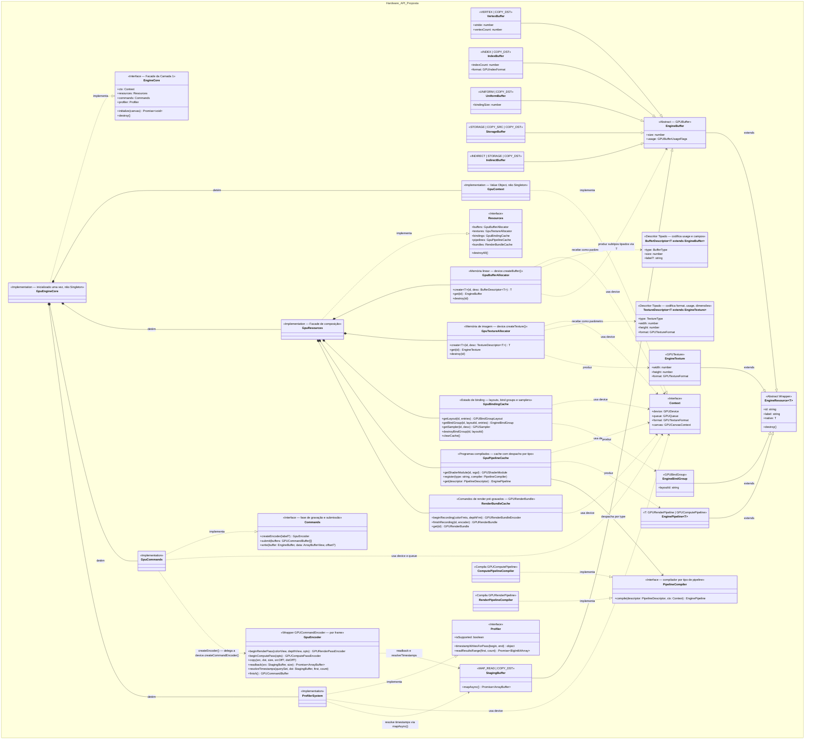

# Fluxo Estrutural e Gerenciamento de Loaders

Neste documento, mapeamos a arquitetura limpa em uso pelo motor WebGPU para realizar a ponte entre os Dados Puros da Cena (Camada 3) e o envio em massa para a API de Hardware (Camada 1).

## A Unificação por Trás dos Loaders

A engine baseia-se num design pautado em **Template Method** acoplado ao ECS/DoD. Em vez de criar múltiplos loops dispersos na pipeline de renderização, o trânsito C2 -> C1 é centralizado por uma classe base abstrata que dita a liturgia de travessia do Grafo de Cena: a classe utilitária `SceneLoader<T>`.

### A Classe Abstrata: `SceneLoader<TManager>`
O `SceneLoader` atua de forma rigorosa seguindo o Padrão de Projeto *Visitor*. Ele possui um único método exposto, `.load(scene, manager)`, que itera por toda a árvore ECS invocando obrigatoriamente duas assinaturas abstratas das classes filhas:
1. `getResources(entity: Entity)` -> Quais componentes importam para o meu escopo?
2. `process(resource, manager)` -> O que fazer com ele no estágio atual da máquina de estados?

A partir dele, a Engine cria distinções vitais em como processa dados limitados (visuais) vs dados correlacionados (Física PBD massiva).

### 1. `ResourceLoader` (Uploads Visuais e Atômicos)
Extende de `SceneLoader<ResourceManager>`. 
O `ResourceLoader` atua de forma autônoma avaliando **contratos locais**. Ele procura no Entity tudo o que herda a interface mestre de ciclo de vida (`ResourceState`: Uninitialized, Dirty, etc).
Sua natureza é essencialmente 1-para-1 assíncrona. Quando acha a Geometria A, ele emite o upload do `Float32Array` dela independentemente da Geometria B, empilhando todos os comandos numa `Promise.all` para não travar o Frame.

### 2. `PhysicsResourceLoader` (Agregação DoD Global e Coalescing)
Extende de `SceneLoader<TWorld>`.
O paradigma muda drasticamente. Processos físicos interconectados como os do PBD ou colisores Broadphase não se importam com a independência dos componentes — **Eles dependem da soma global deles**. 
O `PhysicsResourceLoader` varre a Cena para descobrir quem está inicializando ou mudando. O segredo dele é o **Coalescing**: no término do loop, ele invoca `_emitCoalescedEvents()`.
A partir daí, se houver alteração estrutural, a Física não aloca memoriazinhs pingadas. Ela derruba arrays no formato Float e agrupa todos os corpos em "Sopas Numéricas Colossais" no **GpuBufferRegistry** (RigidBody global buffer batch), usando ponteiros absolutos. 

## Diagrama da Arquitetura C2 Efetiva

Abaixo, a representação da herança limpa entre a interface abstrata e seus pipelines reais em TypeScript:

```mermaid
classDiagram
    %% HIERARQUIA DE COMPONENTES E ANTI-PATTERNS (Camada 3)
    namespace Core_e_Hierarquia {
        class EventDispatcher {
            <<Padrão Observer — Base>>
            -listeners: Map~string, Array~handler~~
            +addEventListener(type, listener)
            +removeEventListener(type, listener)
            +hasEventListener(type, listener) boolean
            +dispatchEvent(event)
            +clearEventListeners()
        }
        class Entity {
            +id: number
            +visible: boolean
            +getComponents() Component[]
            +getPhysics() Physic[]
            +add(object: Entity)
            +remove(object: Entity)
        }
        class Resource {
            <<State Interface>>
            +state: ResourceState
            +allocateResource(rm)
            +updateResource(rm)
            +disposeResource(rm)
        }
        class Component {
            <<Interface>>
            +type: string
            +entity: Entity
        }
        class RenderQueue {
            <<Interface DoD>>
            +opaqueGroups: Map
            +transparentList: Array
            +lights: Array
            +clear()
            +acquireFloat32(size)
        }
        class RenderExtractor {
            <<Funnel Extrator DoD>>
            -extractorStrategies: Map
            +opaqueGroups: Map
            +transparentList: Array
            +lights: Array
            +extract(scene, cameraPos: vec3)
            +addStrategy(strategy)
        }
        class Float32Pool {
            <<Memory Pool GC Free>>
            -buckets: Map
            -cursors: Map
            +acquire(size) Float32Array
            +reset()
        }
    }

    namespace Estrategias_Extracao {
        class ExtractionStrategy {
            <<Interface>>
            +extract(entity, queue, cameraPos)
        }
        class MeshExtractionStrategy {
            <<Extrator Nativo>>
        }
        class LightExtractionStrategy {
            <<Extrator Nativo>>
        }
        class ParticleExtractionStrategy {
            <<Extrator Opcional>>
        }
    }

    namespace Componentes_Cena {
        class Geometry {
            +type: string
            +vertexCount: number
            +rawVertices: Float32Array
        }
        class Material {
            +type: string
            +color: Float32Array
            +roughness: number
        }
        class Light {
            +intensity: number
            +color: vec3
        }
        class Particles {
            +count: number
        }
        class Camera {
            <<Anti-Pattern: Extends Entity>>
            +viewProjectionMatrix: mat4
            +updateMatrices()
        }
        class PerspectiveCamera {
            +fov: number
            +aspect: number
            +near: number
            +far: number
        }
    }

    %% CAMADA DE RENDERING MESTRE E ORQUESTRAÇÃO
    namespace Camada4_Apresentacao {
        class WebGPURenderer {
            -engine: EngineCore
            -extractor: RenderExtractor
            -loader: ResourceLoader
            -world: SimulationWorld
            -canvasWidth: number
            -canvasHeight: number
            -clearColor: object
            -gpuResourcesReady: boolean
            -depthView: GPUTextureView
            -frameUboData: Float32Array
            -frameBindGroup: GPUBindGroup
            -shaderRegistry: Map
            -objectUboData: Float32Array
            -objectBindGroup: GPUBindGroup
            -pipelineCache: Map
            -geoStorageCache: Map
            +initialize(canvas: HTMLCanvasElement)
            +setSize(width: number, height: number)
            +setClearColor(r, g, b, a)
            +render(scene: Scene, camera: Camera)
            -uploadFrameUbo(camera: Camera)
            -initGPUResources()
            -ensurePipelines()
            -createPipeline(cmd: RenderCommand)
            -buildEntityIdToSlot(cmds)
            -collectAllCommands()
            -uploadObjectMatrices(cmds)
            -drawCommands(pass, cmds)
            -getOrCreateGeoStorageBg(cmd)
        }
    }

    %% SIMULAÇÃO FÍSICA E FACHADA
    namespace Modulos_Fisica {
        class SimulationWorld {
            <<Abstract Base>>
            +connectScene(scene: Entity)
            +disconnectScene(scene: Entity)
            +setSolver(pType: string, solver: PhysicsSolver)
            +removeSolver(pType: string)
            +addForce(force: Force)
            +removeForce(id: string)
            +step(scene: Entity, dt: number)
            +initializeResources(rm: ResourceManager)?
            +encodeSyncPasses(encoder, idToSlot, ubo)?
        }
        class PhysicsWorld {
            <<Facade Layer 3>>
            -orchestrator: GpuPhysicsOrchestrator
            +eventBus: EventBus
            +initializeResources(rm: ResourceManager)
            +connectScene(scene: Entity)
            +disconnectScene(scene: Entity)
            +step(scene: Entity, dt: number)
            +encodeSyncPasses(encoder, idToSlot, ubo)
            +addForce(force: Force)
            +removeForce(id: string)
            +setSolver(pType: string, solver: PhysicsSolver)
            +removeSolver(pType: string)
        }
        class GpuPhysicsOrchestrator {
            <<Engine Interna GPU>>
            +eventBus: EventBus
            +initializeResources(rm)
            +step(scene, dt)
            +encodeSyncPasses()
        }
        class EventBus {
            <<Interface Sync/PubSub Layer 2>>
            +on(type, handler) unsubscribe
            +off(type, handler)
            +emit(type, payload)
        }
    }

    %% CAMADA DE SINCRONIZAÇÃO CONCRETA E REGISTROS
    namespace Implementacoes_Concretas {
        class SceneLoader~T~ {
            <<Abstract Base>>
            +load(scene: Scene, manager: T)
            #getResources(entity: Entity) Iterable
            #process(resource: unknown, manager: T)
        }
        class ResourceLoader {
            -_promises: Promise[]
            -_counters: object
            +load(scene, rm)
            #getResources(entity: Entity)
            #process(resource, rm)
        }
        class PhysicsResourceLoader~TWorld~ {
            +eventBus: EventBus
            -_uninitializedCount: number
            -_registry: GpuBufferRegistry
            +setResourceManager(rm)
            +load(scene, world)
            #process(resource, world)
            -_allocateRigidBodyBatch()
            -_allocateSoftBodyBuffers()
            -_emitCoalescedEvents()
        }
        class GpuBufferRegistry {
            <<Catálogo de Buffers GPU — Layer 2>>
            -_entries: Map~string, GpuBufferEntry~
            +register(entry: GpuBufferEntry)
            +unregister(id: string)
            +unregisterByOwner(uuid: string) string[]
            +get(id: string) GpuBufferEntry
            +getByOwner(uuid: string) GpuBufferEntry[]
            +snapshot() ReadonlyMap
            +totalBytes: number
        }
        class GpuBufferEntry {
            <<Interface>>
            +id: string
            +type: GpuBufferType
            +byteSize: number
            +domain: string
            +ownerUuid?: string
        }
        class GpuComputePassRegistry {
            <<Registry de Passes de Física>>
            -passes: PhysicsComputePass[]
            -readySet: Set~string~
            +register(pass: PhysicsComputePass)
            +unregister(passId: string)
            +executeAll(context, dt) Promise~void~
            +disposeAll()
            +activePasses: readonly PhysicsComputePass[]
        }
    }

    %% SISTEMA DE EVENTOS E REGISTROS GPU (Layer 2)
    namespace Sistema_Eventos_GPU {
        class DefaultEventBus {
            <<Implementação Síncrona>>
            -handlers: Map~string, Set~handler~~
            +on(type, handler) unsubscribe
            +off(type, handler)
            +emit(type, payload)
        }
        class EventMap {
            <<EventMap Tipado>>
            physics:bodies:changed → PhysicsBodiesChangedPayload
            physics:colliders:changed → PhysicsCollidersChangedPayload
            physics:frame:submitted → PhysicsFrameSubmittedPayload
            physics:transforms:ready → PhysicsTransformsReadyPayload
            physics:rb:reallocated → PhysicsRbReallocatedPayload
        }
        class PhysicsBodiesChangedPayload {
            <<Payload>>
            +changedCount: number
        }
        class PhysicsCollidersChangedPayload {
            <<Payload>>
            +changedCount: number
        }
        class PhysicsFrameSubmittedPayload {
            <<Payload>>
            +bodyCount: number
            +submitTime: number
        }
        class PhysicsTransformsReadyPayload {
            <<Payload>>
            +pipelineId: string
            +transforms: ReadonlyArray
        }
        class PhysicsRbReallocatedPayload {
            <<Payload>>
            +bodyCount: number
            +colliderCount: number
        }
    }

    %% CAMADA 1: HARDWARE (VRAM e Registros)
    namespace Hardware_API {
        %% -----------------------------------
        %% PAINEL DE CONTROLE (CORE)
        %% -----------------------------------
        class WebGPUContext {
            <<Singleton>>
            -adapterRef: GPUAdapter
            -deviceRef: GPUDevice
            -contextRef: GPUCanvasContext
            -formatRef: GPUTextureFormat
            +adapter: GPUAdapter
            +device: GPUDevice
            +context: GPUCanvasContext
            +format: GPUTextureFormat
            +queue: GPUQueue
            +$getInstance() WebGPUContext
            +$reset()
            +initialize(canvas) Promise~void~
        }
        class ProfilerSystem {
            <<Implementation>>
            -context: WebGPUContext
            -querySet: GPUQuerySet
            -resolveBuffer: GPUBuffer
            -resultBuffer: GPUBuffer
            +isSupported: boolean
            +canResolve: boolean
            +timestampWritesForPass(beginIndex, endIndex)
            +writeTimestamp(passEncoder, queryIndex)
            +resolveQueriesRange(encoder, first, count)
            +readResultsRange(first, count)
        }
        class Profiler {
            <<Interface>>
            +isSupported: boolean
            +canResolve: boolean
            +timestampWritesForPass(beginIndex, endIndex)
            +writeTimestamp(passEncoder, queryIndex)
            +resolveQueriesRange(encoder, first, count)
            +readResultsRange(first, count)
        }
        class WebGPUEngineCore {
            <<Singleton Super Facade>>
            +context: WebGPUContext
            +resources: WebGPUResourceManager
            +pipelines: WebGPUPipelineManager
            +compute: WebGPUComputeManager
            +$getInstance() WebGPUEngineCore
            +initialize(canvas)
            +destroy()
            +canvasFormat: GPUTextureFormat
            +getCurrentCanvasTextureView()
        }
        class EngineCore {
            <<Interface>>
            +resources: ResourceManager
            +pipelines: PipelineManager
            +renderPasses: RenderPassManager
            +compute: ComputeManager
            +bundles: BundleCache
            +indirect: IndirectDrawManager
            +copy: CopyManager
            +profiler: Profiler
            +initialize(canvas)
            +destroy()
            +canvasFormat: GPUTextureFormat
            +getCurrentCanvasTextureView()
        }

        %% -----------------------------------
        %% ORQUESTRADOR CENTRAL DE MEMÓRIA
        %% -----------------------------------
        class WebGPUResourceManager {
            <<Implementation>>
            +buffers: BufferManager
            +textures: TextureManager
            +bindings: BindGroupManager
            +constructor()
            +destroyAll()
        }
        class ResourceManager {
            <<Interface>>
            +buffers: BufferManager
            +textures: TextureManager
            +bindings: BindGroupManager
            +destroyAll()
        }

        %% -----------------------------------
        %% COMPILADOR E CACHE DE SHADERS
        %% -----------------------------------
        class WebGPUPipelineManager {
            <<Implementation>>
            -context: WebGPUContext
            -shaderModules: Map
            -renderPipelines: Map
            -pipelineLayouts: Map
            -getShaderModule(id, code)
            +createRenderPipeline(id, wgslCode, pipelineDescriptor)
            +getRenderPipeline(id)
            +createPipelineLayout(id, layouts)
        }
        class PipelineManager {
            <<Interface>>
            +createRenderPipeline(id, wgslCode, pipelineDescriptor)
            +getRenderPipeline(id)
            +createPipelineLayout(id, layouts)
        }

        %% -----------------------------------
        %% GERENTES DE RECURSOS E SEUS WRAPPERS
        %% -----------------------------------
        class EngineResource~T~ {
            <<Abstract Wrapper>>
            +id: string
            +label: string
            #rawGpuObject: T
            +destroy()
        }

        class WebGPUBindGroupManager {
            <<Implementation>>
            -context: WebGPUContext
            -bindGroupLayouts: Map
            -bindGroups: Map
            +getLayout(id: string, entries: object[])
            +getBindGroup(id: string, layoutId: string, entries: object[])
            +destroyBindGroup(id: string, layoutId: string)
            +clearCache()
        }
        class BindGroupManager {
            +createBindGroup(id: string, layout: object)
            +getBindGroup(id: string)
        }
        class EngineBindGroup {
            <<extends EngineResource>>
            +layoutId: string
            +destroy()
        }

        class WebGPUTextureManager {
            <<Implementation>>
            -context: WebGPUContext
            -textures: Map
            -samplers: Map
            +createTexture(id: string, desc: object)
            +createDepthTexture(id: string, w: number, h: number)
            +getTexture(id: string)
            +createSampler(id: string, desc: object)
            +destroyTexture(id: string)
            +destroyAll()
        }
        class TextureManager {
            +createTexture(id: string, desc: object)
            +destroyTexture(id: string)
        }
        class EngineTexture {
            <<extends EngineResource>>
            +width: number
            +height: number
            +depth: number
            +format: GPUTextureFormat
            +destroy()
        }

        class WebGPUBufferManager {
            <<Implementation>>
            -context: WebGPUContext
            -buffers: Map
            +createUniformBuffer(id, size, usage)
            +createStorageBuffer(id, size, usage)
            +createVertexBuffer(id, size, usage)
            +createIndexBuffer(id, size, usage)
            +writeBuffer(id, data, offset)
            +uploadStagedAsync(id, data)
            +getBuffer(id)
            +destroyBuffer(id)
            +destroyAll()
        }
        class BufferManager {
            +createStorageBuffer(id: string, size: number)
            +writeBuffer(id: string, data: Float32Array)
            +getBuffer(id: string)
        }
        class EngineBuffer {
            <<extends EngineResource>>
            +size: number
            +usage: GPUBufferUsageFlags
            +destroy()
        }

        %% -----------------------------------
        %% ENCODERS E PASSES GRÁFICOS
        %% -----------------------------------
        class WebGPURenderPassManager {
            <<Implementation>>
            -context: WebGPUContext
            +constructor()
            +createCommandEncoder(label)
            +beginRenderPass(encoder, colorView, depthView, clearColor, label)
            +submit(encoders)
        }
        class RenderPassManager {
            <<Interface>>
            +createCommandEncoder(label)
            +beginRenderPass(encoder, colorView, depthView, clearColor, label)
            +submit(encoders)
        }

        %% -----------------------------------
        %% COMPUTAÇÃO, GRAVAÇÃO E CÓPIAS
        %% -----------------------------------
        class WebGPUComputeManager {
            <<Implementation>>
            -context: WebGPUContext
            -pipelines: Map
            +createComputePipeline(id, wgsl, entryPoint)
            +getComputePipeline(id)
            +beginComputePassExplicit(encoder, label, stamp)
            +dispatchOnPass(pass, id, bindGroups, x, y, z)
            +createBindGroupFromPipeline(id, idx, entries, label)
            +beginComputePass(encoder, label)
            +dispatch(encoder, id, bindGroups, x, y, z)
        }
        class ComputeManager {
            <<Interface>>
            +createComputePipeline(id, wgsl, entryPoint)
            +getComputePipeline(id)
            +beginComputePassExplicit(encoder, label, stamp)
            +dispatchOnPass(pass, id, bindGroups, x, y, z)
            +createBindGroupFromPipeline(id, idx, entries, label)
            +beginComputePass(encoder, label)
            +dispatch(encoder, id, bindGroups, x, y, z)
        }
        class BundleCache {
            <<Interface>>
            +beginRecording(colorFmts, depthFmt)
            +finishRecording(id, encoder)
            +getBundle(id)
        }
        class CopyManagerImpl["CopyManager"] {
            <<Implementation>>
            -context: WebGPUContext
            +constructor()
            +copyBufferToBuffer(encoder, source, dest, size, srcOff, dstOff)
            +readBuffer(source, size)
        }
        class CopyManagerIntf["CopyManager"] {
            <<Interface>>
            +copyBufferToBuffer(encoder, source, dest, size, srcOff, dstOff)
            +readBuffer(source, size)
        }
        class IndirectDrawManagerImpl["IndirectDrawManager"] {
            <<Implementation>>
            -context: WebGPUContext
            -indirectBuffers: Map
            +constructor()
            +createDrawIndirectBuffer(id)
            +createDrawIndexedIndirectBuffer(id)
            +getBuffer(id)
        }
        class IndirectDrawManagerIntf["IndirectDrawManager"] {
            <<Interface>>
            +createDrawIndirectBuffer(id)
            +createDrawIndexedIndirectBuffer(id)
            +getBuffer(id)
        }
    }

    %% --------------------------------
    %% RELAÇÕES E DEPENDÊNCIAS DO CORE
    %% --------------------------------
    %% CORE
    WebGPUEngineCore *-- WebGPUContext : Master Composition
    WebGPUEngineCore *-- ProfilerSystem : Master Composition
    WebGPUEngineCore *-- WebGPUResourceManager : Master Composition
    WebGPUEngineCore *-- WebGPUPipelineManager : Master Composition
    WebGPUEngineCore *-- WebGPURenderPassManager : Master Composition
    WebGPUEngineCore *-- WebGPUComputeManager : Master Composition
    WebGPUEngineCore *-- CopyManagerImpl : Master Composition
    WebGPUEngineCore *-- IndirectDrawManagerImpl : Master Composition
    WebGPUEngineCore ..|> EngineCore : Implementa
    ProfilerSystem ..|> Profiler : Implementa
    ProfilerSystem ..> WebGPUContext : Usa
    %% SUBSISTEMA DE PIPELINES
    WebGPUPipelineManager ..|> PipelineManager : Implementa

    %% SUBSISTEMA DE RENDERING PASSES
    WebGPURenderPassManager ..|> RenderPassManager : Implementa

    %% FACADE
    WebGPUResourceManager *-- WebGPUBindGroupManager : <<Anti-Pattern>> Acoplamento Direto
    WebGPUResourceManager *-- WebGPUTextureManager : <<Anti-Pattern>> Acoplamento Direto
    WebGPUResourceManager *-- WebGPUBufferManager : <<Anti-Pattern>> Acoplamento Direto
    WebGPUResourceManager ..|> ResourceManager : Implementa

    %% SUBSISTEMA DE BIND GROUPS
    WebGPUBindGroupManager ..|> BindGroupManager : Implementa
    WebGPUBindGroupManager ..> EngineBindGroup : Usa
    EngineBindGroup --|> EngineResource : Herda

    %% SUBSISTEMA DE TEXTURAS
    WebGPUTextureManager ..|> TextureManager : Implementa
    WebGPUTextureManager ..> EngineTexture : Usa
    EngineTexture --|> EngineResource : Herda

    %% SUBSISTEMA DE BUFFERS
    WebGPUBufferManager ..|> BufferManager : Implementa
    WebGPUBufferManager ..> EngineBuffer : Usa
    EngineBuffer --|> EngineResource : Herda

    %% SUBSISTEMA DE COMPUTAÇÃO
    WebGPUComputeManager ..|> ComputeManager : Implementa

    %% SUBSISTEMA DE CÓPIAS
    CopyManagerImpl ..|> CopyManagerIntf : Implementa
    CopyManagerImpl ..> EngineBuffer : Usa

    %% SUBSISTEMA DE DESENHO INDIRETO
    IndirectDrawManagerImpl ..|> IndirectDrawManagerIntf : Implementa
    IndirectDrawManagerImpl ..> EngineBuffer : Usa
    Resource <|-- Component : Herda
    Component <|-- Geometry : Implementa
    Component <|-- Material : Implementa
    Component <|-- Light : Implementa
    Component <|-- Particles : Implementa
    
    EventDispatcher <|-- Entity : Herda
    Entity <|-- Camera : Extends (Problema Estrutural!)
    Camera <|-- PerspectiveCamera : Extends

    %% HERANÇAS DE SISTEMAS
    SceneLoader <|-- ResourceLoader : Extends
    SceneLoader <|-- PhysicsResourceLoader : Extends
    SimulationWorld <|-- PhysicsWorld : Extends (Acoplamento Crítico)
    SimulationWorld <|-- GpuPhysicsOrchestrator : Extends (Problema Insano!)

    %% AMÁLGAMA NO RENDERER
    WebGPURenderer --> WebGPUEngineCore : Usa
    WebGPURenderer --> ResourceLoader : Aciona .load()
    WebGPURenderer --> RenderExtractor : Prepara matrizes
    WebGPURenderer --> SimulationWorld : Delega cálculo (.step)
    
    %% EVENTOS GPU
    DefaultEventBus ..|> EventBus : Implementa
    EventBus ..> EventMap : Tipagem de eventos
    EventMap --> PhysicsBodiesChangedPayload
    EventMap --> PhysicsCollidersChangedPayload
    EventMap --> PhysicsFrameSubmittedPayload
    EventMap --> PhysicsTransformsReadyPayload
    EventMap --> PhysicsRbReallocatedPayload

    %% REGISTROS GPU
    GpuBufferRegistry --> GpuBufferEntry : Registra entradas
    GpuComputePassRegistry ..> WebGPUEngineCore : getInstance() Anti-Pattern
    PhysicsResourceLoader *-- GpuBufferRegistry : Detém
    GpuPhysicsOrchestrator *-- GpuComputePassRegistry : Detém

    %% DELEGAÇÃO DA FÍSICA
    PhysicsWorld --> GpuPhysicsOrchestrator : Facade Delega
    GpuPhysicsOrchestrator --> PhysicsResourceLoader : Aciona Load Interno
    GpuPhysicsOrchestrator --> EventBus : Detém
    PhysicsResourceLoader --> EventBus : Compartilha Dependência

    %% DEPENDÊNCIAS DO ECS
    SceneLoader --> Entity : Itera Nodos (.traverse)
    RenderExtractor --> Entity : Extrai Dados
    RenderExtractor ..|> RenderQueue : Implementa
    RenderExtractor *-- Float32Pool : Composição (Array Pool)
    RenderExtractor *-- ExtractionStrategy : Delega Extração (OCP)
    MeshExtractionStrategy ..|> ExtractionStrategy : Implementa
    LightExtractionStrategy ..|> ExtractionStrategy : Implementa
    ParticleExtractionStrategy ..|> ExtractionStrategy : Implementa
```

> [!WARNING]
> **Anti-Pattern de Acoplamento:** A injeção do `GpuPhysicsOrchestrator` dentro do `PhysicsWorld` não usa inversão de dependência (DIP). Ocorre de maneira engessada e *hardcoded* invocando a função isolada `createGpuPhysicsWorld()` no construtor. Consequentemente, o core arquitetural principal acaba forçado a rastrear explicitamente todos os Kernels de Compute do motor (como XPBD, MPM, FEM), sacrificando o princípio OCP.

### O Triunfo da Padronização
Esse é o verdadeiro poder da arquitetura da Engine em seu Core. Ela não engessa o sistema. Ao extrair os loops `scene.traverse()` e a semântica `Onde Encontrar -> O Que Fazer` para uma **Abstract Class**, qualquer colaborador pode construir um "SoundLoader" amanhã, herdá-lo de `SceneLoader`, e apenas customizar as promessas, mantendo o controle total garantido pelo ECS purista.

### Raio-X de Dependência: WebGPUContext

Devido à sua natureza de **Singleton** centralizador geográfico (fornecendo o `GPUDevice` e `GPUQueue` nus da Placa de Vídeo), dúzias de instâncias arquiteturais subvertem injeções de dependência complexas para buscar a infraestrutura diretamente da memória do `WebGPUContext`.

O diagrama a seguir exibe a impressionante malha capilar de todos os módulos que ativamente dependem de conexões com ele.


---

## Diagrama de Elementos — Camada 3 (`src/elements`)

Mapeamento dos elementos de alto nível expostos ao desenvolvedor: corpos físicos, colisores, forças, partículas, compute passes, infraestrutura GPU, geometrias e materiais.

```mermaid
classDiagram

    %% ── CORPOS FÍSICOS ──────────────────────────────────────────────────────────
    namespace Corpos_Fisicos {
        class PhysicsBody {
            <<Abstract — scene/components>>
            +type: string
            +physicType: string
            +acceptedAlgorithms: readonly string[]
            +bufferIds?: object
            +gpuRbIndex?: number
        }
        class RigidBody {
            <<GPU-only — LCP/PGS>>
            +material: RigidBodyMaterial
            +simState: RigidBodySimState
            +gpuRbIndex: number
        }
        class SoftBody {
            <<XPBD SoftBody>>
            +particles: SoftParticle[]
            +constraints: SoftConstraint[]
            +bufferIds: SoftBodyGpuBufferSet
        }
        class FEMBody {
            <<XPBD-FEM T4>>
            +nodes: FEMNode[]
            +tetrahedra: FEMTetrahedron[]
            +bufferIds: FEMBufferIds
        }
        class MPMBody {
            <<MLS-MPM>>
            +particles: MPMParticleData[]
            +material: MPMMaterialType
            +bufferIds: MPMBufferIds
        }
        class PBFBody {
            <<Position-Based Fluids>>
            +particles: PBFParticleData[]
            +bufferIds: PBFBufferIds
        }
        class SPHBody {
            <<WCSPH>>
            +particles: SPHParticleData[]
            +bufferIds: SPHBufferIds
        }
    }

    %% ── COLISORES ───────────────────────────────────────────────────────────────
    namespace Colisores {
        class Collider {
            <<Abstract — scene/components>>
            +getAABB() AABB
            +packDescriptor() Float32Array
        }
        class SDFCollider {
            <<SDF Base>>
            +sdf: SDF
            +boundingRadius: number
            +center: vec3
        }
        class BoxShape {
            +hw: number
            +hh: number
            +hd: number
        }
        class SphereShape {
            +radius: number
        }
        class PlaneShape {
            +halfWidth: number
            +halfDepth: number
            +normal: vec3
        }
    }

    %% ── FORÇAS ──────────────────────────────────────────────────────────────────
    namespace Forcas {
        class Force {
            <<Interface — scene/systems>>
            +id: string
            +compute(body, dt) vec3
        }
        class ConstantForce {
            -direction: vec3
            +compute(_body, _dt) vec3
        }
        class FunctionalForce {
            -fn: Function
            +compute(body, dt) vec3
        }
    }

    %% ── PARTÍCULAS ──────────────────────────────────────────────────────────────
    namespace Particulas {
        class ParticleEmitter {
            <<Abstract — scene/components>>
            +shaderId: string
            +maxParticles: number
            +aliveCount: number
            +bindGroupIds: string[]
            +step(encoder, dt)
        }
        class EmitterShape {
            <<Interface>>
            +id: string
            +sample() SpawnSample
        }
        class CPUParticleEmitter {
            <<Simulação CPU — até ~5k>>
            +emissionRate: number
            +maxLife: number
            +gravity: vec3
        }
        class GPUParticleEmitter {
            <<Simulação GPU Compute>>
            +maxParticles: number
        }
        class FluidParticleVisualAdapter {
            <<Anti-Pattern: herança por conveniência>>
            -_physicsBody: FluidPhysicsBody
            -_renderBgId: string
        }
        class ConeEmitterShape {
            +angle: number
            +radius: number
        }
        class PointEmitterShape { }
        class SphereEmitterShape { }
    }

    %% ── COMPUTE PASSES ──────────────────────────────────────────────────────────
    namespace Compute_Passes {
        class PhysicsComputePass {
            <<Interface — scene/systems>>
            +passId: string
            +acceptedPhysicTypes: string[]
            +ensureReady(core) Promise~void~
            +execute(context, dt)
            +dispose()
        }
        class ComputePassBase {
            <<Abstract — RigidBody>>
            #buildBindGroups()
            #encodeSimParams()
            #encodeAlgorithmPasses()
        }
        class LCPComputePass {
            <<LCP/PGS — Catto 2005>>
        }
        class XPBDComputePass {
            <<XPBD RigidBody — deprecated>>
        }
        class FluidComputePassBase {
            <<Abstract — Fluidos Partículados>>
            #writeSimParams()
            #buildGlobalBGs()
            #buildBodyBGs()
            #encodeSubstep()
            #allocateBody()
        }
        class PBFComputePass {
            <<Position-Based Fluids>>
        }
        class SPHComputePass {
            <<WCSPH>>
        }
        class FEMComputePass {
            <<XPBD-FEM T4>>
        }
        class MPMComputePass {
            <<MLS-MPM>>
        }
        class SoftBodyXPBDComputePass {
            <<XPBD SoftBody>>
        }
    }

    %% ── INFRAESTRUTURA GPU ──────────────────────────────────────────────────────
    namespace GPU_Infra {
        class WgslComposer {
            <<Composição de módulos WGSL>>
            +compose(...blocks) string$
        }
        class GraphColorSolver {
            <<Greedy Graph Coloring — SoftBody>>
            +solve(constraints) ColoredConstraints$
        }
        class FEMGraphColorSolver {
            <<Graph Coloring — FEM>>
        }
        class NeighborSearchGrid {
            <<Busca de Vizinhos — SPH/PBF>>
            +build(encoder, particles, count)
            +getBindGroup() object
        }
        class EulerianGrid {
            <<Grade Euleriana — MPM/FLIP>>
            +encodeClear(encoder)
            +getMomentumBuffer() GPUBuffer
        }
        class ColliderDescriptorUploader {
            <<Upload de colisores para GPU>>
        }
        class ShaderLibrary {
            <<Cache de módulos WGSL>>
        }
    }

    %% ── GEOMETRIAS ──────────────────────────────────────────────────────────────
    namespace Geometrias {
        class Geometry {
            <<Abstract — scene/components>>
            +vertexCount: number
            +rawVertices: Float32Array
        }
        class ParametricGeometry {
            <<f(u,v) → vértice>>
        }
        class BoxGeometry { }
        class SphereGeometry { }
        class PlaneGeometry { }
        class PointCloudGeometry {
            <<Nuvem de pontos — escrita por GPU>>
        }
        class FEMBoxGeometry {
            <<Superfície de malha FEM>>
        }
    }

    %% ── MATERIAIS ───────────────────────────────────────────────────────────────
    namespace Materiais {
        class Material {
            <<Abstract — scene/components>>
            +type: string
        }
        class StandardMaterial {
            +color: vec4
            +roughness: number
            +metallic: number
        }
        class WireframeMaterial {
            +color: vec4
            +lineWidth: number
        }
    }

    %% ── RELAÇÕES ────────────────────────────────────────────────────────────────

    %% Corpos Físicos
    PhysicsBody <|-- RigidBody
    PhysicsBody <|-- SoftBody
    PhysicsBody <|-- FEMBody
    PhysicsBody <|-- MPMBody
    PhysicsBody <|-- PBFBody
    PhysicsBody <|-- SPHBody

    %% Colisores
    Collider <|-- SDFCollider
    SDFCollider <|-- BoxShape
    SDFCollider <|-- SphereShape
    SDFCollider <|-- PlaneShape
    RigidBody --> SDFCollider : possui colisores
    SoftBody --> SDFCollider : usa para colisão

    %% Forças
    Force <|.. ConstantForce : Implementa
    Force <|.. FunctionalForce : Implementa

    %% Partículas
    ParticleEmitter <|-- CPUParticleEmitter
    ParticleEmitter <|-- GPUParticleEmitter
    ParticleEmitter <|-- FluidParticleVisualAdapter
    EmitterShape <|.. ConeEmitterShape : Implementa
    EmitterShape <|.. PointEmitterShape : Implementa
    EmitterShape <|.. SphereEmitterShape : Implementa
    CPUParticleEmitter --> EmitterShape : usa
    GPUParticleEmitter --> EmitterShape : usa
    FluidParticleVisualAdapter --> PBFBody : lê buffer GPU
    FluidParticleVisualAdapter --> SPHBody : lê buffer GPU

    %% Compute Passes
    PhysicsComputePass <|.. ComputePassBase : Implementa
    PhysicsComputePass <|.. FluidComputePassBase : Implementa
    PhysicsComputePass <|.. FEMComputePass : Implementa
    PhysicsComputePass <|.. MPMComputePass : Implementa
    PhysicsComputePass <|.. SoftBodyXPBDComputePass : Implementa
    ComputePassBase <|-- LCPComputePass
    ComputePassBase <|-- XPBDComputePass
    FluidComputePassBase <|-- PBFComputePass
    FluidComputePassBase <|-- SPHComputePass
    PBFComputePass --> NeighborSearchGrid : recebe injetado
    SPHComputePass --> NeighborSearchGrid : recebe injetado
    MPMComputePass --> EulerianGrid : usa internamente
    SoftBodyXPBDComputePass --> GraphColorSolver : usa
    FEMComputePass --> FEMGraphColorSolver : usa

    %% Geometrias
    Geometry <|-- ParametricGeometry
    Geometry <|-- BoxGeometry
    Geometry <|-- PointCloudGeometry
    Geometry <|-- FEMBoxGeometry
    ParametricGeometry <|-- SphereGeometry
    ParametricGeometry <|-- PlaneGeometry

    %% Materiais
    Material <|-- StandardMaterial
    Material <|-- WireframeMaterial
```



---

## Proposta — Camada 1: Hardware API Refatorada

Reorganização da Camada 1 com três responsabilidades alinhadas às fases reais da WebGPU: **criação de recursos**, **gravação de comandos** e **submissão**. O `GpuContext` deixa de ser Singleton e passa a ser um value object injetado. Os buffers ganham hierarquia tipada refletindo os `GPUBufferUsage` da API.

| Problema atual | Correção proposta |
|---|---|
| `WebGPUContext` Singleton — 11 dependências diretas | `GpuContext` value object — injetado uma vez no startup |
| `WebGPUEngineCore` God Object — 8 managers expostos | `EngineCore` com 3 responsabilidades: ctx + resources + profiler |
| `BufferManager`, `TextureManager`, `BindGroupManager`, `PipelineManager` paralelos | `GpuResourceCache` unificado — espelha o `GPUDevice` da WebGPU |
| `RenderPassManager` mistura criação de encoder + submit | Separação: `GpuEncoder` (gravação, por frame) + `EngineCore.submit()` |
| `IndirectDrawManager` separado para buffers com flag `INDIRECT` | `IndirectBuffer` como subtipo tipado em `GpuResourceCache` |
| `EngineBuffer` flat sem distinção semântica de uso | Hierarquia tipada: `VertexBuffer`, `IndexBuffer`, `StorageBuffer`… |
| `CopyManager` desconexo da fase de gravação | `GpuEncoder.copy()` e `GpuEncoder.readback()` — onde pertence |



### Organização de Pacotes — Camada 1

```
src/core/
│
├── interfaces/                        ← contratos públicos — importados pelas camadas superiores
│     ├── EngineCore.ts                  Facade da Camada 1
│     ├── Context.ts                     device, queue, format, canvas
│     ├── Resources.ts                   buffers, textures, bindings, pipelines, bundles
│     ├── Commands.ts                    createEncoder, submit, write
│     └── Profiler.ts                    isSupported, timestampWritesForPass, readResultsRange
│
└── gpu/                               ← implementações WebGPU — nunca importadas diretamente por C2/C3/C4
      ├── GpuEngineCore.ts               implementa EngineCore
      ├── GpuContext.ts                  implementa Context (value object)
      ├── GpuCommands.ts                 implementa Commands — createEncoder, submit, write via GPUQueue
      ├── GpuEncoder.ts                  wrapper de GPUCommandEncoder — descartável por frame
      │
      ├── profiler/
      │     └── ProfilerSystem.ts        implementa Profiler — GPUQuerySet + StagingBuffer
      │
      └── resources/
            ├── GpuResources.ts          implementa Resources — facade de composição
            │
            ├── base/
            │     └── EngineResource.ts  abstract wrapper genérico T — base de todos os wrappers
            │
            ├── buffers/
            │     ├── GpuBufferAllocator.ts
            │     ├── BufferDescriptor.ts  descritor tipado — codifica usage e campos por subtipo
            │     ├── EngineBuffer.ts      abstract — GPUBufferUsageFlags
            │     ├── VertexBuffer.ts      VERTEX | COPY_DST
            │     ├── IndexBuffer.ts       INDEX | COPY_DST
            │     ├── UniformBuffer.ts     UNIFORM | COPY_DST
            │     ├── StorageBuffer.ts     STORAGE | COPY_SRC | COPY_DST
            │     ├── IndirectBuffer.ts    INDIRECT | STORAGE | COPY_DST
            │     └── StagingBuffer.ts     MAP_READ | COPY_DST
            │
            ├── textures/
            │     ├── GpuTextureAllocator.ts
            │     ├── TextureDescriptor.ts  descritor tipado — format, usage, dimensões
            │     └── EngineTexture.ts
            │
            ├── bindings/
            │     ├── GpuBindingCache.ts    layouts, bind groups, samplers
            │     └── EngineBindGroup.ts
            │
            ├── pipelines/
            │     ├── GpuPipelineCache.ts          shader modules — cache com despacho por tipo
            │     ├── EnginePipeline.ts             wrapper genérico T: GPURenderPipeline | GPUComputePipeline
            │     ├── PipelineCompiler.ts           interface — compilador por tipo de pipeline
            │     ├── ComputePipelineCompiler.ts    compila GPUComputePipeline
            │     └── RenderPipelineCompiler.ts     compila GPURenderPipeline
            │
            └── bundles/
                  └── RenderBundleCache.ts  GPURenderBundle — pré-gravado, reutilizável
```

> **Regra de importação:** camadas superiores (C2, C3, C4) importam exclusivamente de `core/interfaces/`.
> A pasta `core/gpu/` é a implementação WebGPU — substituível por outro backend (`webgl/`, `mock/`) sem tocar os contratos.

---

## Proposta — Camada 2: Sincronização e Inventário

A Camada 2 é a ponte entre o hardware (C1) e os elementos de cena (C3). Ela não conhece geometrias específicas nem solvers concretos — opera sobre **abstrações gerenciáveis**: qualquer coisa que implemente `Resource` pode ser carregada, catalogada e mantida em inventário. Representa dois modos de operação: **individual** (um recurso → um slot de VRAM) e **coletivo** (N corpos → buffers globais coalescidos para fenômenos físicos).

```mermaid
classDiagram

    %% ── CAMADA 1 — INTERFACE ─────────────────────────────────────────────────
    namespace Camada_1 {
        class EngineCore {
            <<Facade da Camada 1>>
            +ctx: Context
            +resources: Resources
            +commands: Commands
            +profiler: Profiler
            +initialize(canvas) Promise~void~
            +destroy()
        }
        class Resources {
            <<Interface — fase de alocação>>
            +buffers: GpuBufferAllocator
            +textures: GpuTextureAllocator
            +bindings: GpuBindingCache
            +pipelines: GpuPipelineCache
            +bundles: RenderBundleCache
        }
        class Commands {
            <<Interface — fase de gravação e submissão>>
            +createEncoder(label?) GpuEncoder
            +submit(buffers: GPUCommandBuffer[])
            +write(buffer: EngineBuffer, data: ArrayBufferView, offset?)
        }
        class GpuEncoder {
            <<Wrapper por frame — Camada 1>>
            +beginRenderPass(colorView, depthView, opts) GPURenderPassEncoder
            +beginComputePass(opts) GPUComputePassEncoder
            +copy(src, dst, size)
            +finish() GPUCommandBuffer
        }
    }

    %% ── NÚCLEO ECS ───────────────────────────────────────────────────────────
    namespace Nucleo_ECS {
        class World {
            <<ECS store — EntityId: u32, arrays de components por tipo>>
            +insert(id: EntityId, resource: Resource, tags: string[])
            +update(id: EntityId, resource: Resource)
            +remove(id: EntityId, type: string)
            +get(id: EntityId, type: string) Resource
            +query(types: string[]) EntityId[]
        }
    }

    %% ── CONTRATOS DE CICLO DE VIDA ───────────────────────────────────────────
    namespace Contratos_Recurso {
        class Resource {
            <<Interface — dado GPU gerenciável>>
            +getDescriptors() GPUDescriptor[]
            +getPipelineDescriptors() PipelineDescriptor[]
            +pack() Float32Array
        }
    }
    note for Resource "Todo dado enviado à Camada 2 — dt, parâmetros de simulação,\nrender targets, câmera, uniforms — deve ser declarado via\nGPUDescriptor com Schema. Nunca como parâmetro direto de método."

    %% ── DESCRITORES GPU ──────────────────────────────────────────────────────
    namespace Descritores_GPU {
        class Schema {
            <<Abstract — contrato de schema GPU>>
            +stride: number
            +toWGSL() string
        }
        class FieldType {
            <<Enum — tipo primitivo WebGPU>>
            f32
            vec2f
            vec3f
            vec4f
            mat4x4f
            u32
            i32
        }
        class StructSchema {
            <<Schema de struct — campos nomeados e tipados>>
            +fields: Map~string, FieldType~
            +stride: number
            +pack(data: object) Float32Array
            +toWGSL() string
        }
        class TensorSchema {
            <<Schema de tensor N-dimensional>>
            +shape: number[]
            +elementType: FieldType
            +stride: number
            +toWGSL() string
        }
        class GPUDescriptor {
            <<Descrição de recurso GPU alocável>>
            +id: string
            +group: number
            +binding: number
            +schema: Schema
            +count: number
            +usage: number
        }
        class PipelineDescriptor {
            <<Descrição de pipeline GPU>>
            +id: string
            +type: string
            +shaderId: string
            +entryPoints: string[]
        }
    }
    note for PipelineDescriptor "Descreve o programa GPU — não o layout de dados.\nNão estende Schema: Schema define estrutura de memória;\nPipelineDescriptor define qual shader compila sobre ela."

    %% ── SISTEMAS LAYER 2 ─────────────────────────────────────────────────────
    namespace Sistemas {
        class ResourceSystem {
            <<Coordena ciclo de vida de recursos GPU>>
            +collect(resource: Resource)
            +update(resource: Resource)
            +dispose(resource: Resource)
            +flush(world: World, core: EngineCore) Promise~void~
        }
        class ExecutionSystem {
            <<Coordena gravação e submissão de comandos GPU>>
            +run(world: World, core: EngineCore)
        }
        class ShaderRegistry {
            <<Registro de WGSL — ponte Layer 3 para Layer 1>>
            +register(id: string, wgsl: string)
            +get(id: string) string
        }
    }

    %% ── FENÔMENOS GLOBAIS ────────────────────────────────────────────────────
    namespace Fenomenos_Globais {
        class EventBus {
            <<Interface — eventos de ciclo do pipeline GPU>>
            +on(type, handler) unsubscribe
            +off(type, handler)
            +emit(type, payload)
        }
        class DefaultEventBus {
            <<Implementation>>
        }
        class ChangedEvent~T~ {
            <<Abstract — conjunto de resources mudou>>
            +added: T[]
            +removed: T[]
        }
        class ReallocatedEvent~T~ {
            <<Abstract — buffer recriado — bind groups invalidados>>
            +resource: T
            +newBufferId: string
        }
        class ReadyEvent~T~ {
            <<Abstract — fase GPU concluída — dado disponível>>
            +payload: T
        }
        class SubmittedEvent~T~ {
            <<Abstract — pass submetido à GPU>>
            +timestamp: number
        }
        class EventMap {
            <<Mapa de eventos de pipeline>>
            +resourcesChanged ChangedEvent~Resource~
            +bufferReallocated ReallocatedEvent~Resource~
            +transformsReady ReadyEvent~Resource~
            +frameSubmitted SubmittedEvent~void~
        }
    }

    %% ── RELAÇÕES ─────────────────────────────────────────────────────────────

    %% Núcleo ECS
    World --> Resource : armazena por EntityId
    World --> EventBus : emite eventos ao inserir, atualizar e remover
    ResourceSystem ..> EventBus : escuta eventos de World

    %% Descritores GPU
    StructSchema --|> Schema : estende
    TensorSchema --|> Schema : estende
    Schema --> FieldType : tipos primitivos
    GPUDescriptor --> Schema : schema

    %% Resource declara dados e pipelines
    Resource ..> GPUDescriptor : getDescriptors
    Resource ..> PipelineDescriptor : getPipelineDescriptors

    %% Sistemas Layer 2
    ResourceSystem --> World : consulta resources por EntityId
    ResourceSystem ..> GPUDescriptor : coleta e aloca via Layer 1
    ResourceSystem --> EngineCore : usa subsistemas de alocação
    ResourceSystem --> EventBus : emite eventos após flush
    ExecutionSystem ..> EventBus : escuta eventos de World
    ExecutionSystem --> World : consulta entidades por tipo
    ExecutionSystem --> ShaderRegistry : busca wgsl por shaderId
    ExecutionSystem ..> PipelineDescriptor : compila pipelines via Layer 1
    ExecutionSystem --> EngineCore : grava encoder e submete

    %% Layer 1 — referências internas
    EngineCore --> Resources : resources
    EngineCore --> Commands : commands
    Commands ..> GpuEncoder : createEncoder — cria por frame

    %% Eventos
    DefaultEventBus ..|> EventBus : implementa
    EventBus ..> EventMap : contrato de tipos
    EventMap --> ChangedEvent : changed events
    EventMap --> ReallocatedEvent : reallocated events
    EventMap --> ReadyEvent : ready events
    EventMap --> SubmittedEvent : submitted events
```



### Organização de Pacotes — Camada 2

```
src/scene/
│
├── contracts/                        ← o que Layer 3 implementa — importado por L3 e L4
│     ├── Resource.ts                   interface — dado GPU gerenciável (getDescriptors, getPipelineDescriptors, pack)
│     └── Schema.ts                     abstract — contrato de schema GPU (stride, toWGSL)
│
├── descriptors/                      ← value objects que Layer 3 produz e Layer 2 consome
│     ├── GPUDescriptor.ts              descrição de recurso GPU alocável
│     ├── PipelineDescriptor.ts         descrição de pipeline GPU
│     ├── StructSchema.ts               schema de struct — campos nomeados e tipados
│     ├── TensorSchema.ts               schema de tensor N-dimensional
│     └── FieldType.ts                  enum de tipos primitivos WebGPU
│
├── world/                            ← núcleo ECS — importado por L3 e L4
│     └── World.ts                      ECS store — EntityId como u32, arrays por tipo
│
├── systems/                          ← sistemas de coordenação — acionados por Layer 4
│     ├── ResourceSystem.ts             coordena ciclo de vida de recursos GPU
│     ├── ExecutionSystem.ts            coordena gravação e submissão de comandos GPU
│     └── ShaderRegistry.ts            registro de WGSL — ponte Layer 3 → Layer 1
│
└── events/                           ← sistema de eventos de pipeline GPU
      ├── EventBus.ts                   interface pubsub — importada por L3 e L4
      ├── DefaultEventBus.ts            implementação síncrona
      ├── EventMap.ts                   mapa tipado de eventos do pipeline
      ├── ChangedEvent.ts               forma genérica — conjunto de resources mudou
      ├── ReallocatedEvent.ts           forma genérica — buffer recriado, bind groups invalidados
      ├── ReadyEvent.ts                 forma genérica — fase GPU concluída, dado disponível
      └── SubmittedEvent.ts             forma genérica — pass submetido à GPU
```

> **Regra de importação:**
> Layer 3 importa exclusivamente de `scene/contracts/`, `scene/descriptors/`, `scene/world/` e `scene/events/` — nunca de `scene/systems/` (que é domínio da Layer 4) nem de `core/` (Layer 1).
> Layer 4 importa de qualquer pasta de `scene/` e de `core/interfaces/`, mas nunca de `core/gpu/` (implementação WebGPU).

---

## Proposta — Camada 3: Elementos de Cena e Física

A Camada 3 contém todos os elementos concretos da engine: recursos visuais, corpos físicos, partículas e infraestrutura GPU auxiliar. **Todo elemento com dado GPU implementa `Resource`** — o contrato da Camada 2 que garante alocação, atualização e descarte via `ResourceSystem`, sem acesso direto à Camada 1.

O padrão é idêntico para física, geometria, material, luz e câmera:
- `getDescriptors()` declara slots GPU via `StructSchema` (uniforms) ou `TensorSchema` (arrays de partículas e constraints)
- `getPipelineDescriptors()` declara qual shader processa esses dados
- `pack()` serializa o estado atual para o buffer

### O que foi removido e por quê

| Removido | Substituto | Motivo |
|---|---|---|
| `PhysicsComputePass` e hierarquia | `ResourceSystem` + `ExecutionSystem` | Passes acoplavam à Camada 1 — a Camada 2 assume coordenação |
| `FluidParticleVisualAdapter` | `FluidBody` + `PointCloudGeometry` + `PointSpriteMaterial` | Anti-pattern de herança por conveniência |
| `XPBDComputePass` | `SoftBody` + `XPBDSolver` | Deprecated — pass obsoleto ainda registrável |
| `ColliderDescriptorUploader` | `Collider.getDescriptors()` | Absorvido pelo contrato `Resource` |
| `ShaderLibrary` | `ShaderRegistry` (Camada 2) | Centralizado na Camada 2 como ponte L3 → L1 |
| `FEMGraphColorSolver` | `GraphColorSolver` | Mesmo algoritmo — duas implementações sem razão |
| `bufferIds?: object` em `PhysicsBody` | `getDescriptors(): GPUDescriptor[]` | Perda total de segurança de tipos |
| `FEMBody`, `MPMBody`, `PBFBody`, `SPHBody` | `SoftBody` / `FluidBody` + `Solver` correspondente | O algoritmo não define o tipo de corpo — o Solver é composable |
| `Force` CPU-only | `ForceField` implements Resource | Forças vão para shaders — precisam de Schema e GPUDescriptor |
| `ConstantForce`, `FunctionalForce` | `GravityField`, `WindField`, `VortexField`, `DragField` | Nomes semânticos — cada campo tem Schema próprio |

### Composição ECS — um EntityId, múltiplos Resources

Um mesmo EntityId pode acumular papéis ortogonais. O Solver consulta o `World` e lê os buffers de cada tipo:

```
Planeta:    Transform + RigidBody + SphereGeometry + StandardMaterial + GravityField + SphereCollider
Pano:       Transform + SoftBody + PlaneGeometry + StandardMaterial + XPBDSolver + SpringConstraint
Fluido:     Transform + FluidBody + PointCloudGeometry + PointSpriteMaterial + SPHSolver + BuoyancyField
Vento:      Transform + WindField   ← entidade ambiental sem body
```

`ForceField` não é propriedade de um body — é um Resource independente que o Solver lê via `World.query(['ForceField'])`.

```mermaid
classDiagram

    %% ── CAMADA 2 — CONTRATOS (referência) ───────────────────────────────────
    namespace Camada_2 {
        class Resource {
            <<Interface — Camada 2>>
            +getDescriptors() GPUDescriptor[]
            +getPipelineDescriptors() PipelineDescriptor[]
            +pack() Float32Array
        }
        class World {
            <<ECS store — Camada 2>>
            +insert(id: EntityId, resource: Resource, tags: string[])
            +query(tags: string[]) EntityId[]
        }
    }

    %% ── RECURSOS DE CENA ─────────────────────────────────────────────────────
    namespace Recursos_Cena {
        class Transform {
            <<implements Resource>>
            <<StructSchema: position vec3f, rotation vec4f, scale vec3f>>
            +position: vec3
            +rotation: quat
            +scale: vec3
        }
        class Camera {
            <<implements Resource>>
            <<StructSchema: view mat4x4f, projection mat4x4f, near f32, far f32>>
            +fov: number
            +aspect: number
            +near: number
            +far: number
        }
        class Light {
            <<Abstract — implements Resource>>
            <<StructSchema: color vec3f, intensity f32>>
            +color: vec3
            +intensity: number
        }
        class DirectionalLight {
            <<StructSchema estende Light + direction vec3f>>
            +direction: vec3
        }
        class PointLight {
            <<StructSchema estende Light + position vec3f + radius f32>>
            +radius: number
        }
        class RenderTarget {
            <<implements Resource>>
            <<GPUDescriptor: textura de cor e depth>>
            +width: number
            +height: number
        }
    }

    %% ── GEOMETRIA ────────────────────────────────────────────────────────────
    namespace Geometria {
        class Geometry {
            <<Abstract — implements Resource>>
            <<TensorSchema: vértices [pos vec3f, normal vec3f, uv vec2f]>>
            +vertexCount: number
            +indexCount: number
        }
        class ParametricGeometry {
            <<f(u,v) → vértice>>
        }
        class BoxGeometry { }
        class SphereGeometry { }
        class PlaneGeometry { }
        class PointCloudGeometry {
            <<escrita por compute — FluidBody e Partículas>>
        }
    }

    %% ── MATERIAL ─────────────────────────────────────────────────────────────
    namespace Material_ns {
        class Material {
            <<Abstract — implements Resource>>
            <<PipelineDescriptor: shaderId de render>>
            +shaderId: string
        }
        class StandardMaterial {
            <<StructSchema: albedo vec4f, roughness f32, metallic f32>>
            +color: vec4
            +roughness: number
            +metallic: number
        }
        class WireframeMaterial {
            <<StructSchema: color vec4f>>
            +color: vec4
        }
        class PointSpriteMaterial {
            <<StructSchema: radius f32, color vec4f — fluido e partículas>>
            +radius: number
        }
    }

    %% ── FÍSICA — BODIES ──────────────────────────────────────────────────────
    namespace Fisica_Bodies {
        class PhysicsBody {
            <<Abstract — implements Resource>>
            <<StructSchema: mass f32, linearDamping f32, angularDamping f32>>
            +mass: number
            +linearDamping: number
        }
        class RigidBody {
            <<TensorSchema: pos vec3f, rot vec4f, linVel vec3f, angVel vec3f>>
            +isKinematic: boolean
        }
        class SoftBody {
            <<TensorSchema: partículas [pos vec3f, vel vec3f, mass f32]>>
            +restShapeMatching: boolean
        }
        class FluidBody {
            <<TensorSchema: partículas [pos vec3f, vel vec3f, density f32, pressure f32]>>
            +restDensity: number
        }
    }

    %% ── FÍSICA — FORCE FIELDS ────────────────────────────────────────────────
    namespace Fisica_ForceFields {
        class ForceField {
            <<Abstract — implements Resource>>
            <<StructSchema: strength f32, falloff f32, minDist f32, maxDist f32>>
            +strength: number
            +falloff: number
        }
        class GravityField {
            <<StructSchema: acceleration vec3f — ambiental ou corpo-a-corpo>>
            +acceleration: vec3
        }
        class WindField {
            <<StructSchema: direction vec3f, magnitude f32>>
            +direction: vec3
        }
        class VortexField {
            <<StructSchema: axis vec3f, magnitude f32>>
            +axis: vec3
        }
        class DragField {
            <<StructSchema: linearCoeff f32, quadraticCoeff f32>>
            +linearCoeff: number
        }
        class BuoyancyField {
            <<StructSchema: fluidDensity f32, fluidLevel f32 — emitido por FluidBody>>
            +fluidDensity: number
        }
    }

    %% ── FÍSICA — COLLIDERS ───────────────────────────────────────────────────
    namespace Fisica_Colliders {
        class Collider {
            <<Abstract — implements Resource>>
            <<StructSchema: friction f32, restitution f32>>
            +friction: number
            +restitution: number
        }
        class BoxCollider {
            <<StructSchema: halfExtents vec3f>>
        }
        class SphereCollider {
            <<StructSchema: radius f32>>
        }
        class PlaneCollider {
            <<StructSchema: normal vec3f, offset f32>>
        }
        class MeshCollider {
            <<TensorSchema: triângulos de colisão [vec3f, vec3f, vec3f]>>
        }
    }

    %% ── FÍSICA — CONSTRAINTS ─────────────────────────────────────────────────
    namespace Fisica_Constraints {
        class Constraint {
            <<Abstract — implements Resource>>
            <<StructSchema: bodyA EntityId u32, bodyB EntityId u32>>
            +bodyA: number
            +bodyB: number
        }
        class SpringConstraint {
            <<TensorSchema: pares [bodyA u32, bodyB u32, stiffness f32, restLength f32, damping f32]>>
            +stiffness: number
            +restLength: number
            +damping: number
        }
        class JointConstraint {
            <<StructSchema: anchorA vec3f, anchorB vec3f, limits vec2f>>
        }
        class DistanceConstraint {
            <<StructSchema: minDist f32, maxDist f32>>
        }
    }

    %% ── FÍSICA — SOLVERS ─────────────────────────────────────────────────────
    namespace Fisica_Solvers {
        class Solver {
            <<Interface — implements Resource>>
            <<PipelineDescriptor: shaders de compute>>
            +accepts(body: PhysicsBody) boolean
        }
        class LCPSolver {
            <<RigidBody — LCP/PGS>>
            <<lê: RigidBody, Collider, Constraint, ForceField>>
        }
        class XPBDSolver {
            <<SoftBody — XPBD>>
            <<lê: SoftBody, Constraint, ForceField, GraphColorSolver>>
        }
        class FEMSolver {
            <<SoftBody — XPBD-FEM T4>>
            <<lê: SoftBody, Constraint, ForceField, GraphColorSolver>>
        }
        class MPMSolver {
            <<FluidBody e SoftBody — MLS-MPM>>
            <<lê: Body, ForceField, EulerianGrid>>
        }
        class PBFSolver {
            <<FluidBody — Position-Based Fluids>>
            <<lê: FluidBody, ForceField, NeighborSearchGrid>>
        }
        class SPHSolver {
            <<FluidBody — WCSPH>>
            <<lê: FluidBody, ForceField, NeighborSearchGrid>>
        }
    }

    %% ── PARTÍCULAS ───────────────────────────────────────────────────────────
    namespace Particulas {
        class ParticleEmitter {
            <<Abstract — implements Resource>>
            <<TensorSchema: partículas [pos vec3f, vel vec3f, life f32, size f32]>>
            +maxParticles: number
        }
        class ScriptedParticleEmitter {
            <<CPU — até ~5k partículas>>
            +emissionRate: number
        }
        class ComputeParticleEmitter {
            <<GPU — PipelineDescriptor aponta shader de emissão>>
        }
        class EmitterShape {
            <<Interface>>
            +sample() SpawnSample
        }
        class ConeEmitterShape { }
        class PointEmitterShape { }
        class SphereEmitterShape { }
    }

    %% ── INFRAESTRUTURA GPU ───────────────────────────────────────────────────
    namespace GPU_Infra {
        class WgslComposer {
            <<Composição de módulos WGSL>>
            +compose(...blocks) string$
        }
        class GraphColorSolver {
            <<Greedy Graph Coloring — SoftBody e FEM>>
            +solve(constraints) ColoredConstraints$
        }
        class NeighborSearchGrid {
            <<implements Resource — SPH/PBF>>
            <<TensorSchema: células de hash espacial>>
            +cellSize: number
        }
        class EulerianGrid {
            <<implements Resource — MPM/FLIP>>
            <<TensorSchema: grade de velocidade e massa>>
            +resolution: vec3i
        }
    }

    %% ── RELAÇÕES ─────────────────────────────────────────────────────────────

    %% Implementação de Resource
    Transform ..|> Resource : implementa
    Camera ..|> Resource : implementa
    Light ..|> Resource : implementa
    RenderTarget ..|> Resource : implementa
    Geometry ..|> Resource : implementa
    Material ..|> Resource : implementa
    PhysicsBody ..|> Resource : implementa
    ForceField ..|> Resource : implementa
    Collider ..|> Resource : implementa
    Constraint ..|> Resource : implementa
    Solver ..|> Resource : implementa
    ParticleEmitter ..|> Resource : implementa
    NeighborSearchGrid ..|> Resource : implementa
    EulerianGrid ..|> Resource : implementa

    %% Cena
    Light <|-- DirectionalLight
    Light <|-- PointLight

    %% Geometria
    Geometry <|-- ParametricGeometry
    Geometry <|-- BoxGeometry
    Geometry <|-- PointCloudGeometry
    ParametricGeometry <|-- SphereGeometry
    ParametricGeometry <|-- PlaneGeometry

    %% Material
    Material <|-- StandardMaterial
    Material <|-- WireframeMaterial
    Material <|-- PointSpriteMaterial

    %% Bodies
    PhysicsBody <|-- RigidBody
    PhysicsBody <|-- SoftBody
    PhysicsBody <|-- FluidBody

    %% ForceFields — qualquer EntityId pode emitir
    ForceField <|-- GravityField
    ForceField <|-- WindField
    ForceField <|-- VortexField
    ForceField <|-- DragField
    ForceField <|-- BuoyancyField
    FluidBody --> BuoyancyField : emite sobre corpos imersos

    %% Colliders
    Collider <|-- BoxCollider
    Collider <|-- SphereCollider
    Collider <|-- PlaneCollider
    Collider <|-- MeshCollider

    %% Constraints
    Constraint <|-- SpringConstraint
    Constraint <|-- JointConstraint
    Constraint <|-- DistanceConstraint

    %% Solvers
    Solver <|.. LCPSolver : implementa
    Solver <|.. XPBDSolver : implementa
    Solver <|.. FEMSolver : implementa
    Solver <|.. MPMSolver : implementa
    Solver <|.. PBFSolver : implementa
    Solver <|.. SPHSolver : implementa
    XPBDSolver --> GraphColorSolver : resolve constraints
    FEMSolver --> GraphColorSolver : resolve elementos
    PBFSolver --> NeighborSearchGrid : busca vizinhos
    SPHSolver --> NeighborSearchGrid : busca vizinhos
    MPMSolver --> EulerianGrid : transfere momento

    %% Partículas
    ParticleEmitter <|-- ScriptedParticleEmitter
    ParticleEmitter <|-- ComputeParticleEmitter
    EmitterShape <|.. ConeEmitterShape : implementa
    EmitterShape <|.. PointEmitterShape : implementa
    EmitterShape <|.. SphereEmitterShape : implementa
    ScriptedParticleEmitter --> EmitterShape : usa
    ComputeParticleEmitter --> EmitterShape : usa

    %% World
    World --> Resource : armazena por EntityId
```



### Organização de Pacotes — Camada 3

```
src/elements/
│
├── scene/                            ← recursos de cena — sempre presentes
│     ├── Transform.ts                  StructSchema: position vec3f, rotation vec4f, scale vec3f
│     ├── Camera.ts                     StructSchema: view mat4x4f, projection mat4x4f, near f32, far f32
│     ├── Light.ts                      abstract — StructSchema: color vec3f, intensity f32
│     ├── DirectionalLight.ts
│     ├── PointLight.ts
│     └── RenderTarget.ts               GPUDescriptor: textura de cor e depth
│
├── geometry/                         ← dados de vértice e índice
│     ├── Geometry.ts                   abstract — TensorSchema: [pos vec3f, normal vec3f, uv vec2f]
│     ├── ParametricGeometry.ts
│     ├── BoxGeometry.ts
│     ├── SphereGeometry.ts
│     ├── PlaneGeometry.ts
│     └── PointCloudGeometry.ts         escrita por compute — fluido e partículas
│
├── material/                         ← shading e aparência
│     ├── Material.ts                   abstract — PipelineDescriptor aponta shader de render
│     ├── StandardMaterial.ts           StructSchema: albedo vec4f, roughness f32, metallic f32
│     ├── WireframeMaterial.ts          StructSchema: color vec4f
│     └── PointSpriteMaterial.ts        StructSchema: radius f32, color vec4f
│
├── physics/
│     ├── bodies/                     ← contêineres de estado físico
│     │     ├── PhysicsBody.ts          abstract — StructSchema: mass f32, linearDamping f32
│     │     ├── RigidBody.ts            TensorSchema: pos, rot, linVel, angVel
│     │     ├── SoftBody.ts             TensorSchema: partículas [pos vec3f, vel vec3f, mass f32]
│     │     └── FluidBody.ts            TensorSchema: partículas [pos vec3f, vel vec3f, density f32, pressure f32]
│     │
│     ├── forcefields/                ← campos de força — ambiental ou corpo-a-corpo
│     │     ├── ForceField.ts           abstract — StructSchema: strength f32, falloff f32
│     │     ├── GravityField.ts         StructSchema: acceleration vec3f
│     │     ├── WindField.ts            StructSchema: direction vec3f, magnitude f32
│     │     ├── VortexField.ts          StructSchema: axis vec3f, magnitude f32
│     │     ├── DragField.ts            StructSchema: linearCoeff f32, quadraticCoeff f32
│     │     └── BuoyancyField.ts        StructSchema: fluidDensity f32, fluidLevel f32
│     │
│     ├── colliders/                  ← formas de colisão — material de contato
│     │     ├── Collider.ts             abstract — StructSchema: friction f32, restitution f32
│     │     ├── BoxCollider.ts          StructSchema: halfExtents vec3f
│     │     ├── SphereCollider.ts       StructSchema: radius f32
│     │     ├── PlaneCollider.ts        StructSchema: normal vec3f, offset f32
│     │     └── MeshCollider.ts         TensorSchema: triângulos [vec3f, vec3f, vec3f]
│     │
│     ├── constraints/                ← vínculos entre EntityIds
│     │     ├── Constraint.ts           abstract — StructSchema: bodyA u32, bodyB u32
│     │     ├── SpringConstraint.ts     TensorSchema: pares [bodyA, bodyB, stiffness, restLength, damping]
│     │     ├── JointConstraint.ts      StructSchema: anchorA vec3f, anchorB vec3f, limits vec2f
│     │     └── DistanceConstraint.ts   StructSchema: minDist f32, maxDist f32
│     │
│     └── solvers/                    ← algoritmos de simulação — PipelineDescriptor aponta compute shaders
│           ├── Solver.ts               interface — implements Resource
│           ├── LCPSolver.ts            RigidBody — LCP/PGS
│           ├── XPBDSolver.ts           SoftBody — XPBD
│           ├── FEMSolver.ts            SoftBody — XPBD-FEM T4
│           ├── MPMSolver.ts            FluidBody/SoftBody — MLS-MPM
│           ├── PBFSolver.ts            FluidBody — Position-Based Fluids
│           └── SPHSolver.ts            FluidBody — WCSPH
│
├── particles/                        ← sistema de partículas visual
│     ├── ParticleEmitter.ts            abstract — TensorSchema: [pos, vel, life, size]
│     ├── ScriptedParticleEmitter.ts    CPU — até ~5k
│     ├── ComputeParticleEmitter.ts     GPU compute
│     └── shapes/
│           ├── EmitterShape.ts
│           ├── ConeEmitterShape.ts
│           ├── PointEmitterShape.ts
│           └── SphereEmitterShape.ts
│
└── gpu/                              ← infraestrutura GPU auxiliar
      ├── WgslComposer.ts               composição de módulos WGSL
      ├── GraphColorSolver.ts           greedy graph coloring — SoftBody e FEM
      ├── NeighborSearchGrid.ts         TensorSchema: células de hash espacial — SPH/PBF
      └── EulerianGrid.ts               TensorSchema: grade de velocidade e massa — MPM/FLIP
```
