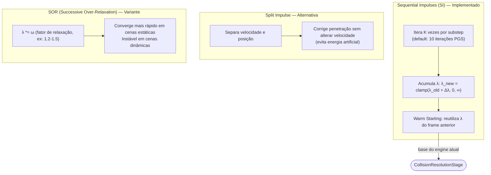

# Arquitetura de Solvers de Colisão

| Algoritmo | O que resolve | Lógica / Fórmula |
| :--- | :--- | :--- |
| **Sequential Impulses (SI)** | Resolve múltiplas colisões simultâneas de forma iterativa sem matrizes gigantes. | Itera sobre a lista de contatos $N$ vezes. Aplica impulsos locais que convergem para uma solução global estável. |
| **Split Impulse** | Impede que a correção de posição (depenetração) adicione "energia falsa" (velocidade). | Separa o impulso de velocidade ($P_v$) do de posição ($P_p$). A posição é corrigida, mas a velocidade real não herda o "pulo". |
| **Solver Over-Relaxation** | Acelera a convergência do solver, reduzindo o número de iterações necessárias. | Multiplica o impulso por um fator $\omega$ (1.0 a 2.0). $J_{final} = J_{old} + \omega(J_{new} - J_{old})$. |
