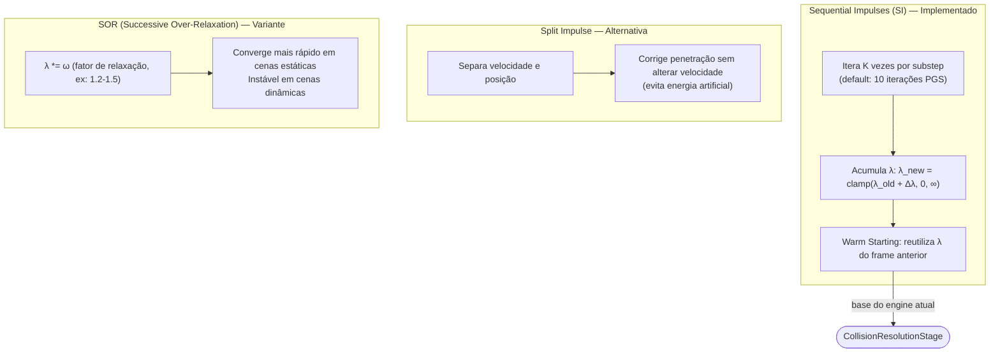
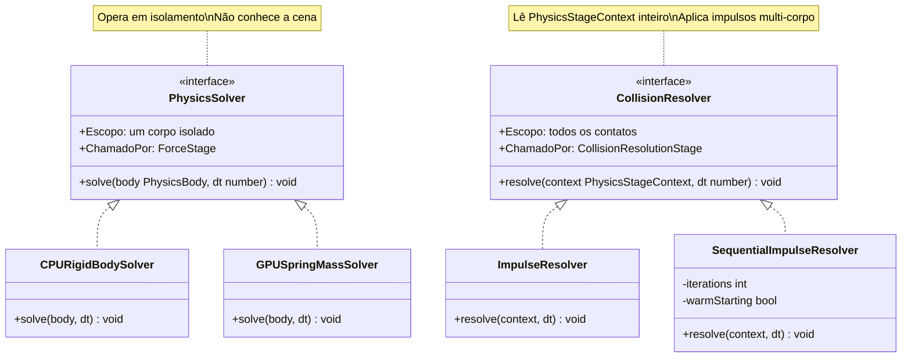
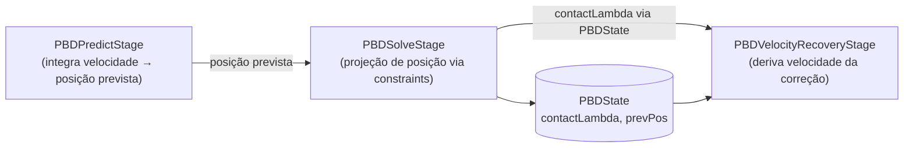
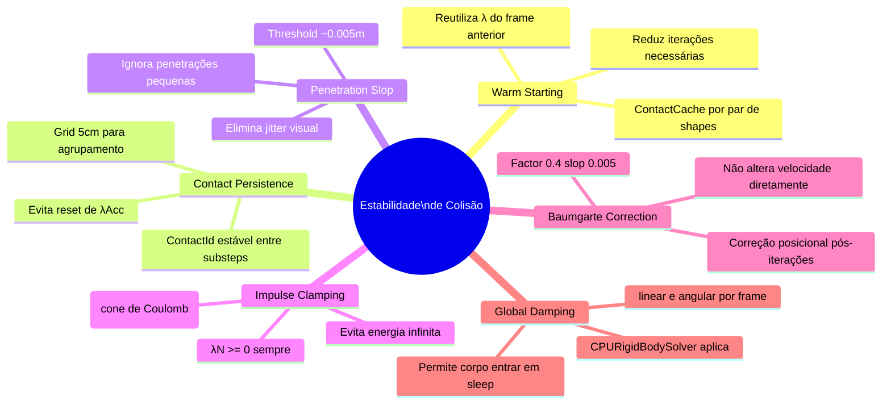
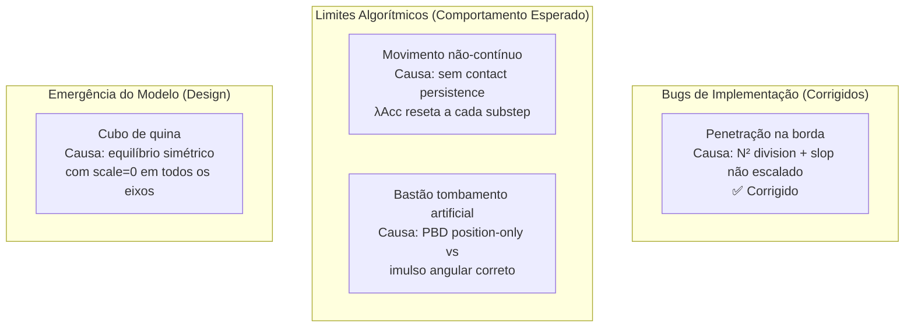
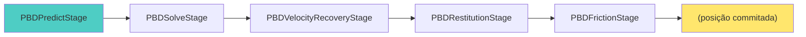

# Colisões — Solvers, Resolvers e Estabilidade

Este guia reúne, num único lugar, a anatomia de colisões de corpos rígidos no motor: os **conceitos
matemáticos** de um contato, os **algoritmos** de resolução, a **arquitetura** (a distinção entre *solver*
e *resolver*), os **limites** do pipeline PBD atual e as **técnicas de estabilização e persistência** que
mantêm pilhas estáveis e sem jitter.

## 1. Conceitos-chave de um contato

| Conceito | O que resolve | Fórmula / Termo Chave |
| :--- | :--- | :--- |
| **Massa Efetiva ($K$)** | Calcula a "resistência" total do par ao impacto, unindo massa e inércia rotacional. | $K = \frac{1}{m_A} + \frac{1}{m_B} + \frac{(r_A \times n)^2}{I_A} + \frac{(r_B \times n)^2}{I_B}$. O impulso escalar é $J = \frac{\Delta v}{K}$. |
| **Impulso Normal** | Garante a não-penetração e o efeito de rebote (restituição). | $J_n = \text{max}(J_{acumulado} + \text{impulso}, 0)$. O *clamp* em 0 impede que o contato "grude" ou puxe o objeto. |
| **Limite de Coulomb** | Define o atrito máximo que uma superfície pode exercer antes de escorregar. | $|J_t| \le \mu \cdot J_n$. O impulso de atrito (tangencial) é limitado pela força normal $J_n$ e o coeficiente $\mu$. |
| **Bias Term** | A "mola" que empurra objetos para fora quando há sobreposição. | $Bias = \frac{\beta}{\Delta t} \cdot \text{penetração}$. É o termo usado no método de Baumgarte para corrigir o erro de posição. |
| **Gyroscopic Forces** | (3D) Mantém a estabilidade de objetos que giram muito rápido em torno de seus eixos. | $\tau_{gyro} = \omega \times (I \cdot \omega)$. Corrige o torque fictício gerado pela integração numérica da rotação. |

## 2. Algoritmos de resolução



| Algoritmo | O que resolve | Lógica / Fórmula |
| :--- | :--- | :--- |
| **Sequential Impulses (SI)** | Resolve múltiplas colisões simultâneas de forma iterativa sem matrizes gigantes. | Itera sobre a lista de contatos $N$ vezes. Aplica impulsos locais que convergem para uma solução global estável. |
| **Split Impulse** | Impede que a correção de posição (depenetração) adicione "energia falsa" (velocidade). | Separa o impulso de velocidade ($P_v$) do de posição ($P_p$). A posição é corrigida, mas a velocidade real não herda o "pulo". |
| **Solver Over-Relaxation** | Acelera a convergência do solver, reduzindo o número de iterações necessárias. | Multiplica o impulso por um fator $\omega$ (1.0 a 2.0). $J_{final} = J_{old} + \omega(J_{new} - J_{old})$. |

## 3. Solvers vs Resolvers — a diferença real

São responsabilidades radicalmente distintas:



**Por que existem `ImpulseResolver` e `SequentialImpulseResolver`?**

- **ImpulseResolver**: 1 passagem por contato, independente. O(n). Adequado para colisões isoladas. Não converge para pilhas (body A empurra body B que empurra body C — cada contato é resolvido sem "ver" os outros).
- **SequentialImpulseResolver**: PGS (Projected Gauss-Seidel), K iterações por substep + warm starting. Propaga impulsos através da cadeia de contatos. Custo O(k·n) mas convergência muito melhor para stacks.

O `SequentialImpulseResolver` chama `ImpulseResolver.resolveContact` como método estático — esse é o acoplamento conhecido. A intenção era reutilizar a matemática de um único contato, mas o resultado é que `ImpulseResolver` tem dupla natureza: resolver standalone **e** utilidade de baixo nível.

## 4. Limites algorítmicos do pipeline PBD

Para os casos específicos relatados, os limites abaixo são atingidos — e são esperados, não bugs.

**Limite 1: Manifolds sem persistência (contact caching).** Cada substep regenera todos os contatos do zero. Quando o bastão está na borda, N muda a cada substep (4→3→2 vértices). Não há ID estável por contato entre substeps. Consequência: `λAcc` é resetado para zero a cada substep — cada substep começa "frio", sem memória do que foi corrigido antes. O resultado visual é movimento não-contínuo, especialmente durante transições de N. **Solução:** *contact persistence* — manter um manifold estável entre substeps (Bullet, PhysX e Havok implementam). Custo: associar contatos por pares de shapes e manter histórico por alguns frames.

**Limite 2: PBD com scale=0 não produz tombamento natural.** O `PBDSolveStage` com `angularCorrectionScale=0` aplica apenas translação. A física correta do contato na borda exige que a força normal gere torque sobre o CM. Isso foi parcialmente endereçado com impulso angular no `VelocityUpdateStage`, mas é workaround:

- Pipeline SI: ContactForce → Impulso (linear + angular) em um único passo.
- Pipeline PBD atual: posição corrigida (só translação) → velocidade derivada → impulso de ajuste.

O PBD de Müller et al. (XPBD 2020) aplica correção angular **durante** o solve de posição, não depois na velocidade — a força de contato (e o torque) emergem naturalmente do multiplicador de Lagrange.

**Limite 3: Equilíbrio de aresta/quina (cubo de quina).** Com `angularCorrectionScale=0` e 2 contatos simétricos (aresta), os torques se cancelam e o cubo encontra um mínimo energético artificialmente estável. Não é bug — é comportamento emergente correto dado o modelo (sem correção angular de posição). Solução: contato persistente + `angularCorrectionScale` baixo (~0.05), ou detectar contato de aresta e aplicar perturbação.

**Limite 4: Warm starting inexistente no PBD.** O `SequentialImpulseResolver` reutiliza λ do frame anterior como ponto de partida, reduzindo iterações. O PBD não tem isso — cada substep começa do zero, precisando de mais iterações para pilhas.

## 5. Acoplamento atual vs arquitetura ideal

### O que está acoplado hoje



`PBDSolveStage` exporta `contactLambda` para que `PBDVelocityUpdateStage` calcule o limite de Coulomb. Isso cria acoplamento temporal (ordem de execução implícita) e torna os dois estágios inseparáveis. O `PBDVelocityUpdateStage` faz três coisas em sequência: recuperação de velocidade + restituição + atrito. E o `SequentialImpulseResolver` delega para método estático de `ImpulseResolver` — acoplamento estrutural que impede substituição independente.

### Como seria modular

Camada de contato com identidade estável:

```
ContactCache (persiste entre substeps)
    → ContactId (par de shapes + feature)
    → λAcc histórico por ContactId
```

Separação de responsabilidades no PBD:

```
PBDPredictStage          — integração de posição (inalterado)
PBDConstraintStage       — projeção de posição por constraint (atual PBDSolveStage)
PBDVelocityRecoveryStage — vel = (pos_new - pos_old)/dt
PBDRestitutionStage      — impulso normal (bounce + clamp)
PBDFrictionStage         — impulso tangencial (Coulomb)
```

Separação nos resolvers SI:

```
ContactImpulseKernel      — matemática pura de um contato (sem estado)
ImpulseResolver           — usa kernel, 1 passagem
SequentialImpulseResolver — usa kernel, K passagens + warm starting
```

## 6. Técnicas de estabilização e persistência

| Técnica | O que resolve | Funcionamento |
| :--- | :--- | :--- |
| **Warm Starting** | Mantém pilhas de objetos (stacks) perfeitamente imóveis e estáveis. | Salva o impulso $J$ do frame anterior e o aplica no início do novo frame como uma "estimativa inicial" próxima do real. |
| **Contact Persistence** | Viabiliza o Warm Starting identificando o contato através dos frames. | Atribui IDs únicos para pares de feições (ex: Vértice ID 5 vs Face ID 2). Se o ID persiste, o impulso é reaproveitado. |
| **Penetration Slop** | Elimina tremores (jitter) de micro-oscilações em objetos em repouso. | Define uma margem (ex: 0.005m). Se $\text{penetração} < \text{slop}$, o Bias é zerado para evitar micro-correções infinitas. |
| **Impulse Clamping** | Impede que o atrito ou a correção de posição gerem energia infinita. | O limite de aplicação (clamp) deve ser feito sobre o **impulso total acumulado** no frame, não na iteração isolada. |
| **Friction Anchors** | Evita o "drift" (deslizamento lento) de objetos em superfícies levemente inclinadas. | Armazena o ponto de contato inicial e tenta "travar" o objeto ali enquanto a força lateral for menor que o atrito. |
| **Predictive Contacts** | Evita o "tunneling" (objetos rápidos atravessando paredes finas). | Cria um contato "virtual" antes da colisão ocorrer, prevendo a posição no próximo frame: $\text{dist} + v \cdot \Delta t$. |
| **Global Damping** | Drena energia residual acumulada por erros de precisão numérica (float). | Aplica uma redução mínima constante: $v = v \cdot (1 - \text{fator})$. Crucial para permitir que o corpo entre em *Sleep*. |



## 7. Diagnóstico final



Os bugs de implementação foram corrigidos. O que resta são limitações do pipeline PBD sem contact persistence e sem warm starting entre substeps. Esses limites são reais mas comuns — Godot Physics 3D tem os mesmos artefatos no modo GodotPhysics; eles só desaparecem com Jolt (que tem persistent contacts).

Pipeline PBD completo:



---

> **Veja também:** a resolução de colisão de corpos rígidos na GPU é detalhada em
> [Pipeline LCP](./pipeline_lcp.md) e [Pipeline RigidBody GPU](./pipeline_rigidbody_gpu.md);
> os fundamentos matemáticos comuns estão em
> [Conceitos de Computação Gráfica, Matemática e Física](./conceitos_cg_matematica_fisica.md).
