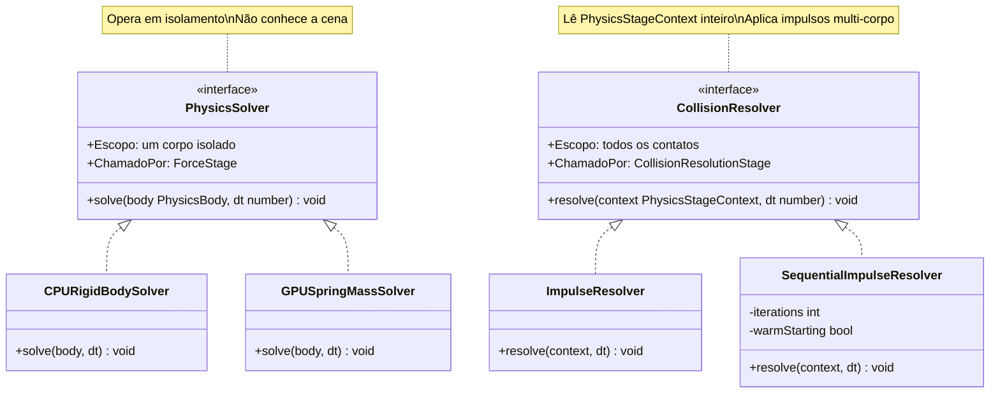
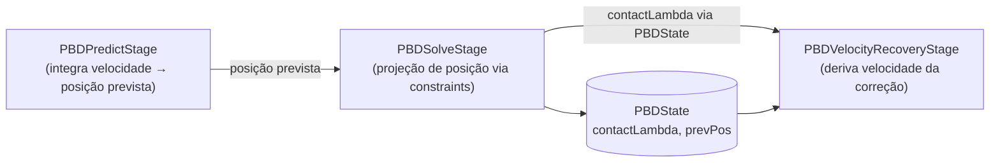
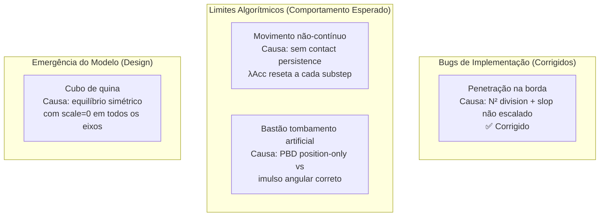
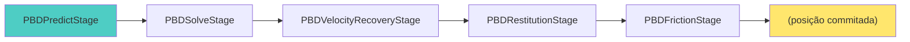

1. Solvers vs Resolvers — qual a diferença real

  São responsabilidades radicalmente distintas:

  Por que existem ImpulseResolver e SequentialImpulseResolver?

  - ImpulseResolver: 1 passagem por contato, independente. O(n). Adequado para colisões isoladas. Não converge para pilhas (body A empurra body B que empurra body C — cada contato é resolvido sem "ver" os outros).
  - SequentialImpulseResolver: PGS (Projected Gauss-Seidel), K iterações por substep + warm starting. Propaga impulsos através da cadeia de contatos. Custo O(k·n) mas convergência muito melhor para stacks.

  O SequentialImpulseResolver chama ImpulseResolver.resolveContact como método estático — isso é o acoplamento que você identificou. A intenção era reutilizar a matemática de um único contato, mas o resultado é que ImpulseResolver tem dupla natureza: resolver standalone E utilidade de baixo nível.

  ---
  2. Você atingiu os limites algorítmicos? Sim — para os casos específicos relatados

  Limite 1: Manifolds sem persistência (contact caching)

  Cada substep regenera todos os contatos do zero. Quando o bastão está na borda, N muda a cada substep (4→3→2 vértices). Não há ID estável por contato entre substeps.

  Consequência real: λAcc é resetado para zero a cada substep. Cada substep começa "frio" — sem memória do que foi corrigido no substep anterior. O resultado visual é exatamente o que você vê: movimento não-contínuo, especialmente durante transições de N.

  Solução algoritmica: Contact persistence — manter um manifold estável entre substeps com posições de contato "mortas" que sobrevivem mesmo quando o vértice sai levemente do plano. Bullet, PhysX e Havok implementam isso. Custo: associar contatos por pares de shapes e manter histórico por alguns frames.

  Limite 2: PBD com scale=0 não produz tombamento natural

  O PBDSolveStage com angularCorrectionScale=0 aplica apenas translação. A física correta do contato na borda exige que a força normal gere um torque sobre o CM. Isso foi parcialmente endereçado adicionando impulso angular na seção 2 do VelocityUpdateStage, mas é um workaround sobre uma limitação de design:

  Pipeline SI: ContactForce → Impulso (linear + angular) em um único passo
  Pipeline PBD atual: Posição corrigida (só translação) → velocidade derivada → impulso de ajuste

  O PBD de Müller et al. (XPBD 2020) aplica correção angular durante o solve de posição, não depois na velocidade. O resultado é que a força de contato emerge naturalmente do Lagrange multiplier, incluindo o torque.

  Limite 3: Equilíbrio de aresta/quina (cubo de quina)

  Com angularCorrectionScale=0 e 2 contatos simétricos (aresta), os torques cancelam. O cubo encontra um mínimo energético artificialmente estável. Isso não é bug de implementação — é comportamento emergente correto dado o modelo escolhido (sem correção angular de posição). A solução real é contato persistente + angularCorrectionScale baixo (~0.05) ou detectar contato de aresta e aplicar perturbação.

  Limite 4: Warm starting inexistente no PBD

  O SequentialImpulseResolver tem warm starting — reutiliza λ do frame anterior como ponto de partida, reduzindo as iterações necessárias para convergência. O PBD não tem isso. Cada substep começa do zero, precisando de mais iterações para pilhas/stacks.

  ---
  3. Acoplamento atual vs arquitetura ideal

  O que está acoplado hoje

  PBDSolveStage exporta contactLambda para que PBDVelocityUpdateStage possa calcular o limite de Coulomb. Isso cria acoplamento temporal (ordem de execução é implícita, não declarada) e torna os dois estágios inseparáveis.

  PBDVelocityUpdateStage faz três coisas em sequência: recuperação de velocidade + restituição + atrito. São responsabilidades distintas empacotadas em uma classe.

  SequentialImpulseResolver delega para método estático de ImpulseResolver — acoplamento estrutural que impede substituição independente.

  Como seria modular

  Camada de contato com identidade estável:
  ContactCache (persiste entre substeps)
      → ContactId (par de shapes + feature)
      → λAcc histórico por ContactId

  Separação de responsabilidades no PBD:
  PBDPredictStage          — integração de posição (inalterado)
  PBDConstraintStage       — projeção de posição por constraint (atual PBDSolveStage)
  PBDVelocityRecoveryStage — vel = (pos_new - pos_old)/dt
  PBDRestitutionStage      — impulso normal (bounce + clamp)
  PBDFrictionStage         — impulso tangencial (Coulomb)

  Separação nos resolvers SI:
  ContactImpulseKernel     — matemática pura de um contato (sem estado)
  ImpulseResolver          — usa kernel, 1 passagem
  SequentialImpulseResolver — usa kernel, K passagens + warm starting

  ---
  4. Diagnóstico final

  Os bugs de implementação foram corrigidos. O que resta são limitações do pipeline PBD sem contact persistence e sem warm starting entre substeps. Esses limites são reais mas comuns — Godot Physics 3D tem os mesmos artefatos no modo GodotPhysics; eles só desaparecem com Jolt (que tem persistent contacts).

---

Pipeline PBD completo:

