# Migração da Engine Legacy para a Clean Architecture

A engine passou por uma reescrita em 4 camadas (`C1 Hardware`, `C2 Sync`,
`C3 Elements`, `C4 Presentation`). O código antigo segue intacto em
`src/legacy/` para compatibilidade durante a transição. Este guia mostra
os equivalentes 1:1 entre as APIs.

## TL;DR — substituições mais comuns

| Legacy | Clean |
|---|---|
| `import { ... } from 'webgpu-engine/legacy'` | `import { ... } from 'webgpu-engine'` |
| `createGpuPhysicsWorld(canvas)` | `await Application.create({ canvas })` |
| `physicsWorld.update(dt)` | `app.events.emit('frameTick', { dt, elapsed })` |
| `physicsWorld.bodies.push(rb)` | `app.world.insert(new RigidBody(...))` |
| `new SoftBody({ algorithm: 'XPBD' })` | `new SoftBody({}, { algorithm: 'XPBD' })` |
| `Physics.LCPSolver` | `new LCPFlow(app.core, app.world, app.resources)` registrado em `app.flows` |
| `mesh.material = mat` | `mesh.add(new StandardMaterial(...))` |
| `engineCore.commit()` | `app.start()` (GameLoop dispara via RAF) |

## Setup mínimo

**Antes (legacy):**

```typescript
import { createGpuPhysicsWorld } from 'webgpu-engine/legacy';
const world = await createGpuPhysicsWorld({ canvas });
world.start();
```

**Depois (clean):**

```typescript
import { Application } from 'webgpu-engine';
const app = await Application.create({ canvas });
app.start();
```

`Application.create` faz o bootstrap das 4 camadas:

- C1: `GpuEngineCore` adquire device/queue/canvas swapchain
- C2: `World`, `EventBus`, `ResourceSystem`, `ExecutionSystem`, `FlowRegistry` instanciam-se
- C4: `registerPresentationDefaults` registra `ShadowFlow + ForwardFlow + PostFlow + DebugFlow + UIFlow`

## Inserir entidades

**Antes:**

```typescript
const cube = new MeshBox(materials.standard, 1, 1, 1);
cube.position = [0, 0, 0];
world.add(cube);
```

**Depois:**

```typescript
import { BoxGeometry, StandardMaterial, Transform } from 'webgpu-engine';

const cube = new BoxGeometry({ size: [1, 1, 1] });
cube.add(new StandardMaterial({ albedo: [0.8, 0.4, 0.2, 1], roughness: 0.4 }));
cube.add(new Transform({ position: [0, 0, 0, 1] }));
app.world.insert(cube);
```

A composição via `entity.add(part)` faz o `World.insert` indexar o root e
todos os filhos no mesmo `EntityId`, e o `ResourceSystem` aloca buffers/binds
automaticamente conforme cada `Resource.getDescriptors()`.

## Física

**Antes:**

```typescript
world.physics.gravity = [0, -9.81, 0];
world.physics.addRigidBody({ position: [0, 5, 0], mass: 1, restitution: 0.3 });
```

**Depois:**

```typescript
import { GravityField, RigidBody, LCPFlow } from 'webgpu-engine';

app.world.insert(new GravityField({ acceleration: [0, -9.81, 0, 0] }));
app.world.insert(new RigidBody({ position: [0, 5, 0, 1], mass: 1, restitution: 0.3 }));
app.flows.register(new LCPFlow(app.core, app.world, app.resources));
```

Cada solver (LCP, XPBD, FEM, MPM, SPH, PBF) é um `Flow` que se auto-registra
nos pools de bodies por algoritmo (`SoftBody:XPBD`, `MPMParticle:MPM`, etc.).

## Controllers

**Antes:** orbit/fps/fly hardcoded no engine.
**Depois:** opt-in via `InteractionSystem.addController`:

```typescript
import { InteractionSystem, OrbitController } from 'webgpu-engine';

const interaction = new InteractionSystem({ canvas, window }, app.events);
interaction.attach();
interaction.addController(new OrbitController(camera, {
    target: [0, 0, 0], distance: 5,
    autoRotate: true, damping: 0.85,
}));
```

## Pós-processamento

**Antes:** chain hardcoded no render pipeline.
**Depois:** `app.defaults.post.addEffect(...)`:

```typescript
import { Bloom, ToneMapping, Fxaa, Vignette } from 'webgpu-engine';

app.defaults.post.addEffect(new ToneMapping());
app.defaults.post.addEffect(new Bloom({ aux: [0.5, 0, 0] }));
app.defaults.post.addEffect(new Fxaa());
app.defaults.post.addEffect(new Vignette());
```

A ordem importa — efeitos são aplicados em cadeia ping-pong sobre o offscreen
do `ForwardFlow` antes de blittar para o canvas.

## Loaders

**Antes:** `loadMesh`, `loadTexture` síncronos sintéticos.
**Depois:** `Assets` consolidado em `presentation/assets/`:

```typescript
import { GltfLoader, TextureLoader, FontLoader } from 'webgpu-engine';

const gltf = await new GltfLoader().load('/assets/model.glb');
const tex = await new TextureLoader().load('/assets/diffuse.png');
const font = await new FontLoader().load('Inter', '/fonts/Inter.woff2', { fontSize: 32 });
```

GLB binário é detectado por magic — basta passar a URL ou `parse(arrayBuffer, url)`.

## Convivência durante a transição

`webgpu-engine/legacy` continua exportado e funcional, apontando para
`src/legacy/`. Após você migrar todos os call sites para a API limpa, remova
o import de `legacy` e nenhum bytecode legacy entrará no bundle (tree-shaken).

A migração é **opcional**: legacy permanecerá enquanto houver consumidores.
A motivação para migrar é acessar features novas (Flow XPBD com
DistanceConstraint, MPMFlow snow material, post-effects modulares,
GltfLoader com skinning, profiler timestamp-query, controllers com damping).

---

> **Apêndice — Arquitetura legada (pré-clean).** As classes a seguir foram **removidas** na refatoração C1→C4 (`SceneLoader`, `ResourceLoader`, `PhysicsResourceLoader`, `WebGPUContext`/`WebGPUEngineCore` singletons, `PhysicsWorld`, `GpuPhysicsOrchestrator`, bodies `FEMBody`/`MPMBody`/`PBFBody`/`SPHBody`, `ComputePass`). Mantido apenas como referência histórica de migração.

## Fluxo Estrutural e Gerenciamento de Loaders

Neste documento, mapeamos a arquitetura limpa em uso pelo motor WebGPU para realizar a ponte entre os Dados Puros da Cena (Camada 3) e o envio em massa para a API de Hardware (Camada 1).

### A Unificação por Trás dos Loaders

A engine baseia-se num design pautado em **Template Method** acoplado ao ECS/DoD. Em vez de criar múltiplos loops dispersos na pipeline de renderização, o trânsito C2 -> C1 é centralizado por uma classe base abstrata que dita a liturgia de travessia do Grafo de Cena: a classe utilitária `SceneLoader<T>`.

#### A Classe Abstrata: `SceneLoader<TManager>`
O `SceneLoader` atua de forma rigorosa seguindo o Padrão de Projeto *Visitor*. Ele possui um único método exposto, `.load(scene, manager)`, que itera por toda a árvore ECS invocando obrigatoriamente duas assinaturas abstratas das classes filhas:
1. `getResources(entity: Entity)` -> Quais componentes importam para o meu escopo?
2. `process(resource, manager)` -> O que fazer com ele no estágio atual da máquina de estados?

A partir dele, a Engine cria distinções vitais em como processa dados limitados (visuais) vs dados correlacionados (Física PBD massiva).

#### 1. `ResourceLoader` (Uploads Visuais e Atômicos)
Extende de `SceneLoader<ResourceManager>`. 
O `ResourceLoader` atua de forma autônoma avaliando **contratos locais**. Ele procura no Entity tudo o que herda a interface mestre de ciclo de vida (`ResourceState`: Uninitialized, Dirty, etc).
Sua natureza é essencialmente 1-para-1 assíncrona. Quando acha a Geometria A, ele emite o upload do `Float32Array` dela independentemente da Geometria B, empilhando todos os comandos numa `Promise.all` para não travar o Frame.

#### 2. `PhysicsResourceLoader` (Agregação DoD Global e Coalescing)
Extende de `SceneLoader<TWorld>`.
O paradigma muda drasticamente. Processos físicos interconectados como os do PBD ou colisores Broadphase não se importam com a independência dos componentes — **Eles dependem da soma global deles**. 
O `PhysicsResourceLoader` varre a Cena para descobrir quem está inicializando ou mudando. O segredo dele é o **Coalescing**: no término do loop, ele invoca `_emitCoalescedEvents()`.
A partir daí, se houver alteração estrutural, a Física não aloca memoriazinhs pingadas. Ela derruba arrays no formato Float e agrupa todos os corpos em "Sopas Numéricas Colossais" no **GpuBufferRegistry** (RigidBody global buffer batch), usando ponteiros absolutos. 

### Diagrama da Arquitetura C2 Efetiva

Abaixo, a representação da herança limpa entre a interface abstrata e seus pipelines reais em TypeScript:

```mermaid
classDiagram
    %% HIERARQUIA DE COMPONENTES E ANTI-PATTERNS (Camada 3)
    namespace Core_e_Hierarquia {
        class EventDispatcher {
            <<Padrão Observer — Base>>
            -listeners: Map~string, Array~handler~~
            +addEventListener(type, listener)
            +removeEventListener(type, listener)
            +hasEventListener(type, listener) boolean
            +dispatchEvent(event)
            +clearEventListeners()
        }
        class Entity {
            +id: number
            +visible: boolean
            +getComponents() Component[]
            +getPhysics() Physic[]
            +add(object: Entity)
            +remove(object: Entity)
        }
        class Resource {
            <<State Interface>>
            +state: ResourceState
            +allocateResource(rm)
            +updateResource(rm)
            +disposeResource(rm)
        }
        class Component {
            <<Interface>>
            +type: string
            +entity: Entity
        }
        class RenderQueue {
            <<Interface DoD>>
            +opaqueGroups: Map
            +transparentList: Array
            +lights: Array
            +clear()
            +acquireFloat32(size)
        }
        class RenderExtractor {
            <<Funnel Extrator DoD>>
            -extractorStrategies: Map
            +opaqueGroups: Map
            +transparentList: Array
            +lights: Array
            +extract(scene, cameraPos: vec3)
            +addStrategy(strategy)
        }
        class Float32Pool {
            <<Memory Pool GC Free>>
            -buckets: Map
            -cursors: Map
            +acquire(size) Float32Array
            +reset()
        }
    }

    namespace Estrategias_Extracao {
        class ExtractionStrategy {
            <<Interface>>
            +extract(entity, queue, cameraPos)
        }
        class MeshExtractionStrategy {
            <<Extrator Nativo>>
        }
        class LightExtractionStrategy {
            <<Extrator Nativo>>
        }
        class ParticleExtractionStrategy {
            <<Extrator Opcional>>
        }
    }

    namespace Componentes_Cena {
        class Geometry {
            +type: string
            +vertexCount: number
            +rawVertices: Float32Array
        }
        class Material {
            +type: string
            +color: Float32Array
            +roughness: number
        }
        class Light {
            +intensity: number
            +color: vec3
        }
        class Particles {
            +count: number
        }
        class Camera {
            <<Anti-Pattern: Extends Entity>>
            +viewProjectionMatrix: mat4
            +updateMatrices()
        }
        class PerspectiveCamera {
            +fov: number
            +aspect: number
            +near: number
            +far: number
        }
    }

    %% CAMADA DE RENDERING MESTRE E ORQUESTRAÇÃO
    namespace Camada4_Apresentacao {
        class WebGPURenderer {
            -engine: EngineCore
            -extractor: RenderExtractor
            -loader: ResourceLoader
            -world: SimulationWorld
            -canvasWidth: number
            -canvasHeight: number
            -clearColor: object
            -gpuResourcesReady: boolean
            -depthView: GPUTextureView
            -frameUboData: Float32Array
            -frameBindGroup: GPUBindGroup
            -shaderRegistry: Map
            -objectUboData: Float32Array
            -objectBindGroup: GPUBindGroup
            -pipelineCache: Map
            -geoStorageCache: Map
            +initialize(canvas: HTMLCanvasElement)
            +setSize(width: number, height: number)
            +setClearColor(r, g, b, a)
            +render(scene: Scene, camera: Camera)
            -uploadFrameUbo(camera: Camera)
            -initGPUResources()
            -ensurePipelines()
            -createPipeline(cmd: RenderCommand)
            -buildEntityIdToSlot(cmds)
            -collectAllCommands()
            -uploadObjectMatrices(cmds)
            -drawCommands(pass, cmds)
            -getOrCreateGeoStorageBg(cmd)
        }
    }

    %% SIMULAÇÃO FÍSICA E FACHADA
    namespace Modulos_Fisica {
        class SimulationWorld {
            <<Abstract Base>>
            +connectScene(scene: Entity)
            +disconnectScene(scene: Entity)
            +setSolver(pType: string, solver: PhysicsSolver)
            +removeSolver(pType: string)
            +addForce(force: Force)
            +removeForce(id: string)
            +step(scene: Entity, dt: number)
            +initializeResources(rm: ResourceManager)?
            +encodeSyncPasses(encoder, idToSlot, ubo)?
        }
        class PhysicsWorld {
            <<Facade Layer 3>>
            -orchestrator: GpuPhysicsOrchestrator
            +eventBus: EventBus
            +initializeResources(rm: ResourceManager)
            +connectScene(scene: Entity)
            +disconnectScene(scene: Entity)
            +step(scene: Entity, dt: number)
            +encodeSyncPasses(encoder, idToSlot, ubo)
            +addForce(force: Force)
            +removeForce(id: string)
            +setSolver(pType: string, solver: PhysicsSolver)
            +removeSolver(pType: string)
        }
        class GpuPhysicsOrchestrator {
            <<Engine Interna GPU>>
            +eventBus: EventBus
            +initializeResources(rm)
            +step(scene, dt)
            +encodeSyncPasses()
        }
        class EventBus {
            <<Interface Sync/PubSub Layer 2>>
            +on(type, handler) unsubscribe
            +off(type, handler)
            +emit(type, payload)
        }
    }

    %% CAMADA DE SINCRONIZAÇÃO CONCRETA E REGISTROS
    namespace Implementacoes_Concretas {
        class SceneLoader~T~ {
            <<Abstract Base>>
            +load(scene: Scene, manager: T)
            #getResources(entity: Entity) Iterable
            #process(resource: unknown, manager: T)
        }
        class ResourceLoader {
            -_promises: Promise[]
            -_counters: object
            +load(scene, rm)
            #getResources(entity: Entity)
            #process(resource, rm)
        }
        class PhysicsResourceLoader~TWorld~ {
            +eventBus: EventBus
            -_uninitializedCount: number
            -_registry: GpuBufferRegistry
            +setResourceManager(rm)
            +load(scene, world)
            #process(resource, world)
            -_allocateRigidBodyBatch()
            -_allocateSoftBodyBuffers()
            -_emitCoalescedEvents()
        }
        class GpuBufferRegistry {
            <<Catálogo de Buffers GPU — Layer 2>>
            -_entries: Map~string, GpuBufferEntry~
            +register(entry: GpuBufferEntry)
            +unregister(id: string)
            +unregisterByOwner(uuid: string) string[]
            +get(id: string) GpuBufferEntry
            +getByOwner(uuid: string) GpuBufferEntry[]
            +snapshot() ReadonlyMap
            +totalBytes: number
        }
        class GpuBufferEntry {
            <<Interface>>
            +id: string
            +type: GpuBufferType
            +byteSize: number
            +domain: string
            +ownerUuid?: string
        }
        class GpuComputePassRegistry {
            <<Registry de Passes de Física>>
            -passes: PhysicsComputePass[]
            -readySet: Set~string~
            +register(pass: PhysicsComputePass)
            +unregister(passId: string)
            +executeAll(context, dt) Promise~void~
            +disposeAll()
            +activePasses: readonly PhysicsComputePass[]
        }
    }

    %% SISTEMA DE EVENTOS E REGISTROS GPU (Layer 2)
    namespace Sistema_Eventos_GPU {
        class DefaultEventBus {
            <<Implementação Síncrona>>
            -handlers: Map~string, Set~handler~~
            +on(type, handler) unsubscribe
            +off(type, handler)
            +emit(type, payload)
        }
        class EventMap {
            <<EventMap Tipado>>
            physics:bodies:changed → PhysicsBodiesChangedPayload
            physics:colliders:changed → PhysicsCollidersChangedPayload
            physics:frame:submitted → PhysicsFrameSubmittedPayload
            physics:transforms:ready → PhysicsTransformsReadyPayload
            physics:rb:reallocated → PhysicsRbReallocatedPayload
        }
        class PhysicsBodiesChangedPayload {
            <<Payload>>
            +changedCount: number
        }
        class PhysicsCollidersChangedPayload {
            <<Payload>>
            +changedCount: number
        }
        class PhysicsFrameSubmittedPayload {
            <<Payload>>
            +bodyCount: number
            +submitTime: number
        }
        class PhysicsTransformsReadyPayload {
            <<Payload>>
            +pipelineId: string
            +transforms: ReadonlyArray
        }
        class PhysicsRbReallocatedPayload {
            <<Payload>>
            +bodyCount: number
            +colliderCount: number
        }
    }

    %% CAMADA 1: HARDWARE (VRAM e Registros)
    namespace Hardware_API {
        %% -----------------------------------
        %% PAINEL DE CONTROLE (CORE)
        %% -----------------------------------
        class WebGPUContext {
            <<Singleton>>
            -adapterRef: GPUAdapter
            -deviceRef: GPUDevice
            -contextRef: GPUCanvasContext
            -formatRef: GPUTextureFormat
            +adapter: GPUAdapter
            +device: GPUDevice
            +context: GPUCanvasContext
            +format: GPUTextureFormat
            +queue: GPUQueue
            +$getInstance() WebGPUContext
            +$reset()
            +initialize(canvas) Promise~void~
        }
        class ProfilerSystem {
            <<Implementation>>
            -context: WebGPUContext
            -querySet: GPUQuerySet
            -resolveBuffer: GPUBuffer
            -resultBuffer: GPUBuffer
            +isSupported: boolean
            +canResolve: boolean
            +timestampWritesForPass(beginIndex, endIndex)
            +writeTimestamp(passEncoder, queryIndex)
            +resolveQueriesRange(encoder, first, count)
            +readResultsRange(first, count)
        }
        class Profiler {
            <<Interface>>
            +isSupported: boolean
            +canResolve: boolean
            +timestampWritesForPass(beginIndex, endIndex)
            +writeTimestamp(passEncoder, queryIndex)
            +resolveQueriesRange(encoder, first, count)
            +readResultsRange(first, count)
        }
        class WebGPUEngineCore {
            <<Singleton Super Facade>>
            +context: WebGPUContext
            +resources: WebGPUResourceManager
            +pipelines: WebGPUPipelineManager
            +compute: WebGPUComputeManager
            +$getInstance() WebGPUEngineCore
            +initialize(canvas)
            +destroy()
            +canvasFormat: GPUTextureFormat
            +getCurrentCanvasTextureView()
        }
        class EngineCore {
            <<Interface>>
            +resources: ResourceManager
            +pipelines: PipelineManager
            +renderPasses: RenderPassManager
            +compute: ComputeManager
            +bundles: BundleCache
            +indirect: IndirectDrawManager
            +copy: CopyManager
            +profiler: Profiler
            +initialize(canvas)
            +destroy()
            +canvasFormat: GPUTextureFormat
            +getCurrentCanvasTextureView()
        }

        %% -----------------------------------
        %% ORQUESTRADOR CENTRAL DE MEMÓRIA
        %% -----------------------------------
        class WebGPUResourceManager {
            <<Implementation>>
            +buffers: BufferManager
            +textures: TextureManager
            +bindings: BindGroupManager
            +constructor()
            +destroyAll()
        }
        class ResourceManager {
            <<Interface>>
            +buffers: BufferManager
            +textures: TextureManager
            +bindings: BindGroupManager
            +destroyAll()
        }

        %% -----------------------------------
        %% COMPILADOR E CACHE DE SHADERS
        %% -----------------------------------
        class WebGPUPipelineManager {
            <<Implementation>>
            -context: WebGPUContext
            -shaderModules: Map
            -renderPipelines: Map
            -pipelineLayouts: Map
            -getShaderModule(id, code)
            +createRenderPipeline(id, wgslCode, pipelineDescriptor)
            +getRenderPipeline(id)
            +createPipelineLayout(id, layouts)
        }
        class PipelineManager {
            <<Interface>>
            +createRenderPipeline(id, wgslCode, pipelineDescriptor)
            +getRenderPipeline(id)
            +createPipelineLayout(id, layouts)
        }

        %% -----------------------------------
        %% GERENTES DE RECURSOS E SEUS WRAPPERS
        %% -----------------------------------
        class EngineResource~T~ {
            <<Abstract Wrapper>>
            +id: string
            +label: string
            #rawGpuObject: T
            +destroy()
        }

        class WebGPUBindGroupManager {
            <<Implementation>>
            -context: WebGPUContext
            -bindGroupLayouts: Map
            -bindGroups: Map
            +getLayout(id: string, entries: object[])
            +getBindGroup(id: string, layoutId: string, entries: object[])
            +destroyBindGroup(id: string, layoutId: string)
            +clearCache()
        }
        class BindGroupManager {
            +createBindGroup(id: string, layout: object)
            +getBindGroup(id: string)
        }
        class EngineBindGroup {
            <<extends EngineResource>>
            +layoutId: string
            +destroy()
        }

        class WebGPUTextureManager {
            <<Implementation>>
            -context: WebGPUContext
            -textures: Map
            -samplers: Map
            +createTexture(id: string, desc: object)
            +createDepthTexture(id: string, w: number, h: number)
            +getTexture(id: string)
            +createSampler(id: string, desc: object)
            +destroyTexture(id: string)
            +destroyAll()
        }
        class TextureManager {
            +createTexture(id: string, desc: object)
            +destroyTexture(id: string)
        }
        class EngineTexture {
            <<extends EngineResource>>
            +width: number
            +height: number
            +depth: number
            +format: GPUTextureFormat
            +destroy()
        }

        class WebGPUBufferManager {
            <<Implementation>>
            -context: WebGPUContext
            -buffers: Map
            +createUniformBuffer(id, size, usage)
            +createStorageBuffer(id, size, usage)
            +createVertexBuffer(id, size, usage)
            +createIndexBuffer(id, size, usage)
            +writeBuffer(id, data, offset)
            +uploadStagedAsync(id, data)
            +getBuffer(id)
            +destroyBuffer(id)
            +destroyAll()
        }
        class BufferManager {
            +createStorageBuffer(id: string, size: number)
            +writeBuffer(id: string, data: Float32Array)
            +getBuffer(id: string)
        }
        class EngineBuffer {
            <<extends EngineResource>>
            +size: number
            +usage: GPUBufferUsageFlags
            +destroy()
        }

        %% -----------------------------------
        %% ENCODERS E PASSES GRÁFICOS
        %% -----------------------------------
        class WebGPURenderPassManager {
            <<Implementation>>
            -context: WebGPUContext
            +constructor()
            +createCommandEncoder(label)
            +beginRenderPass(encoder, colorView, depthView, clearColor, label)
            +submit(encoders)
        }
        class RenderPassManager {
            <<Interface>>
            +createCommandEncoder(label)
            +beginRenderPass(encoder, colorView, depthView, clearColor, label)
            +submit(encoders)
        }

        %% -----------------------------------
        %% COMPUTAÇÃO, GRAVAÇÃO E CÓPIAS
        %% -----------------------------------
        class WebGPUComputeManager {
            <<Implementation>>
            -context: WebGPUContext
            -pipelines: Map
            +createComputePipeline(id, wgsl, entryPoint)
            +getComputePipeline(id)
            +beginComputePassExplicit(encoder, label, stamp)
            +dispatchOnPass(pass, id, bindGroups, x, y, z)
            +createBindGroupFromPipeline(id, idx, entries, label)
            +beginComputePass(encoder, label)
            +dispatch(encoder, id, bindGroups, x, y, z)
        }
        class ComputeManager {
            <<Interface>>
            +createComputePipeline(id, wgsl, entryPoint)
            +getComputePipeline(id)
            +beginComputePassExplicit(encoder, label, stamp)
            +dispatchOnPass(pass, id, bindGroups, x, y, z)
            +createBindGroupFromPipeline(id, idx, entries, label)
            +beginComputePass(encoder, label)
            +dispatch(encoder, id, bindGroups, x, y, z)
        }
        class BundleCache {
            <<Interface>>
            +beginRecording(colorFmts, depthFmt)
            +finishRecording(id, encoder)
            +getBundle(id)
        }
        class CopyManagerImpl["CopyManager"] {
            <<Implementation>>
            -context: WebGPUContext
            +constructor()
            +copyBufferToBuffer(encoder, source, dest, size, srcOff, dstOff)
            +readBuffer(source, size)
        }
        class CopyManagerIntf["CopyManager"] {
            <<Interface>>
            +copyBufferToBuffer(encoder, source, dest, size, srcOff, dstOff)
            +readBuffer(source, size)
        }
        class IndirectDrawManagerImpl["IndirectDrawManager"] {
            <<Implementation>>
            -context: WebGPUContext
            -indirectBuffers: Map
            +constructor()
            +createDrawIndirectBuffer(id)
            +createDrawIndexedIndirectBuffer(id)
            +getBuffer(id)
        }
        class IndirectDrawManagerIntf["IndirectDrawManager"] {
            <<Interface>>
            +createDrawIndirectBuffer(id)
            +createDrawIndexedIndirectBuffer(id)
            +getBuffer(id)
        }
    }

    %% --------------------------------
    %% RELAÇÕES E DEPENDÊNCIAS DO CORE
    %% --------------------------------
    %% CORE
    WebGPUEngineCore *-- WebGPUContext : Master Composition
    WebGPUEngineCore *-- ProfilerSystem : Master Composition
    WebGPUEngineCore *-- WebGPUResourceManager : Master Composition
    WebGPUEngineCore *-- WebGPUPipelineManager : Master Composition
    WebGPUEngineCore *-- WebGPURenderPassManager : Master Composition
    WebGPUEngineCore *-- WebGPUComputeManager : Master Composition
    WebGPUEngineCore *-- CopyManagerImpl : Master Composition
    WebGPUEngineCore *-- IndirectDrawManagerImpl : Master Composition
    WebGPUEngineCore ..|> EngineCore : Implementa
    ProfilerSystem ..|> Profiler : Implementa
    ProfilerSystem ..> WebGPUContext : Usa
    %% SUBSISTEMA DE PIPELINES
    WebGPUPipelineManager ..|> PipelineManager : Implementa

    %% SUBSISTEMA DE RENDERING PASSES
    WebGPURenderPassManager ..|> RenderPassManager : Implementa

    %% FACADE
    WebGPUResourceManager *-- WebGPUBindGroupManager : <<Anti-Pattern>> Acoplamento Direto
    WebGPUResourceManager *-- WebGPUTextureManager : <<Anti-Pattern>> Acoplamento Direto
    WebGPUResourceManager *-- WebGPUBufferManager : <<Anti-Pattern>> Acoplamento Direto
    WebGPUResourceManager ..|> ResourceManager : Implementa

    %% SUBSISTEMA DE BIND GROUPS
    WebGPUBindGroupManager ..|> BindGroupManager : Implementa
    WebGPUBindGroupManager ..> EngineBindGroup : Usa
    EngineBindGroup --|> EngineResource : Herda

    %% SUBSISTEMA DE TEXTURAS
    WebGPUTextureManager ..|> TextureManager : Implementa
    WebGPUTextureManager ..> EngineTexture : Usa
    EngineTexture --|> EngineResource : Herda

    %% SUBSISTEMA DE BUFFERS
    WebGPUBufferManager ..|> BufferManager : Implementa
    WebGPUBufferManager ..> EngineBuffer : Usa
    EngineBuffer --|> EngineResource : Herda

    %% SUBSISTEMA DE COMPUTAÇÃO
    WebGPUComputeManager ..|> ComputeManager : Implementa

    %% SUBSISTEMA DE CÓPIAS
    CopyManagerImpl ..|> CopyManagerIntf : Implementa
    CopyManagerImpl ..> EngineBuffer : Usa

    %% SUBSISTEMA DE DESENHO INDIRETO
    IndirectDrawManagerImpl ..|> IndirectDrawManagerIntf : Implementa
    IndirectDrawManagerImpl ..> EngineBuffer : Usa
    Resource <|-- Component : Herda
    Component <|-- Geometry : Implementa
    Component <|-- Material : Implementa
    Component <|-- Light : Implementa
    Component <|-- Particles : Implementa
    
    EventDispatcher <|-- Entity : Herda
    Entity <|-- Camera : Extends (Problema Estrutural!)
    Camera <|-- PerspectiveCamera : Extends

    %% HERANÇAS DE SISTEMAS
    SceneLoader <|-- ResourceLoader : Extends
    SceneLoader <|-- PhysicsResourceLoader : Extends
    SimulationWorld <|-- PhysicsWorld : Extends (Acoplamento Crítico)
    SimulationWorld <|-- GpuPhysicsOrchestrator : Extends (Problema Insano!)

    %% AMÁLGAMA NO RENDERER
    WebGPURenderer --> WebGPUEngineCore : Usa
    WebGPURenderer --> ResourceLoader : Aciona .load()
    WebGPURenderer --> RenderExtractor : Prepara matrizes
    WebGPURenderer --> SimulationWorld : Delega cálculo (.step)
    
    %% EVENTOS GPU
    DefaultEventBus ..|> EventBus : Implementa
    EventBus ..> EventMap : Tipagem de eventos
    EventMap --> PhysicsBodiesChangedPayload
    EventMap --> PhysicsCollidersChangedPayload
    EventMap --> PhysicsFrameSubmittedPayload
    EventMap --> PhysicsTransformsReadyPayload
    EventMap --> PhysicsRbReallocatedPayload

    %% REGISTROS GPU
    GpuBufferRegistry --> GpuBufferEntry : Registra entradas
    GpuComputePassRegistry ..> WebGPUEngineCore : getInstance() Anti-Pattern
    PhysicsResourceLoader *-- GpuBufferRegistry : Detém
    GpuPhysicsOrchestrator *-- GpuComputePassRegistry : Detém

    %% DELEGAÇÃO DA FÍSICA
    PhysicsWorld --> GpuPhysicsOrchestrator : Facade Delega
    GpuPhysicsOrchestrator --> PhysicsResourceLoader : Aciona Load Interno
    GpuPhysicsOrchestrator --> EventBus : Detém
    PhysicsResourceLoader --> EventBus : Compartilha Dependência

    %% DEPENDÊNCIAS DO ECS
    SceneLoader --> Entity : Itera Nodos (.traverse)
    RenderExtractor --> Entity : Extrai Dados
    RenderExtractor ..|> RenderQueue : Implementa
    RenderExtractor *-- Float32Pool : Composição (Array Pool)
    RenderExtractor *-- ExtractionStrategy : Delega Extração (OCP)
    MeshExtractionStrategy ..|> ExtractionStrategy : Implementa
    LightExtractionStrategy ..|> ExtractionStrategy : Implementa
    ParticleExtractionStrategy ..|> ExtractionStrategy : Implementa
```

> [!WARNING]
> **Anti-Pattern de Acoplamento:** A injeção do `GpuPhysicsOrchestrator` dentro do `PhysicsWorld` não usa inversão de dependência (DIP). Ocorre de maneira engessada e *hardcoded* invocando a função isolada `createGpuPhysicsWorld()` no construtor. Consequentemente, o core arquitetural principal acaba forçado a rastrear explicitamente todos os Kernels de Compute do motor (como XPBD, MPM, FEM), sacrificando o princípio OCP.

#### O Triunfo da Padronização
Esse é o verdadeiro poder da arquitetura da Engine em seu Core. Ela não engessa o sistema. Ao extrair os loops `scene.traverse()` e a semântica `Onde Encontrar -> O Que Fazer` para uma **Abstract Class**, qualquer colaborador pode construir um "SoundLoader" amanhã, herdá-lo de `SceneLoader`, e apenas customizar as promessas, mantendo o controle total garantido pelo ECS purista.

#### Raio-X de Dependência: WebGPUContext

Devido à sua natureza de **Singleton** centralizador geográfico (fornecendo o `GPUDevice` e `GPUQueue` nus da Placa de Vídeo), dúzias de instâncias arquiteturais subvertem injeções de dependência complexas para buscar a infraestrutura diretamente da memória do `WebGPUContext`.

O diagrama a seguir exibe a impressionante malha capilar de todos os módulos que ativamente dependem de conexões com ele.

```mermaid
classDiagram
    %% CORE
    class WebGPUContext {
        <<Singleton Centralizado>>
        +getInstance() WebGPUContext$
        +device: GPUDevice
        +queue: GPUQueue
    }
    
    class WebGPUEngineCore {
        <<Super Facade>>
    }
    WebGPUEngineCore *-- WebGPUContext : Master Composition (Gerencia Ciclo de Vida)

    %% MANAGERS DE RECURSOS (ROTEADORES CPU/GPU)
    class WebGPUBufferManager { <<Gerencia Memória em Buffer>> }
    class WebGPUTextureManager { <<Gerencia Pixels/Depth>> }
    class WebGPUBindGroupManager { <<Layouts/VRAM Binds>> }
    class PipelineManager["WebGPUPipelineManager"] { <<Compila Shaders>> }
    class IndirectManager["IndirectDrawManager"] { <<Instanciação Nativa em GPU>> }

    WebGPUBufferManager ..> WebGPUContext : Acessa Device / Queue
    WebGPUTextureManager ..> WebGPUContext : Acessa Device / Queue
    WebGPUBindGroupManager ..> WebGPUContext : Acessa Device
    PipelineManager ..> WebGPUContext : Acessa Device
    IndirectManager ..> WebGPUContext : Acessa Device

    %% MANAGERS DE FLUXO (PIPELINE/RENDER/CÓPIA)
    class RenderPassManager["WebGPURenderPassManager"] { <<Grava Passagens Gráficas>> }
    class ComputeManager["WebGPUComputeManager"] { <<Grava Passagens Paralelas>> }
    class CopyManager { <<Transfere Async CPU <-> GPU>> }
    class BundleCache { <<Recicla GPU Commands>> }
    class ProfilerSystem { <<Timestamps Nativos>> }

    RenderPassManager ..> WebGPUContext : Acessa Queue / Device
    ComputeManager ..> WebGPUContext : Acessa Device
    CopyManager ..> WebGPUContext : Acessa Device
    BundleCache ..> WebGPUContext : Acessa Device
    ProfilerSystem ..> WebGPUContext : Acessa Device

    %% ESTRUTURAS COMPUTACIONAIS AVANÇADAS (FÍSICA)
    class ComputePassBase { <<Wrapper de Kernel XPBD/FEM>> }
    class EulerianGrid { <<Macro-Grid Espacial MPM>> }
    class NeighborSearchGrid { <<Sort/Hash SPH>> }
    
    ComputePassBase ..> WebGPUContext : Acessa Device Nativo
    EulerianGrid ..> WebGPUContext : Aloca Massive Storage Buffers
    NeighborSearchGrid ..> WebGPUContext : Aloca Hash Buffers
```



---

### Diagrama de Elementos — Camada 3 (`src/elements`)

Mapeamento dos elementos de alto nível expostos ao desenvolvedor: corpos físicos, colisores, forças, partículas, compute passes, infraestrutura GPU, geometrias e materiais.

```mermaid
classDiagram

    %% ── CORPOS FÍSICOS ──────────────────────────────────────────────────────────
    namespace Corpos_Fisicos {
        class PhysicsBody {
            <<Abstract — scene/components>>
            +type: string
            +physicType: string
            +acceptedAlgorithms: readonly string[]
            +bufferIds?: object
            +gpuRbIndex?: number
        }
        class RigidBody {
            <<GPU-only — LCP/PGS>>
            +material: RigidBodyMaterial
            +simState: RigidBodySimState
            +gpuRbIndex: number
        }
        class SoftBody {
            <<XPBD SoftBody>>
            +particles: SoftParticle[]
            +constraints: SoftConstraint[]
            +bufferIds: SoftBodyGpuBufferSet
        }
        class FEMBody {
            <<XPBD-FEM T4>>
            +nodes: FEMNode[]
            +tetrahedra: FEMTetrahedron[]
            +bufferIds: FEMBufferSpecs
        }
        class MPMBody {
            <<MLS-MPM>>
            +particles: MPMParticleData[]
            +material: MPMMaterialType
            +bufferIds: MPMBufferSpecs
        }
        class PBFBody {
            <<Position-Based Fluids>>
            +particles: PBFParticleData[]
            +bufferIds: PBFBufferSpecs
        }
        class SPHBody {
            <<WCSPH>>
            +particles: SPHParticleData[]
            +bufferIds: SPHBufferSpecs
        }
    }

    %% ── COLISORES ───────────────────────────────────────────────────────────────
    namespace Colisores {
        class Collider {
            <<Abstract — scene/components>>
            +getAABB() AABB
            +packDescriptor() Float32Array
        }
        class SDFCollider {
            <<SDF Base>>
            +sdf: SDF
            +boundingRadius: number
            +center: vec3
        }
        class BoxShape {
            +hw: number
            +hh: number
            +hd: number
        }
        class SphereShape {
            +radius: number
        }
        class PlaneShape {
            +halfWidth: number
            +halfDepth: number
            +normal: vec3
        }
    }

    %% ── FORÇAS ──────────────────────────────────────────────────────────────────
    namespace Forcas {
        class Force {
            <<Interface — scene/systems>>
            +id: string
            +compute(body, dt) vec3
        }
        class ConstantForce {
            -direction: vec3
            +compute(_body, _dt) vec3
        }
        class FunctionalForce {
            -fn: Function
            +compute(body, dt) vec3
        }
    }

    %% ── PARTÍCULAS ──────────────────────────────────────────────────────────────
    namespace Particulas {
        class ParticleEmitter {
            <<Abstract — scene/components>>
            +shaderId: string
            +maxParticles: number
            +aliveCount: number
            +bindGroupIds: string[]
            +step(encoder, dt)
        }
        class EmitterShape {
            <<Interface>>
            +id: string
            +sample() SpawnSample
        }
        class CPUParticleEmitter {
            <<Simulação CPU — até ~5k>>
            +emissionRate: number
            +maxLife: number
            +gravity: vec3
        }
        class GPUParticleEmitter {
            <<Simulação GPU Compute>>
            +maxParticles: number
        }
        class FluidParticleVisualAdapter {
            <<Anti-Pattern: herança por conveniência>>
            -_physicsBody: FluidPhysicsBody
            -_renderBgId: string
        }
        class ConeEmitterShape {
            +angle: number
            +radius: number
        }
        class PointEmitterShape { }
        class SphereEmitterShape { }
    }

    %% ── COMPUTE PASSES ──────────────────────────────────────────────────────────
    namespace Compute_Passes {
        class PhysicsComputePass {
            <<Interface — scene/systems>>
            +passId: string
            +acceptedPhysicTypes: string[]
            +ensureReady(core) Promise~void~
            +execute(context, dt)
            +dispose()
        }
        class ComputePassBase {
            <<Abstract — RigidBody>>
            #buildBindGroups()
            #encodeSimParams()
            #encodeAlgorithmPasses()
        }
        class LCPComputePass {
            <<LCP/PGS — Catto 2005>>
        }
        class XPBDComputePass {
            <<XPBD RigidBody — deprecated>>
        }
        class FluidComputePassBase {
            <<Abstract — Fluidos Partículados>>
            #writeSimParams()
            #buildGlobalBGs()
            #buildBodyBGs()
            #encodeSubstep()
            #allocateBody()
        }
        class PBFComputePass {
            <<Position-Based Fluids>>
        }
        class SPHComputePass {
            <<WCSPH>>
        }
        class FEMComputePass {
            <<XPBD-FEM T4>>
        }
        class MPMComputePass {
            <<MLS-MPM>>
        }
        class SoftBodyXPBDComputePass {
            <<XPBD SoftBody>>
        }
    }

    %% ── INFRAESTRUTURA GPU ──────────────────────────────────────────────────────
    namespace GPU_Infra {
        class WgslComposer {
            <<Composição de módulos WGSL>>
            +compose(...blocks) string$
        }
        class GraphColorSolver {
            <<Greedy Graph Coloring — SoftBody>>
            +solve(constraints) ColoredConstraints$
        }
        class FEMGraphColorSolver {
            <<Graph Coloring — FEM>>
        }
        class NeighborSearchGrid {
            <<Busca de Vizinhos — SPH/PBF>>
            +build(encoder, particles, count)
            +getBindGroup() object
        }
        class EulerianGrid {
            <<Grade Euleriana — MPM/FLIP>>
            +encodeClear(encoder)
            +getMomentumBuffer() GPUBuffer
        }
        class ColliderDescriptorUploader {
            <<Upload de colisores para GPU>>
        }
        class ShaderLibrary {
            <<Cache de módulos WGSL>>
        }
    }

    %% ── GEOMETRIAS ──────────────────────────────────────────────────────────────
    namespace Geometrias {
        class Geometry {
            <<Abstract — scene/components>>
            +vertexCount: number
            +rawVertices: Float32Array
        }
        class ParametricGeometry {
            <<f(u,v) → vértice>>
        }
        class BoxGeometry { }
        class SphereGeometry { }
        class PlaneGeometry { }
        class PointCloudGeometry {
            <<Nuvem de pontos — escrita por GPU>>
        }
        class FEMBoxGeometry {
            <<Superfície de malha FEM>>
        }
    }

    %% ── MATERIAIS ───────────────────────────────────────────────────────────────
    namespace Materiais {
        class Material {
            <<Abstract — scene/components>>
            +type: string
        }
        class StandardMaterial {
            +color: vec4
            +roughness: number
            +metallic: number
        }
        class WireframeMaterial {
            +color: vec4
            +lineWidth: number
        }
    }

    %% ── RELAÇÕES ────────────────────────────────────────────────────────────────

    %% Corpos Físicos
    PhysicsBody <|-- RigidBody
    PhysicsBody <|-- SoftBody
    PhysicsBody <|-- FEMBody
    PhysicsBody <|-- MPMBody
    PhysicsBody <|-- PBFBody
    PhysicsBody <|-- SPHBody

    %% Colisores
    Collider <|-- SDFCollider
    SDFCollider <|-- BoxShape
    SDFCollider <|-- SphereShape
    SDFCollider <|-- PlaneShape
    RigidBody --> SDFCollider : possui colisores
    SoftBody --> SDFCollider : usa para colisão

    %% Forças
    Force <|.. ConstantForce : Implementa
    Force <|.. FunctionalForce : Implementa

    %% Partículas
    ParticleEmitter <|-- CPUParticleEmitter
    ParticleEmitter <|-- GPUParticleEmitter
    ParticleEmitter <|-- FluidParticleVisualAdapter
    EmitterShape <|.. ConeEmitterShape : Implementa
    EmitterShape <|.. PointEmitterShape : Implementa
    EmitterShape <|.. SphereEmitterShape : Implementa
    CPUParticleEmitter --> EmitterShape : usa
    GPUParticleEmitter --> EmitterShape : usa
    FluidParticleVisualAdapter --> PBFBody : lê buffer GPU
    FluidParticleVisualAdapter --> SPHBody : lê buffer GPU

    %% Compute Passes
    PhysicsComputePass <|.. ComputePassBase : Implementa
    PhysicsComputePass <|.. FluidComputePassBase : Implementa
    PhysicsComputePass <|.. FEMComputePass : Implementa
    PhysicsComputePass <|.. MPMComputePass : Implementa
    PhysicsComputePass <|.. SoftBodyXPBDComputePass : Implementa
    ComputePassBase <|-- LCPComputePass
    ComputePassBase <|-- XPBDComputePass
    FluidComputePassBase <|-- PBFComputePass
    FluidComputePassBase <|-- SPHComputePass
    PBFComputePass --> NeighborSearchGrid : recebe injetado
    SPHComputePass --> NeighborSearchGrid : recebe injetado
    MPMComputePass --> EulerianGrid : usa internamente
    SoftBodyXPBDComputePass --> GraphColorSolver : usa
    FEMComputePass --> FEMGraphColorSolver : usa

    %% Geometrias
    Geometry <|-- ParametricGeometry
    Geometry <|-- BoxGeometry
    Geometry <|-- PointCloudGeometry
    Geometry <|-- FEMBoxGeometry
    ParametricGeometry <|-- SphereGeometry
    ParametricGeometry <|-- PlaneGeometry

    %% Materiais
    Material <|-- StandardMaterial
    Material <|-- WireframeMaterial
```



---

