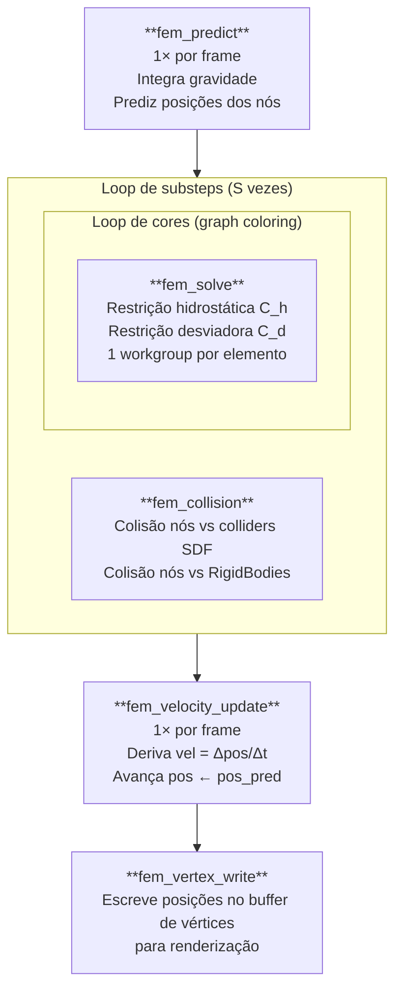
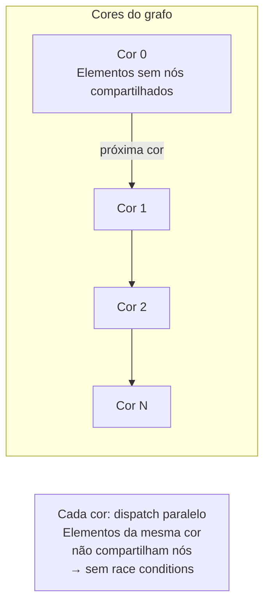

# Pipeline FEM — Corpos Deformáveis

**Finite Element Method com XPBD** para corpos deformáveis, usando elementos tetraédricos T4 e material Neo-Hookean. Implementado em compute shaders WGSL com **graph coloring** para paralelismo sem condições de corrida.

Referência: Müller & Gross 2004; Macklin & Müller 2021, *"XPBD: Position-Based Simulation of Compliant Constrained Dynamics"*.

---

## 1. Visão geral

---

## 2. Discretização: Tetraedro T4

O domínio deformável é dividido em **tetraedros T4** (4 nós, 4 faces). Cada elemento possui:

- 4 índices de nós: $n_0, n_1, n_2, n_3$
- $\mathbf{D}_m^{-1}$ — inversa da shape matrix de repouso (pré-computada na CPU)
- Volume de repouso $V_0$
- Parâmetros de material por elemento: $\mu_e$, $\lambda_e$ (Lamé)

### Campos por nó (Particle)

| Campo | Tipo | Significado |
|-------|------|-------------|
| `pos.xyz` | `vec3f` | Posição atual |
| `pos.w` | `f32` | Massa inversa $m^{-1}$ |
| `pred.xyz` | `vec3f` | Posição prevista (usada pelo solver) |

---

## 3. Gradiente de deformação

### 3.1 Shape matrix atual

$$
\mathbf{D}_s = [\mathbf{p}_1 - \mathbf{p}_0 \mid \mathbf{p}_2 - \mathbf{p}_0 \mid \mathbf{p}_3 - \mathbf{p}_0]
$$

### 3.2 Gradiente de deformação F

$$
\mathbf{F} = \mathbf{D}_s \cdot \mathbf{D}_m^{-1}
$$

- $\mathbf{F} = \mathbf{I}$ no estado de repouso (sem deformação)
- $J = \det(\mathbf{F})$ é a razão de volume: $J = 1$ conserva volume, $J < 0$ indica inversão

### 3.3 Shape matrix de repouso

$$
\mathbf{D}_m = [\mathbf{X}_1 - \mathbf{X}_0 \mid \mathbf{X}_2 - \mathbf{X}_0 \mid \mathbf{X}_3 - \mathbf{X}_0]
$$

onde $\mathbf{X}_i$ são as posições de repouso. $\mathbf{D}_m^{-1}$ é pré-computada uma vez na CPU e armazenada por colunas em `FEMElement.Bm_col{0,1,2}`.

---

## 4. Material Neo-Hookean — Restrições XPBD

O material Neo-Hookean é modelado por dois tipos de restrição:

### 4.1 Restrição hidrostática $C_h$ (volume)

$$
C_h = J - 1 = \det(\mathbf{F}) - 1
$$

Penaliza mudança de volume. $C_h = 0$ quando o elemento não expande nem comprime.

**Compliance:** $\alpha_h = \frac{1}{\lambda + 2\mu}$ (inversamente proporcional ao módulo volumétrico)

### 4.2 Restrição desviadora $C_d$ (forma)

$$
C_d = \|\mathbf{F}\|_F - \sqrt{3}
$$

onde $\|\mathbf{F}\|_F = \sqrt{\text{tr}(\mathbf{F}^\top \mathbf{F})}$ é a norma de Frobenius. Penaliza distorção de forma. $C_d = 0$ quando $\mathbf{F}$ é ortogonal uniforme (rotação pura + escala isotrópica).

**Compliance:** $\alpha_d = \frac{1}{\mu}$

---

## 5. Gradientes das restrições

### 5.1 Gradiente hidrostático

Para o nó $k+1$ ($k = 0, 1, 2$):

$$
\mathbf{g}_{h,k+1} = J \cdot \mathbf{F}^{-T} \cdot \mathbf{b}_k
$$

onde $\mathbf{b}_k$ é a coluna $k$ de $\mathbf{D}_m^{-1}$.

O gradiente do nó 0 é determinado por **equilíbrio** (partição da unidade):

$$
\mathbf{g}_{h,0} = -(\mathbf{g}_{h,1} + \mathbf{g}_{h,2} + \mathbf{g}_{h,3})
$$

Derivação: $\frac{\partial J}{\partial \mathbf{p}_k} = J \cdot \mathbf{F}^{-T} \frac{\partial \mathbf{D}_s}{\partial \mathbf{p}_k} \mathbf{D}_m^{-1}$; como $\frac{\partial \mathbf{D}_s}{\partial \mathbf{p}_{k+1}} = \mathbf{e}_k^\top$ (vetor padrão), o resultado é $J \cdot \mathbf{F}^{-T} \mathbf{b}_k$.

### 5.2 Gradiente desviador

Para o nó $k+1$:

$$
\mathbf{g}_{d,k+1} = \frac{\mathbf{F} \cdot \mathbf{b}_k}{\|\mathbf{F}\|_F}
$$

Derivação: $\frac{\partial \|\mathbf{F}\|_F}{\partial \mathbf{p}_{k+1}} = \frac{\mathbf{F}}{\|\mathbf{F}\|_F} \cdot \mathbf{b}_k$.

---

## 6. Solver XPBD-FEM

### 6.1 Compliance normalizada

A compliance $\tilde{\alpha}$ incorpora o passo de tempo e o volume de repouso (Macklin 2021):

$$
\tilde{\alpha} = \frac{\alpha}{dt_\text{sub}^2 \cdot V_0}
$$

Isso torna o solver independente da escala temporal e da discretização do malha.

### 6.2 Incremento XPBD

Para cada restrição $C$ (hidrostática ou desviadora):

$$
\Delta\lambda = \frac{-(C + \tilde{\alpha} \cdot \lambda)}{\displaystyle\sum_{i=0}^{3} w_i \|\mathbf{g}_i\|^2 + \tilde{\alpha}}
$$

onde $w_i = m_i^{-1}$ é a massa inversa do nó $i$.

> Nota: nesta implementação, $\lambda = 0$ em cada substep (warm-start desabilitado para estabilidade a longo prazo, pois acumulação de lambda cresce indefinidamente).

### 6.3 Correção de posição

Aplica a correção a cada nó:

$$
\Delta \tilde{\mathbf{p}}_i = w_i \cdot \Delta\lambda \cdot \mathbf{g}_i
$$

O solver resolve $C_h$ primeiro (usando posições previstas atuais), depois $C_d$ com as posições já corrigidas por $C_h$.

---

## 7. Graph Coloring para paralelismo

O desafio do FEM paralelo: dois elementos que compartilham um nó não podem executar o solver simultaneamente (corrida de escrita em `pred`).

**Solução:** coloração do grafo de elementos (nós = elementos, arestas = nós compartilhados). Elementos da mesma cor não compartilham nós → podem ser resolvidos em paralelo.

Para cada cor, um `dispatch(count_para_essa_cor)` é emitido com `workgroup_size(1)` — cada workgroup processa um elemento de forma serial (os 4 nós do elemento são acoplados e devem ser resolvidos em sequência).

---

## 8. Colisão FEM (`fem_collision`)

Executa por substep, após `fem_solve`. Para cada nó, testa contra:

1. **Colliders estáticos**: avalia SDF em espaço local, aplica correção posicional proporcional à penetração
2. **RigidBodies dinâmicos**: usa `pos_pred` e `rot_pred` do corpo rígido para transformar o nó para espaço local; corrige ambos (nó FEM e corpo rígido) por impulso

Para o nó FEM com penetração $d < 0$:

$$
\Delta \tilde{\mathbf{p}}_\text{nó} = -w_\text{nó} \cdot \frac{d}{w_\text{nó} + w_\text{rb}} \cdot \hat{\mathbf{n}}
$$

---

## 9. Recuperação de velocidade (`fem_velocity_update`)

Após todos os substeps, deriva velocidades por diferença finita:

$$
\mathbf{v}_i = \frac{\tilde{\mathbf{p}}_i - \mathbf{x}_i}{\Delta t_\text{frame}}
$$

Aplica damping e avança: $\mathbf{x}_i \leftarrow \tilde{\mathbf{p}}_i$.

---

## 10. Parâmetros de configuração

| Parâmetro | Descrição | Típico |
|-----------|-----------|--------|
| `youngsModulus` | Módulo de Young $E$ (Pa) | $10^3$–$10^6$ |
| `poissonsRatio` | Coeficiente de Poisson $\nu$ | 0.3–0.49 |
| `mu` | $\mu = E / (2(1+\nu))$ | derivado |
| `lambda` | $\lambda = E\nu / ((1+\nu)(1-2\nu))$ | derivado |
| `substeps` | Subdivisões de $\Delta t_\text{frame}$ | 10–30 |
| `iterations` | Iterações por substep | 10–20 |
| `damping` | Coeficiente de damping | 0.01–0.05 |

### Relação Lamé ↔ propriedades de engenharia

$$
\mu = \frac{E}{2(1+\nu)}, \qquad \lambda = \frac{E\nu}{(1+\nu)(1-2\nu)}
$$

- $\mu$ (segundo coeficiente de Lamé) controla resistência ao cisalhamento
- $\lambda$ (primeiro coeficiente de Lamé) controla resistência volumétrica
- Para material quase-incompressível ($\nu \to 0.5$): $\lambda \to \infty$ → usar $C_h$ com compliance muito baixa
