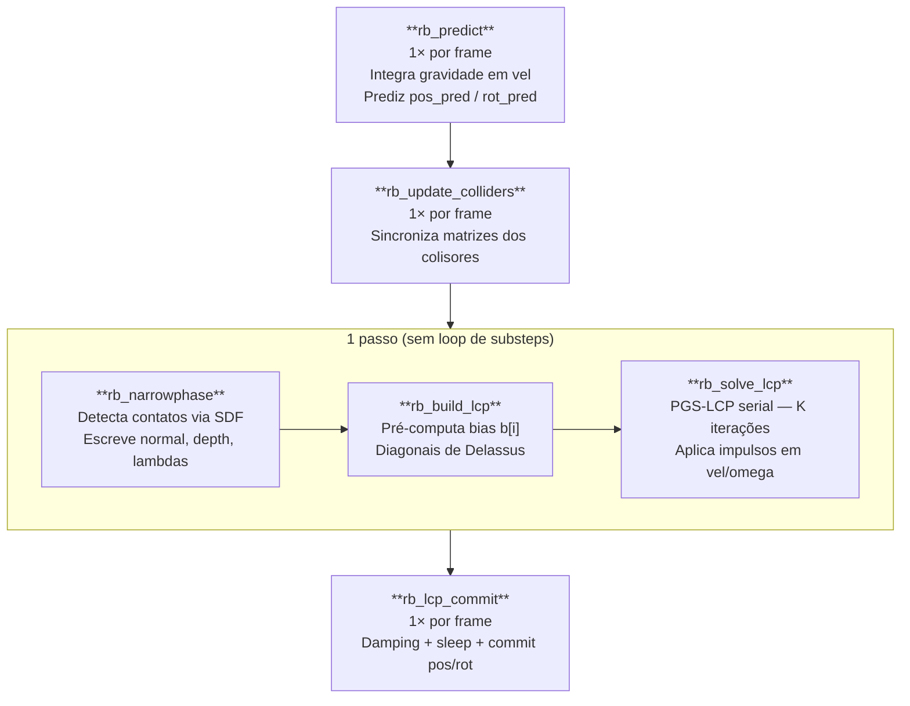
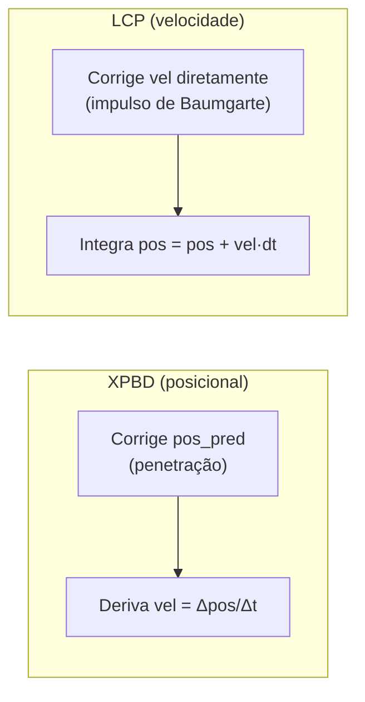

# Pipeline LCP — Corpos Rígidos

**Linear Complementarity Problem** com **Projected Gauss-Seidel (PGS)** para corpos rígidos, implementado inteiramente em compute shaders WGSL.

Ao contrário do pipeline XPBD (que corrige posições), o pipeline LCP opera no **espaço de velocidade**: calcula impulsos que satisfazem as condições de não-penetração e fricção de Coulomb.

---

## 1. Visão geral



> O pipeline LCP usa **1 passo** (sem loop de substeps). A convergência vem das $K$ iterações internas do solver. Múltiplos substeps aplicariam o mesmo bias Baumgarte $N$ vezes sobre o mesmo gap, gerando explosão de velocidade.

---

## 2. Fase 1 — Predição (`rb_predict`)

Igual ao pipeline XPBD, com uma diferença: a gravidade é integrada **diretamente em `vel`** (não apenas em `vel_ext`). Isso é necessário para que o solver LCP leia a velocidade pós-gravidade e corrija o excesso:

$$
\mathbf{v} \leftarrow \mathbf{v} + \mathbf{g} \cdot \Delta t_\text{frame}
$$

---

## 3. Detecção de colisões (`rb_narrowphase`)

Idêntica ao pipeline XPBD. Ver [pipeline_xpbd.md §4](./pipeline_xpbd.md#4-detecção-de-colisões-rb_narrowphase).

O campo `_pad3` de cada contato armazena o SDF real $d$ (sem d_speculative), usado pela correção posicional direta em `rb_lcp_commit`.

---

## 4. Construção do sistema LCP (`rb_build_lcp`)

Executa **em paralelo** (1 thread por contato ativo), **1× por frame**.

### 4.1 Diagonal de Delassus

A diagonal do operador de Delassus $\mathbf{A}$ mede a resistência à aceleração relativa de cada contato. Para o contato $i$ com corpo A e collider estático:

$$
a_{ii} = w_A(\hat{\mathbf{n}}_i) = m_A^{-1} + (\mathbf{r}_A \times \hat{\mathbf{n}}_i)^\top \mathbf{I}_A^{-1} (\mathbf{r}_A \times \hat{\mathbf{n}}_i)
$$

Para contato **corpo-a-corpo** (A e B), as contribuições somam:

$$
a_{ii} = w_A(\hat{\mathbf{n}}_i) + w_B(\hat{\mathbf{n}}_i)
$$

As diagonais tangenciais são calculadas da mesma forma, substituindo $\hat{\mathbf{n}}$ por $\hat{\mathbf{t}}_1$ e $\hat{\mathbf{t}}_2$ (base ortonormal do plano tangente).

### 4.2 Velocidade relativa normal

$$
v_\text{rel,n} = \hat{\mathbf{n}} \cdot (\mathbf{v}_c^A - \mathbf{v}_c^B)
$$

onde $\mathbf{v}_c^A = \mathbf{v}_A + \boldsymbol{\omega}_A \times \mathbf{r}_A$ é a velocidade do ponto de contato em A.

### 4.3 Bias de Baumgarte com restituição

O bias $b[i]$ combina **estabilização de posição** (Baumgarte) com **restituição**:

$$
b_i = \frac{\beta \cdot \min(\text{gap} + s_\text{slop},\ 0)}{\Delta t} + e \cdot \max(-v_\text{rel,n},\ 0)
$$

onde:
- $\beta$ — coeficiente de Baumgarte (tipicamente 0.1–0.3)
- $s_\text{slop}$ — penetration slop (folga permitida, tipicamente 0.001 m)
- $e$ — coeficiente de restituição do par
- O segundo termo só se aplica quando $v_\text{rel,n} < 0$ e $|v_\text{rel,n}|$ excede o `restitutionThreshold`

---

## 5. Solver LCP/PGS (`rb_solve_lcp`)

Executa **serial** (1 thread), **1× por frame**, com $K = $ `solve_iters` × `substeps` iterações internas.

### 5.1 Formulação do LCP

O problema de contato se formula como um LCP:

$$
\mathbf{A} \boldsymbol{\lambda} + \mathbf{b} \geq \mathbf{0}, \quad \boldsymbol{\lambda} \geq \mathbf{0}, \quad \boldsymbol{\lambda}^\top (\mathbf{A}\boldsymbol{\lambda} + \mathbf{b}) = 0
$$

Estas são as **condições de Signorini**:
- $\lambda_n \geq 0$: o contato só empurra, nunca puxa
- $A\lambda + b \geq 0$: velocidade relativa na normal $\geq 0$ após o impulso
- Complementaridade: ou o contato está ativo ($\lambda_n > 0$) ou separado ($v_\text{rel,n} > 0$), não ambos

### 5.2 Warm-Starting

Antes da primeira iteração PGS, aplica os impulsos do frame anterior escalonados por $\xi$ (warm-start factor):

$$
\boldsymbol{\lambda}_0^{(n)} = \xi \cdot \boldsymbol{\lambda}_\text{prev}^{(n)}, \qquad
\boldsymbol{\lambda}_0^{(t)} = \xi \cdot \boldsymbol{\lambda}_\text{prev}^{(t)}
$$

$$
\mathbf{v}_A \leftarrow \mathbf{v}_A + m_A^{-1} \cdot \lambda_0^{(n)} \cdot \hat{\mathbf{n}}, \qquad
\boldsymbol{\omega}_A \leftarrow \boldsymbol{\omega}_A + \mathbf{I}_A^{-1} (\mathbf{r}_A \times \lambda_0^{(n)} \hat{\mathbf{n}})
$$

O warm-starting reduz o número de iterações necessárias para convergência, pois a solução inicial já está próxima da convergida.

### 5.3 Passo PGS normal

Para cada contato $i$ na iteração $k$, a velocidade relativa na normal é recalculada a partir do estado **atual** (Gauss-Seidel usa o estado mais recente):

$$
j_v = \hat{\mathbf{n}}_i \cdot (\mathbf{v}_c^A - \mathbf{v}_c^B)
$$

O incremento de impulso:

$$
\Delta\lambda_n = -\frac{j_v + b_i}{a_{ii}}
$$

Projeção de Signorini (restrição unilateral):

$$
\lambda_n^\text{novo} = \max(\lambda_n^\text{antigo} + \Delta\lambda_n,\ 0)
$$

$$
\delta\lambda_n = \lambda_n^\text{novo} - \lambda_n^\text{antigo}
$$

Atualização de velocidades:

$$
\mathbf{v}_A \leftarrow \mathbf{v}_A + m_A^{-1} \cdot \delta\lambda_n \cdot \hat{\mathbf{n}}_i
$$

$$
\boldsymbol{\omega}_A \leftarrow \boldsymbol{\omega}_A + \mathbf{I}_A^{-1} (\mathbf{r}_A \times \delta\lambda_n \hat{\mathbf{n}}_i)
$$

Para contatos corpo-a-corpo, aplica reação oposta em B.

### 5.4 Passo PGS tangencial — Cone de Coulomb

Para cada contato $i$, a velocidade tangencial relativa é decomposta em $\hat{\mathbf{t}}_1$ e $\hat{\mathbf{t}}_2$:

$$
j_{v,t} = \begin{pmatrix} \hat{\mathbf{t}}_1 \cdot (\mathbf{v}_c^A - \mathbf{v}_c^B) \\ \hat{\mathbf{t}}_2 \cdot (\mathbf{v}_c^A - \mathbf{v}_c^B) \end{pmatrix}
$$

Os incrementos PGS tangenciais:

$$
\Delta\lambda_{t,k} = -\frac{j_{v,t,k}}{a_{ii}^{(t_k)}}, \quad k = 1, 2
$$

Projeção no **disco de Coulomb** (cone 2D):

$$
\boldsymbol{\lambda}_t^\text{novo} = \boldsymbol{\lambda}_t^\text{antigo} + \Delta\boldsymbol{\lambda}_t
$$

$$
\boldsymbol{\lambda}_t^\text{proj} = \boldsymbol{\lambda}_t^\text{novo} \cdot \min\!\left(1,\ \frac{\mu \cdot \lambda_n^\text{novo}}{|\boldsymbol{\lambda}_t^\text{novo}|}\right)
$$

Isso garante $|\boldsymbol{\lambda}_t| \leq \mu \lambda_n$ (cone de Coulomb 3D).

---

## 6. Commit final (`rb_lcp_commit`)

Executa **em paralelo** (1 thread por corpo), **1× por frame**, após o solver.

### 6.1 Integração de posição

Usa a velocidade já corrigida pelo solver LCP (não recalcula a partir de `pos_pred`):

$$
\mathbf{x}_\text{novo} = \mathbf{x} + \mathbf{v}_\text{corrigida} \cdot \Delta t_\text{frame}
$$

$$
\mathbf{q}_\text{novo} = \text{normalize}\!\left(\mathbf{q} + \frac{\Delta t_\text{frame}}{2} \begin{pmatrix} \boldsymbol{\omega}_\text{corrigida} \\ 0 \end{pmatrix} \otimes \mathbf{q}\right)
$$

### 6.2 Correção posicional direta

Para penetrações reais remanescentes após o solver, aplica correção posicional proporcional:

$$
\Delta\mathbf{x}_\text{corr} = \sum_{j \text{ ativo}} \hat{\mathbf{n}}_j \cdot \max(-(d_j + s_\text{slop}),\ 0) \cdot 0.1
$$

O fator 0.1 complementa o Baumgarte de velocidade (~10% posição + ~70% velocidade $\approx$ 80% de correção total por frame), evitando que o corpo afunde gradualmente.

### 6.3 Pseudo-sleep com guarda de contato

O sleep **só é aplicado se o corpo estiver em contato com algo**. Isso evita o falso-sleep em corpos no pico de um quique (quando $|\mathbf{v}| \approx 0$ momentaneamente sem contato ativo):

```
has_contact = existe contato ativo no loop de correção
if (has_contact AND |v|² < v_sleep² AND |ω|² < 25·v_sleep²):
    v ← 0,  ω ← 0,  vel.w ← 1  (flag de sleep)
```

---

## 7. Diferença LCP vs XPBD



| Aspecto | XPBD | LCP |
|---------|------|-----|
| Espaço do solver | Posição | Velocidade |
| Substeps | N (tipicamente 4–16) | 1 |
| Iterações por substep | K | K (total = K × substeps) |
| Restituição | Separada (`rb_solve_velocity`) | Via bias $b_i$ |
| Warm-starting | Implícito (lambda_n) | Explícito (escalonado por wsf) |
| Fricção | Impulso em vel-space | Cone de Coulomb no PGS |
| Correção posicional | XPBD nativa | Baumgarte + pós-correção direta |

---

## 8. Parâmetros de configuração

| Parâmetro | Descrição | Típico |
|-----------|-----------|--------|
| `iterations` | $K$ iterações PGS | 10–25 |
| `baumgarteBeta` | $\beta$ — estabilização de posição | 0.1–0.3 |
| `warmStartFactor` | $\xi$ — escalonamento do warm-start | 0.7–0.95 |
| `penetrationSlop` | $s_\text{slop}$ — folga permitida (m) | 0.001 |
| `restitutionThreshold` | Velocidade mínima para bounce (m/s) | 0.5 |
| `sleepLinThreshold` | $v_\text{sleep}$ (m/s) | 0.05–0.1 |
| `globalAngularDamping` | Damping angular global | 0.5 |
