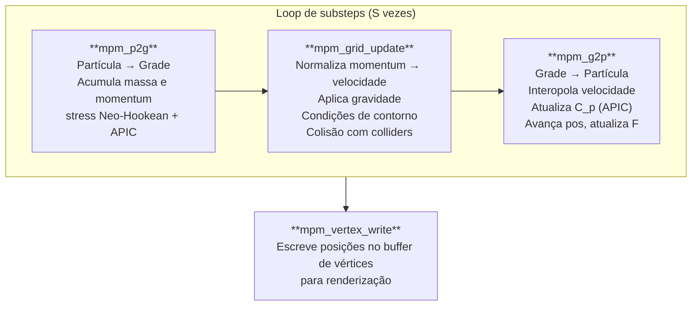
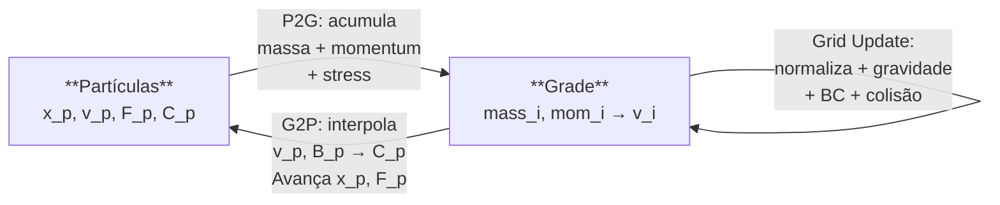

# Pipeline MPM — Material Point Method

**MLS-MPM** (*Moving Least Squares Material Point Method*) com **APIC** (*Affine Particle-in-Cell*) para simulação de fluidos e materiais granulares. Implementado em compute shaders WGSL com **aritmética de ponto fixo** para operações atômicas na grade.

Referência: Hu et al. 2018, *"A Moving Least Squares Material Point Method with Displacement Discontinuity and Two-Way Rigid Body Coupling"*.

---

## 1. Visão geral

O MPM alterna entre uma representação **Lagrangiana** (partículas) para rastrear material e uma representação **Euleriana** (grade) para resolver a dinâmica. O ciclo P2G → Grid Update → G2P executa $S$ vezes por frame.



---

## 2. Estrutura de dados

### 2.1 MPMParticle

| Campo | Tipo | Significado |
|-------|------|-------------|
| `pos.xyz` | `vec3f` | Posição |
| `pos.w` | `f32` | Massa $m_p$ |
| `vel.xyz` | `vec3f` | Velocidade |
| `vel.w` | `f32` | Volume de repouso $V_0^p$ |
| `F_col{0,1,2}.xyz` | `vec3f` | Colunas do gradiente de deformação $\mathbf{F}$ (3×3) |
| `F_col0.w` | `f32` | $J = \det(\mathbf{F})$ (para acesso rápido) |
| `C_col{0,1,2}.xyz` | `vec3f` | Colunas do campo afim APIC $\mathbf{C}_p$ (3×3) |

### 2.2 MPMGridNode

| Campo | Tipo | Significado |
|-------|------|-------------|
| `mass_i32` | `atomic<i32>` | Massa em ponto fixo |
| `mom_x/y/z_i32` | `atomic<i32>` | Momentum em ponto fixo (3 componentes) |
| `vel` | `vec3f` | Velocidade normalizada (escrita por grid_update) |

O uso de **atomics i32** permite que múltiplas partículas acumulem em paralelo no mesmo nó sem condições de corrida. A escala `fixed_scale` (tipicamente $10^5$) converte f32 → i32 preservando precisão suficiente.

---

## 3. Função de peso B-Spline quadrática

### 3.1 Peso 1D

Para uma partícula na posição fracionária $f_x$ em relação ao nó base:

$$
w_0(f_x) = \tfrac{1}{2}(1.5 - f_x)^2
$$
$$
w_1(f_x) = \tfrac{3}{4} - (f_x - 1)^2
$$
$$
w_2(f_x) = \tfrac{1}{2}(f_x - 0.5)^2
$$

As três funções formam uma **partição da unidade**: $w_0 + w_1 + w_2 = 1$.

### 3.2 Gradiente 1D (pré-dividido por $dx$)

$$
\nabla w_0 = -(1.5 - f_x) / dx, \qquad
\nabla w_1 = -2(f_x - 1) / dx, \qquad
\nabla w_2 = (f_x - 0.5) / dx
$$

### 3.3 Peso e gradiente 3D

Produto das funções 1D em cada eixo (suporte de $3^3 = 27$ nós):

$$
w_{i,p} = w_{x,a} \cdot w_{y,b} \cdot w_{z,c}, \quad a,b,c \in \{0,1,2\}
$$

$$
\nabla w_{i,p} = \begin{pmatrix}
\nabla w_{x,a} \cdot w_{y,b} \cdot w_{z,c} \\
w_{x,a} \cdot \nabla w_{y,b} \cdot w_{z,c} \\
w_{x,a} \cdot w_{y,b} \cdot \nabla w_{z,c}
\end{pmatrix}
$$

### 3.4 Coordenadas fracionárias

$$
\mathbf{o} = \mathbf{x}_p / dx, \qquad
\mathbf{b} = \lfloor \mathbf{o} - 0.5 \rfloor, \qquad
\mathbf{f} = \mathbf{o} - \mathbf{b}
$$

---

## 4. Modelo de material: Neo-Hookean

### 4.1 Primeiro tensor de Piola-Kirchhoff

$$
\mathbf{P} = \mu (\mathbf{F} - \mathbf{F}^{-T}) + \lambda \ln(J) \cdot \mathbf{F}^{-T}
$$

onde:
- $\mathbf{F}$ — gradiente de deformação da partícula
- $J = \det(\mathbf{F})$ — razão de volume
- $\mu, \lambda$ — coeficientes de Lamé

### 4.2 Produto $\mathbf{P}\mathbf{F}^\top$

Para a fase P2G, a força de stress é computada via o produto:

$$
\boldsymbol{\sigma} = \mathbf{P} \mathbf{F}^\top
$$

Este produto aparece naturalmente na discretização variacional do MPM e converte o stress de Piola-Kirchhoff para a força interna na grade.

---

## 5. Fase P2G — Partícula → Grade (`mpm_p2g`)

Cada thread processa uma partícula e acumula nas 27 células vizinhas.

### 5.1 Contribuição de massa

$$
\Delta m_i = w_{i,p} \cdot m_p
$$

### 5.2 Momentum APIC

O campo afim APIC $\mathbf{C}_p$ codifica a variação de velocidade ao redor da partícula. O momentum contribuído ao nó $i$ combina velocidade da partícula, transferência afim e força de stress:

$$
\Delta \mathbf{mom}_i = w_{i,p} \cdot m_p \cdot (\mathbf{v}_p + \mathbf{C}_p (\mathbf{x}_i - \mathbf{x}_p))\ -\ \Delta t \cdot V_0^p \cdot \mathbf{P}\mathbf{F}^\top \nabla w_{i,p}
$$

O segundo termo é a força interna elástica discretizada; o sinal negativo vem da formulação variacional (princípio dos trabalhos virtuais).

### 5.3 Acúmulo atômico em ponto fixo

Para evitar condições de corrida com múltiplas partículas escrevendo no mesmo nó:

$$
\text{grid}[i].\text{mass\_i32} \mathrel{+}= \text{round}(\Delta m_i \cdot \text{fs})
$$

$$
\text{grid}[i].\text{mom\_x/y/z\_i32} \mathrel{+}= \text{round}(\Delta\text{mom}_{i,x/y/z} \cdot \text{fs})
$$

---

## 6. Atualização da grade (`mpm_grid_update`)

### 6.1 Normalização

$$
\mathbf{v}_i = \frac{\mathbf{mom}_i}{m_i} = \frac{[\text{mom\_x/y/z\_i32}] / \text{fs}}{[\text{mass\_i32}] / \text{fs}}
$$

### 6.2 Forças externas (gravidade)

$$
\mathbf{v}_i \leftarrow \mathbf{v}_i + \mathbf{g} \cdot \Delta t_\text{sub}
$$

### 6.3 Condições de contorno (slip-wall)

A grade tem margem de 3 células. Nós nas bordas têm a componente de velocidade que aponta para fora zeranda:

```
if (ix < 3 and v_i.x < 0):  v_i.x ← 0
if (ix > gx-4 and v_i.x > 0):  v_i.x ← 0
(idem para y e z)
```

### 6.4 Colisão com colliders SDF

Para cada collider estático, o SDF é avaliado na posição do nó. Se o nó estiver dentro do collider ($d < 0$), a componente de velocidade que penetra é removida (sem penalização):

$$
v_n = \mathbf{v}_i \cdot \hat{\mathbf{n}}, \qquad \text{se } v_n < 0: \quad \mathbf{v}_i \leftarrow \mathbf{v}_i - v_n \hat{\mathbf{n}}
$$

---

## 7. Fase G2P — Grade → Partícula (`mpm_g2p`)

### 7.1 Interpolação de velocidade

$$
\mathbf{v}_p^\text{novo} = \sum_{i \in \text{suporte}} w_{i,p} \cdot \mathbf{v}_i
$$

### 7.2 Matriz de momentum afim APIC

$$
\mathbf{B}_p = \sum_{i \in \text{suporte}} w_{i,p} \cdot \mathbf{v}_i \otimes (\mathbf{x}_i - \mathbf{x}_p)
$$

onde $\otimes$ é o produto externo (resultado: matriz 3×3).

### 7.3 Campo afim $\mathbf{C}_p$ (MLS-MPM)

Para B-spline quadrática, a constante $\mathbf{D} = \frac{1}{4}dx^2 \mathbf{I}$, então:

$$
\mathbf{C}_p = \mathbf{D}^{-1} \mathbf{B}_p = \frac{4}{dx^2} \mathbf{B}_p
$$

**Identidade central do MLS-MPM:** $\mathbf{C}_p$ é simultaneamente o **campo afim de transferência** (APIC) e o **gradiente de velocidade** $\nabla \mathbf{v}_p$ da partícula. Isso elimina a necessidade de calcular $\nabla \mathbf{v}$ separadamente.

### 7.4 Avanço de posição

$$
\mathbf{x}_p^\text{novo} = \mathbf{x}_p + \Delta t_\text{sub} \cdot \mathbf{v}_p^\text{novo}
$$

### 7.5 Atualização do gradiente de deformação

Como $\mathbf{C}_p = \nabla \mathbf{v}_p$, a equação de evolução do gradiente de deformação $\dot{\mathbf{F}} = \nabla \mathbf{v} \cdot \mathbf{F}$ se integra por Euler explícito:

$$
\mathbf{F}_p^\text{novo} = (\mathbf{I} + \Delta t_\text{sub} \cdot \mathbf{C}_p) \cdot \mathbf{F}_p^\text{antigo}
$$

---

## 8. Diagrama de fluxo de dados



---

## 9. Aritmética de ponto fixo

A GPU não suporta `atomicAdd` em `f32`. A solução é converter para `i32`:

$$
x_\text{i32} = \text{round}(x_\text{f32} \cdot \text{fs}), \qquad \text{fs} = 10^5 \text{ (típico)}
$$

A faixa i32 suporta valores f32 de até $\pm 2^{31} / \text{fs} \approx \pm 21474$ unidades. Para evitar overflow com muitas partículas, `fixed_scale` deve ser ajustado para a escala do problema.

---

## 10. Parâmetros de configuração

| Parâmetro | Descrição | Típico |
|-----------|-----------|--------|
| `mu` | $\mu$ — resistência ao cisalhamento (Pa) | $10^3$–$10^5$ |
| `lambda` | $\lambda$ — resistência volumétrica (Pa) | $10^3$–$10^5$ |
| `substeps` | Subdivisões de $\Delta t_\text{frame}$ | 20–50 |
| `cellSize` | $dx$ — tamanho da célula (m) | 0.1–0.5 |
| `gridX/Y/Z` | Dimensões da grade | 32–128 por eixo |
| `fixedScale` | Escala ponto fixo | $10^5$ |
| `boundary_width` | Margem da grade (células) | 3 |

### Relação entre parâmetros e comportamento

- **Fluido:** $\mu \approx 0$, $\lambda$ moderado → sem resistência ao cisalhamento, mantém volume
- **Gelatina/Soft:** $\mu > 0$, $\lambda$ moderado → resiste a cisalhamento e compressão
- **Quase-incompressível:** $\lambda \gg \mu$ → mantém volume fortemente (penaliza $J \neq 1$)
- **$\Delta t_\text{sub}$ menor:** mais estável mas mais lento; CFL recomenda $\Delta t < dx / v_\text{max}$
