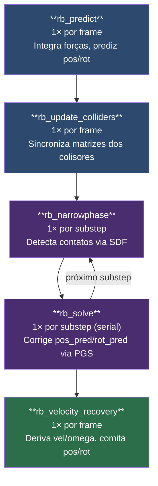
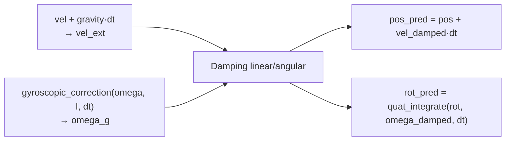
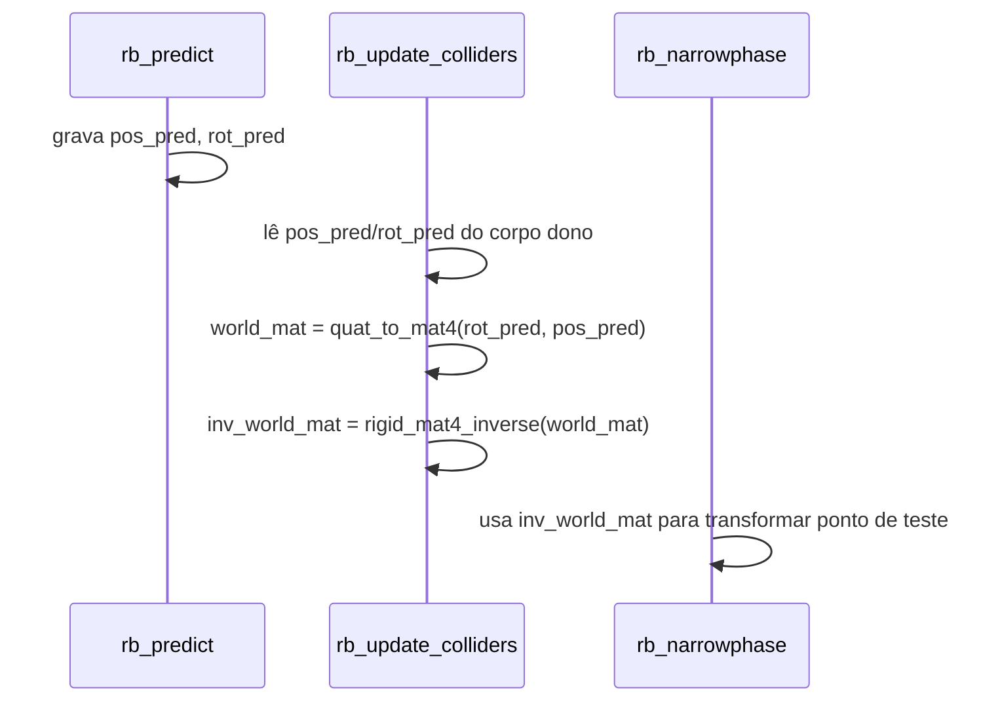
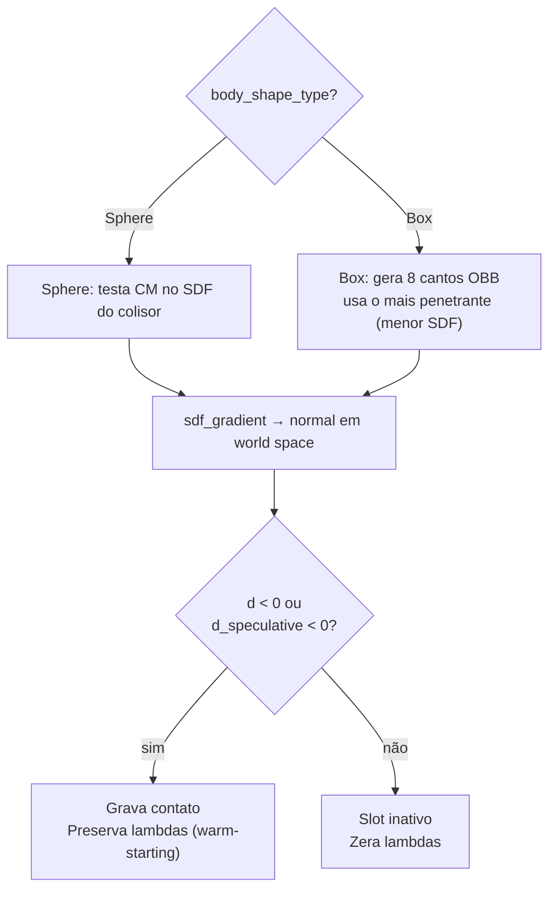
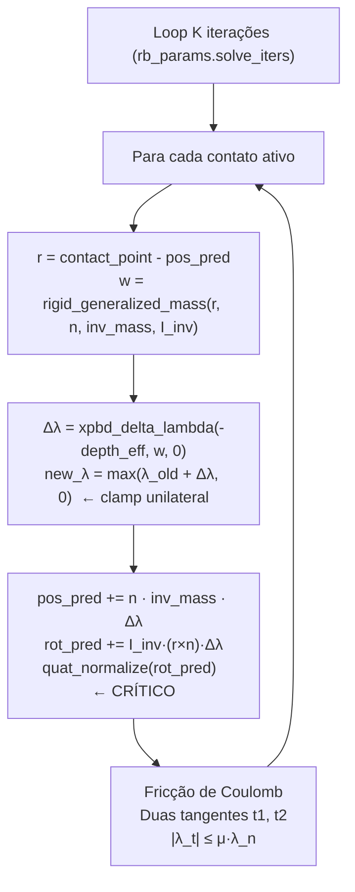
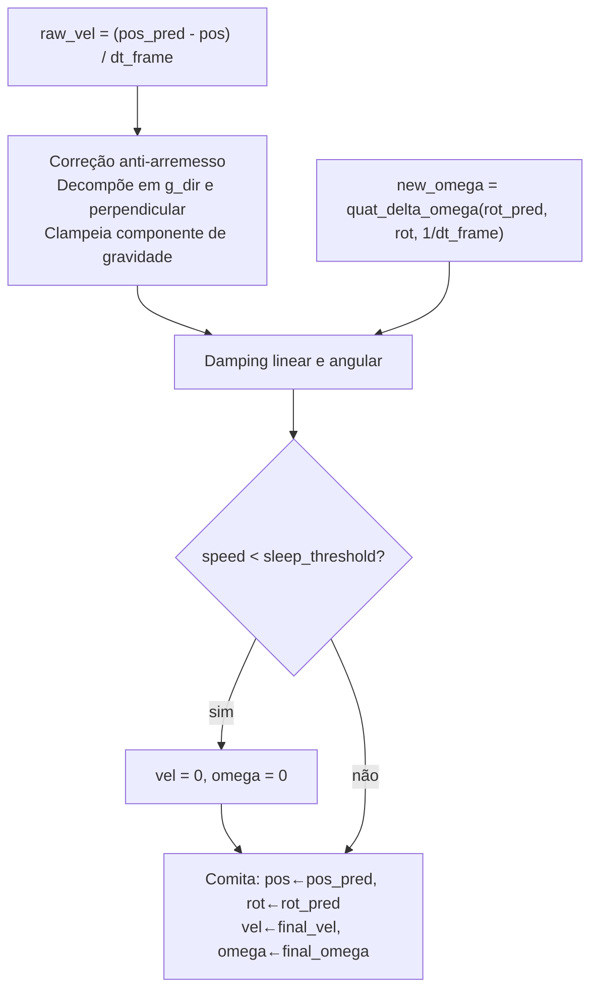

# Pipeline RigidBody GPU — Etapas WGSL

Este guia descreve cada etapa do pipeline de simulação física de corpos rígidos, implementado inteiramente em compute shaders WGSL. A simulação usa **XPBD (Extended Position-Based Dynamics)** com PGS Gauss-Seidel posicional.

---

## Visão geral do pipeline por frame

O loop de substeps repete narrowphase + solve `N` vezes por frame (default `N=4`). Mais substeps aumentam a precisão numérica à custa de custo de GPU.

---

## Buffers compartilhados

| Buffer | Tipo | Quem lê | Quem escreve |
|--------|------|---------|--------------|
| `gpu_rb_bodies` | `RigidBody[]` | todos os kernels | predict, solve, velocity_recovery |
| `gpu_rb_colliders` | `ColliderDesc[]` | narrowphase | update_colliders (dinâmicos), CPU (estáticos) |
| `gpu_rb_contacts` | `RBContact[]` | solve | narrowphase |
| `gpu_rb_sim_params` | `RBSimParams` (uniform) | todos os kernels | CPU (upload por frame) |

---

## Etapa 1 — `rb_predict`

**Quando:** 1× por frame, antes dos substeps.
**Dispatch:** `ceil(body_count / 64)` workgroups — totalmente paralelo.

Integra as forças externas e gera uma **posição/rotação prevista** sem modificar o estado comprometido (`pos`, `rot`, `vel`, `omega`).

**Por que não modificar `vel`/`omega`?**
Eles são preservados como referência de "velocidade antes da correção posicional". A etapa 5 (`rb_velocity_recovery`) usa essa referência para calcular o bounce correto e evitar velocity explosion.

A **correção giroscópica** estabiliza rotações de corpos não-esféricos (ex: bastão girando) que seriam instáveis com integração simétrica de Euler.

---

## Etapa 2 — `rb_update_colliders`

**Quando:** 1× por frame, após predict e antes de narrowphase.
**Dispatch:** `ceil(collider_count / 64)` — totalmente paralelo.

Recalcula `world_mat` e `inv_world_mat` de cada colisor dinâmico a partir de `pos_pred`/`rot_pred`.

**Antes desta etapa existia:** CPU fazia readback da GPU → atualizava `body.position` → enviava colisor atualizado. Isso criava 1 frame de atraso entre a posição do corpo e o colisor usado na detecção.

Colisores **estáticos** (`body_owner_idx == 0xFFFFFFFF`) são ignorados — suas matrizes continuam sendo enviadas pela CPU via `ColliderDescriptorUploader`, pois não se movem.

---

## Etapa 3 — `rb_narrowphase`

**Quando:** 1× por substep.
**Dispatch:** `ceil(body_count × collider_count / 64)` — cada thread gerencia o slot `contacts[rb_i * col_count + col_j]`.

Detecta contatos entre cada corpo dinâmico e cada colisor via **SDF (Signed Distance Function)**.

**Contato especulativo:** ativa o contato mesmo sem penetração atual se `d_speculative = d + v·n·dtSub < 0`. Evita tunneling de corpos rápidos.

**Warm-starting:** os valores de `lambda_n`, `lambda_tx`, `lambda_ty` do frame anterior são preservados quando o slot permanece ativo. Isso reduz o número de iterações necessárias para convergência em `rb_solve`.

**Auto-colisão:** filtrada — um corpo nunca testa seu próprio colisor (`col.body_owner_idx == rb_i`), pois o CM estaria sempre dentro da forma, gerando contato falso.

---

## Etapa 4 — `rb_solve`

**Quando:** 1× por substep.
**Dispatch:** `dispatch(1, 1, 1)` — **thread única, serial**.

Aplica correção posicional XPBD a `pos_pred`/`rot_pred` para todos os contatos ativos, iterando `K` vezes (Gauss-Seidel).

**Por que thread única?**
Gauss-Seidel depende de leituras do estado **já corrigido** de iterações anteriores. Threads paralelas criariam data hazards (race conditions no buffer de corpos). A alternativa seria K dispatches separados com barreiras de memória — mais caro do que um loop serial no shader para contagens de contatos típicas.

**Penetration slop:** `depth_eff = max(depth - slop, 0)`. Remove micro-penetrações abaixo de ~0.005 m antes de calcular a correção, eliminando jitter visual em objetos em repouso.

**Renormalização de quaternion:** obrigatória após cada correção angular. Sem ela, acúmulo de erros de ponto flutuante faz `rot_pred` "derivar" de um quaternion unitário em poucas iterações.

**Fricção de Coulomb:** cônica — `|λ_t| ≤ μ·λ_n` garante que o atrito nunca excede a força normal escalada pelo coeficiente de fricção.

---

## Etapa 5 — `rb_velocity_recovery`

**Quando:** 1× por frame, após todos os substeps.
**Dispatch:** `ceil(body_count / 64)` — totalmente paralelo.

Deriva as velocidades a partir da diferença de posição acumulada pelos substeps e comita o estado previsto como estado atual.

**Por que `dt_frame` e não `dtSub`?**
`pos_pred` acumulou correções de N substeps, cada um de duração `dtSub = dt_frame / N`. Dividir por `dtSub` amplificaria a velocidade derivada por um fator N, causando "velocity explosion" na primeira colisão.

**Correção anti-arremesso:** o componente da velocidade ao longo da gravidade é clampeado. Sem isso, correções posicionais do `rb_solve` se convertem em velocidades para cima (aparência de "arremessar" objetos ao contato).

**Pseudo-sleep:** se `|vel|² < sleep_threshold²` e `|omega|² < sleep_threshold² × 25`, ambos são zerados. Drena micro-vibrações infinitas acumuladas por erros numéricos.

---

## Resumo dos dados por etapa

| Etapa | Lê de | Escreve em | Paralelismo |
|-------|-------|------------|-------------|
| `rb_predict` | `bodies[i].pos, vel, omega, rot` | `bodies[i].pos_pred, rot_pred` | 64/workgroup |
| `rb_update_colliders` | `bodies[owner].pos_pred, rot_pred` | `colliders[ci].world_mat, inv_world_mat` | 64/workgroup |
| `rb_narrowphase` | `bodies`, `colliders` | `contacts` | 64/workgroup |
| `rb_solve` | `bodies`, `contacts` | `bodies.pos_pred, rot_pred`; `contacts.lambda_*` | 1 thread (serial) |
| `rb_velocity_recovery` | `bodies.pos_pred, rot_pred, pos, rot, vel, omega` | `bodies.vel, omega, pos, rot` | 64/workgroup |
