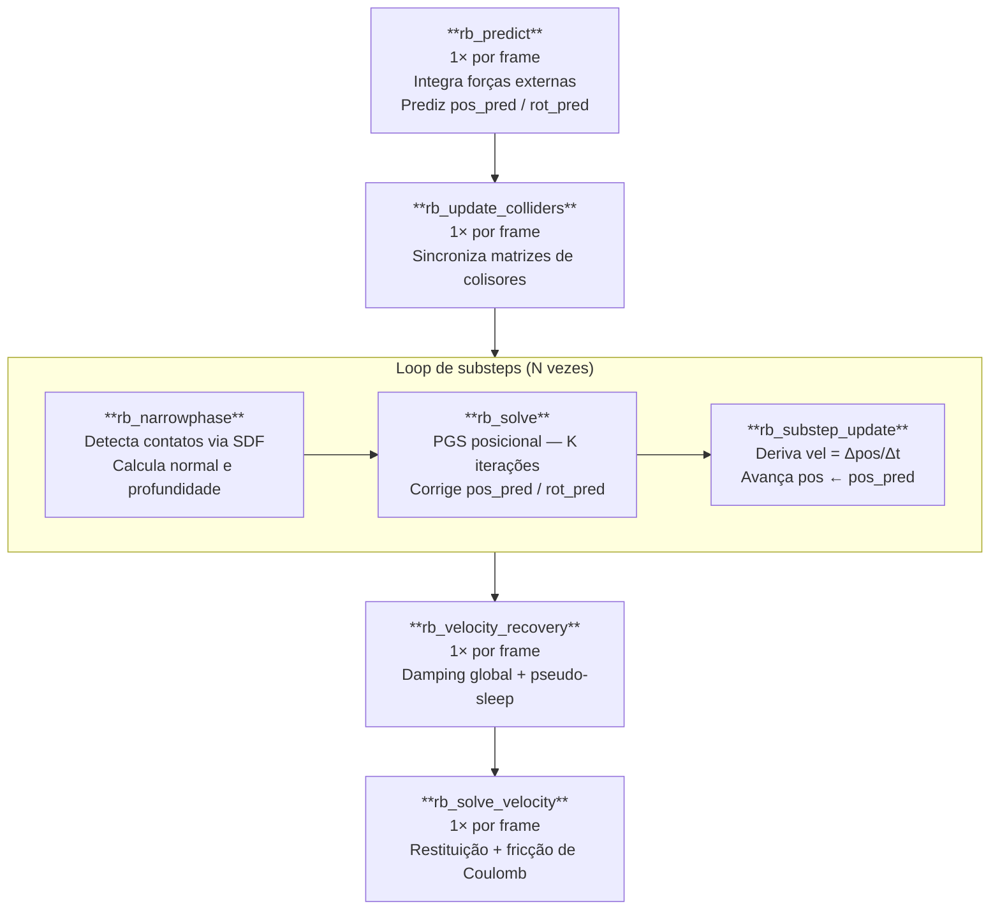
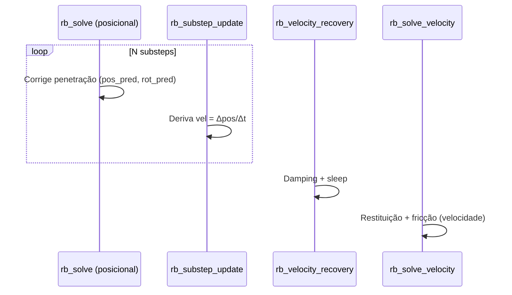

# Pipeline XPBD — Corpos Rígidos

**Extended Position-Based Dynamics** para corpos rígidos, implementado inteiramente em compute shaders WGSL.

Referência principal: Müller et al. 2020, *"Detailed Rigid Body Simulation with Extended Position Based Dynamics"*.

---

## 1. Visão geral

O pipeline XPBD simula corpos rígidos resolvendo **restrições de contato no espaço de posição**. Cada frame é dividido em $N$ substeps; dentro de cada substep, um solver PGS itera $K$ vezes sobre todos os contatos ativos, corrigindo posições previstas.

---

## 2. Estrutura de dados

### 2.1 RigidBody

Cada corpo armazena estado duplo (atual e previsto) mais propriedades físicas:

| Campo | Tipo | Significado |
|-------|------|-------------|
| `pos.xyz` | `vec3f` | Posição do centro de massa |
| `pos.w` | `f32` | Massa inversa $m^{-1}$ (0 = cinemático) |
| `rot` | `vec4f` | Quaternion de rotação atual (XYZW) |
| `vel.xyz` | `vec3f` | Velocidade linear |
| `vel.w` | `f32` | Flag de sleep (1 = dormindo) |
| `omega.xyz` | `vec3f` | Velocidade angular |
| `pos_pred` | `vec4f` | Posição prevista (usada pelo solver) |
| `rot_pred` | `vec4f` | Rotação prevista |
| `I_inv.xyz` | `vec3f` | Tensor de inércia inverso (diagonal, espaço local) |
| `mat_props` | `vec4f` | `(restitution, friction, lin_damp, ang_damp)` |

### 2.2 RBContact

Cada slot de contato armazena:

| Campo | Significado |
|-------|-------------|
| `normal.xyz` | Normal do contato (aponta para fora do collider) |
| `normal.w` | $-d_\text{eff}$ — profundidade efetiva |
| `point.xyz` | Ponto de contato em world space |
| `point.w` | $\lambda_n$ — impulso normal acumulado (warm-start) |
| `lambda_tx/ty` | Impulsos tangenciais acumulados |

---

## 3. Fase 1 — Predição (`rb_predict`)

Executa **1× por frame**, antes do loop de substeps.

### 3.1 Integração de forças externas (Semi-Implicit Euler)

$$
\mathbf{v}_\text{ext} = \mathbf{v} + \mathbf{g} \cdot \Delta t_\text{sub}
$$

### 3.2 Correção giroscópica

Para corpos com tensor de inércia não-uniforme, a equação de Euler introduz torque giroscópico. A correção implícita de primeira ordem é:

$$
\boldsymbol{\omega}' = \boldsymbol{\omega} - \Delta t \cdot \mathbf{I}^{-1} \left( \boldsymbol{\omega} \times (\mathbf{I} \cdot \boldsymbol{\omega}) \right)
$$

onde $\mathbf{I}$ é o tensor de inércia no espaço mundo.

### 3.3 Damping exponencial (frame-rate independent)

$$
\mathbf{v}_d = \mathbf{v}_\text{ext} \cdot e^{-k_\text{lin} \cdot \Delta t}, \qquad
\boldsymbol{\omega}_d = \boldsymbol{\omega}' \cdot e^{-k_\text{ang} \cdot \Delta t}
$$

### 3.4 Predição de posição e rotação

$$
\tilde{\mathbf{x}} = \mathbf{x} + \mathbf{v}_d \cdot \Delta t_\text{sub}
$$

$$
\tilde{\mathbf{q}} = \mathbf{q} + \frac{\Delta t_\text{sub}}{2} \begin{pmatrix} \boldsymbol{\omega}_d \\ 0 \end{pmatrix} \otimes \mathbf{q}
$$

O quaternion previsto $\tilde{\mathbf{q}}$ é normalizado antes de usar.

> **Observação:** `rb_predict` não modifica `vel` nem `omega` — apenas `pos_pred` e `rot_pred`. O estado atual é preservado para `rb_velocity_recovery`.

---

## 4. Detecção de colisões (`rb_narrowphase`)

Executa **1× por substep**, paralelizando sobre todos os pares (corpo, collider).

### 4.1 SDF e contato especulativo

Para cada par $(A, C)$, a distância com sinal é avaliada em espaço local do collider:

$$
d = \text{SDF}_C(\mathbf{x}_\text{test}) - r_A
$$

onde $r_A = 0$ para BoxShape e $r_A = $ raio para SphereShape.

O **contato especulativo** prevê se haverá penetração no próximo substep:

$$
d_\text{spec} = d + (\mathbf{v}_A \cdot \hat{\mathbf{n}}) \cdot \Delta t_\text{sub}
$$

O contato é ativado se $d < 0$ ou $d_\text{spec} < 0$.

A **profundidade efetiva** usada pelo solver é:

$$
d_\text{eff} = \begin{cases} d_\text{spec} & \text{se } d \geq 0 \text{ (contato preditivo)} \\ d & \text{se } d < 0 \text{ (penetração real)} \end{cases}
$$

### 4.2 Ponto de contato e normal

A normal $\hat{\mathbf{n}}$ é o gradiente normalizado do SDF transformado para o espaço mundo. O ponto de contato é projetado na superfície do collider:

$$
\mathbf{p}_c = \mathbf{x}_\text{test} - (d_\text{eff} + r_A) \cdot \hat{\mathbf{n}}
$$

### 4.3 BoxShape — canto mais penetrante

Para BoxShape, os 8 cantos do OBB são testados. O **canto mais penetrante** (menor SDF) é usado como ponto de teste. Quando 2+ cantos penetram um plano, usa-se o **centróide** para suprimir torque espúrio em pousamentos planos.

---

## 5. Solver XPBD posicional (`rb_solve`)

Executa serial (1 thread), **1× por substep**, com $K$ iterações Gauss-Seidel internas.

### 5.1 Restrição de contato

A violação da restrição de não-penetração é:

$$
C = -d_\text{eff} \geq 0
$$

### 5.2 Massa generalizada

A massa generalizada ao longo da direção $\hat{\mathbf{n}}$ mede a resistência combinada à translação e rotação:

$$
w_A(\hat{\mathbf{n}}) = m_A^{-1} + (\mathbf{r} \times \hat{\mathbf{n}})^\top \mathbf{I}_A^{-1} (\mathbf{r} \times \hat{\mathbf{n}})
$$

onde $\mathbf{r} = \mathbf{p}_c - \tilde{\mathbf{x}}_A$ é o vetor do CM ao ponto de contato.

### 5.3 Incremento de multiplicador XPBD

Com compliance $\tilde{\alpha} = 0$ (contato rígido):

$$
\Delta\lambda = -\frac{C}{\sum_i w_i}
$$

O multiplicador acumulado é clampeado para garantir unilateralidade (Signorini):

$$
\lambda_\text{novo} = \max(\lambda_\text{antigo} + \Delta\lambda,\ 0)
$$

$$
\delta\lambda = \lambda_\text{novo} - \lambda_\text{antigo}
$$

### 5.4 Correção de posição e rotação

$$
\Delta \tilde{\mathbf{x}}_A = m_A^{-1} \cdot \delta\lambda \cdot \hat{\mathbf{n}}
$$

$$
\Delta \tilde{\boldsymbol{\theta}}_A = \mathbf{I}_A^{-1} (\mathbf{r} \times \hat{\mathbf{n}}) \cdot \delta\lambda
$$

A atualização do quaternion usa a fórmula de integração angular:

$$
\tilde{\mathbf{q}}_A \leftarrow \tilde{\mathbf{q}}_A + \frac{1}{2} \begin{pmatrix} \Delta\tilde{\boldsymbol{\theta}}_A \\ 0 \end{pmatrix} \otimes \tilde{\mathbf{q}}_A
$$

O quaternion é renormalizado após cada correção para evitar drift numérico.

> **Clamp angular:** para evitar instabilidade com grandes $\delta\lambda$, o vetor de correção angular é limitado a $|\Delta\tilde{\boldsymbol{\theta}}| \leq 0.2$ rad/iteração.

---

## 6. Atualização de substep (`rb_substep_update`)

Ao final de cada substep, derive velocidades a partir das correções posicionais:

$$
\mathbf{v}_\text{novo} = \frac{\tilde{\mathbf{x}} - \mathbf{x}}{\Delta t_\text{sub}}
$$

$$
\boldsymbol{\omega}_\text{novo} = \frac{2}{\Delta t_\text{sub}} \cdot \text{Im}\left( \tilde{\mathbf{q}} \otimes \mathbf{q}^{-1} \right)
$$

Em seguida: $\mathbf{x} \leftarrow \tilde{\mathbf{x}}$, $\mathbf{q} \leftarrow \tilde{\mathbf{q}}$.

---

## 7. Recuperação de velocidade (`rb_velocity_recovery`)

Executa **1× por frame**, após o loop de substeps.

Aplica damping global e **pseudo-sleep**: se a velocidade linear e angular estão abaixo dos thresholds, zera ambas:

$$
|\mathbf{v}|^2 < v_\text{sleep}^2 \quad\text{e}\quad |\boldsymbol{\omega}|^2 < 25 \cdot v_\text{sleep}^2 \implies \mathbf{v} = \mathbf{0},\ \boldsymbol{\omega} = \mathbf{0}
$$

---

## 8. Solver de velocidade — Restituição e Fricção (`rb_solve_velocity`)

Executa serial, **1× por frame**, após `rb_velocity_recovery`.

### 8.1 Correção de velocidade normal (restituição $e = 0$)

Quando $v_n = \hat{\mathbf{n}} \cdot \mathbf{v}_c < -\epsilon$, aplica impulso para zerar a componente de aproximação:

$$
j_n = \frac{-v_n}{w_A(\hat{\mathbf{n}})}
$$

$$
\mathbf{v}_A \leftarrow \mathbf{v}_A + j_n \cdot m_A^{-1} \cdot \hat{\mathbf{n}}, \qquad
\boldsymbol{\omega}_A \leftarrow \boldsymbol{\omega}_A + j_n \cdot \mathbf{I}_A^{-1} (\mathbf{r} \times \hat{\mathbf{n}})
$$

### 8.2 Fricção de Coulomb

Após corrigir $v_n$, a velocidade tangencial no ponto de contato é:

$$
\mathbf{v}_\text{tan} = \mathbf{v}_c - v_n \hat{\mathbf{n}}
$$

O impulso de parada total e o máximo pelo cone de Coulomb:

$$
j_\text{stop} = \frac{|\mathbf{v}_\text{tan}|}{w_A(\hat{\mathbf{t}})}, \qquad j_\text{max} = \frac{\mu \cdot \lambda_n}{\Delta t}
$$

O impulso aplicado respeita o cone: $j_t = \min(j_\text{stop},\ j_\text{max})$ na direção $-\hat{\mathbf{t}}$.

---

## 9. Desacoplamento posição/velocidade (Müller 2020)

Separa a correção de **penetração** (espaço de posição, XPBD posicional) da correção de **velocidade** (espaço de velocidade, impulsos). Isso elimina acoplamento entre os dois efeitos e permite tratar restituição e fricção com $\lambda_n$ já estabilizado.

---

## 10. Parâmetros de configuração

| Parâmetro | Descrição | Típico |
|-----------|-----------|--------|
| `substeps` | Subdivisões de $\Delta t_\text{frame}$ | 4–16 |
| `iterations` | Iterações PGS por substep ($K$) | 10–30 |
| `sleepLinThreshold` | $v_\text{sleep}$ em m/s | 0.05–0.1 |
| `restitutionThreshold` | Velocidade mínima para bounce | 0.5 m/s |
| `linearDamping` / `angularDamping` | Coeficientes de damping por corpo | 0.0–0.5 |
