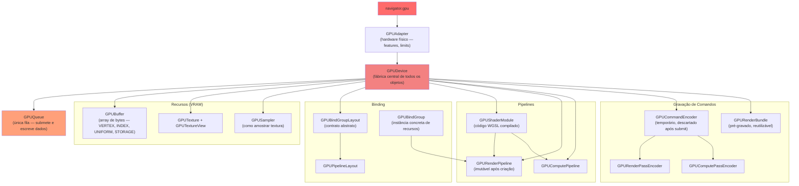
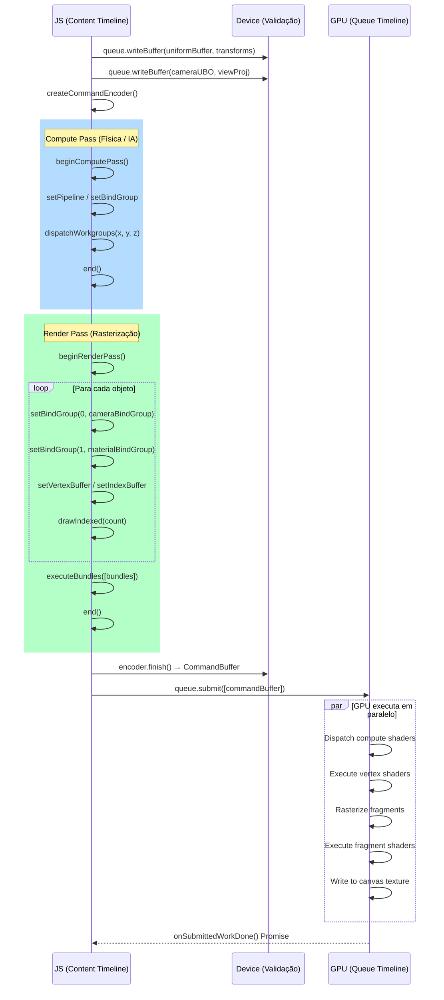

# Resumo WebGPU — Componentes, Uso e Relacionamentos

---

## Modelo de Execução: As Três Timelines

A spec W3C define três contextos de execução separados e assíncronos entre si:

| Timeline | Onde roda | Responsabilidade |
|---|---|---|
| **Content** | Thread JS do browser | Criação de objetos, gravação de comandos no encoder |
| **Device** | User agent / GPU process | Validação de descritores, criação de recursos no driver |
| **Queue** | Núcleos físicos da GPU | Execução real de shaders, draws, dispatches e cópias |

**Pontes de sincronização:**
- `queue.submit()` — move o trabalho da Content para a Queue Timeline
- `buffer.mapAsync()` — bloqueia o buffer para leitura no JS; resolve quando a GPU termina
- `queue.onSubmittedWorkDone()` — Promise que resolve quando toda a Queue Timeline conclui o lote submetido

> A Content Timeline **nunca** espera a Queue de forma síncrona. Toda comunicação de retorno é via Promise.

---

## Hierarquia de Objetos

Todos os objetos WebGPU herdam de `GPUObjectBase`:
- **`label`** — string de debug; aparece em mensagens de erro do driver
- **`destroy()`** — libera VRAM imediatamente, sem esperar o GC do JS



---

## Família 1 — Dados (VRAM física)

### GPUBuffer
Array de bytes brutos na GPU. Sem tipo intrínseco — a tipagem vem do shader ou do JS ao mapear.

| Usage flag | Para que serve |
|---|---|
| `VERTEX` | Fonte de atributos no Input Assembler |
| `INDEX` | Índices de vértices |
| `UNIFORM` | Leitura somente em shaders (câmera, luz, time) |
| `STORAGE` | Leitura/escrita aleatória em compute ou fragment |
| `COPY_SRC` / `COPY_DST` | Origem/destino de cópias e `writeBuffer` |
| `INDIRECT` | Parâmetros de `drawIndirect` / `dispatchWorkgroupsIndirect` |
| `QUERY_RESOLVE` | Destino de `resolveQuerySet` (timestamps, occlusion) |

**Estados (`mapState`):** `"unmapped"` → `"pending"` → `"mapped"` → (unmap) → `"unmapped"`

**Relacionamentos:** alimenta `GPURenderPassEncoder` (VERTEX/INDEX), é lido por shaders via `GPUBindGroup` (UNIFORM/STORAGE), e serve de destino para `GPUQueue.writeBuffer` e `encoder.copyBufferToBuffer`.

---

### GPUTexture
Memória multidimensional da GPU. Não é lida diretamente — sempre via `GPUTextureView`.

| Dimensão | Uso típico |
|---|---|
| `'1d'` | Lookup tables, gradientes |
| `'2d'` | Imagens, render targets, depth buffers, cubemaps (6 layers) |
| `'3d'` | Volumes, voxels |

Propriedades relevantes: `format`, `mipLevelCount`, `sampleCount` (1 = normal, 4 = MSAA), `depthOrArrayLayers`.

Usage flags: `TEXTURE_BINDING` (shader lê), `STORAGE_BINDING` (shader lê/escreve), `RENDER_ATTACHMENT` (alvo de Render Pass), `COPY_SRC` / `COPY_DST`.

**`GPUTextureView`** — "lente" sobre a textura; especifica mip level, array layer e aspect. É o que se conecta a pipelines, bind groups e render pass attachments.

**`GPUExternalTexture`** — importa `<video>` / `ImageBitmap` diretamente para a GPU sem cópia pela RAM JS. Expira ao fim do frame; deve ser reimportada a cada `requestAnimationFrame`.

**Relacionamentos:** `GPUTexture.createView()` gera `GPUTextureView`, que é usada em `GPUBindGroup` (para sampling) e em `colorAttachments` / `depthStencilAttachment` de Render Passes.

---

### GPUSampler
Define **como** o shader lê uma `GPUTextureView` — não armazena dados.

| Propriedade | Opções | Efeito |
|---|---|---|
| `magFilter` / `minFilter` | `nearest` / `linear` | Pixelado vs. suavizado |
| `mipmapFilter` | `nearest` / `linear` | Transição entre níveis de mip |
| `addressModeU/V/W` | `clamp-to-edge` / `repeat` / `mirror-repeat` | Comportamento além de UV [0,1] |
| `compare` | funções de comparação | Para shadow maps (depth comparison) |
| `maxAnisotropy` | 1–16 | Qualidade em superfícies oblíquas |

**Relacionamentos:** sempre emparelhado com `GPUTextureView` num `GPUBindGroup`; referenciado no WGSL via `@group(N) @binding(M) var s: sampler`.

---

## Família 2 — Estado estático (Binding & Layout)

### GPUBindGroupLayout
Define o **contrato** de recursos que um grupo de shaders espera. Não contém dados — é um molde.

**Importância:** determina `visibility` (VERTEX / FRAGMENT / COMPUTE) e tipo de cada recurso (`buffer`, `texture`, `sampler`, `storageTexture`, `externalTexture`). Imutável após criação.

### GPUBindGroup
Instância concreta do contrato. Conecta buffers, views e samplers reais aos slots declarados no layout.

```
GPUBindGroupLayout  ←──────  GPUBindGroup  ──────→  GPUBuffer / GPUTextureView / GPUSampler
       ↑                                                        (recursos físicos)
GPUPipelineLayout
       ↑
GPURenderPipeline / GPUComputePipeline
```

**Opção `layout: 'auto'`** — a pipeline infere o layout diretamente do WGSL. Conveniente para shaders simples; impede reuso do layout entre pipelines distintas.

**`getBindGroupLayout(index)`** — recupera o layout inferido de uma pipeline para criar bind groups compatíveis.

**Dynamic offsets** (`hasDynamicOffset: true`) — permite variar o offset de um buffer uniform em runtime via `setBindGroup(0, bg, [offset])`. Útil para empacotar matrizes de múltiplos objetos num único buffer com stride de 256 bytes.

### GPUPipelineLayout
Agrupa múltiplos `GPUBindGroupLayout` (grupos 0, 1, 2…). Define a interface completa de recursos de uma pipeline.

**Relacionamentos:** `GPUPipelineLayout` é passado a `createRenderPipeline` / `createComputePipeline`. Compartilhar o mesmo `GPUPipelineLayout` entre pipelines permite trocar pipelines sem precisar rebindar os grupos.

---

## Família 3 — Execução (Shaders & Pipelines)

### GPUShaderModule
Contém o código WGSL compilado. Um único módulo pode ter múltiplos entry points (`@vertex`, `@fragment`, `@compute`).

- `compilationHints` — pré-compila entry points associando-os ao `GPUPipelineLayout` durante o loading, eliminando stutter ao criar a pipeline depois.
- `getCompilationInfo()` → `GPUCompilationInfo` com array de `GPUCompilationMessage` (`type`, `message`, `lineNum`, `linePos`, `length`).

### GPURenderPipeline
Objeto imutável e compilado que encapsula **todo** o estado de renderização:

| Estágio | O que configura |
|---|---|
| `vertex` | Shader, entry point, layout de buffers de vértice (stride, atributos, `stepMode`) |
| `fragment` | Shader, entry point, color targets, blend state |
| `primitive` | Topology, cullMode, frontFace, stripIndexFormat |
| `depthStencil` | Format, depthWriteEnabled, depthCompare, operações de stencil |
| `multisample` | count (1 ou 4), mask, alphaToCoverageEnabled |

**Criação assíncrona:** `createRenderPipelineAsync()` compila em background — obrigatória em loading screens para evitar stutter de shader compilation.

### GPUComputePipeline
Pipeline para compute shaders. Apenas estágio `compute` (shader + entry point). Não tem estado de rasterização.

**Relacionamentos:** ambas as pipelines requerem `GPUPipelineLayout` (ou `'auto'`), são ativadas com `setPipeline()` dentro de um Pass Encoder, e expõem `getBindGroupLayout(index)`.

---

## Família 4 — Gravação e Medição

### GPUCommandEncoder
Objeto temporário de gravação. Não executa nada — acumula intenções que a GPU executará após `submit()`. Torna-se inválido após `finish()`.

**Métodos de cópia:**

| Método | O que faz |
|---|---|
| `copyBufferToBuffer` | Cópia GPU-GPU entre buffers |
| `copyBufferToTexture` | Sobe dados de buffer para textura |
| `copyTextureToBuffer` | Baixa textura para buffer (screenshot, readback) |
| `copyTextureToTexture` | Cópia entre texturas |
| `clearBuffer` | Zera região de buffer sem passar pela CPU |
| `resolveQuerySet` | Transfere resultados de QuerySet para um buffer |

**Debug:** `pushDebugGroup(label)` / `popDebugGroup()` / `insertDebugMarker(label)` — visíveis em Spector.js / RenderDoc.

### GPURenderPassEncoder
Subcontexto de gravação para draws. Criado por `encoder.beginRenderPass(descriptor)`.

Descriptor define: `colorAttachments` (view, `loadOp: 'clear'|'load'`, `storeOp: 'store'|'discard'`, `clearValue`) e `depthStencilAttachment`.

Métodos principais: `setPipeline`, `setBindGroup`, `setVertexBuffer`, `setIndexBuffer`, `setViewport`, `setScissorRect`, `setBlendConstant`, `setStencilReference`, `draw`, `drawIndexed`, `drawIndirect`, `drawIndexedIndirect`, `executeBundles`, `beginOcclusionQuery` / `endOcclusionQuery`, `end`.

### GPUComputePassEncoder
Subcontexto para compute. `setPipeline`, `setBindGroup`, `dispatchWorkgroups(x,y,z)`, `dispatchWorkgroupsIndirect(buffer, offset)`, `end`.

### GPURenderBundle / GPURenderBundleEncoder
Pré-grava sequências de draw imutáveis reutilizáveis. `GPURenderBundleEncoder` grava como um render pass (sem attachment concreto — só formatos). `finish()` produz um `GPURenderBundle`.

`renderPass.executeBundles([bundle])` injeta os comandos pré-gravados com custo mínimo de CPU por frame.

**Caso de uso:** geometria estática de cenário (cidades, florestas) gravada uma vez no loading e disparada todo frame.

### GPUQuerySet
Armazena resultados de medições da GPU.

| Tipo | Para que serve | Como usar |
|---|---|---|
| `'timestamp'` | Medir tempo de GPU em nanosegundos | `timestampWrites` no descriptor do pass; `resolveQuerySet` no encoder |
| `'occlusion'` | Contar amostras que passaram depth/stencil | `beginOcclusionQuery(slot)` / `endOcclusionQuery()` no Render Pass |

Resultado sempre vai para um `GPUBuffer` via `encoder.resolveQuerySet(querySet, first, count, buffer, offset)`, depois lido via `mapAsync`.

---

## GPUQueue — Submissão e Escrita

Interface única obtida via `device.queue`. Ponto de entrada da Queue Timeline.

| Método | Uso |
|---|---|
| `submit([...commandBuffers])` | Envia lote de comandos para execução na GPU |
| `writeBuffer(buffer, offset, data)` | Escreve ArrayBuffer/TypedArray direto no buffer GPU (sem mapAsync) |
| `writeTexture(dest, data, layout, size)` | Sobe pixels da CPU para uma textura |
| `copyExternalImageToTexture(src, dest, size)` | Importa ``, `<canvas>`, `<video>`, `ImageBitmap` sem passar pela RAM JS |
| `onSubmittedWorkDone()` | Promise que resolve quando todo o trabalho submetido até agora termina |

---

## GPUCanvasContext — Saída Visual

```javascript
const context = canvas.getContext('webgpu');
context.configure({ device, format, alphaMode, toneMapping });
// alphaMode: 'opaque' | 'premultiplied'
// toneMapping: { mode: 'standard' | 'extended' }  (HDR)
const texture = context.getCurrentTexture(); // usar como RENDER_ATTACHMENT
context.unconfigure(); // desasocia o device (necessário ao recriar após device lost)
```

`getCurrentTexture()` retorna a `GPUTexture` do frame atual. Sua `createView()` é o que vai em `colorAttachments[0].view` do Render Pass.

---

## Erros e Debugging

```javascript
// Captura erros de um bloco específico:
device.pushErrorScope('validation' | 'out-of-memory' | 'internal');
// ... operações ...
const error = await device.popErrorScope(); // GPUValidationError | GPUOutOfMemoryError | null

// Erros fora de qualquer escopo:
device.addEventListener('uncapturederror', e => console.error(e.error.message));

// Device perdido (driver crash, GPU reset):
device.lost.then(info => { /* recriar device */ });
```

---

## Fluxo Completo por Frame



---

## Mapa de Relacionamentos

```
GPUAdapter
  └─ GPUDevice ──────────────────────────────────────────────────────┐
       ├─ GPUQueue                                                    │
       │    ├─ submit(GPUCommandBuffer[])                             │
       │    ├─ writeBuffer(GPUBuffer, ...)                            │
       │    ├─ writeTexture(GPUTexture, ...)                          │
       │    └─ onSubmittedWorkDone()                                  │
       │                                                              │
       ├─ GPUBuffer  ←─────────────────────────────── usage flags    │
       ├─ GPUTexture → GPUTextureView                                 │
       ├─ GPUExternalTexture                                          │
       ├─ GPUSampler                                                  │
       │                                                              │
       ├─ GPUShaderModule                                             │
       ├─ GPUBindGroupLayout ─┐                                       │
       ├─ GPUBindGroup ───────┤→ conecta recursos aos shaders         │
       ├─ GPUPipelineLayout ──┘                                       │
       │                                                              │
       ├─ GPURenderPipeline  (layout + vertex + fragment + ...)       │
       ├─ GPUComputePipeline (layout + compute)                       │
       │                                                              │
       ├─ GPUCommandEncoder                                           │
       │    ├─ beginRenderPass()  → GPURenderPassEncoder  → end()     │
       │    ├─ beginComputePass() → GPUComputePassEncoder → end()     │
       │    ├─ copy* / clearBuffer / resolveQuerySet                  │
       │    └─ finish() → GPUCommandBuffer                            │
       │                                                              │
       ├─ GPURenderBundleEncoder → finish() → GPURenderBundle         │
       └─ GPUQuerySet (timestamp / occlusion) ───────────────────────┘
```
Brilho, rugosidade, refração, caustics, transparência