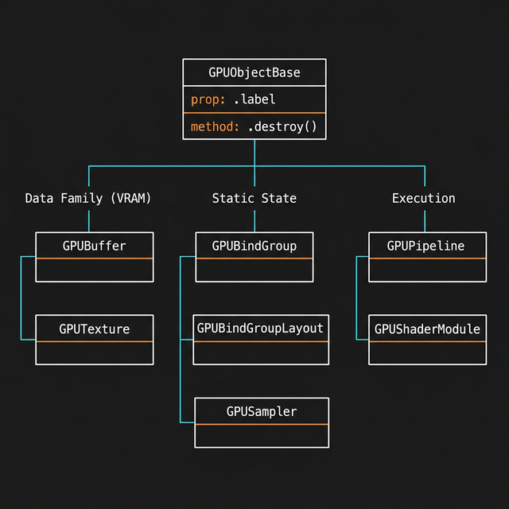

# 1.1 A Arquitetura Interna: `GPUObjectBase` e o Ciclo de Vida

Diferente do WebGL, onde os recursos eram representados por simples "inteiros numéricos" soltos (handles) gerenciados globalmente, a WebGPU foi desenhada sob rígidos princípios de Engenharia de Software Orientada a Objetos.

Todos os recursos lógicos criados pelo `GPUDevice` (com raras exceções como o próprio Device e Adapter) herdam de uma interface fundamental e raiz da especificação W3C chamada **`GPUObjectBase`**.



## A Interface `GPUObjectBase`

Se você instanciar um `GPUBuffer`, uma `GPUTexture`, um `GPUSampler`, um `GPUBindGroup` ou um `GPURenderPipeline`, todos eles compartilham uma linhagem comum. A interface `GPUObjectBase` dita duas regras de infraestrutura cruciais para desenvolvedores de Engines Gráficas:

### 1. Rastreabilidade (`label`)
Todos os objetos derivados possuem uma propriedade `.label` (uma string).
Esta é a maior dádiva para o *debugging* de aplicações complexas. Quando o driver da Placa de Vídeo trava devido a um erro de validação (por exemplo, tentar ler um buffer além do seu tamanho usando um offset errado), a mensagem de erro cuspirá exatamente o `label` que você cadastrou no momento da criação, ao invés de lançar um erro genérico indecifrável de vazamento de VRAM.

```javascript
// Exemplo de Injeção estrutural
const myMeshBuffer = device.createBuffer({
    label: "Buffer_Vertice_Baril_Lado_A", // Obrigatório em Boas Práticas!
    size: 1024,
    usage: GPUBufferUsage.VERTEX
});

console.log(myMeshBuffer.label); // "Buffer_Vertice_Baril_Lado_A"
```

### 2. Destruição Determinística (`destroy()`)
A maioria dos objetos WebGPU expõe explicitamente o método `.destroy()`.
Arquiteturas de CPU (como o V8 do Node/Chrome) usam *Garbage Collectors* que rodam quando a aba bem entende. Porém, a memória VRAM da Placa de Vídeo é um recurso preciosíssimo e escasso.

Se você deletar a referência Javascript de um buffer gigante de 50MB que continha milhares de vértices paramétricos:
```javascript
let matrizPesada = device.createBuffer({ ... });
matrizPesada = null; // Prática RUIM na WebGPU!
```
O *Garbage Collector* javascript pode demorar minutos para rodar e limpar isso. Enquanto isso, a VRAM física da Placa de Vídeo continuará ocupada com "Lixo Órfão" ($Memory Leak$).

A herança arquitetural do WebGPU obriga a Engine a gerenciar o próprio lixo físico antes de perder a referência do ponteiro:
```javascript
matrizPesada.destroy(); // Libera IMEDIATAMENTE os transistores de VRAM na Placa de Vídeo!
matrizPesada = null; 
```

## A Árvore de Cidadãos de Primeira Classe

Compreender o `GPUObjectBase` é o segredo para construir as Camadas Base (Layer 1) de qualquer Engine. A especificação divide essa linhagem nas seguintes grandes famílias estruturais alocáveis:

1.  **A Família de Dados (VRAM Física)**
    *   `GPUBuffer`: O tijolo primitivo. Array de bytes brutos sem formato.
    *   `GPUTexture`: Matrizes dimensionais indexadas por eixos (1D, 2D, 3D) prontas para Anti-aliasing (MSAA) e Mipmaps.
2.  **A Família de Estado Estático (Binding & Layout)**
    *   `GPUSampler`: Configuração leve de "como ler" uma textura (Filtro Linear, Nearest, etc).
    *   `GPUBindGroupLayout`: A planta-baixa (O 'Tipo' em TypeScript) indicando quais recursos o Shader pedirá.
    *   `GPUBindGroup`: A Instância materializada de uma "Planta-Baixa", segurando referências diretas para Buffers e Texturas.
    *   `GPUPipelineLayout`: O mapeamento mestre unindo múltiplos `BindGroupLayouts`.
3.  **A Família de Execução (Computação e Renderização)**
    *   `GPUShaderModule`: Código puro da linguagem WGSL traduzido.
    *   `GPUComputePipeline` / `GPURenderPipeline`: Os colossos de processamento. Estruturas imutáveis gigantescas que compilaram o ShaderModule contra o PipelineLayout e o Estado da Tela.
4.  **A Família de Gravação e Medição**
    *   `GPUCommandEncoder` / Pass Encoders: Passivos e temporários, gravam a lista de comandos que a GPU executará após o `submit()`. Tornam-se inválidos após o `finish()`.
    *   `GPURenderBundle`: Pacote imutável de comandos de render pré-gravados, reutilizável em múltiplos frames via `executeBundles()`.
    *   `GPUQuerySet`: O cronômetro direto no silício da placa gráfica (Timestamp/Occlusion).

As engines profissionais (como construímos com o `BufferManager` e `PipelineManager` na Fase 1) nada mais são do que encapsuladores TypeScript que impedem programadores de vazarem essas pontas do `GPUObjectBase`!

[Módulo 1: Fundamentos ⬅](./01_Fundamentos_e_Inicializacao.md) | [Módulo 2: Buffers ➡](./02_Buffer_e_Layout_Memoria.md)
