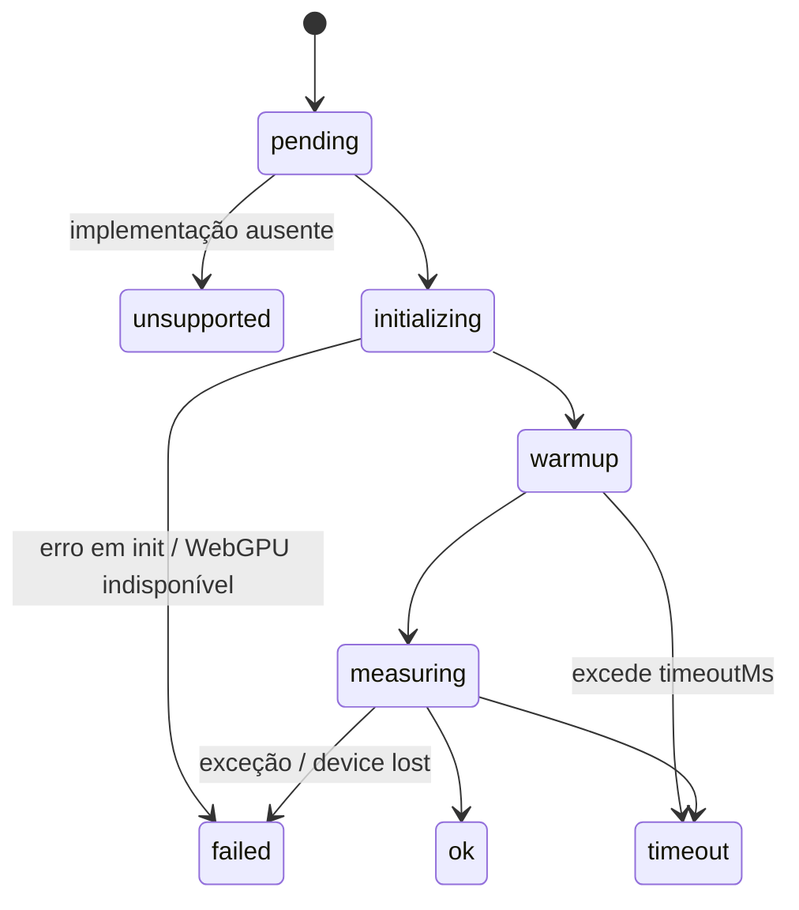

# Data Model — 002 Harness de Benchmark

Entidades da spec (Key Entities) refinadas com campos, validações e transições. Tipos TypeScript completos em
[contracts/scene-api.md](./contracts/scene-api.md), [contracts/results-schema.md](./contracts/results-schema.md) e
[contracts/frame-stats-api.md](./contracts/frame-stats-api.md).

---

## Motor (lib) — observabilidade de quadro (FR-007a)

### FrameStats

| Campo        | Tipo                 | Regra                                                                                                                                                        |
| ------------ | -------------------- | ------------------------------------------------------------------------------------------------------------------------------------------------------------ |
| `drawCalls`  | inteiro ≥ 0          | soma de `draw`, `drawIndexed`, `drawIndirect`, `drawIndexedIndirect` e draws gravados em bundles executados no quadro                                        |
| `dispatches` | inteiro ≥ 0          | soma de `dispatchWorkgroups` + `dispatchWorkgroupsIndirect`                                                                                                  |
| `passes`     | inteiro ≥ 0          | passes render + compute abertos no quadro                                                                                                                    |
| `gpuTimeMs`  | número ≥ 0, opcional | ausente se profiling desligado, sem `timestamp-query`, estouro de capacidade ou sem leitura resolvida ainda; quando presente, refere-se ao quadro `gpuFrame` |
| `gpuFrame`   | inteiro, opcional    | índice do quadro a que `gpuTimeMs` pertence (defasagem 1–3 quadros)                                                                                          |

### FrameTimestampAllocator (interno C1, lógica pura)

- Estado por quadro: `next` (próximo índice livre), `capacity` (par), `overflowed`.
- `begin(frameIndex)` zera; `allocatePair()` → `{ first, last } | undefined` (undefined e `overflowed=true` quando
  `next + 2 > capacity`); `sumIntervals(ns: BigInt64Array, pairs)` → ms = Σ (last − first) / 1e6, ignorando pares
  com `last < first` (timestamp inválido) e retornando `undefined` se todos forem inválidos.

---

## Harness

### SceneDefinition

| Campo                  | Tipo                                                   | Regra                                                                                            |
| ---------------------- | ------------------------------------------------------ | ------------------------------------------------------------------------------------------------ |
| `id`                   | slug kebab-case                                        | único no catálogo                                                                                |
| `title`, `description` | texto                                                  | obrigatórios                                                                                     |
| `variants`             | `VariantDefinition[]` (≥ 1)                            | `id` único na cena; `params` livres (ex.: `{ count: 100000 }`, `{ count: 10000, moving: true }`) |
| `seed`                 | inteiro                                                | default 1337; mesma semente nas duas engines                                                     |
| `camera`               | `{ position, target, fovDeg }`                         | idêntica nas duas engines                                                                        |
| `implementations`      | `Record<EngineId, SceneImplementation \| Unsupported>` | toda engine registrada aparece: implementação ou `{ unsupported: motivo, until?: 'F3' }`         |
| `phase`                | `'F0' \| 'F1' …`                                       | fase do roadmap que introduziu a cena (rastreabilidade)                                          |

### EngineAdapter

| Campo/método     | Regra                                                                          |
| ---------------- | ------------------------------------------------------------------------------ |
| `id`             | `'clayflow' \| 'three'`                                                        |
| `version`        | string informada no perfil                                                     |
| `init(canvas)`   | cria renderer/app com resolução fixa; falha → resultado `failed`               |
| `capabilities()` | `{ gpuTiming: boolean; memory: 'exact' \| 'estimated' }`                       |
| `frame()`        | executa o trabalho síncrono do quadro e retorna `{ cpuMs, drawCalls, gpuMs? }` |
| `dispose()`      | libera recursos (a página é descartada de qualquer forma)                      |

### RunConfig

`warmupMs` (default 3000, e no mínimo 5 quadros), `windowMs` (10000), `repetitions` (3), `timeoutMs` (60000),
`resolution` (1280×720), filtros `scenes[]`, `variants[]`, `engines[]`, `quick` (1000/3000/1), `headless` (false),
`tolerance` (0.10), `port` (5180), `profiling` (true; `--no-profiling` mede o overhead — SC-005), `from?`.
Validação: inteiros positivos; `tolerance` em (0, 1).

### EnvironmentProfile

`profileId`, `gpu { vendor, architecture, device, description }`, `browser { name, version, major }`, `os`,
`resolution`, `devicePixelRatio`, `timestampQuery: boolean`, `versions { clayflow, three, rapier }`, `commit`,
`date`. `profileId` = slug + hash curto dos campos de hardware/navegador maior/OS/resolução (R10).

### Result

| Campo                        | Regra                                                   |
| ---------------------------- | ------------------------------------------------------- |
| `scene`, `variant`, `engine` | chave composta única por execução                       |
| `status`                     | `ok \| unsupported \| failed \| timeout`                |
| `reason`                     | obrigatório se `status ≠ ok`                            |
| `limitations`                | lista (pode ser vazia) vinda da implementação (FR-007b) |
| `metrics`                    | presente só se `ok` (ver Metrics)                       |
| `repetitions`                | métricas por repetição (para CV/diagnóstico)            |
| `unstable`                   | `true` se CV entre repetições > 5%                      |

### Metrics

`cpuMs` (mediana), `gpuMs` (mediana | `null` = indisponível — menos de `min(30, ⌈quadros/4⌉)` leituras), `frameMs { mean, p95, p99 }`, `fps` (=1000/mean),
`drawCalls` (mediana), `memoryBytes` + `memoryKind ('exact' | 'estimated')`, `samples { frames, gpu }`,
`vsyncLimited: boolean` (se o FPS ficar a ±2% de 60/120/144).

### Baseline

`profileId`, `createdAt`, `commit`, `results: Result[]` (somente `engine = 'clayflow'`), `tolerance` usada.

### RegressionReport

`profileId`, `baselineCommit`, `regressions[]`, `improvements[]`, `skipped[]` (métrica indisponível / sem
correspondência), `passed: boolean`. Cada item: `scene`, `variant`, `metric`, `baseline`, `current`, `deltaPct`.

### Transições de estado de um Result (por execução)

### Regras de comparação (gate)

| Baseline                        | Atual                         | Efeito                                                   |
| ------------------------------- | ----------------------------- | -------------------------------------------------------- |
| `ok`                            | `ok`, métrica de tempo +>10%  | **regressão**                                            |
| `ok`                            | `ok`, métrica −>10%           | melhoria (destacada)                                     |
| `ok`                            | `failed` / `timeout`          | **regressão**                                            |
| `failed` / `timeout`            | `ok`                          | melhoria                                                 |
| qualquer                        | `unsupported` ↔ `unsupported` | ignorado                                                 |
| métrica `null` em um dos lados  | —                             | `skipped` com aviso                                      |
| sem baseline para o `profileId` | —                             | erro orientando `bench:baseline` (não passa por omissão) |
