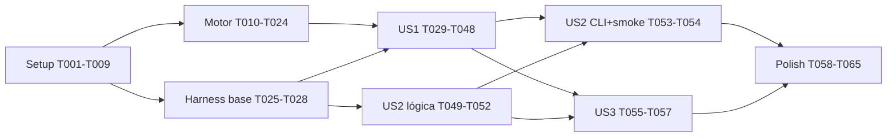

# Tasks: Harness de Benchmark Comparativo (clayflow vs Three.js)

**Feature**: `002-benchmark-harness` | **Branch**: `feature/002-benchmark-harness`
**Pré-requisito**: spec `003-reactive-transforms` concluída e integrada em `develop` (as cenas posicionam objetos só por posição/rotação/escala).
**Input**: plan.md, spec.md, research.md (R1–R12), data-model.md, contracts/ (frame-stats-api, scene-api, cli,
results-schema), quickstart.md

## Format: `[ID] [P?] [Story?] Description with file path`

- **[P]**: paralelizável (arquivos distintos, sem dependência pendente).
- **[USx]**: tarefa de fase de user story.
- Testes Vitest CPU-side são exigidos (Constituição V; plan "Testing"): toda lógica pura nova do motor e do
  harness tem teste. A medição real é validada pelo próprio `npm run bench` em navegador (gate local).

## Path Conventions

- Motor: `src/` — mudanças **só** de observabilidade (FR-007a). Testes em `src/**/__tests__/`.
- Harness: `bench/` na raiz, fora da lib. Lógica pura em `bench/core/` (testes em `bench/core/__tests__/`);
  navegador em `bench/page/`, `bench/engines/`, `bench/scenes/`; Node em `bench/runner/`.
- Lado clayflow do harness importa **apenas** `clayflow` (alias → `src/index.ts`); nunca `src/**` (FR-016).
- Docs: `clay-engine-doc/docs/guides/`.

---

## Phase 1: Setup (Shared Infrastructure)

- [ ] T001 Instalar devDependencies fixadas em `package.json`: `three@0.186.1`, `@types/three@0.186.0`, `@dimforge/rapier3d-compat@~0.21.0`, `playwright@~1.63.0` (com `PLAYWRIGHT_SKIP_BROWSER_DOWNLOAD=1` — usa o Chrome instalado), `tsx`, e `@types/node` se ausente; confirmar que `dependencies` continua só `uuid`
- [ ] T002 Adicionar scripts em `package.json`: `bench` (`tsx bench/runner/cli.ts run`), `bench:check` (`tsx bench/runner/cli.ts check`), `bench:baseline` (`tsx bench/runner/cli.ts baseline`), `typecheck:bench` (`tsc -p bench/tsconfig.json --noEmit`); `lint`/`lint:fix` → `eslint src bench`; `format`/`format:check` incluem `"bench/**/*.{ts,json,md}"`
- [ ] T003 [P] Criar `bench/tsconfig.json` (estende `../tsconfig.json`; `types: ["@webgpu/types", "node"]`; `paths: { "clayflow": ["../src/index.ts"] }`; `include: ["**/*.ts"]`; `exclude: ["results/**"]`)
- [ ] T004 [P] Criar `bench/vite.config.ts` (root `bench/`, `resolve.alias.clayflow → ../src/index.ts`, `server.port` 5180 com `strictPort`, `optimizeDeps.exclude: ['@dimforge/rapier3d-compat']` se necessário)
- [ ] T005 [P] Adicionar bloco `bench/**/*.ts` em `eslint.config.js`: `parserOptions.project: './bench/tsconfig.json'` e `no-restricted-imports` com padrões `**/src/**`, `../src/**`, `../../src/**` (mensagem: "use o alias `clayflow` — FR-016")
- [ ] T006 [P] Atualizar `knip.json`: entries `bench/runner/cli.ts`, `bench/page/main.ts`, `bench/vite.config.ts`, `bench/**/__tests__/**/*.ts`; project `bench/**/*.ts`; ignore `bench/results/**`
- [ ] T007 [P] Atualizar `vitest.config.ts`: `include` acrescenta `bench/**/__tests__/**/*.test.ts` (sem alterar thresholds de coverage de `src/`)
- [ ] T008 [P] Acrescentar `bench/results/**` em `.gitignore`
- [ ] T009 Criar o esqueleto: `bench/index.html` (canvas `#bench-canvas` 1280×720 fixo, CSS sem margem, `<script type="module" src="/page/main.ts">`), `bench/baselines/.gitkeep`, `bench/README.md` (2 linhas apontando para o guia); rodar `npm run lint`, `npm run typecheck:bench` e `npm run check:dead` para validar a configuração

**Checkpoint**: tooling aceita `bench/`; gate atual continua verde.

---

## Phase 2: Foundational (Blocking Prerequisites)

**Bloqueia todas as user stories.** Duas frentes independentes: (A) observabilidade de quadro do motor
(FR-007a, contrato `contracts/frame-stats-api.md`) e (B) contratos e lógica pura base do harness.

### A — Observabilidade de quadro no motor (FR-007a)

- [ ] T010 [P] Criar `src/core/contracts/FrameStats.ts` (interface `FrameStats { drawCalls; dispatches; passes; gpuTimeMs?; gpuFrame? }` com JSDoc do contrato); exportar em `src/core/contracts/index.ts` e como `export type` em `src/index.ts`
- [ ] T011 [P] Teste `src/core/gpu/profiler/__tests__/FrameTimestampAllocator.test.ts`: pares sequenciais `{first,last}`; estouro (`next + 2 > capacity`) → `undefined` e `overflowed = true`; `begin(frameIndex)` zera; `sumIntervals` soma `(last − first)/1e6`, ignora pares com `last < first`, retorna `undefined` se todos inválidos ou lista vazia
- [ ] T012 Implementar `src/core/gpu/profiler/FrameTimestampAllocator.ts` (lógica pura, sem tipos WebGPU) até T011 passar
- [ ] T013 [P] Teste `src/core/gpu/__tests__/GpuContext.test.ts` com `navigator.gpu` mockado: adaptador com `features.has('timestamp-query') === true` ⇒ `requestDevice` recebe `requiredFeatures` contendo `'timestamp-query'`; sem a feature ⇒ `requiredFeatures` vazio/ausente; sem `navigator.gpu` ⇒ erro atual preservado
- [ ] T014 Alterar `createGpuContext` em `src/core/gpu/GpuContext.ts` para solicitar `'timestamp-query'` quando o adaptador oferecer (mudança mínima — `powerPreference`/limites ficam para a spec 004) até T013 passar
- [ ] T015 [P] Teste `src/core/gpu/passes/__tests__/passCounters.test.ts` com encoders mockados: `draw`, `drawIndexed`, `drawIndirect`, `drawIndexedIndirect` incrementam `drawCalls`; `executeBundles` soma os draws gravados em cada bundle; `dispatchWorkgroups`/`dispatchWorkgroupsIndirect` incrementam `dispatches`
- [ ] T016 Criar contador por quadro (objeto `FrameCounters { drawCalls; dispatches; passes; reset() }` interno a C1, em `src/core/gpu/GpuFrame.ts` ou arquivo vizinho) e instrumentar `src/core/gpu/passes/GpuRenderPass.ts`, `src/core/gpu/passes/GpuBundleRenderPass.ts` (guarda nº de draws gravados no bundle finalizado) e `src/core/gpu/passes/GpuComputePass.ts` até T015 passar
- [ ] T017 Em `src/core/gpu/GpuFrame.ts`: zerar contadores na abertura do quadro, incrementar `passes` em cada `beginRenderPass`/`beginComputePass`; com profiling ligado, injetar `timestampWrites` de um par do `FrameTimestampAllocator` em todo passe sem `timestampWrites` explícito e registrar o par (passes com timestamps explícitos, ex. `ForwardFlow.setProfileTimestamps`, são respeitados e também somados)
- [ ] T018 Em `src/core/gpu/profiler/GpuProfilerSystem.ts`: QuerySet com capacidade configurável (default 256), `resolveQuerySet` + cópia para staging ao fim do quadro, readback assíncrono sem bloquear (pula quadro se o staging anterior ainda estiver mapeando), soma via `FrameTimestampAllocator.sumIntervals`, guarda `{ gpuTimeMs, gpuFrame }` e intervalos por rótulo de passe; estouro → `gpuTimeMs` ausente no quadro + `console.warn` único sugerindo `profilingCapacity`; `submit` sem passes medidos (ex.: `pool_grow:*` da spec 003) não resolve QuerySet nem substitui a última leitura
- [ ] T019 Adicionar `setFrameProfiling(enabled: boolean, capacity?: number): void` e `lastFrameStats(): FrameStats` ao contrato `src/core/contracts/EngineCore.ts` e implementar em `src/core/gpu/GpuEngineCore.ts` (no-op com aviso único sem `timestamp-query`); teste `src/core/gpu/__tests__/GpuEngineCore.frameStats.test.ts` (estatísticas zeradas antes do 1º quadro; contadores refletem o quadro submetido; `gpuTimeMs` ausente com profiling desligado)
- [ ] T020 Atualizar todos os dublês de `EngineCore` existentes (buscar `EngineCore` em `src/**/__tests__/**` e `src/__smokes__/**` — incluindo os da spec 003: `src/scene/__tests__/helpers/fakeSceneCore.ts`, `src/scene/__tests__/helpers/fakeResourceCore.ts` e `src/presentation/flows/__tests__/helpers/renderHarness.ts`) para implementar os dois métodos novos, mantendo `tsc --noEmit` verde
- [ ] T021 Adicionar `readonly stats: FrameStats` a `src/scene/events/FrameCompleteEvent.ts` e anexar `core.lastFrameStats()` no `emit('frameComplete', …)` de `src/scene/systems/ExecutionSystem.ts`; mover o início da medição de `dt` para antes de `emit('frameRecording', …)` (o envio da fila de sujos da spec 003 é CPU do quadro) e atualizar o JSDoc de `dt`; teste `src/scene/__tests__/ExecutionSystem.frameStats.test.ts` (payload carrega `stats` do core; `dt` inclui a espera sintética de um ouvinte de `frameRecording`; uma gravação auxiliar `pool_grow:*` entre quadros não altera o `stats` do quadro seguinte)
- [ ] T022 Adicionar `profiling?: boolean` e `profilingCapacity?: number` (JSDoc do contrato) a `ApplicationOptions` em `src/presentation/app/Application.ts`, chamando `core.setFrameProfiling(true, capacity)` na criação quando ligado; teste `src/presentation/app/__tests__/Application.profiling.test.ts` (ligado chama com capacidade; omitido não chama)
- [ ] T023 Fazer `src/presentation/flows/DebugFlow.ts` preencher `profilerStats.stagesNs` com `rótulo do passe → ns` a partir dos intervalos do profiler (hoje sempre `{}`); teste `src/presentation/flows/__tests__/DebugFlow.stagesNs.test.ts`
- [ ] T024 Verificar a frente A: `npm run lint && npx tsc --noEmit && npm run test && npm run check:circular && npm run check:dead`; smoke manual em `npm run dev` (Chrome) confirmando `frameComplete.stats.gpuTimeMs` preenchido com `profiling: true` em máquina com `timestamp-query`

### B — Contratos e lógica pura base do harness

- [ ] T025 Criar `bench/core/types.ts` com todos os tipos de `contracts/scene-api.md` (`EngineId`, `CameraSpec`, `VariantDefinition`, `Unsupported`, `SceneContext`, `SceneImplementation` com `limitations?`, `SceneDefinition`, `FrameSample`, `EngineAdapter`) e de `contracts/results-schema.md` (`RunFile`, `EnvironmentProfile`, `ResultStatus`, `Metrics`, `Result` com `limitations?`, `BaselineFile`, `RunConfig`, `RegressionReport`), mais o protocolo página→runner `PageResult` publicado em `window.__benchResult`
- [ ] T026 [P] `bench/core/rng.ts`: `mulberry32(seed)` e geradores compartilhados de layout (`gridScatter(rng, count, extent)` → posições/escala/cor; `heightJitter`), usados pelas duas engines; teste `bench/core/__tests__/rng.test.ts` (mesma semente ⇒ mesma sequência; sementes diferentes divergem; valores em [0,1); layout determinístico)
- [ ] T027 [P] `bench/core/stats.ts`: `median`, `percentile(p)` (interpolação linear), `mean`, `coefficientOfVariation`, `aggregateRepetitions(reps) → Metrics` (mediana das medianas; `gpuMs` = `null` com < 30 amostras; `vsyncLimited` se FPS a ±2% de 60/120/144; `unstable` se CV > 5%); teste `bench/core/__tests__/stats.test.ts`
- [ ] T028 [P] `bench/core/profile.ts`: `buildProfile(raw) → EnvironmentProfile` e `profileId` = slug legível (`vendor-device-chromeNNN-os-WxH`) + hash curto estável dos campos de hardware/navegador maior/OS/resolução (R10); teste `bench/core/__tests__/profile.test.ts` (versão menor do Chrome não muda o id; resolução muda; slug só `[a-z0-9-]`)

**Checkpoint**: motor expõe `FrameStats` pela API pública; harness tem contratos e estatística testados.

---

## Phase 3: User Story 1 — Rodar o benchmark comparativo e obter um relatório (Priority: P1) 🎯 MVP

**Goal**: `npm run bench` executa as 5 cenas × variantes × 2 engines em páginas isoladas e gera
`bench/results/latest.json` + `latest.md` (Acceptance 1–4; FR-001–FR-010, FR-007b, FR-016–FR-018).

**Independent test**: `npm run bench -- --quick` numa máquina com Chrome + WebGPU termina com as 5 cenas
reportadas, incluindo "não suportado" para `point-lights` e `skinned-characters` no clayflow, limitações
declaradas e perfil de ambiente; `--scene instances --engine clayflow` roda só o subconjunto.

### Lógica pura (testada)

- [ ] T029 [P] [US1] `bench/core/args.ts`: parse das flags de `contracts/cli.md` (`--scene`, `--variant`, `--engine`, `--quick`, `--warmup`, `--window`, `--reps`, `--timeout`, `--headless`, `--tolerance`, `--from`, `--port`) → `RunConfig` com defaults R5 e preset `--quick` (1000/3000/1); validação (inteiros positivos, tolerância em (0,1), engine conhecida) com mensagens claras; teste `bench/core/__tests__/args.test.ts`
- [ ] T030 [P] [US1] `bench/core/plan.ts`: `planRuns(catalog, config) → RunSpec[]` (produto cena × variante × engine × repetição respeitando filtros; implementação `Unsupported` gera um único `Result` `unsupported` com `reason`/`until`, sem abrir página; filtro sem correspondência ⇒ erro listando ids válidos); teste `bench/core/__tests__/plan.test.ts`
- [ ] T031 [P] [US1] `bench/core/report.ts`: `toRunFile(...)` e `toMarkdown(runFile)` no formato de `contracts/results-schema.md` (cabeçalho de perfil; colunas clay / three / × por métrica; `n/d` para GPU indisponível, nunca 0; `*` memória estimada; ⚠ instável; nota "limitado pela vsync"; estados não suportado/falhou/tempo esgotado com motivo; resumo mais rápido / equivalente ±10% / mais lento por cena — SC-006; seção "Limitações conhecidas do motor" — FR-007b); teste `bench/core/__tests__/report.test.ts` com RunFile sintético
- [ ] T032 [P] [US1] `bench/page/sampler.ts`: `FrameSampler` com relógio injetável — descarta aquecimento, coleta intervalos entre rAFs, `cpuMs`, `drawCalls`, `gpuMs` (quando presentes) durante a janela, sinaliza fim e timeout; teste `bench/core/__tests__/sampler.test.ts` com relógio falso (amostras do aquecimento descartadas; janela respeitada; timeout dispara)

### Página e adaptadores

- [ ] T033 [US1] `bench/engines/clayflow.ts`: `EngineAdapter` clayflow só via `clayflow` — `Application.create({ canvas, profiling: true })`, câmera da `CameraSpec`, resolução fixa e DPR 1; `frame()` dirige um quadro e lê `cpuMs` = `frameComplete.dt`, `drawCalls`/`gpuMs` = `frameComplete.stats`; `memoryBytes` = `core.memoryUsage().totalBytes` (`memory: 'exact'`); `capabilities().gpuTiming` conforme `stats.gpuTimeMs` aparecer; não chama `app.start()`: dispara cada quadro com `app.events.emit('frameTick', { dt, elapsed })` (síncrono, executa o `ExecutionSystem`; `Time` não é atualizado nesse caminho, então as cenas não dependem dele) e lê o `frameComplete` correspondente — o motor não tem `step()` até a F1; `scene.update?(dt)` roda **antes** do `frameTick`, para que as mutações de `data` entrem na fila e sejam enviadas no mesmo quadro (spec 003)
- [ ] T034 [P] [US1] `bench/engines/three.ts`: `EngineAdapter` Three — `WebGPURenderer({ antialias: false, trackTimestamp: true })` + `await renderer.init()`, `setPixelRatio(1)`, `setSize(1280,720)`, `PerspectiveCamera` da `CameraSpec`, luz direcional equivalente à default do clayflow; `frame()` mede `performance.now()` em volta de `scene.update?(dt)` + `renderer.render()`, lê `info.render.drawCalls`, chama `resolveTimestampsAsync('render')`/`('compute')` e usa `info.render.timestamp` (+compute) como `gpuMs`; `memoryBytes` estimado
- [ ] T035 [P] [US1] `bench/engines/threeMemory.ts`: `estimateThreeMemory(scene)` = Σ `byteLength` de atributos/índices únicos + texturas (largura×altura×4×mips), contando `InstancedMesh.instanceMatrix`; teste `bench/core/__tests__/threeMemory.test.ts` com objetos sintéticos (geometria compartilhada contada uma vez)
- [ ] T036 [US1] `bench/page/main.ts`: lê `?scene=&variant=&engine=&seed=&warmup=&window=&timeout=`, verifica `navigator.gpu` (falha → `PageResult` `failed` "WebGPU indisponível neste navegador"), carrega a implementação lazy do catálogo, monta adaptador + cena com `mulberry32(seed)`, roda o `FrameSampler`, captura exceções/`device lost` (→ `failed`), timeout (→ `timeout`), coleta `adapter.info` para o perfil, publica `window.__benchResult`

### Cenas (cada pasta: `scene.ts` com a `SceneDefinition`, implementações lazy por engine)

- [ ] T037 [P] [US1] `bench/scenes/instances/{scene.ts,clayflow.ts,three.ts}`: variantes `10k`/`100k`/`1m` (`count`), layout `gridScatter`; mais `10k-moving` (`{ count: 10000, moving: true }`); clayflow = N entidades `BoxGeometry` + `StandardMaterial` + `Transform` (só `position`/`rotation`/`scale`; a matriz de mundo é do `TransformFlow`, spec 003) — recurso compartilhado entre entidades não é suportado —, `limitations: ['sem instancing no render: 1 draw e 4 bind groups por objeto (até F2)', 'render LDR 8 bits, sem MSAA (até F4)']`, e em `10k-moving` `update(dt)` muta `transform.data.position`/`rotation` de todas as entidades (função determinística do índice e do tempo acumulado), com a limitação extra `'um envio por objeto alterado, sem agrupamento (até F2)'`; three = um `InstancedMesh` com `MeshStandardMaterial`, e em `10k-moving` o mesmo movimento via `setMatrixAt` + `instanceMatrix.needsUpdate`
- [ ] T038 [P] [US1] `bench/scenes/unique-objects/{scene.ts,clayflow.ts,three.ts}`: variante `1k`; 1k geometrias com parâmetros distintos (dimensões/segmentos via `rng`) e materiais distintos; clayflow com `StandardMaterial` por objeto; three com `Mesh` + `MeshStandardMaterial` por objeto
- [ ] T039 [P] [US1] `bench/scenes/point-lights/{scene.ts,three.ts}`: variante `256`; three = plano + 200 objetos + 256 `PointLight` (cores/posições via `rng`); clayflow = `{ unsupported: 'o forward ignora PointLight', until: 'F4' }`
- [ ] T040 [P] [US1] `bench/scenes/skinned-characters/character.ts`: humanoide procedural (~3k vértices de cápsulas fundidas, `skinIndex`/`skinWeight`), esqueleto de 20 ossos e `AnimationClip` de caminhada sintético (quaternions senoidais) — determinístico, sem assets (R9)
- [ ] T041 [US1] `bench/scenes/skinned-characters/{scene.ts,three.ts}`: variante `500`; three = 500 `SkinnedMesh` de `character.ts` com `AnimationMixer` e fase aleatória (`rng`), `update(dt)` avança os mixers; clayflow = `{ unsupported: 'sem skinning/animação', until: 'F8' }`
- [ ] T042 [P] [US1] `bench/scenes/rigid-bodies/{scene.ts,clayflow.ts,three.ts}`: variantes `1k` e `10k` (`count`); esferas soltas sobre chão estático (posições iniciais via `rng`, passo 1/60); clayflow = `RigidBody` pela fachada de domínio da spec 001 (a pose chega à tela pelo `Transform`: readback → `position`/`rotation` → `TransformFlow`, spec 003), `limitations: ['readback de todos os corpos para a CPU por quadro, pose publicada fora do quadro e com 1 quadro de atraso (até F2)', 'solver LCP em uma thread e narrowphase O(N·M) (até F5)', 'sem instancing no render (até F2)']` — `10k` deve terminar em `timeout`, registrado como linha de base; three = Rapier (`await RAPIER.init()`, `world.step()` em `update`) + render `InstancedMesh` sincronizado das translações/rotações
- [ ] T043 [US1] `bench/core/catalog.ts`: registra as 5 `SceneDefinition` (`instances`, `unique-objects`, `point-lights`, `skinned-characters`, `rigid-bodies`) com `phase: 'F0'`, `seed: 1337` e câmeras idênticas por engine

### Runner (Node)

- [ ] T044 [P] [US1] `bench/runner/server.ts`: `createServer({ configFile: 'bench/vite.config.ts' })`, `listen(port)`, URL base, `close()`
- [ ] T045 [P] [US1] `bench/runner/browser.ts`: `chromium.launch({ channel: 'chrome', headless, args: ['--enable-unsafe-webgpu', '--disable-gpu-vsync', '--disable-frame-rate-limit'] })`; Chrome ausente → erro de ambiente (exit 3) com instrução; detecta adaptador de software (SwiftShader) via `PageResult` e avisa (erro em `check`/`baseline`)
- [ ] T046 [US1] `bench/runner/orchestrate.ts`: para cada `RunSpec` de `planRuns`, abre **página nova**, navega com a query, `waitForFunction(() => window.__benchResult)` com `timeoutMs`, repassa logs de console, fecha a página; agrega repetições com `aggregateRepetitions`; um erro numa execução vira `failed`/`timeout` e o loop segue (FR-010); progresso no terminal
- [ ] T047 [US1] `bench/runner/cli.ts` subcomando `run`: `parseArgs` → servidor → navegador → `orchestrate` → `buildProfile` (versões de `package.json`, `git rev-parse --short HEAD`, data) → grava `bench/results/<data>-<profileId>.json`, `latest.json`, `latest.md` e imprime o markdown; WebGPU indisponível na 1ª página → exit 3 sem relatório parcial; sempre fecha navegador e servidor
- [ ] T048 [US1] Smoke real: `npm run bench -- --quick` termina em < 3 min com as 5 cenas, "não suportado" nas duas cenas esperadas, limitações e GPU do clayflow preenchida (com `timestamp-query`); `npm run bench -- --scene instances --engine clayflow --variant 10k` roda só o subconjunto; anotar no PR os números obtidos

**Checkpoint**: relatório comparativo reproduzível — MVP entregue.

---

## Phase 4: User Story 2 — Detectar regressão contra baseline versionado (Priority: P2)

**Goal**: `bench:baseline` grava o baseline do perfil; `bench:check` reprova regressões > 10% do clayflow
(Acceptance 1–4; FR-011–FR-014; SC-003).

**Independent test**: gravar baseline, inserir espera artificial de +15% numa cena clayflow, `bench:check`
termina com exit 1 listando cena/variante/métrica/valores/%; removida a espera, passa com exit 0.

- [ ] T049 [P] [US2] `bench/core/baseline.ts`: `toBaseline(runFile, tolerance) → BaselineFile` (só `engine === 'clayflow'`), `parseBaseline(json)` com validação de `schemaVersion` e erro legível, `baselinePath(profileId)`; teste `bench/core/__tests__/baseline.test.ts`
- [ ] T050 [P] [US2] `bench/core/compare.ts`: `compare(baseline, current, tolerance) → RegressionReport` seguindo a tabela "Regras de comparação" de `data-model.md` — métricas `cpuMs`, `gpuMs`, `frameMs.p95`, `frameMs.p99`; `ok→failed/timeout` é regressão; `failed→ok` é melhoria; `unsupported↔unsupported` ignorado; métrica `null` em um lado → `skipped`; Three nunca avaliado (FR-013)
- [ ] T051 [US2] Teste `bench/core/__tests__/compare.test.ts`: degradação sintética de exatamente +15% em cada métrica de tempo detectada em 100% dos casos (SC-003); execução idêntica passa; +9% passa; −12% vira melhoria; transições de status; `skipped` com `null`; resultados Three ignorados; tolerância customizada
- [ ] T052 [US2] `bench/core/report.ts`: `regressionToMarkdown(report)` (tabela de regressões e melhorias com cena, variante, métrica, baseline, atual, Δ%, e sugestão de `npm run bench:baseline` quando houver melhorias > 10%); estender `bench/core/__tests__/report.test.ts`
- [ ] T053 [US2] `bench/runner/cli.ts` subcomandos `baseline` (executa e grava `bench/baselines/<profileId>.json`) e `check` (executa ou lê `--from`; sem baseline do perfil → exit 2 com mensagem orientando `bench:baseline` e listando perfis existentes; perfil diferente nunca é comparado — Acceptance 4; regressão → exit 1; ok → exit 0); adaptador de software → erro nesses dois subcomandos
- [ ] T054 [US2] Smoke do gate: `npm run bench:baseline -- --quick`, depois `busyWait` temporário de +15% em `bench/scenes/instances/clayflow.ts` → `npm run bench:check -- --quick` exit 1; remover → exit 0; `npm run bench:check -- --from bench/results/latest.json` funciona sem reexecutar; descartar o baseline de teste

**Checkpoint**: gate de regressão local funcional.

---

## Phase 5: User Story 3 — Adicionar cena com pouca cerimônia (Priority: P3)

**Goal**: nova cena = arquivos da cena + 1 linha no catálogo; zero mudança em executor, métricas, relatório ou
baseline (Acceptance 1–2; FR-015; SC-004).

**Independent test**: o teste de catálogo registra uma cena sintética só por definição e ela aparece em
`planRuns`, no relatório e no baseline; uma cena implementada só para uma engine mostra a outra como "não
suportado" sem erro.

- [ ] T055 [P] [US3] `bench/core/catalog.ts`: `validateCatalog(scenes)` executado ao carregar (ids kebab-case únicos; ≥ 1 variante com ids únicos; toda `EngineId` presente como implementação ou `Unsupported` com motivo não vazio; `phase` e `seed` presentes) com erros apontando a cena; teste `bench/core/__tests__/catalog.test.ts` cobrindo as 5 cenas reais e casos inválidos
- [ ] T056 [US3] Teste de extensibilidade `bench/core/__tests__/extensibility.test.ts` (SC-004): uma `SceneDefinition` fictícia definida só no teste, implementada para uma única engine, passa por `validateCatalog` → `planRuns` → `toMarkdown` → `toBaseline`/`compare` sem nenhuma alteração nesses módulos, e a outra engine aparece como "não suportado"
- [ ] T057 [US3] Documentar no topo de `bench/core/catalog.ts` (JSDoc) o passo a passo de adicionar uma cena (espelha `quickstart.md` §5)

**Checkpoint**: harness pronto para acompanhar F1→F10.

---

## Phase 6: Polish & Cross-Cutting Concerns

- [ ] T058 [P] Guia `clay-engine-doc/docs/guides/benchmark.md` (FR-019): pré-requisitos, rodar (`--quick`, filtros), ler o relatório (×, n/d, ⚠, vsync, limitações), gravar/atualizar baseline, gate local, adicionar cena, e a API de observabilidade (`profiling: true`, `frameComplete.stats`, defasagem de `gpuTimeMs`)
- [ ] T059 [P] Atualizar `clay-engine-doc/docs/guides/dev_workflow.md`: benchmark (`bench:check`) e `typecheck:bench` no gate local para mudanças em renderização/física (CI sem GPU — FR-014); e `clay-engine-doc/docs/guides/09_Compute_Pass_e_Queries.md` com a seção de profiling por quadro (timestamps automáticos, capacidade, estouro)
- [ ] T060 JSDoc em todos os exports novos da lib (`FrameStats`, `setFrameProfiling`, `lastFrameStats`, `profiling`, `profilingCapacity`, `stats`); `npm run doc:coverage` verde; `npm run doc` regenerado
- [ ] T061 Verificar SC-005: `npm pack --dry-run` não lista nada de `bench/`; `dependencies` só `uuid`; `grep` em `dist/` sem `three`/`rapier`; overhead da observabilidade — comparar `cpuMs` de `instances/10k` clayflow com `profiling` ligado vs desligado (parâmetro de query `profiling=0` aceito por `bench/page/main.ts` e `bench/engines/clayflow.ts`), diferença ≤ 2%; registrar no PR
- [ ] T062 Verificar SC-002 e SC-007: duas execuções completas consecutivas (`npm run bench`) com medianas por cena diferindo ≤ 5% e duração ≤ 15 min; `--quick` ≤ 3 min; registrar no PR
- [ ] T063 Gravar e commitar o baseline da máquina de referência (`npm run bench:baseline` → `bench/baselines/<profileId>.json`) e anexar o `latest.md` do primeiro relatório completo ao PR como linha de base declarada da F1/F2 (SC-006)
- [ ] T064 Atualizar `specs/ROADMAP.md` (F0 marcada como entregue, com link para o relatório no PR) e o `Status` de `specs/002-benchmark-harness/spec.md`
- [ ] T065 Gate completo verde: `npm run lint && npm run format:check && npm run check:circular && npm run check:dead && npx tsc --noEmit && npm run typecheck:bench && npm run test:coverage && npm run doc:coverage && npm run build:lib`

---

## Dependencies & Execution Order

### Phase dependencies

- **Setup (Phase 1)** → sem dependências.
- **Foundational (Phase 2)** → depende do Setup; **bloqueia todas as user stories**. Frentes A (motor) e B
  (harness) são independentes entre si.
- **US1 (Phase 3)** → depende de A e B (o adaptador clayflow precisa de `frameComplete.stats`).
- **US2 (Phase 4)** → lógica (T049–T052) depende só de B; CLI e smoke (T053–T054) dependem de US1 (precisam de
  execuções reais).
- **US3 (Phase 5)** → depende de T030/T031/T043 (US1) e T049/T050 (US2) para o teste de extensibilidade.
- **Polish (Phase 6)** → depende de todas as stories.

### Within phases

- Teste antes da implementação quando listados em par (T011→T012, T013→T014, T015→T016).
- T016 → T017 → T018 → T019 → (T020, T021) → T022 → T023 → T024.
- T040 → T041. Cenas (T037–T042) → T043 → T046 → T047 → T048.
- T050 → T051; T052 depende de T031.

### Story completion order



## Parallel Opportunities

- **Setup**: T003–T008 juntos.
- **Foundational**: frente A (T010, T011, T013, T015 em paralelo; depois a cadeia do GpuFrame) em paralelo com
  a frente B (T026, T027, T028 juntos após T025).
- **US1**: T029–T032 juntos; T034/T035 em paralelo com T033; cenas T037, T038, T039, T040, T042 juntas; T044 e
  T045 juntos.
- **US2**: T049 e T050 juntos (podem começar logo após a Foundational, em paralelo com US1).
- **Polish**: T058 e T059 juntos.

### Exemplo — US1, cenas em paralelo

```text
Task: "T037 instances (scene/clayflow/three)"
Task: "T038 unique-objects (scene/clayflow/three)"
Task: "T039 point-lights (scene/three; clayflow unsupported até F4)"
Task: "T040 character.ts procedural"
Task: "T042 rigid-bodies (scene/clayflow fachada/three Rapier)"
```

## Implementation Strategy

- **MVP = Setup + Foundational + US1** (T001–T048): relatório comparativo reproduzível com observabilidade do
  motor. Já responde "onde estamos?" e fixa a linha de base para a F1.
- **Incremento 2 = US2** (T049–T054): gate de regressão.
- **Incremento 3 = US3** (T055–T057): extensibilidade garantida por teste.
- **Conclusão = Polish** (T058–T065). Pela regra de completude do projeto, a feature só está pronta com **todas**
  as tarefas concluídas e o gate completo verde — o MVP é ordem de execução, não ponto de parada.
- Commits pequenos por tarefa/grupo (mensagens em português, conventional), PR para `develop` ao final.
