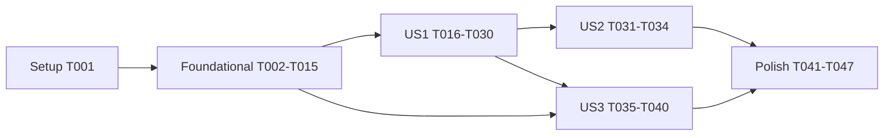

# Tasks: Transformações reativas

**Feature**: `003-reactive-transforms` | **Branch**: `feature/003-reactive-transforms`
**Input**: plan.md, spec.md, research.md (R1–R10), data-model.md, contracts/ (reactive-data, transform-stage),
quickstart.md

## Format: `[ID] [P?] [Story?] Description with file path`

- **[P]**: paralelizável (arquivos distintos, sem dependência pendente).
- **[USx]**: tarefa de fase de user story.
- Testes Vitest CPU-side são exigidos (Constituição V; plan "Testing"); teste antes da implementação quando listados em
  par. A verdade da GPU é validada pelo smoke `src/__smokes__/transforms.ts`.

## Path Conventions

- C2 `src/scene/` (testes em `src/scene/__tests__/`), C3 `src/elements/` (testes em `src/elements/scene/__tests__/` e
  `src/elements/physics/__tests__/`), C4 `src/presentation/` (testes em `src/presentation/flows/__tests__/`).
- Testes de integração seguem o padrão de `src/scene/__tests__/integration/SceneOrchestration.test.ts`: `createScene`
  real com `EngineCore` mockado (`record`/`submit`/`create`/`write` como `vi.fn`).
- Código novo de C3/C4 depende só de contratos (`core/contracts`, `scene/contracts`, `scene/events`,
  `scene/descriptors`) — nunca de `scene/systems/ResourceSystem` (research R7).

---

## Phase 1: Setup

- [x] T001 Criar pastas de teste `src/elements/scene/__tests__/` e `src/presentation/flows/__tests__/` e confirmar que o `include` de `vitest.config.ts` (`src/**/__tests__/**/*.test.ts`) as cobre; rodar `npm test` para registrar a linha de base verde

---

## Phase 2: Foundational (Blocking Prerequisites) — mecanismo reativo da C2

**Bloqueia todas as user stories.**

- [x] T002 [P] Teste `src/scene/__tests__/reactiveData.test.ts` para o proxy profundo (contrato `contracts/reactive-data.md`): atribuição de campo chama `onChange`; escrita indexada em `Array` e `Float32Array` chama; `TypedArray.set`/`fill`/`copyWithin`/`sort`/`reverse` e `Array.splice`/`fill`/`sort`/`reverse` chamam após mutar o alvo; `delete` chama; `proxy.position === proxy.position` (cache estável); leitura não chama; valores primitivos e objetos aninhados simples funcionam; `JSON.stringify`/iteração/`Array.isArray` preservados
- [x] T003 Implementar `src/scene/systems/reactiveData.ts` — `makeReactive(data, onChange)` com traps `set`/`deleteProperty`, proxy aninhado sob demanda para `Array`/`TypedArray` cacheado em `WeakMap`, métodos mutadores envolvidos e métodos não mutadores ligados ao alvo (necessário para `TypedArray`) — até T002 passar; JSDoc explicando o limite de referências capturadas antes da inserção
- [x] T004 [P] Adicionar `upload?: 'always' | 'initial' | 'never'` com JSDoc a `src/scene/descriptors/GPUDescriptor.ts` (texto do contrato `reactive-data.md`)
- [x] T005 [P] Criar `src/scene/events/FrameRecordingEvent.ts` (`{ readonly elapsed: number }`, JSDoc), adicionar `frameRecording: FrameRecordingEvent` a `src/scene/events/EventMap.ts` e reexportar em `src/scene/events/index.ts` e no barrel de tipos de `src/index.ts`
- [x] T006 [P] Criar contrato `src/scene/contracts/PoolDirectory.ts` (`poolBufferSpec`, `poolCount`, `poolSlotOf`, `poolKeyForResource`, com JSDoc; "slot igual em todos os pools do mesmo recurso"), reexportar em `src/scene/contracts/index.ts`
- [x] T007 [P] Teste `src/scene/__tests__/phases.test.ts`: `FlowRegistry.phasesInOrder()` retorna `['physics','transform','shadow','forward','post','ui']` e um Flow com `phase = 'transform'` é despachado entre physics e shadow pelo `ExecutionSystem` (core mockado)
- [x] T008 Adicionar `'transform'` ao tipo `Phase` em `src/scene/flows/Flow.ts` (JSDoc da fase: "estágios que produzem transformações de mundo; roda depois da física e antes da sombra") e a `PHASE_ORDER` em `src/scene/flows/FlowRegistry.ts` até T007 passar
- [x] T009 [P] Teste `src/scene/__tests__/ExecutionSystem.frameRecording.test.ts`: em `frameTick`, `frameRecording` é emitido com o `elapsed` do tick **antes** de `core.record` (ordem verificada por spies) e `frameComplete` continua depois de `submit`
- [x] T010 Emitir `frameRecording` no início de `onFrameTick` em `src/scene/systems/ExecutionSystem.ts` (antes de `recordAndSubmit`, inclusive no modo `captureErrors`) e atualizar o JSDoc da classe com a ordem do quadro, até T009 passar
- [x] T011 [P] Teste `src/scene/__tests__/ResourceSystem.reactive.test.ts` (createScene + core mockado): após `world.insert`, mutar `data` de um recurso `'always'` não escreve na hora; no `frameRecording` escreve exatamente uma vez com o último valor (10 mutações ⇒ 1 `write`, SC-004) e emite `resourceReady` uma vez; recurso não inserido não enfileira; recurso removido antes do `frameRecording` não é escrito; `emit('resourceDirty')` manual entra na mesma fila; pool escreve no offset `slot × stride`
- [x] T012 [P] Teste `src/scene/__tests__/ResourceSystem.uploadPolicy.test.ts`: `'always'` escreve na alocação e no sujo; `'initial'` escreve só na alocação, recurso termina em `ResourceState.GpuManaged`, mutação posterior não escreve e emite `console.warn` uma única vez por schema; `'never'` não escreve na alocação, nem no sujo, nem no crescimento do pool; recurso misto (`'always'` + `'never'`) fica `Ready` e só o descritor `'always'` é escrito
- [x] T013 [P] Teste `src/scene/__tests__/ResourceSystem.poolSlots.test.ts`: recurso com dois descritores em pool (schemas distintos) recebe o mesmo slot nos dois pools; inserções intercaladas com recursos de um pool só, remoção e reinserção (free-list) e crescimento além de 16 mantêm `poolSlotOf(a) === poolSlotOf(b)`; crescimento do pool `'never'` emite `poolReallocated` sem `write` de dados da CPU; `ResourceSystem` satisfaz `PoolDirectory` (atribuição de tipo)
- [x] T014 Refatorar `src/scene/systems/ResourceSystem.ts` até T011–T013 passarem: (a) `allocate` instala `makeReactive` em `resource.data` antes do envio inicial, com `onChange` → `markDirty(resource)`; (b) `resourceDirty` e `markDirty` enfileiram num `Set` respeitando `handler.ignoreDirtyMark()` (estado `GpuManaged` ⇒ aviso único por schema); (c) handler de `frameRecording` esvazia a fila: envia só descritores `'always'` (individual inteiro / pool no offset do slot), transita `Dirty → Ready`, emite `resourceReady`, ignora recursos já `Disposed/Destroyed`; (d) política `upload` na alocação e no crescimento (`'never'` não escreve; pool `'never'` cresce só realocando); estado final `GpuManaged` quando todos os descritores com schema são `'initial'`/`'never'`; (e) slot por recurso: o primeiro descritor em pool define o slot, os demais pools usam o mesmo slot (crescendo se preciso) e a remoção libera em todos; (f) `implements PoolDirectory`; (g) corrigir o reempacotamento em `growPool` para usar o descritor do próprio recurso (não `constructor.schema`) e não depender de nome de classe; atualizar o JSDoc da classe
- [x] T015 Rodar `npx tsc --noEmit && npm test && npm run check:circular`; corrigir testes existentes que dependiam de envio imediato em `resourceDirty` (se houver) para emitir `frameTick`/`frameRecording` antes de verificar

**Checkpoint**: dado reativo, fila por quadro, política de envio, slots comuns e fase `transform` prontos.

---

## Phase 3: User Story 1 — Posicionar objetos por posição, rotação e escala (Priority: P1) 🎯 MVP

**Goal**: objetos aparecem onde `position`/`rotation`/`scale` indicam, com sombra e iluminação coerentes (Acceptance
1–4; FR-006–FR-013).

**Independent test**: smoke `transforms.ts` — readback do pool `WorldTransform` igual ao oráculo e pixels nos centros
projetados com tolerância de 1 px; exemplos do README posicionam corretamente.

- [x] T016 [P] [US1] Teste `src/elements/scene/__tests__/Transform.test.ts`: `Transform.schema` tem só `position`/`rotation`/`scale` (stride 48) e `Transform.worldSchema` tem `world: mat4x4f`, `normal: mat3x3f` (stride 112); `getDescriptors()` retorna `transform` (`storage-ro`, pool, `'always'`) e `world` (`storage-rw`, pool, `'never'`); defaults corretos; construtor com `model` emite `console.warn` uma vez por execução e não guarda `model` em `data`
- [x] T017 [US1] Reescrever `src/elements/scene/Transform.ts` até T016 passar (JSDoc: intenção do desenvolvedor; matriz produzida pelo `TransformFlow`; referência ao guia de migração)
- [x] T018 [P] [US1] Criar `src/elements/gpu/wgsl/structs/transform.wgsl` e `src/elements/gpu/wgsl/structs/world_transform.wgsl` com a mesma forma de `Transform.schema`/`Transform.worldSchema` (comentário apontando a fonte TS)
- [x] T019 [US1] Criar `src/elements/gpu/wgsl/kernels/transform_compose.wgsl` (`@workgroup_size(64)`; `@group(0)`: `@binding(0) var<storage, read> transforms: array<Transform>`, `@binding(1) var<storage, read_write> worlds: array<WorldTransform>`, `@binding(2) var<uniform> params: TransformParams { count: u32 }`): retorna se `id >= count`; `q = quat_normalize(rotation)` com módulo 0 ⇒ identidade; `world = T·R·S` column-major; `normal = mat3_from_quat(q) * diag(inv(sx),inv(sy),inv(sz))` com `inv(0) = 0`; reusa `math/quat.wgsl` e `math/mat.wgsl`
- [x] T020 [P] [US1] Teste `src/elements/scene/__tests__/TransformFlow.test.ts` (core e `PoolDirectory` mockados, `EventBus` real): `phase === 'transform'`; despacha na primeira vez; não grava nada sem mudança; despacha após `resourceReady` de recurso cujo `poolKeyForResource` é `'Transform'`; ignora `resourceReady` de outros pools; após `poolReallocated('Transform'|'WorldTransform')` recria o kernel com os novos buffers e despacha; workgroups `= ceil(count/64)`; `count = 0` não despacha; shader passa em `validateWgslReferences`
- [x] T021 [US1] Implementar `src/elements/scene/flows/TransformFlow.ts` (`extends Flow`, `constructor(core: EngineCore, pools: PoolDirectory, events: EventBus)`, kernel via `createComputeKernel` com fonte `structs/transform + structs/world_transform + math/quat + math/mat + kernels/transform_compose`, uniform de parâmetros escrito só quando `count` muda, `needsDispatch` reativo a eventos) até T020 passar; exportar em `src/elements/scene/index.ts` (e barrel público) com JSDoc citando que é substituível na fase `transform` (base de `Parent`, ponto `transform` e cadeias não euclidianas)
- [x] T022 [US1] Registrar `TransformFlow` em `src/presentation/flows/defaults.ts` (antes de sombra/forward; usa `options.events` — tornar `events` obrigatório em `PresentationDefaultsOptions` ou criar o Flow só quando presente, documentando) e expor em `PresentationDefaults` como `transform`
- [x] T023 [P] [US1] Atualizar `src/elements/gpu/wgsl/forward.wgsl`: struct `WorldTransform`; `@group(1) @binding(0) var<storage, read> worlds: array<WorldTransform>`; `vs_main(in, @builtin(instance_index) slot: u32)` usa `worlds[slot].world` para posição e `worlds[slot].normal * in.normal` para a normal; remover struct `Transform` uniforme
- [x] T024 [P] [US1] Atualizar `src/presentation/flows/shadow_depth.wgsl` do mesmo modo (só `world`)
- [x] T025 [P] [US1] Teste `src/presentation/flows/__tests__/ForwardFlow.worldTransform.test.ts` (core, pass e `PoolDirectory` mockados; cena com Camera + Box + StandardMaterial + Transform): layout do grupo 1 é `read-only-storage` com visibilidade de vértice; bind group aponta para `poolBufferSpec('WorldTransform')`; `draw.indexed` recebe `firstInstance = poolSlotOf('WorldTransform', id)`; nenhum `core.write` de dado de transform por objeto em quadros consecutivos; objeto sem slot não é desenhado; escala com `sx·sy·sz < 0` usa pipeline com `frontFace: 'cw'`; `onPoolReallocated('WorldTransform')` recria o bind group
- [x] T026 [US1] Refatorar `src/presentation/flows/ForwardFlow.ts` até T025 passar: tipar o parâmetro de recursos como `PoolDirectory` (código novo), remover `transformBuffer`/`transformBindGroup` por slot e o `write` de transform em `uploadPerFrameData`, criar layout + bind group únicos de `WorldTransform` (recriados em `onPoolReallocated`), desenhar com `firstInstance = slot`, variante de pipeline por sinal do determinante da escala; atualizar JSDoc da classe
- [x] T027 [P] [US1] Teste `src/presentation/flows/__tests__/ShadowFlow.worldTransform.test.ts` com os mesmos critérios de T025 aplicáveis à sombra (layout, bind group, `firstInstance`, sem `write` por objeto, `frontFace`, recriação no realloc)
- [x] T028 [US1] Refatorar `src/presentation/flows/ShadowFlow.ts` até T027 passar (remover buffer/bind group de transform por slot e o `write` por quadro; `PoolDirectory`; JSDoc)
- [ ] T029 [US1] Smoke `src/__smokes__/transforms.ts` (padrão dos smokes existentes, prefixo `[transforms]`, `TRANSFORMS SMOKE PASSED`/`FAIL:`): cena com câmera fixa, luz com sombra e 6 cubos de cores distintas com posições, rotações e escalas variadas (inclui não uniforme e negativa); após 3 quadros, (1) copia o pool `WorldTransform` para staging e compara com um oráculo `T·R·S`/`R·S⁻¹` calculado no próprio smoke (tolerância 1e-5); (2) lê o alvo offscreen do forward e confere a cor esperada nos centros projetados de cada cubo (tolerância 1 px); registrar no `src/__smokes__/README.md`
- [ ] T030 [US1] Rodar o smoke `transforms.ts` no Chrome (Vite dev server reiniciado) e os exemplos do README (cubo girando; chão em `y = -0.5`) confirmando o posicionamento; anotar resultado no PR

**Checkpoint**: motor posiciona objetos — MVP.

---

## Phase 4: User Story 2 — Alterar o dado e ver a mudança sem chamadas manuais (Priority: P2)

**Goal**: mutação de `data` reflete no quadro seguinte para transformações e qualquer recurso (Acceptance 1–4;
FR-001–FR-004; SC-003, SC-004).

**Independent test**: com a cena rodando, mutar `data.position` (campo inteiro e componente) e `material.data.albedo`;
o quadro seguinte mostra a mudança sem outra chamada.

- [ ] T031 [P] [US2] Teste de integração `src/scene/__tests__/integration/ReactiveTransform.test.ts` (createScene + core mockado + `TransformFlow` registrado): mutar `transform.data.position[0]` e emitir `frameTick` ⇒ no mesmo quadro há `write` do slot no pool `Transform` antes do dispatch do `TransformFlow` (ordem verificada pela sequência de chamadas no core mockado) e o `TransformFlow` grava o compute; quadro seguinte sem mutação ⇒ nenhum `write` e nenhum dispatch
- [ ] T032 [P] [US2] Teste de integração `src/scene/__tests__/integration/ReactiveMaterial.test.ts`: mutar `material.data.albedo[0]` de um `StandardMaterial` inserido ⇒ envio no próximo `frameRecording` pelo mesmo mecanismo (vale para qualquer recurso — Acceptance 4)
- [ ] T033 [US2] Corrigir o que T031/T032 revelarem (ordem `frameRecording` → upload → `resourceReady` → dispatch) em `src/scene/systems/ResourceSystem.ts` / `src/elements/scene/flows/TransformFlow.ts`
- [ ] T034 [US2] Estender o smoke `src/__smokes__/transforms.ts`: mover um cubo via `data.position = …` e outro via `data.position[1] = …` num `frameTick`; no quadro seguinte o readback do pool e a amostragem de pixels refletem as novas posições (SC-003); rodar no Chrome

**Checkpoint**: reatividade validada ponta a ponta.

---

## Phase 5: User Story 3 — Física publica apenas a pose (Priority: P3)

**Goal**: corpos rígidos continuam se movendo; física publica só posição/rotação; escala visual preservada; sem acesso
privado (Acceptance 1–2; FR-003, FR-005, FR-014, FR-015; SC-006, SC-007).

**Independent test**: cena de corpos rígidos com escala visual ≠ 1 cai e colide como antes, com a escala mantida.

- [ ] T035 [P] [US3] Teste `src/elements/physics/__tests__/bodyUploadPolicy.test.ts`: descritores em pool de `RigidBody`, `SoftBody` e `FluidBody` (todas as variantes de algoritmo) declaram `upload: 'initial'`; colisores e restrições continuam sem `upload` (default `'always'`)
- [ ] T036 [US3] Adicionar `upload: 'initial'` aos descritores em pool de `src/elements/physics/bodies/RigidBody.ts`, `src/elements/physics/bodies/SoftBody.ts` e `src/elements/physics/bodies/FluidBody.ts` até T035 passar (JSDoc: "a simulação é dona do estado após a inserção")
- [ ] T037 [P] [US3] Teste `src/elements/physics/__tests__/lcpPosePublish.test.ts`: dado um `ArrayBuffer` de readback sintético com posição e quaternion por slot, `applyTransformsFromReadback` (exposto para teste via método protegido/estático conforme padrão do arquivo) atribui `position` e `rotation` normalizados ao `Transform` da entidade, não toca `scale`, não escreve `model`, não acessa `world.events`, e a mutação entra na fila do `ResourceSystem` (um `write` no próximo `frameRecording`)
- [ ] T038 [US3] Refatorar `src/elements/physics/flows/LCPFlow.ts` até T037 passar: remover a construção da matriz e `markTransformDirty` (cast em `world.events`), localizar o `Transform` com `instanceof Transform`, atribuir só `position`/`rotation`; atualizar o JSDoc de `schedulePosRotReadback` (readback permanece até a F2)
- [ ] T039 [US3] Verificar com `grep -rn "as unknown as" src/elements src/presentation` e revisão que nenhum componente acessa membros privados do mundo/barramento (SC-007); remover qualquer ocorrência remanescente relacionada a eventos
- [ ] T040 [US3] Estender o smoke `src/__smokes__/transforms.ts` com 5 corpos rígidos (`RigidBody` esfera com `Transform` de escala visual `[0.5, 0.5, 0.5, 1]`) sobre chão: após 120 quadros as esferas desceram (y menor que o inicial) e o readback do pool `WorldTransform` mostra escala 0.5 preservada; rodar no Chrome junto com os smokes `integration`, `multiApp` e `stress60s`

**Checkpoint**: física sobre o novo mecanismo, sem acoplamento indevido.

---

## Phase 6: Polish & Cross-Cutting Concerns

- [ ] T041 [P] Atualizar `README.md`: exemplos passam a funcionar como escritos; nota curta sobre mutação reativa de `data`
- [ ] T042 [P] Atualizar `clay-engine-doc/docs/guides/getting_started.md` (posicionar e animar objetos por `data`, sem chamadas manuais)
- [ ] T043 [P] Atualizar `clay-engine-doc/docs/guides/migration_legacy_to_clean.md` com a seção "Mudança incompatível: `Transform.model` removido" (antes/depois, aviso em runtime, alternativa para transformações não-TRS: Flow próprio na fase `transform` / ponto de extensão `transform` na F3) e nota de versão
- [ ] T044 [P] Atualizar `clay-engine-doc/docs/guides/architecture_resource_loaders.md`: schema do `Transform` (só intenção) + `WorldTransform`; mutação reativa implementada (proxy + fila + `frameRecording`); política `upload` e `GpuManaged`; fase `transform` e `TransformFlow` (resolve a lacuna "quem converte Transform em matriz"); contrato `PoolDirectory`
- [ ] T045 JSDoc em todos os exports novos/alterados; `npm run doc:coverage` verde; `npm run doc` regenerado; build do site (`clay-engine-doc`) sem links quebrados
- [ ] T046 Verificar SC-005: teste `src/scene/__tests__/integration/StaticScenePerf.test.ts` com 10 000 entidades estáticas (core mockado contando chamadas) — após o primeiro quadro, quadros seguintes sem nenhum `write` de transform e sem dispatch do `TransformFlow`; registrar no PR o tempo de CPU por quadro da cena `integration` antes/depois (sem piora)
- [ ] T047 Gate completo verde: `npm run lint && npm run format:check && npm run check:circular && npm run check:dead && npx tsc --noEmit && npm run test:coverage && npm run doc:coverage && npm run build:lib`; smokes `transforms`, `integration`, `multiApp`, `stress60s` passando no Chrome

---

## Dependencies & Execution Order

### Phase dependencies

- **Setup (T001)** → sem dependências.
- **Foundational (T002–T015)** → depende do Setup; **bloqueia todas as stories**.
- **US1 (T016–T030)** → depende da Foundational.
- **US2 (T031–T034)** → depende de US1 (precisa do `TransformFlow` e do consumo por slot).
- **US3 (T035–T040)** → depende da Foundational (política `upload`) e de US1 (Transform sem `model`, consumo por slot).
  Pode correr em paralelo com US2.
- **Polish (T041–T047)** → depende de todas as stories.

### Within phases

- Pares teste→implementação: T002→T003, T007→T008, T009→T010, (T011, T012, T013)→T014, T016→T017, T020→T021,
  T025→T026, T027→T028, T035→T036, T037→T038.
- T004, T005, T006 antes de T014; T017 e T018 antes de T019; T019 antes de T021; T021 antes de T022; T023/T024 antes de
  T026/T028; T026 e T028 antes de T029.

### Story completion order



## Parallel Opportunities

- **Foundational**: T002, T004, T005, T006, T007, T009 juntos; T011, T012, T013 juntos (depois de T003–T006).
- **US1**: T016 e T018 juntos; T020 em paralelo com T023/T024; T025 e T027 juntos.
- **US2 e US3** podem correr em paralelo após US1; dentro delas T031/T032 e T035/T037 juntos.
- **Polish**: T041–T044 juntos.

### Exemplo — Foundational

```text
Task: "T002 reactiveData.test.ts"
Task: "T004 GPUDescriptor.upload"
Task: "T005 FrameRecordingEvent + EventMap"
Task: "T006 PoolDirectory"
Task: "T007 phases.test.ts"
Task: "T009 ExecutionSystem.frameRecording.test.ts"
```

## Implementation Strategy

- **MVP = Setup + Foundational + US1** (T001–T030): o motor posiciona objetos por posição/rotação/escala, com estágio em
  GPU e consumo por slot.
- **Incremento 2 = US2** (T031–T034) e **Incremento 3 = US3** (T035–T040), em paralelo se conveniente.
- **Conclusão = Polish** (T041–T047). Pela regra de completude do projeto, a feature só está pronta com **todas** as
  tarefas concluídas, smokes passando e gate verde — o MVP é ordem de execução, não ponto de parada.
- Depois do merge desta spec em `develop`, a spec 002 (harness) é retomada sobre ela.
- Commits pequenos por tarefa/grupo (português, conventional), PR para `develop` ao final.
