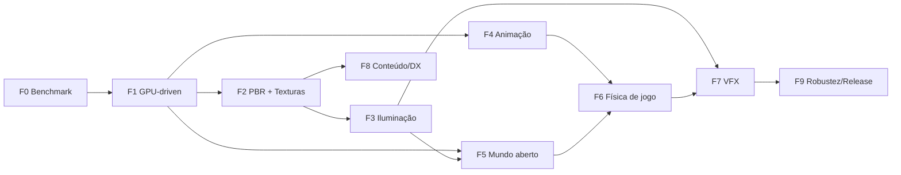

# Roadmap Evolutivo — Clay Engine

**Objetivo**: tornar o clayflow capaz de sustentar um jogo realista (referência: [MorphSociety](https://github.com/dantasgut/morphysociety))
com **qualidade visual equivalente ou superior** e **desempenho superior** ao Three.js.

**Criado**: 2026-10-03 · **Governança**: [Constituição v1.0.0](../.specify/memory/constitution.md) — cada fase vira
uma ou mais specs do Spec Kit, com fachada de domínio (Princípio II) e gate completo verde.

---

## Tese: onde o clayflow pode vencer o Three.js

O Three.js percorre o scene graph na CPU a cada quadro, emite **um draw call e um update de uniforms por objeto** e
faz culling na CPU. Em cenas grandes (vegetação, multidões, construções) o gargalo é a CPU, não a GPU.

O clayflow já tem: física 100% GPU, compute, `drawIndexedIndirect`, `dispatchWorkgroupsIndirect`, render bundles e um
núcleo data-oriented (`Resource`/schema). A aposta é **renderização GPU-driven**: a GPU decide o que desenhar (culling
em compute → indirect draw por material), mantendo o custo de CPU por quadro **~constante**, e física, animação e
render compartilham os mesmos buffers sem round-trip para a CPU.

> Em cenas pequenas haverá empate. A vantagem aparece em **escala** — exatamente o perfil do MorphSociety.

## Diagnóstico de partida (2026-10-03)

| Área             | Estado                                                                                             |
| ---------------- | -------------------------------------------------------------------------------------------------- |
| Iluminação       | 🔴 Lambert (`ambient + N·L`) em `forward.wgsl`; roughness/metallic não usados; sem IBL/céu/neblina |
| Texturas         | 🔴 Infra de textura/sampler existe; `StandardMaterial` sem mapas                                   |
| Sombras          | 🟡 1 shadow map direcional com PCF; sem cascatas                                                   |
| Bones/animação   | 🔴 `GltfLoader` lê skins/animações; sem skinning nem sistema de animação                           |
| Geometria/escala | 🔴 Uniform de Transform por objeto; sem instancing no render, LOD ou frustum culling               |
| Pós-processo     | 🟢 ToneMapping, SSAO, Bloom, FXAA, ColorGrading, Vignette                                          |
| Física rígida    | 🟡 LCP/PGS GPU forte; faltam raycast, character controller, heightfield                            |
| Fluidos          | 🟢 SPH, PBF, MPM na GPU                                                                            |
| Tecido / fogo    | 🟡 Bases (XPBD, emissores de partículas), sem features prontas                                     |

## Fases

| Fase                    | Specs previstas                                                             | Tamanho | Entregas-chave                                                                                                                                                                                                      | Critério de pronto                                                        |
| ----------------------- | --------------------------------------------------------------------------- | ------- | ------------------------------------------------------------------------------------------------------------------------------------------------------------------------------------------------------------------- | ------------------------------------------------------------------------- |
| **F0 Benchmark**        | `002-benchmark-harness`                                                     | P       | Cenas idênticas clayflow × Three.js (WebGPU), métricas CPU/GPU/FPS/draw calls, baseline + gate de regressão                                                                                                         | Relatório reproduzível via `npm run bench`                                |
| **F1 GPU-driven**       | `003-gpu-scene-buffers`, `004-gpu-culling-indirect`                         | G       | Storage buffers globais (transform/material/bounds), mega-buffer de geometria, culling frustum + Hi-Z em compute, indirect draw por material, bundles estáticos, upload por delta                                   | 100k instâncias a 60 fps; CPU < 2 ms/quadro independente do nº de objetos |
| **F2 PBR + texturas**   | `005-pbr-material`, `006-texture-pipeline`                                  | M       | Cook-Torrance (GGX/Smith/Schlick), mapas albedo/normal/ORM/emissive, tangentes MikkTSpace, texture arrays, KTX2/Basis, mipmaps em compute, HDR linear, clearcoat/sheen/transmission/SSS                             | Paridade visual com Three.js em DamagedHelmet/Sponza                      |
| **F3 Iluminação**       | `007-clustered-lighting`, `008-ibl-sky`, `009-shadows-csm`                  | G       | Clustered forward+ (compute), IBL gerado do céu, atmosfera física (Hillaire), dia/noite, CSM 4 cascatas, atlas de sombras pontuais/spot, PCSS, neblina volumétrica, auto-exposição, probes de GI                    | Cena dia/noite do MorphSociety com qualidade ≥                            |
| **F4 Animação**         | `010-gpu-skinning`, `011-animation-system`                                  | G       | Skinning em compute (pré-skin reaproveitado por sombra/física), amostragem de keyframes na GPU para multidões, blending/state machine, morph targets, IK 2 ossos, look-at                                           | 500 personagens animados a 60 fps                                         |
| **F5 Mundo aberto**     | `012-terrain-clipmap`, `013-gpu-vegetation`, `014-water`                    | GG      | Terreno clipmap/CDLOD + streaming + splatting triplanar (heightfield também colisor), vegetação gerada em compute com vento/LOD/impostores, água FFT + SSR integrada a SPH/PBF                                      | Bioma do MorphSociety com FPS > versão Three.js                           |
| **F6 Física de jogo**   | `015-queries-raycast`, `016-character-controller`, `017-cloth-and-coupling` | G       | Raycast/shapecast GPU com readback assíncrono, character controller, heightfield collider, CCD, broadphase BVH/hash, `ClothBody` com colisão contra cápsulas do esqueleto, acoplamento rígido↔fluido e tecido↔vento | Avatar no terreno com roupa simulada; barco flutuando em rio SPH          |
| **F7 VFX**              | `018-vfx-particles`, `019-temporal-aa`                                      | M       | Partículas GPU com bitonic sort, soft particles, flipbooks, fogo/fumaça (grade euleriana leve), decals, TAA/upscaling, motion blur, DoF, SSR                                                                        | Fogueira/forja com luz dinâmica                                           |
| **F8 Conteúdo/DX**      | `020-content-pipeline`                                                      | M       | glTF completo (KHR\_\*, Draco, meshopt) em workers, hot reload de WGSL/materiais, inspector, presets (`openWorld`)                                                                                                  | Assets do MorphSociety carregam sem conversão manual                      |
| **F9 Robustez/Release** | —                                                                           | M       | Device-lost recovery, quality tiers, mobile/Safari, orçamentos de memória, v1.0 semver, guia de migração do Three.js                                                                                                | Release 1.0                                                               |

Tamanhos relativos: P pequeno · M médio · G grande · GG muito grande.

## Marcos de validação com o MorphSociety

| Marco                   | Após  | Escopo portado                            | Critério                                    |
| ----------------------- | ----- | ----------------------------------------- | ------------------------------------------- |
| **M1 Paisagem**         | F1–F3 | Terreno, céu, luz                         | FPS ≥ Three.js, visual equivalente          |
| **M2 Bioma vivo**       | F4–F5 | Vegetação, água, fauna e aldeões animados | FPS ≥ 1,5× Three.js (preset ultra)          |
| **M3 Jogável**          | F6    | Avatar, colisões, picking, modo RTS       | Paridade de gameplay                        |
| **M4 Além do Three.js** | F7    | Fogo, rios fluidos, roupas simuladas      | Recursos sem equivalente nativo no Three.js |
| **M5 Migração**         | F8–F9 | Cliente inteiro                           | Three.js removido do `package.json` do jogo |

A lógica de jogo do MorphSociety (`shared/`) é agnóstica de engine; só o cliente (`src/`) é portado.

## Ordem e riscos

1. **F0 → F1 primeiro.** Materiais, animação e vegetação dependem dos buffers globais e do indirect draw da F1;
   fazer PBR antes obrigaria a reescrever shaders.
2. Depois F2 → F3 em sequência, com **F4 em paralelo** (depende só de F1).
3. Riscos: escopo da F5 (dividir em specs menores); suporte desigual a features WebGPU entre navegadores
   (feature detection + fallbacks); o `WebGPURenderer`/TSL do Three.js evolui — a F0 mantém a comparação honesta
   e contínua; CI sem GPU — smokes de navegador e benchmark entram no gate local (Princípio V).
