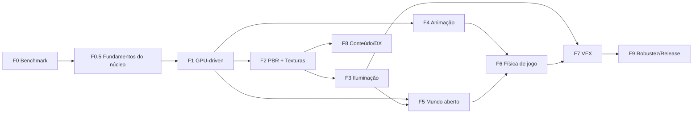

# Roadmap Evolutivo — Clay Engine

**Objetivo**: construir no clayflow as **capacidades de engine** (renderização, materiais, iluminação, animação,
mundo aberto, física de jogo, VFX) com **qualidade visual equivalente ou superior** e **desempenho superior** ao
Three.js, de modo que jogos realistas possam ser modernizados sobre ele.

**Consumidor de referência**: [MorphSociety](https://github.com/dantasgut/morphysociety). O jogo **não** é trazido
para este repositório — ele é o _cliente_ que orienta quais capacidades priorizar e que, no próprio repo, adota o
clayflow como dependência (`file:../clayflow` / pacote publicado) à medida que cada capacidade amadurece. Aqui só
existem engine, testes, smokes e cenas genéricas de benchmark.

**Criado**: 2026-10-03 · **Governança**: [Constituição v1.0.0](../.specify/memory/constitution.md) — cada fase vira
uma ou mais specs do Spec Kit, com fachada de domínio (Princípio II) e gate completo verde.

---

## Tese: onde o clayflow pode vencer o Three.js

O Three.js percorre o scene graph na CPU a cada quadro, emite **um draw call e um update de uniforms por objeto** e
faz culling na CPU. Em cenas grandes (vegetação, multidões, construções) o gargalo é a CPU, não a GPU.

O clayflow já tem: física 100% GPU, compute, `drawIndexedIndirect`, `dispatchWorkgroupsIndirect`, render bundles e um
núcleo data-oriented (`Resource`/schema). A aposta é **renderização GPU-driven**: a GPU decide o que desenhar (culling
em compute → indirect draw por material), mantendo o custo de CPU por quadro **~constante**, e física, animação e
render compartilham os mesmos buffers sem round-trip para a CPU.

> Em cenas pequenas haverá empate. A vantagem aparece em **escala** — exatamente o perfil de jogos como o MorphSociety.

## Diagnóstico de partida (2026-10-03)

| Área             | Estado                                                                                             |
| ---------------- | -------------------------------------------------------------------------------------------------- |
| Iluminação       | 🔴 Lambert (`ambient + N·L`) em `forward.wgsl`; roughness/metallic não usados; sem IBL/céu/neblina |
| Texturas         | 🔴 Infra de textura/sampler existe; `StandardMaterial` sem mapas                                   |
| Sombras          | 🟡 1 shadow map direcional com PCF; sem cascatas                                                   |
| Bones/animação   | 🔴 `GltfLoader` lê skins/animações; sem skinning nem sistema de animação                           |
| Geometria/escala | 🔴 Uniform de Transform por objeto; sem instancing no render, LOD ou frustum culling               |
| Pós-processo     | 🟡 ToneMapping, SSAO, Bloom, FXAA, ColorGrading, Vignette — mas sobre cena LDR 8 bits, sem MSAA    |
| Física rígida    | 🟡 LCP/PGS GPU forte; faltam raycast, character controller, heightfield                            |
| Fluidos          | 🟡 SPH, PBF, MPM simulam na GPU, mas nenhum flow os renderiza (kernels `*_vertex_write` órfãos)    |
| Tecido / fogo    | 🟡 Bases (XPBD, emissores de partículas), sem features prontas                                     |

### Núcleo: o motor não usa a potência que já tem (auditoria 2026-10-04)

O C1 expõe instancing, dynamic offsets, indirect draw/dispatch, render bundles, compute, pipelines assíncronos,
texture arrays e MSAA — mas as camadas acima quase não os usam, e o dispositivo é criado no mínimo. Essas lacunas
viram a fase **F0.5** (fundamentos) e parte da **F1**:

| #   | Lacuna                                                                                                                                                                                                                                       | Evidência                                                       | Fase |
| --- | -------------------------------------------------------------------------------------------------------------------------------------------------------------------------------------------------------------------------------------------- | --------------------------------------------------------------- | ---- |
| 1   | Dispositivo sem `powerPreference`, features ou limites: `timestamp-query` nunca habilitado (profiler inoperante), limites padrão cortam pools grandes, sem `shader-f16`/compressão de textura/`float32-filterable`/`indirect-first-instance` | `core/gpu/GpuContext.ts:17-19`                                  | F0.5 |
| 2   | Física rígida faz round-trip pela CPU a cada quadro (readback do pool inteiro → `Transform` → re-upload pelo forward); `rb_sync_transform.wgsl` existe mas está desligado                                                                    | `LCPFlow.ts:121`, `:594-627`                                    | F0.5 |
| 3   | Forward por objeto: câmera consultada e escrita por objeto, 3 `writeBuffer` + 4 bind groups + 1 draw por objeto, VBO/IBO por entidade, sem instancing/ordenação/culling; sombra repete tudo                                                  | `ForwardFlow.ts:214-262`, `:648-659`; `ShadowFlow.ts`           | F1   |
| 4   | Fluidos, softbodies e partículas sem caminho de render (`*_vertex_write` não referenciados; `PointCloudGeometry`/`PointSpriteMaterial` não desenhados)                                                                                       | `ForwardFlow.ts:476`; `elements/gpu/wgsl/kernels/`              | F1   |
| 5   | Cena renderizada em LDR 8 bits (formato do canvas): tone mapping/bloom sobre valores já cortados; MSAA não usado                                                                                                                             | `ForwardFlow.ts:411`, `:614`                                    | F0.5 |
| 6   | Tipos identificados por `constructor.name` — quebram sob minificação no build do consumidor                                                                                                                                                  | `ForwardFlow.ts:664,675`; `ShadowFlow.ts:419`; `LCPFlow.ts:684` | F0.5 |
| 7   | Lista fixa de schemas de geometria renderizáveis (glTF/terreno não renderizam sem editar o flow — fere OCP)                                                                                                                                  | `ForwardFlow.ts:476`; `ShadowFlow.ts:284`                       | F0.5 |
| 8   | Índices forçados a `uint16`: malhas > 65.535 vértices corrompem; índices `Uint32` do `GltfLoader` são truncados                                                                                                                              | `ForwardFlow.ts:515,534`                                        | F0.5 |
| 9   | Passo de física fixo por quadro sem acumulador: simulação 2,4× mais rápida a 144 Hz, metade a 30 fps                                                                                                                                         | `LCPFlow.ts:523`; `GameLoop.ts:30`                              | F0.5 |

## Fases

| Fase                           | Specs previstas                                                             | Tamanho | Entregas-chave                                                                                                                                                                                                                                                                                                                                                                                                                                                                                                                                                                                                                                                                                                                                                                                                                                                                                                         | Critério de pronto                                                                                                                                                                                                                                                                               |
| ------------------------------ | --------------------------------------------------------------------------- | ------- | ---------------------------------------------------------------------------------------------------------------------------------------------------------------------------------------------------------------------------------------------------------------------------------------------------------------------------------------------------------------------------------------------------------------------------------------------------------------------------------------------------------------------------------------------------------------------------------------------------------------------------------------------------------------------------------------------------------------------------------------------------------------------------------------------------------------------------------------------------------------------------------------------------------------------- | ------------------------------------------------------------------------------------------------------------------------------------------------------------------------------------------------------------------------------------------------------------------------------------------------ |
| **F0 Benchmark**               | `002-benchmark-harness`                                                     | P       | Cenas idênticas clayflow × Three.js (WebGPU), métricas CPU/GPU/FPS/draw calls, baseline + gate de regressão                                                                                                                                                                                                                                                                                                                                                                                                                                                                                                                                                                                                                                                                                                                                                                                                            | Relatório reproduzível via `npm run bench`                                                                                                                                                                                                                                                       |
| **F0.5 Fundamentos do núcleo** | `003-core-foundations`                                                      | M       | **Dispositivo**: `powerPreference: 'high-performance'`, solicitação das features/limites oferecidos pelo adaptador com padrões sensatos e opt-out, relatório público de capacidades (`core.capabilities()`) para as camadas escolherem caminhos. **HDR**: forward em `rgba16float` com MSAA 4× + resolve; pós-processo e tone mapping sobre HDR real. **Renderizáveis por capacidade**: registro de geometrias/materiais por trait em vez de lista fixa de schemas e de `constructor.name` (robusto a minificação, aberto a glTF/terreno). **Índices `uint32`** quando necessário. **Passo fixo com acumulador** no scheduler de flows de simulação (+ fator de interpolação para o render). **Física→render na GPU**: contrato C2 de buffer compartilhado entre flows; `rb_sync_transform` ligado, corpos rígidos desenhados a partir do buffer da física, readback só sob demanda. Câmera em buffer único por quadro | Build minificado do consumidor renderiza igual ao dev; malha glTF de 1M vértices correta; mesma trajetória de simulação a 30/60/144 Hz; `bench` reporta GPU do clayflow; cena `rigid-bodies` sem readback por quadro e com CPU/quadro menor que o baseline F0; bloom/tone mapping de valores > 1 |
| **F1 GPU-driven**              | `004-gpu-scene-buffers`, `005-gpu-culling-indirect`                         | G       | Storage buffers globais (transform/material/bounds), mega-buffer de geometria, culling frustum + Hi-Z em compute, indirect draw por material, bundles estáticos, upload por delta, forward/sombra em lote (instancing, ordenação por estado), caminho de render para geometria produzida em compute (pontos, partículas, superfícies de fluido/softbody via `*_vertex_write`)                                                                                                                                                                                                                                                                                                                                                                                                                                                                                                                                          | 100k instâncias a 60 fps; CPU < 2 ms/quadro independente do nº de objetos                                                                                                                                                                                                                        |
| **F2 PBR + texturas**          | `006-pbr-material`, `007-texture-pipeline`                                  | M       | Cook-Torrance (GGX/Smith/Schlick), mapas albedo/normal/ORM/emissive, tangentes MikkTSpace, texture arrays, KTX2/Basis, mipmaps em compute, HDR linear, clearcoat/sheen/transmission/SSS                                                                                                                                                                                                                                                                                                                                                                                                                                                                                                                                                                                                                                                                                                                                | Paridade visual com Three.js em DamagedHelmet/Sponza                                                                                                                                                                                                                                             |
| **F3 Iluminação**              | `008-clustered-lighting`, `009-ibl-sky`, `010-shadows-csm`                  | G       | Clustered forward+ (compute), IBL gerado do céu, atmosfera física (Hillaire), dia/noite, CSM 4 cascatas, atlas de sombras pontuais/spot, PCSS, neblina volumétrica, auto-exposição, probes de GI                                                                                                                                                                                                                                                                                                                                                                                                                                                                                                                                                                                                                                                                                                                       | Cena genérica de céu dinâmico + 256 luzes com qualidade ≥ Three.js                                                                                                                                                                                                                               |
| **F4 Animação**                | `011-gpu-skinning`, `012-animation-system`                                  | G       | Skinning em compute (pré-skin reaproveitado por sombra/física), amostragem de keyframes na GPU para multidões, blending/state machine, morph targets, IK 2 ossos, look-at                                                                                                                                                                                                                                                                                                                                                                                                                                                                                                                                                                                                                                                                                                                                              | 500 personagens animados a 60 fps                                                                                                                                                                                                                                                                |
| **F5 Mundo aberto**            | `013-terrain-clipmap`, `014-gpu-vegetation`, `015-water`                    | GG      | Terreno clipmap/CDLOD + streaming + splatting triplanar (heightfield também colisor), vegetação gerada em compute com vento/LOD/impostores, água FFT + SSR integrada a SPH/PBF                                                                                                                                                                                                                                                                                                                                                                                                                                                                                                                                                                                                                                                                                                                                         | Cena genérica de terreno + 1M tufos de vegetação com FPS > Three.js                                                                                                                                                                                                                              |
| **F6 Física de jogo**          | `016-queries-raycast`, `017-character-controller`, `018-cloth-and-coupling` | G       | Raycast/shapecast GPU com readback assíncrono, character controller, heightfield collider, CCD, broadphase BVH/hash, `ClothBody` com colisão contra cápsulas do esqueleto, acoplamento rígido↔fluido e tecido↔vento                                                                                                                                                                                                                                                                                                                                                                                                                                                                                                                                                                                                                                                                                                    | Avatar no terreno com roupa simulada; barco flutuando em rio SPH                                                                                                                                                                                                                                 |
| **F7 VFX**                     | `019-vfx-particles`, `020-temporal-aa`                                      | M       | Partículas GPU com bitonic sort, soft particles, flipbooks, fogo/fumaça (grade euleriana leve), decals, TAA/upscaling, motion blur, DoF, SSR                                                                                                                                                                                                                                                                                                                                                                                                                                                                                                                                                                                                                                                                                                                                                                           | Fogueira/forja com luz dinâmica                                                                                                                                                                                                                                                                  |
| **F8 Conteúdo/DX**             | `021-content-pipeline`                                                      | M       | glTF completo (KHR\_\*, Draco, meshopt) em workers, hot reload de WGSL/materiais, inspector, presets (`openWorld`)                                                                                                                                                                                                                                                                                                                                                                                                                                                                                                                                                                                                                                                                                                                                                                                                     | Assets glTF típicos (MakeHuman, Poly Haven, Khronos) sem conversão manual                                                                                                                                                                                                                        |
| **F9 Robustez/Release**        | —                                                                           | M       | Device-lost recovery, quality tiers, mobile/Safari, orçamentos de memória, v1.0 semver, guia de migração do Three.js                                                                                                                                                                                                                                                                                                                                                                                                                                                                                                                                                                                                                                                                                                                                                                                                   | Release 1.0                                                                                                                                                                                                                                                                                      |

Tamanhos relativos: P pequeno · M médio · G grande · GG muito grande.

## Adoção pelo MorphSociety (no repositório do jogo)

Os marcos abaixo **não** são trabalho deste repo: indicam quando o clayflow passa a oferecer o necessário para o
MorphSociety modernizar cada parte do seu cliente, no próprio repositório, consumindo a API pública. A
lógica de jogo do MorphSociety (`shared/`) é agnóstica de engine e não muda. Lacunas encontradas na adoção voltam
para cá como novas specs de capacidade genérica — nunca como código específico do jogo.

| Marco                   | Capacidades disponíveis | O jogo pode modernizar                    | Critério (medido no jogo)                   |
| ----------------------- | ----------------------- | ----------------------------------------- | ------------------------------------------- |
| **M1 Paisagem**         | F1–F3                   | Terreno, céu, luz                         | FPS ≥ versão Three.js, visual equivalente   |
| **M2 Bioma vivo**       | F4–F5                   | Vegetação, água, fauna e aldeões animados | FPS ≥ 1,5× versão Three.js (preset ultra)   |
| **M3 Jogável**          | F6                      | Avatar, colisões, picking, modo RTS       | Paridade de gameplay                        |
| **M4 Além do Three.js** | F7                      | Fogo, rios fluidos, roupas simuladas      | Recursos sem equivalente nativo no Three.js |
| **M5 Adoção completa**  | F8–F9                   | Cliente inteiro                           | Three.js removido do `package.json` do jogo |

## Ordem e riscos

1. **F0 → F0.5 → F1 primeiro.** A F0 mede o motor como ele é hoje (linha de base honesta). A F0.5 corrige os
   fundamentos que qualquer fase seguinte pressupõe — dispositivo completo, HDR, robustez a minificação, índices
   32 bits, passo fixo e física sem round-trip — e mostra o primeiro ganho medido. Materiais, animação e vegetação
   dependem dos buffers globais e do indirect draw da F1; fazer PBR antes obrigaria a reescrever shaders.
2. Depois F2 → F3 em sequência, com **F4 em paralelo** (depende só de F1).
3. Riscos: escopo da F5 (dividir em specs menores); suporte desigual a features WebGPU entre navegadores
   (feature detection + fallbacks); o `WebGPURenderer`/TSL do Three.js evolui — a F0 mantém a comparação honesta
   e contínua; CI sem GPU — smokes de navegador e benchmark entram no gate local (Princípio V).
