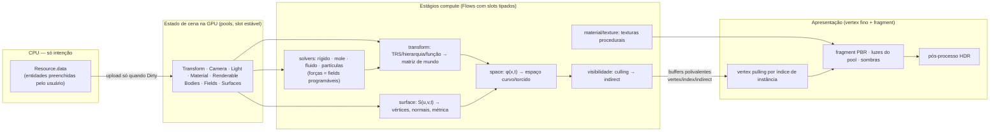
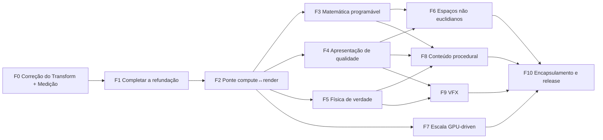

# Roadmap — Clay Engine: correção e evolução

**Criado**: 2026-10-03 · **Reescrito**: 2026-10-05 (após auditoria completa C1–C4 e leitura da arquitetura alvo)
**Governança**: [Constituição v1.0.0](../.specify/memory/constitution.md) — cada fase vira uma ou mais specs do
Spec Kit, com fachada de domínio (Princípio II) e gate completo verde.
**Arquitetura de referência**: [Arquitetura do Motor C1–C4](../clay-engine-doc/docs/guides/architecture_resource_loaders.md)
— a refundação, autoritativa. O legado ([apêndice de migração](../clay-engine-doc/docs/guides/migration_legacy_to_clean.md))
deteriorou a arquitetura original e por isso foi substituído; dele só se resgatam _capacidades_ (ex.: física
escrevendo direto no slot do objeto na GPU, composição de módulos WGSL), nunca estruturas.

---

## 1. Propósito

O Clay Engine existe para **criar mundos matematicamente customizáveis** na GPU, com um núcleo de kernels de
compute de propósito geral sobre o qual tudo — cenário, objetos, materiais, texturas, iluminação, forças,
partículas — é calculado.

- **Transformações programáveis** — as transformações lineares de objetos, cena, câmera e clip são calculadas em
  compute e podem ser substituídas por matemática do usuário.
- **Conteúdo paramétrico e procedural** — terrenos e cenários como superfícies paramétricas; árvores, pessoas e
  animais gerados por procedimento; água como partículas fluidas realistas; luz e texturas realistas.
- **Espaço também é programável** — começa por cenas euclidianas de jogo, mas permite espaços curvos e torcidos
  (estilo _Layers of Fear_): deformações de espaço, projeções customizadas, portais.
- **Compute-first** — compute calcula, vertex e fragment **apresentam**. As duas pipelines conversam por buffers
  compartilhados (buffers polivalentes da C1), sem passar pela CPU.
- **Encapsulamento em níveis** — quem não quiser descer o nível usa peças prontas; quem quiser preenche `data`,
  escreve funções WGSL em pontos de extensão, ou escreve um `Flow` inteiro.

Referências matemáticas (ponto de partida, não limite): [`notes/math.md`](../clay-engine-doc/docs/notes/math.md)
(superfícies paramétricas, homotopias, `P·V·M`, Jacobiana, métrica, curvatura, malha adaptativa),
[`conceitos_cg_matematica_fisica.md`](../clay-engine-doc/docs/guides/conceitos_cg_matematica_fisica.md),
[`10_Hierarquia_Objetos_3D.md`](../clay-engine-doc/docs/guides/10_Hierarquia_Objetos_3D.md) e os guias de física.

**Consumidor de referência**: [MorphSociety](https://github.com/dantasgut/morphysociety) — adota o clayflow no
próprio repositório; nunca é trazido para cá. Desempenho superior ao Three.js em escala continua sendo meta, medida
pelo harness da F0, como consequência da arquitetura.

## 2. Princípios que guiam as correções

1. **Completar a refundação, não reinventá-la.** O desenho C1–C4 é sólido: spec-as-identity, buffers polivalentes,
   pass slots, bag declarativa com inferência, `Flow<TSlots,S>` com slots tipados e máquina de estados, `consumes`
   resolvido por `ConsumerResolver`, pools com slot estável, ciclo de vida com `GpuManaged`. A C1 foi implementada
   quase ao pé da letra; **os mecanismos da C2 que fazem tudo funcionar não existem ou nada os chama** — por isso
   C3 e C4 refazem tudo à mão e não se conversam.
2. **O caminho quente nunca passa pela CPU.** Dado produzido em compute é consumido pelo render no mesmo buffer
   (`GpuManaged`). Readback só sob demanda (consultas, gameplay).
3. **Uma fonte de verdade por struct.** O `StructSchema` gera o WGSL; nada de struct duplicado à mão entre TS e WGSL.
4. **Matemática comum num núcleo único de módulos WGSL**, compartilhado por compute e render, com dependências
   declaradas e deduplicação por símbolo — o objetivo original de organizar solvers com shaders reusáveis.
5. **Pontos de extensão explícitos** para a matemática do usuário (§4.3), sem exigir um `Flow` novo para cada
   customização.
6. **O motor promete só o que entrega.** Documentação, JSDoc e nomes refletem o comportamento real.

## 3. Diagnóstico (auditoria 2026-10-04/05)

### 3.1 Mecanismos da refundação vs código

| Conceito da refundação                                                     | Estado no código                                                                                                                                                                                                                                                     |
| -------------------------------------------------------------------------- | -------------------------------------------------------------------------------------------------------------------------------------------------------------------------------------------------------------------------------------------------------------------- |
| Fachada C1, spec-as-identity, pass slots, ciclo de frame                   | ✅ Implementado (`core/contracts/*`, `GpuEngineCore.ts`, `GpuFrame.ts`)                                                                                                                                                                                              |
| Buffers polivalentes (`vertex`/`index`/`indirect` com `STORAGE`)           | ✅ Usages corretos (`GpuEngineCore.ts:30-46`) — mas `ComputeKernelBinding.buffer` aceita só uniform/storage e a visibilidade é fixa em COMPUTE (`EngineCore.ts:63`, `createComputeKernel.ts:50`): um kernel não escreve vertex/index/indirect nem é lido pelo render |
| `LayoutInferencer.infer` / `inferPool`                                     | 🔴 Não existe; só helpers órfãos, instanciados e não passados a ninguém (`SceneContext.ts:54-57`)                                                                                                                                                                    |
| `consumes` + `ConsumerResolver`                                            | 🔴 Cascas sem registro nem chamada; `consumes` declarados são letra morta                                                                                                                                                                                            |
| `Flow<TSlots,S>` (slots + máquina de estados por eventos)                  | 🔴 `Flow` sem `slots` nem `state`; `isReady()` por polling; sequência imperativa no `dispatch` (`Flow.ts:28-109`)                                                                                                                                                    |
| Seleção de Flow por `FlowDescriptor` (algoritmo ≠ tipo de corpo)           | 🔴 Nenhum Resource implementa `getFlowDescriptors`; schemas por algoritmo (`LCPSchema`, `SPHSchema`); mapa fixo schema→Flow ligado pela C4 (`defaultFlows.ts:26-37`, `Application.ts:120-122`)                                                                       |
| `flowReady`, `bindGroupReplaced`                                           | 🔴 Nunca emitidos                                                                                                                                                                                                                                                    |
| Ciclo de vida com capabilities e `GpuManaged`                              | 🟡 Handlers existem; `GpuManaged` nunca usado; estado atribuído direto (`ResourceSystem.ts:111-297`)                                                                                                                                                                 |
| ResourceSystem alocando a bag inteira                                      | 🟡 Só uniform/storage; vertex/index/indirect/texture/sampler ignorados; um spec por Resource; pool com layout só COMPUTE (`ResourceSystem.ts:136-208`)                                                                                                               |
| "Reuso de instância proibido"                                              | 🔴 `World.insert` idempotente; recurso compartilhado remapeado para a última raiz (`World.ts:43-47,142-149`)                                                                                                                                                         |
| Corpos como contêineres de partículas (`FluidBody`, `SoftBody` com arrays) | 🔴 Uma partícula por entidade (`FluidBody.ts:18-21`, `SoftBody.ts`) — N objetos JS, N registros, N uploads                                                                                                                                                           |
| `Time` governando a física (`scale`, `fixedDt` com substeps)               | 🔴 `fixedDt` próprio por Flow, um passo por quadro, `scale` ignorado, uniform `Time` nunca atualizado                                                                                                                                                                |
| Câmera composta com `Transform`; controllers mutam o `Transform`           | 🔴 Controllers escrevem matrizes da câmera por referência direta; matemática triplicada; `aspect` não atualiza                                                                                                                                                       |
| `RenderTarget`, `ShadowMap`, `Input`, `UiTree`, efeitos como Resources     | 🔴 Cascas ou fora do World                                                                                                                                                                                                                                           |
| Multi-câmera e render-to-texture                                           | ∅ Ausente                                                                                                                                                                                                                                                            |
| Pause/resume/snapshot/restore/headless                                     | ∅ Ausente                                                                                                                                                                                                                                                            |
| Fronteira (C4 não conhece C1 nem solvers concretos)                        | 🔴 15 arquivos de C3/C4 importam `core/contracts`; `Application` expõe `core`/`resources`; `scene/index.ts:35` exporta `engine`                                                                                                                                      |
| Composição WGSL `{{struct:X}}` a partir de `consumes`                      | 🔴 Não existe; shaders montados por `join('\n')` sem dedup                                                                                                                                                                                                           |

### 3.2 Desempenho

| Problema                                                                                                                                           | Evidência                                                      |
| -------------------------------------------------------------------------------------------------------------------------------------------------- | -------------------------------------------------------------- |
| `specHash` sem cache em todo bind/set/write — re-serializa e faz SHA-1 do WGSL completo a cada `setPipeline`                                       | `specHash.ts:30`, `GpuRenderPass.ts:46-70`                     |
| Solver LCP em **uma thread** (`@workgroup_size(1)`, 1 workgroup); XPBD idem; narrowphase O(N·M) sem broadphase                                     | `rb_solve_lcp.wgsl:7`, `LCPFlow.ts:564-570`, `XPBDFlow.ts:232` |
| Forward/sombra por entidade: VBO/IBO, 3 UBOs (câmera duplicada), 4 bind groups, 1 draw; três cópias de geometria (Forward, Shadow, ResourceSystem) | `ForwardFlow.ts:497-660`, `ShadowFlow.ts:316-413`              |
| Sem dedup de geometria nem instancing; pool `Renderable` citado no desenho e nunca definido                                                        | `ForwardFlow.ts:521`, doc L4441                                |
| Física rígida: readback do pool inteiro → CPU → `Transform` → re-upload                                                                            | `LCPFlow.ts:590-701`                                           |
| Dispositivo sem features/limites/`powerPreference` (timestamp-query nunca habilitado)                                                              | `GpuContext.ts:17-19`                                          |

### 3.3 Qualidade e correção

- Shader único Lambert para todos os materiais; roughness/metallic, cor/intensidade de luz, pool de luzes, UVs
  ignorados; normal sem matriz normal (`forward.wgsl:55-98`); topologia do material ignorada (`ForwardFlow.ts:616`).
- Cena em LDR 8 bits, sem MSAA; SSAO/FXAA falsos; tone mapping sobre LDR (`effects.wgsl:36-127`).
- `Transform.model` nunca derivado de posição/rotação/escala (`Transform.ts:25-33`); sombra com frustum fixo ±10.
- FEM sem solve elástico; emissores sem simulação; Wind/Vortex/Drag/Buoyancy sem consumidor; fluidos sem colisores;
  23 de 80 arquivos WGSL órfãos — justamente os de ponte simulação→render (`rb_sync_transform`, `*_vertex_write`)
  e os solvers paralelos (`distance_solve_color/jacobi`, `fem_solve`).
- `ParametricGeometry` amostra em CPU com normal fixa `[0,1,0]`; índices sempre `uint16`.
- Matemática WGSL duplicada (`mat3_*` em 3 arquivos, `W_poly6`/`grad_W_spiky` em 3 kernels, SDF reimplementado).
- Robustez: `constructor.name`, lista fixa de schemas renderizáveis, sem `step()`, vazamentos (slots do forward,
  listener do `DebugFlow`), flows padrão não substituíveis, câmera um quadro atrasada.

## 4. Modelo alvo

### 4.1 Fluxo de dados compute-first

Regras:

- **Um pool por tipo de dado de cena**, visível a compute, vertex e fragment (visibilidade inferida do WGSL). O
  render lê pelo índice de instância — fim do UBO por objeto.
- **Instancing compatível com "reuso de instância proibido"**: memória compartilhada vem de (1) coalescing em pools
  e (2) **dedup de geometria por conteúdo** (schema + parâmetros) no ResourceSystem; o pool `Renderable`
  (geometria, material, slot de transform) agrupa draws por (geometria, pipeline) com `draw.indexed(count, instances)`
  ou indirect.
- **`GpuManaged`**: quando um compute é dono de um buffer (ex.: física escreve `Transform`), a CPU para de fazer
  upload; nenhuma escrita de CPU sobrescreve o resultado da GPU.
- **Câmera = `Camera` + `Transform`**: controllers mutam o `Transform`; um kernel produz view, projection e
  viewProjection a partir dos parâmetros (ponto `camera`).
- **Corpos são contêineres de partículas**: `FluidBody`/`SoftBody` carregam arrays (posições, molas internas,
  tetraedros); constraints entre corpos ficam como Resources próprios.
- **Hierarquia opcional** (decisão D1): componente `Parent` resolvido pelo kernel de transformação, por níveis.

### 4.2 Núcleo de shaders

- **`WgslModule`** `{ name, source, requires[] }` com resolução topológica e **deduplicação por símbolo**. Módulos
  de base: `quat`, `mat`, `linalg`, `sdf`, `sph_kernels`, `mpm_weights`, `xpbd`, `lcp`, `noise`, `color`, `brdf`;
  módulos novos: `parametric` (avaliação, derivadas, métrica, curvatura), `space` (deformações e Jacobiana),
  `procedural` (L-systems, esqueletos, campos), `sampling`.
- **Structs gerados do `StructSchema`** (`toWGSL` com std140/std430 e tipos válidos — hoje `u16` gera WGSL inválido),
  realizando os marcadores `{{struct:X}}` do desenho.
- O mesmo módulo serve compute e render (ex.: `quat_to_mat4` hoje existe em WGSL e reescrito em TS no `LCPFlow`).
- Kernels genéricos reutilizáveis pelo núcleo: prefix sum, sort (radix/bitônico), compactação, reduções, construção de
  grade e busca de vizinhos (já existe em `NeighborSearchPipeline`), BVH — base comum para física, culling,
  partículas e conteúdo procedural.

### 4.3 Pontos de extensão matemáticos

Cada estágio compute aceita uma função WGSL do usuário com assinatura fixa, composta pelo núcleo de shaders e
validada na criação. O motor traz implementações prontas para cada um. São os "slots de função" que complementam os
slots de dados do `Flow<TSlots,S>`.

| Ponto       | Assinatura (conceito)                            | Pronto no motor                            | Exemplos do usuário                                  |
| ----------- | ------------------------------------------------ | ------------------------------------------ | ---------------------------------------------------- |
| `transform` | `(slot, data, t) → mat4`                         | TRS, TRS + `Parent`                        | órbitas, cinemática por equações, enxames            |
| `camera`    | `(data, t) → { view, projection }`               | perspectiva/ortográfica, lookAt            | projeções não lineares, lentes                       |
| `surface`   | `(u, v, t, data) → vec3` (+ derivadas opcionais) | plano, esfera, toro, terreno por ruído     | homotopias, superfícies arbitrárias                  |
| `space`     | `(x, t) → x'` (Jacobiana numérica ou fornecida)  | identidade                                 | corredores que se curvam, torções, espaços dobrados  |
| `field`     | `(x, v, t) → força`                              | gravidade, vento, vórtice, arrasto, empuxo | campos arbitrários                                   |
| `material`  | `(amostra de superfície) → parâmetros PBR`       | PBR por mapas/constantes                   | texturas procedurais, padrões dependentes da métrica |
| `emit`      | `(i, t, data) → partícula`                       | ponto, esfera, cone                        | emissores arbitrários                                |

### 4.4 Níveis de encapsulamento

| Nível  | Para quem                   | Como usa                                                                                       |
| ------ | --------------------------- | ---------------------------------------------------------------------------------------------- |
| **N0** | Quer coisas prontas         | Peças compostas: `Terrain`, `Water`, `Tree`, `Character`, `StandardMaterial`, presets de cena  |
| **N1** | Quer ajustar                | Preenche `data` de Resources atômicos (`ParametricSurface({ preset, params })`, campos, luzes) |
| **N2** | Quer programar a matemática | Funções WGSL nos pontos de extensão (§4.3)                                                     |
| **N3** | Quer um algoritmo novo      | Escreve um `Flow<TSlots,S>` com slots tipados, usando o núcleo de shaders                      |

## 5. Fases

| Fase                                   | Specs previstas                                                                                        | Entregas-chave                                                                                                                                                                                                                                                                                                                                                                                                                                                                                                                                                                                                                                                                                                                                                                                                                                                                                                                                                                                                                                                                                                                                                | Critério de pronto                                                                                                                                                                                                                                      |
| -------------------------------------- | ------------------------------------------------------------------------------------------------------ | ------------------------------------------------------------------------------------------------------------------------------------------------------------------------------------------------------------------------------------------------------------------------------------------------------------------------------------------------------------------------------------------------------------------------------------------------------------------------------------------------------------------------------------------------------------------------------------------------------------------------------------------------------------------------------------------------------------------------------------------------------------------------------------------------------------------------------------------------------------------------------------------------------------------------------------------------------------------------------------------------------------------------------------------------------------------------------------------------------------------------------------------------------------- | ------------------------------------------------------------------------------------------------------------------------------------------------------------------------------------------------------------------------------------------------------- |
| **F0 Correção do Transform e medição** | `003-reactive-transforms` → `002-benchmark-harness`                                                    | **003** (implementada antes da 002): marcação automática de sujo como o desenho prevê — mutação de `data` emite `resourceDirty` (fim do `resourceDirty` manual por cast em `world.events`); `Transform` volta a ser só intenção (`position`/`rotation`/`scale`; `model` sai do schema); `TransformFlow` em compute lê o pool de `Transform` e escreve o pool de matrizes de mundo (`GpuManaged`), estágio substituível pelo futuro ponto `transform`; forward e sombra leem a matriz de mundo pelo slot da entidade no vertex shader (leitura de storage com visibilidade de vértice); `LCPFlow` publica pose (posição/rotação), não matriz. **002**: harness clayflow × Three.js; observabilidade de quadro (`FrameStats`, timestamps em todos os passes); baseline + gate                                                                                                                                                                                                                                                                                                                                                                                   | **003**: `new Transform({ position: [5,0,0,1] })` aparece em x = 5; mutação de `data` reflete no quadro seguinte sem chamada manual; exemplos do README corretos. **002**: relatório reproduzível medindo o motor como ele é, com limitações declaradas |
| **F1 Completar a refundação**          | `004-core-hardening`, `005-shader-modules`, `006-flow-slots`                                           | **004**: dispositivo completo (features, limites, `powerPreference`, relatório de capacidades); cache do `specHash`; `Time` governando a simulação (`step()`, passo fixo com acumulador, `scale`/`physicsScale`, execução headless); ResourceSystem aloca a bag inteira (vertex/index/indirect/texture/sampler, N descritores por Resource); `GpuManaged` efetivo; "reuso de instância proibido" aplicado; índices `uint32`; fim de `constructor.name`; vazamentos corrigidos. **005**: `WgslModule` com dedup por símbolo; structs WGSL gerados do `StructSchema`; núcleo de matemática consolidado; kernels genéricos (scan, sort, compactação). **006**: `Flow<TSlots,S>` com slots tipados e máquina de estados por eventos; registro por factory `{phase, bodyType, priority}` e `unregister`; seleção de Flow por `FlowDescriptor` feita pela C2 (`ensureFlowAllocated` → `flowReady`); `LayoutInferencer.infer` ligado; `consumes` resolvido por `ConsumerResolver`; visibilidade inferida; `ComputeKernelBinding` aceita vertex/index/indirect; `bindGroupReplaced`; fronteira de importação respeitada; documento de arquitetura sem inconsistências | Flows existentes migrados para slots sem regressão no benchmark; nenhum struct duplicado TS↔WGSL; build minificado funciona; mesma trajetória de simulação a 30/60/144 Hz                                                                               |
| **F2 Ponte compute↔render**            | `007-gpu-scene-state`, `008-compute-geometry`                                                          | **007**: pools de Transform/Camera/Light/Material/`Renderable` na GPU; dedup de geometria por conteúdo; `Parent` opcional no `TransformFlow`; câmera = `Camera` + `Transform` com kernel de câmera, controllers mutando o `Transform`, `Input` como Resource; vertex pulling e draws agrupados por (geometria, pipeline) com instâncias; forward e sombra consomem pools; física escreve a pose direto no pool de `Transform` na GPU (fim do readback). **008**: geometria produzida em compute nos buffers polivalentes; corpos como contêineres de partículas (`FluidBody`/`SoftBody` com arrays); render de partículas, fluidos e corpos moles (`*_vertex_write` ligados, sprites instanciados a partir dos pools); `PointCloudGeometry` desenhada; topologia do material respeitada                                                                                                                                                                                                                                                                                                                                                                       | 10k objetos com custo de CPU por quadro ~constante; corpos rígidos sem readback; SPH/PBF/MPM/XPBD visíveis                                                                                                                                              |
| **F3 Matemática programável**          | `009-math-extension-points`, `010-parametric-surfaces`                                                 | **009**: pontos de extensão `transform`/`camera`/`surface`/`space`/`field`/`material`/`emit` com funções WGSL do usuário compostas pelo núcleo, validadas, com implementações prontas. **010**: avaliação de `S(u,v,t)` em compute com derivadas (analíticas ou numéricas), normal, métrica, curvatura; homotopias; malha adaptativa guiada pela métrica e pela distância à câmera; colisor SDF/heightfield derivado da superfície                                                                                                                                                                                                                                                                                                                                                                                                                                                                                                                                                                                                                                                                                                                            | Superfícies paramétricas deformadas em tempo real com normais corretas; terreno paramétrico colidível                                                                                                                                                   |
| **F4 Apresentação de qualidade**       | `011-hdr-pbr`, `012-textures`, `013-lighting`, `014-render-targets-post`                               | HDR `rgba16float` + MSAA; PBR Cook-Torrance usando roughness/metallic e o pool de luzes; matriz normal; texturas (mapas, mipmaps em compute, arrays, KTX2) e **texturas procedurais em compute**; iluminação clustered, céu/IBL, CSM ajustado à cena, `ShadowMap` automático por luz; `RenderTarget` como Resource, multi-câmera e render-to-texture; SSAO com profundidade e normais, TAA, bloom em cadeia de mips; documentação fiel                                                                                                                                                                                                                                                                                                                                                                                                                                                                                                                                                                                                                                                                                                                        | Paridade visual com Three.js em cenas de referência; nenhum efeito "falso" restante                                                                                                                                                                     |
| **F5 Física de verdade**               | `015-parallel-solvers`, `016-soft-and-fields`, `017-fluid-surfaces`, `018-queries-controller`          | LCP/XPBD paralelos (coloração de grafo/Jacobi — kernels já existem); broadphase com a busca de vizinhos; FEM com solve elástico; todos os campos de força consumidos (e programáveis via `field`); colisores de fluido; colisores SDF unificados (inclui superfícies paramétricas); superfície de fluido; raycast/shapecast com readback assíncrono; character controller                                                                                                                                                                                                                                                                                                                                                                                                                                                                                                                                                                                                                                                                                                                                                                                     | 10k corpos rígidos a 60 fps; tecido e fluido interagindo com terreno paramétrico                                                                                                                                                                        |
| **F6 Espaços não euclidianos**         | `019-curved-spaces`                                                                                    | Deformação `space` aplicada a geometria, luz e sombras de forma consistente (normais pela Jacobiana); projeções customizadas; portais (render-to-texture recursivo, transporte de câmera e objetos); simulação em coordenadas de carta com apresentação deformada (D3)                                                                                                                                                                                                                                                                                                                                                                                                                                                                                                                                                                                                                                                                                                                                                                                                                                                                                        | Corredor que se curva e se torce, com portais, navegável e sem artefatos de iluminação                                                                                                                                                                  |
| **F7 Escala GPU-driven**               | `020-gpu-culling-indirect`                                                                             | Culling frustum + Hi-Z em compute → indirect por material; LOD guiado pela métrica; bundles estáticos; upload por delta                                                                                                                                                                                                                                                                                                                                                                                                                                                                                                                                                                                                                                                                                                                                                                                                                                                                                                                                                                                                                                       | 100k instâncias a 60 fps; CPU < 2 ms/quadro independente do nº de objetos                                                                                                                                                                               |
| **F8 Conteúdo procedural**             | `021-procedural-terrain`, `022-procedural-vegetation`, `023-procedural-creatures`, `024-gltf-entities` | Terreno paramétrico + ruído com streaming e splatting; árvores e vegetação em compute (L-systems/space colonization, vento, impostores); pessoas e animais procedurais (esqueleto gerado, skinning em compute, animação procedural e por clipes); glTF → entidades (malha, materiais, texturas, skins); `Assets` produzindo `TextureSpec`/entidades com cache e eventos                                                                                                                                                                                                                                                                                                                                                                                                                                                                                                                                                                                                                                                                                                                                                                                       | Paisagem viva gerada sem assets: terreno, floresta, criaturas animadas, água                                                                                                                                                                            |
| **F9 VFX**                             | `025-gpu-particles`, `026-fire-smoke`                                                                  | Emissores em compute (ponto `emit`, spawn/update/sort), soft particles, flipbooks, fogo e fumaça (grade euleriana leve), decals                                                                                                                                                                                                                                                                                                                                                                                                                                                                                                                                                                                                                                                                                                                                                                                                                                                                                                                                                                                                                               | Fogueira com luz dinâmica e fumaça interagindo com vento                                                                                                                                                                                                |
| **F10 Encapsulamento e release**       | `027-presets-dx`, `028-robustness`                                                                     | Peças N0 prontas (`Terrain`, `Water`, `Tree`, `Character`…), presets; `Application` sem expor C1/C2 (`scene`, `input`, `assets`, `pause/resume/snapshot/restore`); hot reload de WGSL, inspector, quality tiers, device lost, mobile/Safari; v1.0 semver; guia de migração do Three.js                                                                                                                                                                                                                                                                                                                                                                                                                                                                                                                                                                                                                                                                                                                                                                                                                                                                        | Release 1.0; um jogo euclidiano e uma cena não euclidiana montados só com N0/N1                                                                                                                                                                         |

**Ordem**: 003 (correção do Transform) → 002 (medição) → F1 → F2 são sequenciais e bloqueiam o resto — sem slots, núcleo de shaders e ponte compute↔render,
toda capacidade nova repetiria os erros atuais. Depois F3, F4 e F5 podem andar em paralelo; F6 e F8 dependem delas.

## 6. Relação com a spec 002 (F0)

O harness mede o motor **como ele é**, com limitações declaradas por cena (FR-007b). Ajustes decorrentes da
auditoria: o adaptador clayflow dispara quadros com `frameTick` (sem `step()` até a F1); as cenas posicionam objetos só por
`position`/`rotation`/`scale`, o que exige a spec 003 (por isso a 003 é implementada antes); a cena de corpos rígidos ganha a variante `1k` (o solver em uma thread
não completa `10k` até a F5). Fases nas declarações de não suporte: luzes pontuais até **F4**, personagens animados
até **F8**; limitações: instancing e física sem readback até **F2**, HDR/MSAA até **F4**.

## 7. Adoção pelo MorphSociety (no repositório do jogo)

| Marco                   | Capacidades | O jogo pode modernizar               | Critério (medido no jogo)                   |
| ----------------------- | ----------- | ------------------------------------ | ------------------------------------------- |
| **M1 Paisagem**         | F1–F4       | Terreno paramétrico, céu, luz        | FPS ≥ versão Three.js, visual equivalente   |
| **M2 Bioma vivo**       | F5, F8      | Vegetação, água, fauna e aldeões     | FPS ≥ 1,5× versão Three.js (preset ultra)   |
| **M3 Jogável**          | F5          | Avatar, colisões, picking            | Paridade de gameplay                        |
| **M4 Além do Three.js** | F6, F9      | Fogo, rios fluidos, espaços oníricos | Recursos sem equivalente nativo no Three.js |
| **M5 Adoção completa**  | F7, F10     | Cliente inteiro                      | Three.js removido do `package.json` do jogo |

## 8. Decisões em aberto

| #   | Questão                                                                                                                                                                                                                                                                                                                                                                                                   | Proposta                                                                                                                       |
| --- | --------------------------------------------------------------------------------------------------------------------------------------------------------------------------------------------------------------------------------------------------------------------------------------------------------------------------------------------------------------------------------------------------------- | ------------------------------------------------------------------------------------------------------------------------------ |
| D1  | A refundação diz que a engine não impõe hierarquia; a visão pede controlar transformações da cena                                                                                                                                                                                                                                                                                                         | Componente **opcional** `Parent` resolvido no kernel de transformação, por níveis; sem `Parent`, nada muda                     |
| D2  | Onde calcular view/projection e o `model` (a refundação não fixa)                                                                                                                                                                                                                                                                                                                                         | Em compute: kernel de transformação para `model` e kernel de câmera (ponto `camera`) a partir de `Camera` + `Transform`        |
| D3  | Física em espaço curvo                                                                                                                                                                                                                                                                                                                                                                                    | Simular em coordenadas de carta (euclidianas) e aplicar `space` na apresentação; colisões contra a geometria deformada via SDF |
| D4  | Fronteira de importação: 15 arquivos de C3/C4 usam `core/contracts`                                                                                                                                                                                                                                                                                                                                       | Reexportar por `scene/` os contratos necessários a Flows e ajustar a regra/madge                                               |
| D5  | Inconsistências do documento de arquitetura: modelo de transição de estado; exemplos com API antiga por `id`; `pack` listado após remoção; "dev não escreve Flows" × `Flow` público; `register(factory)` × instância; `add(stage, {before/after})` × ordem de registro; `Scene.add` retornando `this` × `EntityId`; pool `Renderable` não definido; ponte pool de partículas → geometria não especificada | Corrigir o documento na spec 005, com as definições deste roadmap (§4)                                                         |
